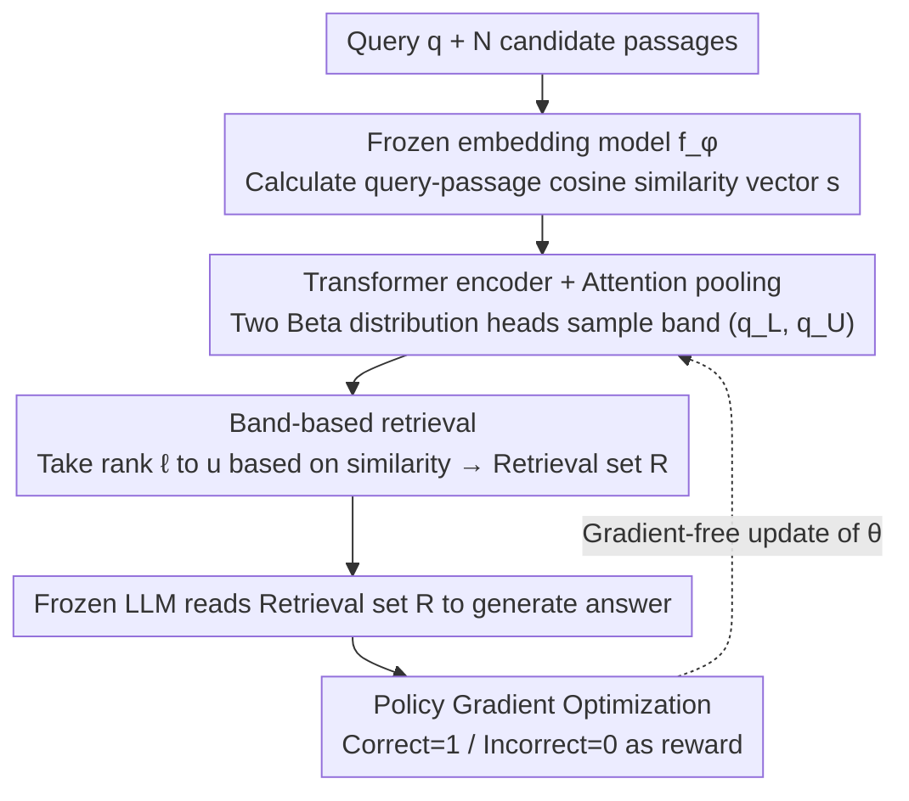

# Beyond RAG vs. Long-Context: Learning Distraction-Aware Retrieval for Efficient Knowledge Grounding

**Conference**: ICLR 2026  
**arXiv**: [2509.21865](https://arxiv.org/abs/2509.21865)  
**Code**: [https://github.com/ku-dmlab/LDAR](https://github.com/ku-dmlab/LDAR)  
**Area**: LLM Inference / RAG / Information Retrieval  
**Keywords**: RAG, Long-Context, Distraction-Aware Retrieval, Adaptive Passage Selection, Knowledge-Intensive QA

## TL;DR
This paper proposes LDAR (Learning Distraction-Aware Retrieval), a lightweight adaptive retriever that learns to select a continuous band of passages based on query-passage similarity distributions. By balancing information coverage against the impact of distracting passages, it outperforms long-context methods using approximately half the token budget.

## Background & Motivation

**Background**: RAG enhances LLM generation via external passage retrieval and is the primary solution for addressing factual errors and outdated knowledge in LLMs. Recently, LLM context windows have expanded to 128K+, leading to "long-context" alternatives that feed entire documents directly to the model.

**Limitations of Prior Work**: Long-context methods suffer from three issues: (i) low token efficiency, where processing redundant context wastes computation; (ii) the "lost in the middle" phenomenon, making it difficult to recall information from the center of the context; and (iii) significant distraction for models with limited capacity, which degrades output quality. Traditional top-k retrieval in RAG is efficient, but a fixed $k$ cannot adapt to the varying processing capabilities of different LLMs.

**Key Challenge**: Retrieving more passages increases information coverage but simultaneously introduces more distracting passages, forming an inverted U-shaped performance curve where performance rises then falls. Critically, the optimal retrieval strategy depends on the LLM's capacity (stronger models tolerate more distraction) and the joint interaction effects between passages (correct individual passages may cause errors when retrieved together).

**Goal**: How to adaptively select a set of passages to minimize the impact of distractions for a given LLM capacity while ensuring sufficient information coverage?

**Key Insight**: The authors observe that the distraction effect depends not only on individual passage relevance but also on the combination of retrieved passages. Therefore, retrieval strategies should be learned from the perspective of similarity distributions rather than simple text-based reranking.

**Core Idea**: Train a lightweight neural network that relies solely on the query-passage cosine similarity distribution. It selects passages by sampling continuous quantized bands from a Beta distribution to minimize distraction to the LLM.

## Method

### Overall Architecture
LDAR identifies how many and which passages to provide to an LLM to find the optimal point between sufficient information and minimal distraction. It inserts a lightweight "referee" between retrieval and generation. Specifically, given a query $q$ and $N$ candidate passages $\{p_i\}$, a frozen embedding model $f_\phi$ calculates the query-passage cosine similarity vector $s \in \mathbb{R}^N$. The adaptive retriever $\pi_\theta$ processes this similarity vector using a Transformer encoder to understand the distribution shape and outputs a quantized band $(q_L, q_U) \subset [0,1]$. Passages falling within this ranked range form the retrieval set $\mathcal{R}$ for LLM generation. Both the LLM and embedding model remain frozen; the retriever is updated via policy gradient using LLM correctness as the reward.

### Key Designs

**1. Band-based Retrieval: Compressing subset selection into 2D continuous control**

Selecting a subset from $N$ candidates is an exponential problem. Using independent Bernoulli sampling for each passage results in a search space of $2^N$, which is difficult to generalize. LDAR instead predicts a continuous similarity band $[q_L, q_U]$ and retrieves passages whose ranks fall within this range. The range is mapped to specific ranks: $\ell = \max(1, \lfloor N \cdot q_L \rceil)$ and $u = \max(\ell, \lfloor N \cdot q_U \rceil)$. This temporal abstraction reduces the search space to a 2D continuous space, making credit assignment and exploration more efficient.

**2. Transformer Encoder + Attention Pooling: Encoding variable-length similarity vectors**

The retriever must understand the shape of the similarity distribution (e.g., sharp clusters vs. heavy tails). Each similarity score $s_i$ is transformed into a token via periodic embedding. A bidirectional self-attention Transformer captures relative relationships between passages, followed by attention pooling to compress the variable-length sequence into a fixed-dimensional global vector. This vector feeds two output heads that predict Beta distribution parameters $(\alpha_L, \beta_L)$ and $(\alpha_U, \beta_U)$ used to sample $q_L$ and $q_U$.

**3. Policy Gradient-based Optimization: Training via LLM feedback**

Since the retrieval set is sampled discretely, gradients cannot be backpropagated through the LLM. LDAR uses policy gradient to maximize $J(\theta) = \mathbb{E}[r_\psi(q, \mathcal{R}, y)]$, where the reward $r_\psi = \mathbb{1}_{\text{corr}}(F_\psi(q, \mathcal{R}), y)$ is a binary indicator of LLM correctness. Using the log-derivative trick, parameters are updated as $\theta_{k+1} = \theta_k + \gamma \cdot r_\psi \cdot \nabla_{\theta_k} \log \pi_{\theta_k}(\cdot|s)$. This setup is extremely efficient as it requires no LLM backpropagation and the retriever does not read passage text.

### Loss & Training
In hallucination tasks, the "correct" behavior is to refuse to answer, which can lead the retriever to a shortcut of retrieving nothing. To avoid this, hallucination tasks are used for evaluation only and excluded from training. In 128K long-context settings, LDAR adaptively retrieves fewer passages (lower token usage), confirming that longer inputs carry higher distraction risks.

## Key Experimental Results

### Main Results
Evaluation was conducted on LaRA (Location, Reasoning, Comparison, Hallucination), HotpotQA, and NQ, covering 5 open-source LLMs (e.g., Qwen-2.5-7B, Llama-3.1-8B) and 4 closed-source LLMs (e.g., GPT-4o, Gemini-2.5-pro).

| Setting | Method | Avg Score (Open) | Avg Score (Closed) | Token Usage Ratio |
|------|------|-------------|-------------|-----------|
| 32K | LC | 58.62 | 74.00 | 1.000 |
| 32K | RAG (Top-5+Reranker) | 62.12 | 70.62 | 0.094 |
| 32K | BGM | 62.70 | 69.63 | 0.057 |
| 32K | Self-Route | 59.45 | 73.97 | 0.426 |
| 32K | **LDAR** | **70.00** | **79.42** | 0.467/0.629 |
| 128K | LC | 43.65 | 69.97 | 1.000 |
| 128K | RAG | 54.67 | 64.42 | 0.025 |
| 128K | **LDAR** | **61.55** | **76.22** | 0.250/0.517 |

### Ablation Study

| Configuration | Effect | Description |
|------|------|------|
| Band-based LDAR | High score + Low token usage | Effectively balances coverage and distraction |
| Bernoulli-based LDAR | Degenerates to LC | Search space is too large for effective exploration |
| Open-source LLM | Token usage ~0.25-0.47 | Weak models retrieve fewer passages |
| Closed-source LLM | Token usage ~0.52-0.63 | Strong models tolerate more distraction |
| Location Task | Usage ratio 0.45 | Info-locating tasks focus on high-similarity zones |
| Comparison Task | Usage ratio 0.50 | Cross-regional integration requires more passages |

### Key Findings
- The band-based strategy is critical; the Bernoulli version failed and degenerated into a long-context approach.
- LDAR adaptively adjusts: it retrieves less for weak models (to avoid distraction) and more for strong models (to leverage long-context capacity).
- In 128K contexts, LDAR retrieves fewer passages than in 32K contexts, indicating higher distraction risks in longer contexts.
- LDAR inference efficiency exceeds LC (3.9s vs 15.4s for open-source models) and most reranker methods.

## Highlights & Insights
- **Band-based temporal abstraction**: Transforming a combinatorial subset problem into a 2D continuous control problem reduces exploration difficulty while maintaining expressiveness.
- **Minimalist design using similarity distributions**: Acting solely on similarity distributions without reading passage text or fine-tuning LLMs/embeddings outperforms text-aware methods like BGM. This suggests similarity distributions contain sufficient information for retrieval decisions.
- **Emergent adaptive behavior**: The framework naturally learns distinct retrieval strategies for different LLMs (less for open-source, more for closed-source) without manual tuning.

## Limitations & Future Work
- Hallucination tasks require special handling and cannot be used for training, indicating difficulty in scenarios where "retrieving nothing" is the optimal strategy.
- The band-based strategy assumes the optimal passage set is a continuous interval in terms of ranked similarity, which may not always hold.
- Each LLM requires an individual retriever; cross-model transferability remains to be verified.
- Reliance on a fixed embedding model may cap performance if the embedding quality is poor.

## Related Work & Insights
- **vs. RAG**: Traditional RAG uses fixed top-k; LDAR uses learned dynamic intervals and accounts for LLM capacity.
- **vs. Long-Context**: LC provides full info but introduces maximum distraction; LDAR finds the optimal balance point.
- **vs. BGM**: BGM performs subset selection on top-5 candidates (limited space, requires text reading); LDAR performs band selection on all passages (larger space, higher efficiency).
- **vs. Self-Route**: Self-Route uses LLM self-evaluation for a binary choice (RAG or LC); LDAR learns a continuous policy.

## Rating
- Novelty: ⭐⭐⭐⭐ The band-based retrieval perspective successfully reframes retrieval as a continuous control problem.
- Experimental Thoroughness: ⭐⭐⭐⭐⭐ Comprehensive evaluation across 6 benchmarks, 9 LLMs, and 8+ baselines.
- Writing Quality: ⭐⭐⭐⭐ Clear motivation, intuitive illustrations, and convincing analysis.
- Value: ⭐⭐⭐⭐ Provides a practical, cost-effective middle ground in the RAG vs. Long-Context debate.

## Related Papers

- [\[ICLR 2026\] Q-RAG: Long Context Multi‑Step Retrieval via Value‑Based Embedder Training](q-rag_long_context_multistep_retrieval_via_valuebased_embedder_training.md)
- [\[ICLR 2026\] Embedding-Based Context-Aware Reranker](embedding-based_context-aware_reranker.md)
- [\[ICLR 2026\] AdaCache: Adaptive Caching and Context Augmentation for Efficient LLM Serving](adacache_adaptive_caching_and_context_augmentation_for_efficient_llm_serving.md)
- [\[ICLR 2026\] Query-Aware Flow Diffusion for Graph-Based RAG with Retrieval Guarantees](query-aware_flow_diffusion_for_graph-based_rag_with_retrieval_guarantees.md)
- [\[ACL 2025\] Hierarchical Document Refinement for Long-context Retrieval-augmented Generation](../../ACL2025/information_retrieval/hierarchical_document_refinement_for_long-context_retrieval-augmented_generation.md)

<!-- RELATED:END -->

<!-- RELATED:START -->

## Related Papers

- [\[ICLR 2026\] Embedding-Based Context-Aware Reranker](embedding-based_context-aware_reranker.md)
- [\[ICLR 2026\] Q-RAG: Long Context Multi‑Step Retrieval via Value‑Based Embedder Training](q-rag_long_context_multistep_retrieval_via_valuebased_embedder_training.md)
- [\[ICLR 2026\] Beyond Text-Only: Towards Multimodal Table Retrieval in Open-World](beyond_text-only_towards_multimodal_table_retrieval_in_open-world.md)
- [\[ICLR 2026\] Attributing Response to Context: A Jensen-Shannon Divergence Driven Mechanistic Study of Context Attribution in Retrieval-Augmented Generation](attributing_response_to_context_a_jensen-shannon_divergence_driven_mechanistic_s.md)
- [\[ICLR 2026\] SmartChunk Retrieval: Query-Aware Chunk Compression with Planning for Efficient Document RAG](smartchunk_retrieval_query-aware_chunk_compression_with_planning_for_efficient_d.md)

<!-- RELATED:END -->
