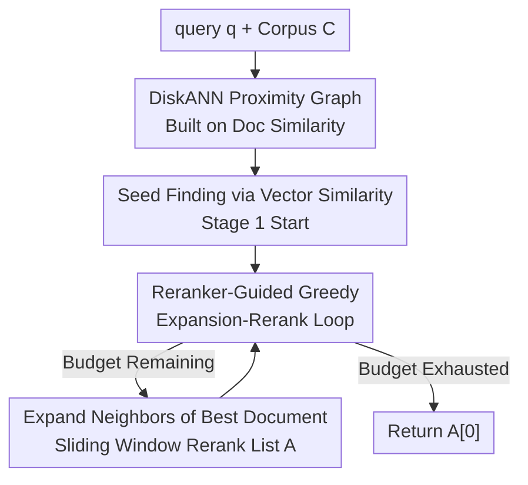

# Beyond Sequential Reranking: Reranker-Guided Search Improves Reasoning Intensive Retrieval

**Conference**: ICLR2026  
**OpenReview**: [https://openreview.net/forum?id=Fjw3OqdjTj](https://openreview.net/forum?id=Fjw3OqdjTj)  
**Code**: https://github.com/xuhaike/Reranker-Guided-Search  
**Area**: Information Retrieval / Reranking / Reasoning-Intensive Retrieval  
**Keywords**: reranker, proximity graph search, bi-metric, reasoning-intensive retrieval, reranker budget

## TL;DR
This paper replaces the rigid "top-k sequential scan" in the "retrieve-and-rerank" pipeline with a greedy search on a document similarity proximity graph (Reranker-Guided-Search, RGS). By prioritizing documents whose neighbors have already received high scores, RGS improves NDCG@10 by 3.5, 2.9, and 5.1 points on BRIGHT, FollowIR, and M-BEIR benchmarks respectively, under a strict budget of 100 reranker calls per query.

## Background & Motivation
**Background**: When complex retrieval tasks (scientific reasoning, instruction following, multimodal) exceed the semantic matching capabilities of embeddings, the dominant remedy is **retrieve-and-rerank**: first use an embedding model to retrieve top-k candidates, then use an expensive but powerful reranker (now mostly LLM-based listwise rerankers) to refine these candidates window by window.

**Limitations of Prior Work**: This pipeline suffers from two critical bottlenecks. First, the final accuracy is capped by **first-stage recall**—if the correct answer is not in the top-k, even the strongest reranker cannot recover it. Ours empirically shows that on BRIGHT, only 31% of ground-truth documents fall within the top 100 results of embedding-based ranking. Second, LLM rerankers are computationally expensive, meaning the **number of documents that can be scanned is extremely limited**. Consequently, the default "sequential scan of the top-k" wastes this precious budget by treating it as a fixed pool.

**Key Challenge**: Reranker budget is a scarce resource, yet sequential scanning fails to utilize information about "which documents are more worth inspecting." it spends the same budget on the 100th candidate as on the 1st, even if the 100th resides in a semantic cluster already proven to be noise.

**Goal**: Under the premise of a fixed number of reranker calls (e.g., max 100 per query), **how to select the documents sent to the reranker to maximize final accuracy**? This requires an adaptive strategy that can "decide where to look next while reranking" rather than relying on a pre-defined candidate set.

**Key Insight**: The authors borrow two observations. First is the **clustering hypothesis**: similar documents often have similar relevance to the same query—thus, once a document is judged relevant by the reranker, its neighbors deserve priority. Second is the **bi-metric framework** from the ANN community (Xu et al. 2024): a proximity graph built with one distance metric (document embedding similarity) can be used to search for nearest neighbors under another metric (reranker preference). Combining these leads to the idea of "guiding reranker exploration via a document graph."

**Core Idea**: Treat the reranker as the "true distance metric" and run a greedy beam search on a proximity graph built from embeddings. Starting from seed documents closest to the query, the algorithm continuously expands the neighbors of the "currently most promising documents" and reranks them. This spends the budget on promising regions and skips low-score clusters, reaching "deep" documents that sequential scanning would never touch.

## Method

### Overall Architecture
The input to RGS is a query $q$, a corpus $C=\{d_1,\dots,d_n\}$, an embedding model $E(\cdot)$, and a listwise reranker $D$. The output is the document deemed most relevant when the reranker budget is exhausted. The workflow consists of **offline graph construction** and **online two-stage search**. In the offline phase, DiskANN is run on document embeddings to build a proximity graph $G$, where each node $v$ has at most $R$ outgoing neighbors $N_{out}(v)$. In the online phase: vector similarity first finds the seed documents closest to the query as the starting point (stage 1); then, starting from these seeds, a "reranker-guided greedy expansion-rerank loop" is executed (stage 2). A candidate list $A$ is maintained and sorted in real-time by reranker preferences. Each step selects the top-most unexpanded document from the list to explore its neighbors, adds new neighbors to the list, and reranks using a sliding window until the budget is depleted, finally returning the top document in $A$.

The key difference is: traditional retrieve-and-rerank "freezes a top-k candidate set and scans sequentially," whereas RGS "dynamically grows the candidate set based on reranker feedback"—the reranker is not only scoring but also deciding the search direction.

### Key Designs

**1. Reranker-Guided Greedy Search on Graph: Replacing "Sequential Scan" with "Correlation Feedback-Driven Beam Search"**

This is the core of the paper, directly addressing the pain point that sequential scanning wastes budget and misses deep documents. RGS maintains an ordered list $A$, initially containing only the seed $s$. Each step takes the first unexpanded document $v$ in $A$, appends its graph neighbors $N_{out}(v)$ (up to $R$, excluding those already in $A$) to the end of the list, and uses the listwise reranker with a sliding window of step $w/2$ to rerank from the end forward. True relevant new documents are thus moved to the front. If $|A|$ exceeds the search list length $L$, it is truncated. This "expand + rerank" loop continues until the reranker budget is exhausted, returning $A[0]$ (see Algorithm 1). The essence is that the list order always reflects the latest reranker preferences, so search always proceeds from the "top document"—standard beam search behavior, but where "distance" is defined by reranker scores rather than vector inner products. By following high-score neighbors and ignoring low-score clusters, it can find document D3 in the TheoremQA-T example (Figure 1), which is ranked 2812th in embedding space and unreachable by sequential reranking.

**2. Bi-metric Proximity Graph Reuse: Searching for Reranker Neighbors on an Embedding Graph**

This addresses the constraint that rerankers are too expensive to score the entire corpus. RGS does not build a separate graph for the reranker (impossible, as rerankers lack indexable vectors). Instead, it reuses the proximity graph built by DiskANN on **document embeddings** as the search backbone. Theoretical justification comes from the bi-metric framework (Xu et al. 2024, Theorem 1.1): as long as vector similarity **approximates** reranker scores within a constant factor, greedy search on the embedding graph will find the nearest neighbor in the reranker metric. This transfers the search cost of the expensive metric (reranker) to the pre-built structure of the cheap metric (embedding), forming the basis for the "embedding as navigator, reranker as judge" division of labor. The runtime bottleneck is reranker calls; Ours estimates reranker calls for RGS as $O(L^2/w)$, whereas retrieve-and-rerank and SlideGAR are $O(Q/w)$ (where $Q$ is budget and $w$ is window size).

**3. Key Difference from SlideGAR: Maintaining Full Reranker Ordering vs. Discarding Neighbors**

This explains why RGS outperforms SlideGAR, which also explores the graph frontier. SlideGAR only selects the top $w/2$ documents from the frontier **based on vector similarity** and discards the rest. This means even if a relevant document appears on the frontier, it may never be reranked if its embedding is not close to the query. Ours views SlideGAR as an "augmented linear reranker with graph neighbors." In contrast, RGS inserts **all** expanded neighbors into the ordered list and lets the reranker decide their fate and order, truly simulating standard beam search. This difference is crucial when embedding-query correlation is weak (reasoning-intensive tasks): RGS does not rely on "neighbors being close to the query in embedding space," only on "neighbors being judged highly by the reranker."

**4. Reranker@k Evaluation Protocol: Explicitly Budgeting Reranker Calls**

Addressing the issue where such methods were previously compared on TREC without a fair metric, the authors propose a rarely discussed evaluation setting: **Reranker@k**. It restricts the reranker to scanning a maximum of $k$ documents across the entire retrieval process (experiments use $k=100/300/500$) and measures NDCG@10 under this constraint. Note that it allows the same document to be reranked multiple times by the listwise reranker (due to sliding window overlap). This protocol brings the trade-off between "reranker budget" and "accuracy" to the forefront, making RR, SlideGAR, and RGS comparable under the same budget.

### Mechanism Example
Consider the TheoremQA-T query Q in Figure 1. Q has surface similarities with documents C1 and D1 (both mention sine/amplitude). First-stage vector retrieval ranks C1 and D1 highly. However, the reranker gives C1 a low score as it lacks the correct mathematical relationship. RGS thus **does not expand C1's neighbors** (saving budget). Since the reranker favors D1, RGS expands D1 to find D2. Although D2 has almost no lexical overlap with Q, it contains the correct method for the problem, which the reranker captures with a high score. Expanding D2 leads to the correct answer D3. The process finds D3 (ranked 2812th in embedding space) after reranking fewer than 500 documents—a result sequential reranking could never reach under budgets of 100 or even 500.

## Key Experimental Results

### Main Results
Three benchmarks: BRIGHT (reasoning-intensive, 12 domains), FollowIR (instruction following), M-BEIR (multimodal, 8 sub-tasks). Embeddings: BGE-Large (CLIP ViT-B/32 for M-BEIR). Reranker: Gemini-2.0-Flash. Mean NDCG@10 under Reranker@100 budget:

| Benchmark | No Reranker | RR (Sequential) | SlideGAR | RGS (Ours) | RGS vs RR |
|------|------------|---------------|----------|------------|-----------|
| BRIGHT | 13.7 | 25.3 | 25.4 | **28.8** | +3.5 (+14%) |
| FollowIR | 49.9 | 60.4 | 62.5 | **63.3** | +2.9 (+5%) |
| M-BEIR | 15.3 | 25.9 | 28.6 | **31.0** | +5.1 (+20%) |

The advantage widens as the budget increases to Reranker@500: On BRIGHT, RGS reaches 33.0 (RR 27.7, SlideGAR 26.9); on M-BEIR, it reaches 38.3 (RR 30.1, SlideGAR 29.9). Notably, SlideGAR's performance on FollowIR dropped from 62.5 to 59.8 as budget increased, while RGS showed stable gains.

### Ablation Study
The authors used perturbation experiments to disentangle the roles of document-document similarity vs. query-document relevance. NDCG@10 on BRIGHT-Psychology under different perturbations:

| Configuration | RR | SlideGAR | RGS | Description |
|------|------|----------|-----|------|
| No Perturbation (w=0) | 40.4 | 36.2 | 49.2 | Original embedding |
| Query Perturbation w=1 | 1.8 | 13.2 | 40.4 | Query embedding completely ineffective |
| Doc Perturbation w=1 | 0.8 | 1.6 | 1.1 | Document similarity structure destroyed |

Key finding: When **only the query** embedding is perturbed to be uninformative (w=1), RR drops to near zero and SlideGAR falls to 13.2, yet **RGS only drops slightly from 49.2 to 40.4**. This is because query embeddings in RGS are only used to find the starting point; a random starting point slows the search but does not change the potential final result. However, all methods collapse when the **document** similarity structure is destroyed, confirming RGS truly relies on the document graph quality.

### Key Findings
- **Embedding capacity is less important at high budgets**: While RR shows significant gaps between 4 different embedding scales (SFR-Mistral 7B to BGE-Micro 17M), RGS converges to similar accuracy under Reranker@500 regardless of the embedding model. Embeddings only determine "how many reranker calls are needed to reach a certain accuracy"; the ceiling is determined by the reranker.
- **Ceiling comes from reranker-label misalignment**: Error analysis categorizes ground-truth as "returned/seen but not selected/never seen." As budget increases, the "seen" ratio rises continuously, but the "returned" ratio plateaus or slightly decreases—indicating RGS has found the correct documents, but the bottleneck is that reranker preferences do not perfectly align with human labels.
- **Gains strongly correlate with task difficulty**: RGS provides the largest gains in scientific reasoning. On AoPS or LeetCode tasks requiring extremely dense reasoning, all reranking methods show almost no improvement. On M-BEIR task 6 (where embeddings fail to encode long documents), RGS boosts scores from <5 to 30.7.

## Highlights & Insights
- **Introducing search algorithms to reranking**: The most significant insight is treating the reranker as an active driver of beam search on a graph rather than a passive scorer. Reranking and retrieval merge from two sequential stages into a single feedback loop. This "expensive metric searching on a cheap metric's graph" is portable to any scenario with a costly/accurate relevance function and a cheap similarity structure.
- **Immunity to query embedding quality**: Since query embeddings are only used for the starting point, RGS is robust in reasoning-intensive tasks where the query and answer share little lexical or semantic overlap—hitting the primary weakness of traditional dense retrieval.
- **Value of the Reranker@k protocol**: Explicitly budgeting reranker calls provides a fair and standardized metric that was previously missing in the sub-field, serving as a valuable benchmark for future work.

## Limitations & Future Work
- **Dependency on document graph quality**: Ablation shows that if document embeddings fail to capture similarity structures, RGS fails along with the baselines; it assumes the "document cluster structure" is a reliable backbone.
- **Reranker ceiling**: Error analysis admits final accuracy is limited by the reranker's preference misalignment with ground truth. More budget cannot fix an answer that was "found but not selected."
- **Complexity sensitivity to $L$**: Reranker calls scale roughly as $O(L^2/w)$. As the search list length $L$ increases, costs grow quadratically, necessitating hyperparameter tuning of $L$ relative to budget.
- **Gap in theoretical guarantees**: Greedy graph search lacks worst-case guarantees, and the bi-metric accuracy guarantee relies on the assumption that vector similarity approximates reranker scores, which might not strictly hold in reasoning tasks.

## Related Work & Insights
- **vs. GAR / RAR / SlideGAR**: These explore graph frontiers to bypass sequential bottlenecks but were mostly validated on classic TREC and (in SlideGAR's case) pick frontier subsets based on vector similarity. RGS maintains a full reranker-sorted list to simulate standard beam search, yielding larger gains on complex modern retrieval tasks (BRIGHT/M-BEIR).
- **vs. Retrieve-and-Rerank (Sequential)**: Both use the same embedding+reranker pair, but RR freezes a top-k set, capping accuracy by first-stage recall. RGS allows the candidate set to grow dynamically, reaching correct documents positioned very late in embedding rankings.
- **vs. Graph ANN (DiskANN/HNSW)**: RGS reuses DiskANN's proximity graph as a backbone but switches the search metric from "vector inner product" to "reranker score," representing a practical application of the bi-metric framework (Xu et al. 2024) in the reranking context.

## Rating
- Novelty: ⭐⭐⭐⭐⭐ Adapting beam search for reranker task selection is a novel and logical extension of graph ANN concepts.
- Experimental Thoroughness: ⭐⭐⭐⭐ Solid across three benchmarks with multiple embeddings/rerankers and perturbation analysis, though sampling 100 queries for M-BEIR is a minor limitation.
- Writing Quality: ⭐⭐⭐⭐⭐ Clear progression from motivation to method and analysis. The Figure 1 example and error analysis effectively explain the mechanism.
- Value: ⭐⭐⭐⭐ Provides stable improvements under fixed reranker budgets, offering direct utility for reasoning-intensive retrieval and LLM reranker deployment.

<!-- RELATED:START -->

## Related Papers

- [\[ICLR 2026\] Frustratingly Simple Retrieval Improves Challenging, Reasoning-Intensive Benchmarks](frustratingly_simple_retrieval_improves_challenging_reasoning-intensive_benchmar.md)
- [\[ICLR 2026\] Hybrid Deep Searcher: Scalable Parallel and Sequential Search Reasoning](hybrid_deep_searcher_scalable_parallel_and_sequential_search_reasoning.md)
- [\[ICLR 2026\] RefTool: Reference-Guided Tool Creation for Knowledge-Intensive Reasoning](reftool_reference-guided_tool_creation_for_knowledge-intensive_reasoning.md)
- [\[ACL 2026\] A Survey of Reasoning-Intensive Retrieval: Progress and Challenges](../../ACL2026/information_retrieval/a_survey_of_reasoning-intensive_retrieval_progress_and_challenges.md)
- [\[ICLR 2026\] Retro*: Optimizing LLMs for Reasoning-Intensive Document Retrieval](retro_optimizing_llms_for_reasoning-intensive_document_retrieval.md)

<!-- RELATED:END -->
