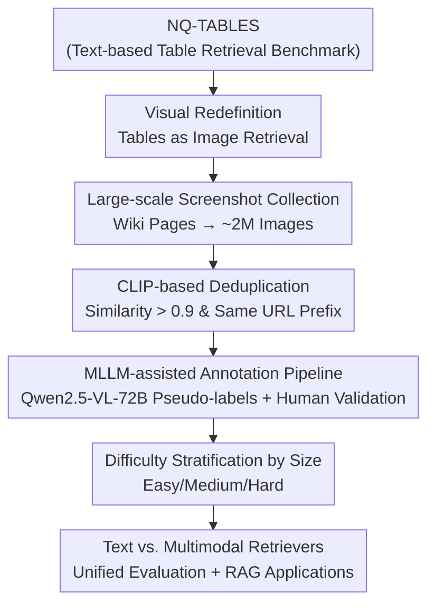

# Beyond Text-Only: Towards Multimodal Table Retrieval in Open-World  

**Conference**: ICLR2026  
**OpenReview**: [https://openreview.net/forum?id=4QPgqdQmYn](https://openreview.net/forum?id=4QPgqdQmYn)  
**Code**: https://github.com/Trustworthy-Information-Access/Tab-ViR  
**Area**: Information Retrieval / Multimodal  
**Keywords**: Table Retrieval, Multimodal Retrieval, Image-based Tables, Benchmark, RAG  

## TL;DR  
This paper argues that "serializing tables into text before retrieval" sacrifices structural and multimodal information. It redefines open-domain table retrieval as "multimodal retrieval of table screenshots" and constructs TaR-ViR, the first benchmarks for image-based table retrieval. Experiments demonstrate that multimodal retrievers can match or exceed text-based ones in recall while bypassing the error-prone table-to-text conversion process.  

## Background & Motivation  

**Background**: Open-domain table retrieval aims to find structured tables relevant to natural language queries from massive corpora. Approximately 27% of web search queries implicitly or explicitly target tabular data, making it a critical function in information systems. However, compared to pure text retrieval, table retrieval is less studied. Mainstream approaches (e.g., TAPAS, DTR, UTP, THYME, ECAT) treat it as a "variant of text retrieval": tables are flattened into linear text sequences by row or column and fed into text encoders.  

**Limitations of Prior Work**: This "serialization-to-text" paradigm has two major flaws. First, **structural semantics are lost during flattening**: complex layouts like merged cells, multi-level headers, and irregular alignments cannot be recovered from 1D sequences. This obscures hierarchical relationships and spatial arrangements, especially in scientific papers where merged cells represent logical groupings. Second, **pure text representations cannot capture multimodal content**: information such as embedded images, visual markers, and color schemes in real-world tables cannot be stored as text. Moreover, extracting text from tables scattered across spreadsheets, PDFs, and web pages is labor-intensive and lossy.  

**Key Challenge**: Tables are intrinsically "2D visual objects," but existing paradigms force them into 1D text streams, sacrificing structural information and visual content at the source and compromising retrieval performance.  

**Goal**: To find a "format-agnostic representation that preserves both structure and content" to bypass the losses of text serialization, and to provide a standard evaluation benchmark for this new direction.  

**Key Insight**: The authors observe that **the visual presentation of a table is naturally format-agnostic and preserves both structural and content information**. Encoding a table directly as an image keeps merged cells, hierarchical headers, and embedded images intact within the pixels. Since multimodal retrieval (from CLIP/BLIP to VLM2Vec and GME) has matured, migrating it to tables is a logical progression.  

**Core Idea**: Replace "serialized table text + text retriever" with "table image + multimodal retriever" to fundamentally avoid error-prone text conversion, and build TaR-ViR to validate the feasibility of this path.  

## Method  

The "Method" section primarily focuses on **benchmark construction** rather than a new model architecture. It addresses how to create a high-quality image-based table retrieval dataset and fairly compare text and multimodal retrievers.  

### Overall Architecture  

TaR-ViR is adapted from the existing pure-text benchmark **NQ-TABLES**. The pipeline involves: crawling **screenshots** of Wikipedia pages corresponding to each table in NQ-TABLES (~2 million images), transforming "tables" from text to images; performing **deduplication** to clean redundant screenshots; using MLLMs for **automated pseudo-labeling** combined with manual **validation** to correct query-table relevance drift caused by webpage updates; and finally, stratifying the data by **image size difficulty**. Systemic comparisons are then conducted between text and multimodal retrievers. Formally, the dataset $D=\{(q, T^{+})\}$, where query $q$ corresponds to a set of relevant tables $T^{+}=\{t^{+}\}$, and each table $t$ consists of an **image** and a **text title**. The goal is to train retrievers that identify relevant patterns between $q$ and $T^{+}$.  

### Key Designs  

**1. Visual Redefinition: From "Serialized Text Matching" to "Image-Query Matching"**  

This is the foundation of the paper, addressing the pain point of structural and multimodal information loss. Instead of flattening tables into text, the authors include the entire table as an **image** in the retrieval corpus. An image naturally preserves spatial structures (merged cells, multi-level headers) and visual cues (photos, colors, font emphasis) while remaining **format-agnostic**. This eliminates the labor-intensive "table-to-text" preprocessing. Multimodal retrievers can consume images directly, preventing large-scale open-world table utilization from being bottlenecked by extraction and standardization. This shift moves table retrieval from an NLP problem to a multimodal retrieval problem.  

**2. Large-scale Screenshot Collection & CLIP Deduplication**  

To make image-based retrieval evaluable, an image corpus is required. The authors crawled screenshots of Wikipedia pages associated with NQ-TABLES. To handle redundancies (multiple URLs pointing to the same content or the same table on different pages), **CLIP** is used for visual similarity filtering. Images with similarity $> 0.9$ **and** sharing the same URL prefix are deemed duplicates. Only one representative instance is kept per group, with labels merged to maintain consistency. For a single NQ-TABLES entry associated with multiple images, the Top-1 after ranking is chosen as the image representation.  

**3. MLLM-assisted Annotation Pipeline: Pseudo-labels + Human Verification**  

Wikipedia is dynamic; crawled screenshots might differ from the original NQ-TABLES tables, meaning relevance may have drifted. Full human re-annotation is too costly. The authors employ **Qwen2.5-VL-72B** to generate pseudo-relevance labels, followed by "streamlined human verification." Humans perform two tasks: **relevance annotation** (verifying if the model's pseudo-match is correct) and **answer annotation** (verifying if the answer in a relevant query-table pair matches the image). To control costs, **human verification covers the test set only**. The training set retains samples labeled as relevant by Qwen2.5-VL-72B, relying on automated filtering for quality. Human evaluation of 1,550 pairs confirmed ~80% accuracy for the automated labels.  

**4. Difficulty Stratification: Mapping Size to Complexity**  

To analyze where multimodal retrieval excels, tables are categorized based on their area relative to the browser window: **Easy** (< 25%), **Medium** (25%–100%), and **Hard** (> 1 window). This corresponds to increasing visual understanding difficulty for MLLMs. Larger tables require stronger spatial reasoning and layout adaptability. This stratification revealed that while OCR-based text retrieval performs well on small tables, image-based retrieval gains the advantage as table size and complexity increase.  

## Key Experimental Results  

### Main Results  

The evaluation compares **text retrievers** (converting table images to HTML via Qwen2.5-VL-7B, then flattening to text) and **multimodal retrievers** (consuming text + images). Metrics include Recall, NDCG, and MRR (cutoff at 50).  

| Retriever | Input Modality | Params | R@10 | N@5 | M@5 |
|-----------|----------------|--------|------|------|------|
| BM25 | Title + OCR Text | – | 20.50 | 21.70 | 19.79 |
| BGE | Title + OCR Text | 109M | **92.15** | **72.82** | **68.18** |
| Qwen3-Embedding | Title + OCR Text | 4.05B | 89.30 | 71.93 | 68.04 |
| GME | Title + Content Image | 2.21B | 59.80 | 43.68 | 40.15 |
| VLM2Vec | Title + Content Image | 7.07B | 94.23 | 70.56 | 64.80 |
| UniME | Title + Content Image | 7.57B | 93.38 | **75.62** | **71.44** |
| ColPali | Content Image Only | 2.21B | 63.59 | 48.93 | 46.15 |

Key Observation: For text retrievers, **BGE (109M) outperforms larger models** like GTE and Qwen3-Embedding, suggesting that text embeddings depend more on training objectives than size. However, multimodal retriever **performance scales monotonically with parameters**, indicating that joint vision-text representation learning requires strong foundational capabilities. Multimodal retrievers with title + content (UniME, VLM2Vec) matched or exceeded OCR-based text retrievers, with UniME significantly outperforming BGE on NDCG/MRR at the cost of complexity.  

### Table Format Comparison & Information Analysis  

Using Qwen2-VL-2B as a unified base to eliminate training bias, different representations were compared:  

| Input Format | R@10 | N@5 | M@5 |
|--------------|------|------|------|
| Title Text + OCR Content | 89.00 | 65.91 | 61.46 |
| Title Text + Original HTML | 90.30 | 65.20 | 60.64 |
| Title Text + Content Image | **91.69** | **67.42** | **62.19** |
| Title Image + Content Image | 82.30 | 58.09 | 53.32 |

Analysis by difficulty showed: **OCR-based text retrieval is best for small tables (Easy)**. However, as tables grow in size and complexity, MLLMs struggle to extract all text accurately. **Image-based retrieval gradually overtakes in Medium/Hard categories**, as images preserve complete information for more precise matching.  

### Key Findings  
- **Title Impact**: Retrievers perform significantly better with table titles. In real-world scenarios where titles are often missing, performance drops to ~70% of the full capability.  
- **OCR Advantage in Ranking (Small Tables)**: MLLMs have a systematic bias toward information visually emphasized by color or font. This mimics human information-seeking behavior, making OCR inputs stronger on ranking metrics (NDCG/MRR) for small tables. This advantage vanishes as table information density increases.  
- **Trade-offs**: One approach is "MLLM Text Extraction → Small Text Retriever (e.g., BGE)," which is flexible. The other is "Direct MLLM Multimodal Retriever," which is streamlined by skipping text conversion.  

### RAG Application  
TaR-ViR also evaluates RAG. Using Qwen3-8B as the top-performing generator, accuracy reached ~58% at $n=5$. While multimodal LLMs like Qwen2.5-VL perform better with image inputs than text counterparts, **pure text LLMs currently have a higher upper bound**. Answering questions from image-based tables requires precise visual parsing, structural understanding, and symbolic reasoning—a combination current MLLMs have not yet perfected.  

## Highlights & Insights  
- **Clean Paradigm Shift**: By reframing tables as images—the most natural carrier of "format-agnostic structure and content"—the paper provides a valuable perspective beyond specific model improvements.  
- **Non-trivial Discoveries**: The finding that "OCR is better for ranking while images are better for recall/large tables" reveals systemic biases in MLLMs toward visual emphasis, offering guidance for system design.  
- **Reusable Methodology**: The "pseudo-labeling + test set verification" pipeline provides a cost-effective way to build multimodal benchmarks while addressing temporal drift in web data.  

## Limitations & Future Work  
- **Empirical Focus**: The paper contributes a benchmark and evidence but does not propose a new retrieval model specifically designed for table images.  
- **Training Noise**: The training set relies on automated filtering with ~80% accuracy. The impact of the remaining 20% noise on downstream training is not fully explored.  
- **Computational Cost**: High performance in the multimodal paradigm currently requires large parameter counts, increasing deployment costs.  
- **Single Source Data**: All screenshots are from Wikipedia. The diversity of layouts in PDFs, business reports, or database exports remains to be validated.  
- **Title Dependency**: Performance degrades significantly without titles; improving retrieval in title-less scenarios is a key future direction.  

## Related Work & Insights  
- **vs. Text Table Retrieval (TAPAS, etc.)**: These focus on optimizing within the text framework (cell embeddings, matching logic). Ours changes the paradigm to bypass the limitations of serialization.  
- **vs. General Multimodal Retrieval (CLIP, VLM2Vec, etc.)**: While these learn general image-text embeddings, this work systematically evaluates them on highly structured "table images" and uncovers task-specific advantages.  
- **vs. Existing Image Table Benchmarks**: TaR-ViR is larger and supports both retrieval and QA, filling a gap in standard multimodal table retrieval evaluation.  

## Rating  
- Novelty: ⭐⭐⭐⭐ Strong reframing of table retrieval as a vision task, though it uses existing models.  
- Experimental Thoroughness: ⭐⭐⭐⭐ Broad coverage of models, formats, and RAG; noise analysis could be deeper.  
- Writing Quality: ⭐⭐⭐⭐ Logical flow, clear findings, and intuitive case studies.  
- Value: ⭐⭐⭐⭐ A significant pushing force for the field, providing the first large-scale benchmark and critical paradigm comparisons.  

<!-- RELATED:START -->

## Related Papers

- [\[ACL 2026\] Retrieve Only Relevant Tables Whether Few or Many: Adaptive Table Retrieval Method](../../ACL2026/information_retrieval/retrieve_only_relevant_tables_whether_few_or_many_adaptive_table_retrieval_metho.md)
- [\[ICLR 2026\] MRMR: A Realistic and Expert-Level Multidisciplinary Benchmark for Reasoning-Intensive Multimodal Retrieval](mrmr_a_realistic_and_expert-level_multidisciplinary_benchmark_for_reasoning-inte.md)
- [\[ICLR 2026\] Beyond Sequential Reranking: Reranker-Guided Search Improves Reasoning Intensive Retrieval](beyond_sequential_reranking_reranker-guided_search_improves_reasoning_intensive_.md)
- [\[ICLR 2026\] Supervised Fine-Tuning or Contrastive Learning? Towards Better Multimodal LLM Reranking](supervised_fine-tuning_or_contrastive_learning_towards_better_multimodal_llm_rer.md)
- [\[ICLR 2026\] Beyond RAG vs. Long-Context: Learning Distraction-Aware Retrieval for Efficient Knowledge Grounding](beyond_rag_vs_long-context_learning_distraction-aware_retrieval_for_efficient_kn.md)

<!-- RELATED:END -->
