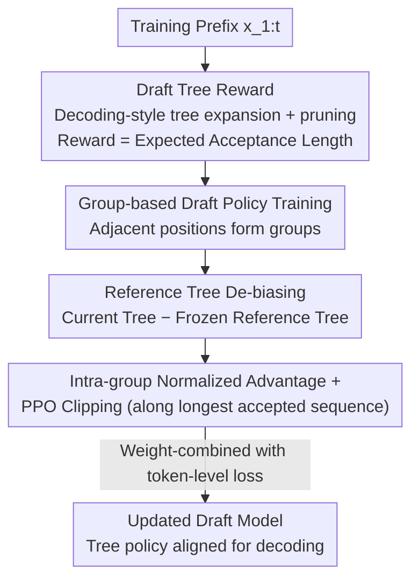

# Bridging Draft Policy Misalignment: Group Tree Optimization for Speculative Decoding

**Conference**: ICLR2026  
**OpenReview**: [https://openreview.net/forum?id=dwPdYFqVWO](https://openreview.net/forum?id=dwPdYFqVWO)  
**Code**: [https://github.com/hsj576/GTO](https://github.com/hsj576/GTO)  
**Area**: LLM Efficiency / Speculative Decoding  
**Keywords**: Speculative Decoding, Draft Policy Misalignment, Tree Drafting, Group Optimization, Acceptance Length

## TL;DR
During speculative decoding training, only a single greedy draft path is optimized, while during decoding, an entire draft tree is used for re-ranking and verification. This misalignment limits acceleration. This paper proposes Group Tree Optimization (GTO), which uses "draft tree rewards + group-based draft policy training" to directly align with the tree policy used during decoding. GTO achieves an average increase in acceptance length of 7.4% across multiple LLMs, with a relative speedup of 7.7% over EAGLE-3.

## Background & Motivation
**Background**: Speculative decoding is a mainstream method for accelerating LLM inference. It uses a lightweight draft model to propose multiple tokens at once, which are then verified in parallel by the target LLM, transforming "one-token-per-step autoregression" into "multiple-accepted-tokens-per-step." Recent works (HASS, GRIFFIN, EAGLE-3) focus on improving draft model training by making draft model hidden states/tokens more similar to those of the target model.

**Limitations of Prior Work**: These methods overlook a fundamental issue: **draft policy misalignment**. During training, the draft model is optimized to "select the highest probability token step-by-step given context to form a greedy draft sequence," essentially performing single-path sequence prediction. However, **tree drafting is actually used during decoding**: the draft model expands a draft tree with multiple branches, re-ranks them by confidence, and selects the top-g branches for objective verification. The object optimized during training is not the object used during decoding.

**Key Challenge**: This misalignment leads to two typical failure modes. First, **greedy paths are pruned**—since paths are re-ranked by overall sequence confidence before top-g selection during decoding, the optimal greedy path from training may be pruned by sibling branches with higher overall confidence (e.g., greedy sequence "It is a" (confidence 0.36) losing to sibling "It has to" (0.38)). Second, **verification mismatch**—even if a greedy path survives pruning, the target model might accept a different sibling branch (e.g., accepting "It is the" instead of the greedy "It is a"). In both cases, the training effort spent on greedy paths is wasted. Testing EAGLE-3 on LLaMA-3.1-8B, the authors observed that 19–34% of greedy paths are pruned during tree construction, and the final accepted path only overlaps with the greedy path by 36–49%. Even when the greedy path is accepted, it averages only 3–4 tokens, significantly shorter than the 5–6 tokens of the full tree.

**Goal**: Align draft model training objectives directly with the "performance of the entire draft tree during decoding" rather than a single greedy path.

**Key Insight**: The sole metric determining speculative decoding efficiency is **acceptance length**—the longer the draft sequence accepted by the target model, the fewer verification steps needed, and the greater the speedup. Therefore, training should directly maximize the "expected acceptance length of the draft tree" as a reward rather than optimizing proxy targets like "next token prediction accuracy."

**Core Idea**: Use "expected acceptance length of the draft tree" as a training reward and maximize it stably using group-based PPO-style optimization to align the training objective with the decoding-time tree strategy—this is Group Tree Optimization (GTO).

## Method

### Overall Architecture
GTO is a **training framework** built on top of existing draft models. It does not change the decoding process but shifts the draft model training objective from "token-level alignment" to "tree-level alignment." It consists of two main components. The first is **Draft Tree Reward**: during training, a draft tree is constructed using the same tree expansion and pruning strategy as in decoding (EAGLE-2 style multi-branch expansion, re-ranking, and selection). A **sample-free** reward is defined as the expected acceptance length of this tree under the target model. The second is **Group-based Draft Policy Training**: because this reward is sparse, highly position-dependent, and has high variance, GTO adopts the grouping idea from GRPO. It constructs draft trees for "groups" of adjacent positions in the same sequence, uses a contrast between the "current draft model vs. a frozen reference draft model" for de-biasing, standardizes advantages within the group, and applies PPO-style clipped updates along the "longest accepted sequence." This converts "decoding-faithful tree rewards" into "stably learnable training signals." The authors provide a theoretical guarantee that improving the draft tree reward provably increases the expected acceptance length.

### Key Designs

**1. Draft Tree Reward: Matching Training Target to "Accepted Length"**

To address the misalignment where "training optimizes greedy paths while decoding looks at the whole tree," GTO defines the reward on the entire draft tree. Given a prefix $x_{1:t}$, a draft tree of depth $d$ is constructed via $\mathcal{T}_t = G(M, x_{1:t})$. Growth happens in two stages: **layer-wise expansion**, where a "global acceptance score" is calculated for each candidate edge and top-k are selected across the entire layer (allowing promising siblings to beat locally greedy choices); and **global pruning/re-ranking**, keeping the top-g leaves based on global scores. For $N$ candidate sequences $S_{t,i}$ in the tree, the expected acceptance length is the sum of acceptance probabilities: $L_{t,i}=\sum_{j=1}^{l_i} P(\bar x_{t+j,i}\mid x_{1:t},\bar x_{t+1:t+j-1,i})$, where the probability is the product of target model per-token probabilities. This is **sample-free** yet directly linked to decoding performance.

The reward for the entire tree is aggregated using log-sum-exp (smooth max): $r_t=R(\mathcal{T}_t;\eta)=\frac{1}{\eta}\log\sum_{i=1}^{N}\exp(\eta L_{t,i})$. The temperature $\eta$ interpolates between "taking the max branch" ($\eta\to\infty$) and "averaging" ($\eta\to 0$); $\eta=1$ is used. This focuses attention on the strongest branches that survive pruning. Theorem 1 proves that for any target sampling temperature $T\ge 0$, increasing $r_t$ increases the expected acceptance length $\mathbb{E}[L^{\text{dec}}_T(\mathcal{T}_t)]$.

**2. Group-based Advantage Construction: Reducing Variance via Adjacent Prefixes**

Optimizing tree rewards directly is difficult because different prefixes have inherent difficulty variances. Prefixes ending in complex math or rare tokens will have low acceptance rates regardless of draft quality. To mitigate this **systemic difficulty bias**, GTO segments a sequence $x_{1:s}$ into non-overlapping **adjacent groups** $G(k)=\{t_k,\dots,t_k+m-1\}$ (size $m\in[4,8]$). Since these prefixes share long contexts and only differ by a few tail tokens, intra-group reward comparison effectively measures draft quality under nearly identical contexts, reducing variance and improving credit assignment.

De-biasing is achieved using a frozen reference model $M_0$: current and reference trees are constructed simultaneously, and the difference $R_i=R(\mathcal{T}_i)-R(\bar{\mathcal{T}}_i)$ cancels out the position-specific difficulty. This is then standardized within the group to calculate the advantage $A_i$. Ablations show that without de-biasing, gradient variance becomes too high, leading to unstable training.

**3. PPO Clipping along Longest Accepted Sequence: Mapping Tree Rewards to Gradients**

Once the advantage is constructed, GTO identifies the **longest accepted sequence** $\hat S_i$ (length $l_i$) in tree $\mathcal{T}_i$. It defines the likelihood ratio $s_i$ between the current and reference models on this sequence and optimizes a PPO-style clipped objective $L_{\text{GTO}}$. Targeting the "longest accepted sequence" reinforces the path that actually determines decoding efficiency.

**4. Two-phase Training and Joint Loss**

GTO follows a two-phase process. **Phase I** uses standard token-level targets (like EAGLE-3) to warm up a reference draft model $M_0$. If a strong draft model already exists, this phase can be skipped. **Phase II** performs the group-based tree reward optimization. The final objective combines the group tree objective with the token-level loss: $L=L_{\text{token}}+\omega\cdot L_{\text{GTO}}$.

## Key Experimental Results

### Main Results
Testing on LLaMA-3.1-8B, LLaMA-3.3-70B, Vicuna-1.3-13B, and others across MT-Bench, HumanEval, and GSM8K. Metrics used are Speedup Ratio (SR) and acceptance length $\tau$.

| Model (T=0) | Method | Avg SR↑ | Avg τ↑ |
|--------|------|------|------|
| LLaMA-3.1-8B | EAGLE-3 | 3.46 | 6.07 |
| LLaMA-3.1-8B | **GTO** | **3.73** | **6.52** |
| Vicuna-1.3-13B | EAGLE-3 | 5.11 | 6.80 |
| Vicuna-1.3-13B | **GTO** | **5.61** | **7.29** |

Overall, GTO improves acceptance length by **7.4%** and provides an additional **7.7%** speedup relative to the previous SOTA, EAGLE-3. Gains are consistent across $T=0$ and $T=1$.

### Ablation Study

| Configuration | Impact | Description |
|------|---------|------|
| Smooth max aggregation (η=1) | Optimal | Superior to "average" or "hard max." |
| w/o Reference tree de-biasing | Unstable | Gradient variance becomes excessive. |
| Skipping Phase I warmup | Feasible | Can directly use pre-trained EAGLE-3 models. |

### Key Findings
- **De-biasing is critical**: Removing $R_i=R(\mathcal{T}_i)-R(\bar{\mathcal{T}}_i)$ causes training divergence, showing position bias is the primary noise source.
- **Aggregation matters**: Log-sum-exp is superior to hard average or max, as it is differentiable and focuses on branches that survive pruning.
- **Misalignment is quantifiable**: The measurable pruning rate of greedy paths (19–34%) validates the original motivation.

## Highlights & Insights
- **Quantifying "Wrong" Objectives**: The paper clearly identifies and quantifies the structural mismatch between single-path training and tree-based decoding.
- **Sample-free Tree Reward**: Calculating rewards via expected length avoids the cost and variance of RL sampling rollouts while maintaining a theoretical link to speedup.
- **Adjacent Position Grouping**: Unlike traditional RL rollouts from the same state, GTO uses adjacent prefixes to handle deterministic tree expansion. This is a clever adaptation for deterministic generation scenarios.
- **Plug-and-play**: It does not change the decoding infrastructure and can be applied to any existing draft model.

## Limitations & Future Work
- The gain over EAGLE-3 (7–8%) is steady but not revolutionary; tree rewards introduce extra training compute for constructing current and reference trees.
- Hyperparameters ($m$, $\eta$, $\omega$) may depend on the specific task or model.
- Calculating expected length requires target model output probabilities, which might be costly for very large target models (e.g., 70B+).

## Related Work & Insights
- **vs. EAGLE-3**: EAGLE-3 uses rollouts during training to better simulate decoding, but the target remains token-level alignment. GTO aligns at the tree level, achieving further speed gains on top of EAGLE-3's draft architecture.
- **vs. HASS / GRIFFIN**: These fix hidden state or token mismatches on a single path; GTO is complementary as it optimizes the tree strategy.
- **vs. GRPO**: GTO adapts the grouping idea from GRPO but modifies it for deterministic tree generation by grouping across adjacent positions rather than multiple rollouts of the same state.

## Rating
- Novelty: ⭐⭐⭐⭐⭐ Formally identifies "Draft Policy Misalignment" and uses tree rewards to bridge it.
- Experimental Thoroughness: ⭐⭐⭐⭐ Extensive testing across 5 LLMs and 3 task types.
- Writing Quality: ⭐⭐⭐⭐⭐ Clear logical flow with both statistical motivations and theoretical guarantees.
- Value: ⭐⭐⭐⭐ Practical plug-and-play value for LLM inference acceleration.

<!-- RELATED:START -->

## Related Papers

- [\[ACL 2026\] Enhancing LLM-based Search Agents via Contribution Weighted Group Relative Policy Optimization](../../ACL2026/information_retrieval/enhancing_llm-based_search_agents_via_contribution_weighted_group_relative_polic.md)
- [\[ICML 2025\] RAPID: Long-Context Inference with Retrieval-Augmented Speculative Decoding](../../ICML2025/information_retrieval/rapid_long-context_inference_with_retrieval-augmented_speculative_decoding.md)
- [\[ICLR 2026\] Attribution-Guided Decoding](attribution-guided_decoding.md)
- [\[ICLR 2026\] CFT-RAG: An Entity Tree Based Retrieval Augmented Generation Algorithm With Cuckoo Filter](cft-rag_an_entity_tree_based_retrieval_augmented_generation_algorithm_with_cucko.md)
- [\[ACL 2026\] End-to-End Optimization of LLM-Driven Multi-Agent Search Systems via Heterogeneous-Group-Based Reinforcement Learning](../../ACL2026/information_retrieval/end-to-end_optimization_of_llm-driven_multi-agent_search_systems_via_heterogeneo.md)

<!-- RELATED:END -->
