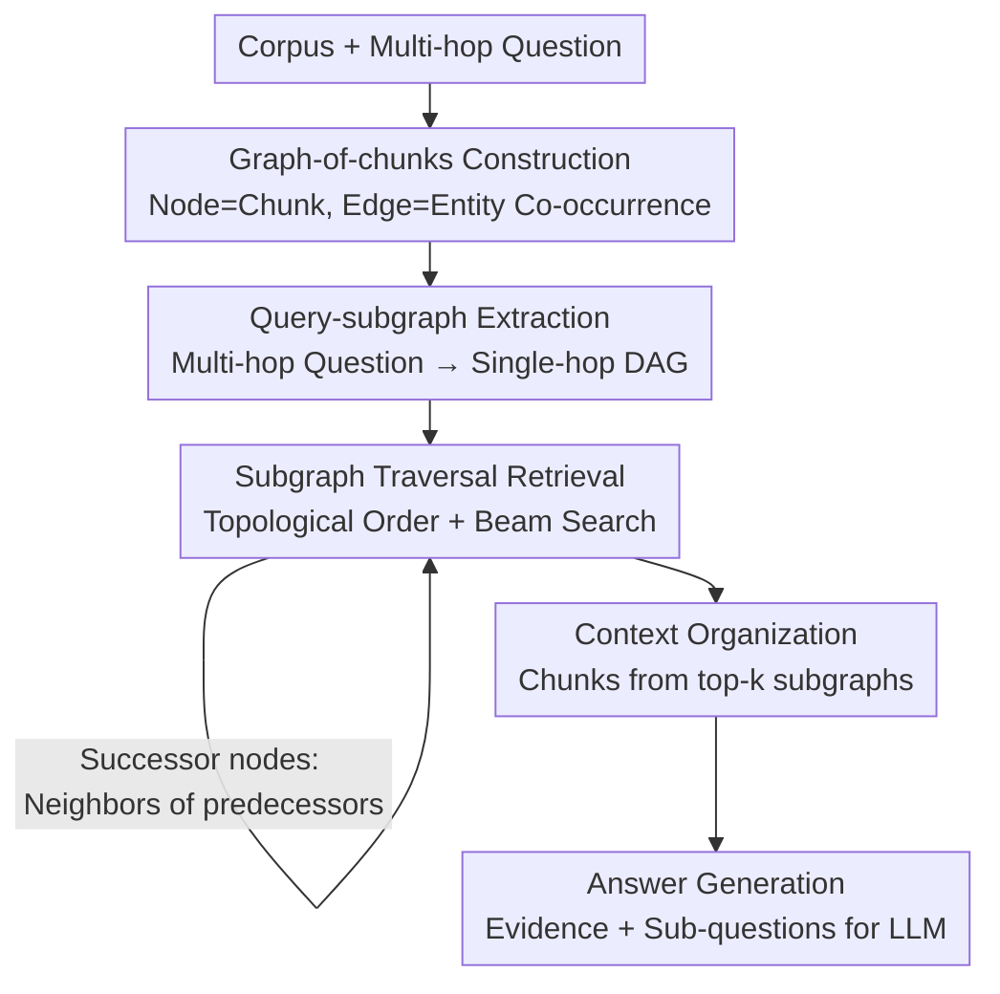

# BrowseNet: Graph-Based Associative Memory for Contextual Information Retrieval

**Conference**: ICLR2026  
**OpenReview**: [https://openreview.net/forum?id=2q5CugVPoK](https://openreview.net/forum?id=2q5CugVPoK)  
**Code**: https://github.com/bisect-group/BrowseNet  
**Area**: Information Retrieval / RAG / Multi-hop QA  
**Keywords**: Associative memory, graph-of-chunks, multi-hop QA, subgraph traversal, retrieval-augmented generation

## TL;DR
BrowseNet organizes the corpus into a "graph-of-chunks" using named entities as edges and text chunks as nodes. By decomposing multi-hop questions into directed acyclic query-subgraphs and performing beam-search-like subgraph traversal along the graph to retrieve evidence, it achieves SOTA Exact Match and recall on HotpotQA, 2WikiMQA, and MuSiQue with only a single LLM call.

## Background & Motivation
**Background**: Retrieval-Augmented Generation (RAG) decouples "knowledge storage" from "model reasoning," allowing LLMs to access updateable external knowledge bases without retraining. The standard trilogy—indexing (encoding chunks into vector databases), retrieval (fetching similar chunks), and generation (prompting the LLM with evidence)—has become the de facto standard.

**Limitations of Prior Work**: Conventional RAG retrieves isolated text chunks based on "literal/semantic similarity," ignoring the associations between chunks. For Multi-Hop Question Answering (MHQA), which requires connecting clues scattered across documents, simple top-k similarity retrieval often fails to capture the full evidence chain. To address this, existing methods follow two paths: iterative prompting (e.g., Chain-of-Thought or ReAct), which incurs high latency and costs due to repeated LLM calls; or graph-enhanced RAG (e.g., GraphRAG, RAPTOR, LightRAG), which uses LLMs to build or expand knowledge graphs during indexing, a process that is expensive and prone to noise. Brain-inspired methods like HippoRAG/HippoRAG-2 represent the current SOTA for MHQA, but their graph construction requires both Named Entity Recognition (NER) **and** Relation Extraction (RE), making the pipeline heavy.

**Key Challenge**: There is a tension between retrieval quality (capturing cross-document associations) and retrieval cost (minimizing LLM calls and noise). Capturing associations usually requires graph construction and LLM calls, which become increasingly expensive and noisy as usage grows.

**Goal**: To explicitly model "inter-chunk associations" in the retrieval process without relying on repeated LLM interactions or expensive relation extraction, enabling multi-hop evidence to be retrieved structurally in one go.

**Key Insight**: The authors compare human associative memory to "content-addressable memory"—retrieval should not merely look at surface similarity but "associate" relevant context following entity links. Thus, the corpus is organized into a graph where edges represent entity co-occurrence, and the multi-hop question is modeled as a dependency graph, turning retrieval into "traversing a large graph according to the structure of a small graph."

**Core Idea**: Replace top-k similarity retrieval with query-specific subgraph traversal. By constructing a graph-of-chunks and decomposing multi-hop questions into a DAG-form query-subgraph, the system performs pruned subgraph searching along the chunk graph. Multi-hop evidence collection is completed with only one LLM call (for query decomposition).

## Method

### Overall Architecture
BrowseNet takes a document corpus and a multi-hop question as input and outputs the answer along with the reasoning process. The pipeline consists of three phases: **Offline indexing** constructs the corpus into a graph-of-chunks; **Online retrieval** first decomposes the question into a query-subgraph (dependency graph), then performs topological-order subgraph traversal along the chunk graph to fetch evidence; **Generation** feeds the evidence and decomposed sub-questions into the LLM.

The key lies in the coordination of "two graphs": the chunk graph characterizes "what is related to what" in the corpus (structural information), and the query-subgraph characterizes "which step to answer first" (reasoning dependency). Retrieval is driven by using the question graph structure to guide the walk on the chunk graph—initial nodes use global semantic recall, while successor nodes are searched only within the **neighbors** of previously hit chunks, realizing "multi-hop" as "traversing edges." The entire process requires only one LLM call per question.

### Key Designs

**1. Graph-of-chunks construction: Weaving the corpus into a traversable association graph**

To address the limitation of standard RAG losing inter-chunk relationships, BrowseNet builds a graph $G=(V,E)$ for corpus $D$: nodes $c\in V$ are document chunks (with unique indices, text, titles, and semantic vectors $M(c)$ encoded by NV-Embed-v2); an edge $e_{ij}$ exists if and only if two chunks share a common or synonymous named entity. Construction involves two steps: using GLiNER (a zero-shot NER model) to extract entities based on general labels (person, location, etc.); then using ColBERTv2 to calculate entity similarity, treating cosine $>0.9$ as synonyms to link chunks. Numbers and dates are excluded due to low information density. 

The ingenuity lies in requiring only NER without RE, making the pipeline lighter than HippoRAG while maintaining high quality (99.86% edge coverage of gold reasoning paths on 2WikiMQA).

**2. Query-subgraph extraction: Modeling multi-hop questions as DAGs**

To address the fact that multi-hop questions have internal dependencies often ignored by flat retrieval, the authors decompose $Q_{orig}$ into a sequence of single-hop sub-questions. This forms a directed graph $Q=(V_q,E_q)$ where nodes are sub-questions and edges represent dependency on intermediate answers. The graph is forced to be a DAG. Decomposition is generated once by GPT-4o. The quality is evaluated using **isomorphic accuracy**, determined by comparing the generated subgraph to the gold reasoning graph using the NetworkX VF2 algorithm.

**3. Subgraph traversal retrieval: Topological order + beam search**

This is the core of the method. After obtaining the query-subgraph, components are processed in topological order. Two strategies are used:

- **Initial nodes**: Perform global semantic recall. The similarity $SS_{c_i}$ is the **maximum** of the cosine similarities between the chunk embedding and both the original multi-hop question and the specific sub-question:

$$SS_{c_i}=\max\big(\cos(M(c_i),M(Q_{orig})),\ \cos(M(c_i),M(V_q^j))\big)$$

Using the `max` provides robustness against query decomposition noise—if the sub-question is precise, the chunk matches it; if it is poorly decomposed, the original question acts as a safety net.

- **Successor nodes**: For a successor node with $p$ predecessors each having $k$ candidate chunks, all $k^p$ combinations are enumerated. The candidates for the successor are the **union of neighbors** of these selected chunks in the chunk graph. Scoring is based on the maximum cosine similarity to the current sub-question, the modified query, and the original question. Each subgraph is scored using a weight weighted by topological depth:

$$weight_{SG}=\sum_i \frac{SS_{c_i}}{depth_{c_i}}$$

Earlier nodes are weighted more heavily since errors at the start crash the entire chain. Keeping only the top-k subgraphs at each step functions as a beam search in the subgraph space, effectively pruning the combinatorial explosion.

**4. Answer generation: Forcing intermediate reasoning**

The retrieved context and the **decomposed sub-questions** are fed into the prompt for the LLM (default: gpt-4o-mini). The model is instructed to reason through the sub-questions step-by-step. Including sub-questions in the prompt reduces ambiguity and improves EM/F1 scores while making the answer traceable.

## Key Experimental Results

### Main Results
1,000 questions were sampled from HotpotQA, 2WikiMQA, and MuSiQue, with other paragraphs from the datasets added as distractors. All baselines used gpt-4o-mini for fairness.

Retrieval Recall (R@2 / R@5, Avg. across 3 datasets):

| Retriever | R@2 | R@5 |
|-----------|------|------|
| BM25 | 46.50 | 58.43 |
| NV-Embed-v2 (7B) | 68.77 | 80.74 |
| HippoRAG | 57.44 | 73.11 |
| HippoRAG-2 (Prev. SOTA) | 69.97 | 86.87 |
| **BrowseNet** | **71.91** | **87.87** |

Answer Generation (EM / F1, Avg. across 3 datasets):

| Method | EM | F1 |
|--------|------|------|
| NV-Embed-v2 (7B) | 49.73 | 62.63 |
| GraphRAG | 41.37 | 56.87 |
| HippoRAG-2 | 51.60 | 65.30 |
| **BrowseNet** | **55.90** | **68.76** |

BrowseNet achieved the highest average scores across both tables. The improvements are statistically significant ($p<0.05$). The advantage is most pronounced on MuSiQue, which requires up to four hops.

### Ablation Study

| Configuration | R@2 (avg) | R@5 (avg) | Description |
|---------------|-----------|-----------|-------------|
| BrowseNet (NV-Embed-v2) | 71.91 | 87.87 | Full Model |
| Synonym Threshold 0.8 / 0.7 | 71.79 / 71.85 | 87.71 / 87.72 | Minor change; robust to threshold |
| Keywords via GPT-4o | 71.72 | 87.61 | Robust to NER model |
| Decomposition via Claude-3.7 | 70.20 | 86.37 | Slight drop; somewhat robust |
| Encoder: GTE-Qwen2 (7B) | 65.78 | 81.90 | **Significant drop** |
| Encoder: Granite-125M | 65.70 | 81.39 | **Significant drop** |

### Key Findings
- **Encoder choice is critical**: Switching from NV-Embed-v2 resulted in a drop from 71.91 to ~65.7, the largest decrease in all ablations.
- **Graph-based gains are substantial**: Compared to BrowseNet without the graph-of-chunks, Recall@5 improved by approximately 5%, while computation time decreased by a factor of 1.5.
- **Huge cost advantage**: The full-pipeline LLM cost of HippoRAG-2 is 33x higher than BrowseNet. BrowseNet's latency is only ~0.49s higher than HippoRAG-2.
- **High graph quality**: The edge coverage of the chunk graph reached 99.86% on 2WikiMQA.

## Highlights & Insights
- **"Two-graph alignment" paradigm**: Mapping both the corpus and the question into graphs transforms retrieval from "ranking" to "traversing," embedding reasoning structure into retrieval.
- **NER-only efficiency**: Achieving results comparable to or better than methods requiring RE suggests that entity co-occurrence edges are sufficient for most association structures.
- **Three-way max similarity**: Combining local and global question similarity effectively mitigates the instability of LLM query decomposition.
- **Subgraph beam search**: Prunes combinatorial explosion while prioritizing early nodes, aligning with the "error propagation" intuition of multi-hop tasks.

## Limitations & Future Work
- **High dependency on the encoder**: Performance drops significantly with weaker embedding models, indicating that graph structure is an enhancement to, not a replacement for, semantic retrieval.
- **Dependency on DAG decomposition**: The method assumes questions can be decomposed into acyclic chains. It may revert to semantic search for failures or circular dependencies.
- **Entity co-occurrence limitations**: Edges based on shared entities may miss "semantically related but entity-distinct" associations.
- **Latency**: While the overhead is small (~0.49s), subgraph enumeration risks expansion for deeper queries ($p>4$).

## Related Work & Insights
- **vs HippoRAG-2**: Both use associative memory. HippoRAG-2 requires expensive KG construction (33x cost). BrowseNet is cheaper and delivers higher召回/EM/F1 by using entity co-occurrence and a single LLM call.
- **vs GraphRAG / RAPTOR**: These use heavy LLM processing during indexing. BrowseNet limits LLM usage to query decomposition and uses graphs for structured traversal rather than generation.
- **vs Dense Retriever**: Dense retrievers ignore isolated chunk relationships. BrowseNet's hybrid "keyword-link + semantic" strategy is significantly stronger for complex multi-hop tasks like MuSiQue.

## Rating
- Novelty: ⭐⭐⭐⭐ "Two-graph alignment + subgraph beam search" is a substantial restructuring of graph-RAG.
- Experimental Thoroughness: ⭐⭐⭐⭐⭐ Covers three standard datasets, ten-plus baselines, cost/latency analysis, and significance testing.
- Writing Quality: ⭐⭐⭐⭐ Logical and well-illustrated; minor notation clarification for $weight_{SG}$ may be needed.
- Value: ⭐⭐⭐⭐⭐ Achieving SOTA while reducing LLM cost to 1/33 is highly attractive for practical RAG systems.

<!-- RELATED:START -->

## Related Papers

- [\[ICLR 2026\] AssoMem: Scalable Memory QA with Multi-Signal Associative Retrieval](assomem_scalable_memory_qa_with_multi-signal_associative_retrieval.md)
- [\[ICLR 2026\] MLP Memory: A Retriever-Pretrained Memory for Large Language Models](mlp_memory_a_retriever-pretrained_memory_for_large_language_models.md)
- [\[ICLR 2026\] Query-Aware Flow Diffusion for Graph-Based RAG with Retrieval Guarantees](query-aware_flow_diffusion_for_graph-based_rag_with_retrieval_guarantees.md)
- [\[ACL 2026\] Optimizing User Profiles via Contextual Bandits for Retrieval-Augmented LLM Personalization](../../ACL2026/information_retrieval/optimizing_user_profiles_via_contextual_bandits_for_retrieval-augmented_llm_pers.md)
- [\[ICLR 2026\] LinearRAG: Linear Graph Retrieval Augmented Generation on Large-scale Corpora](linearrag_linear_graph_retrieval_augmented_generation_on_large-scale_corpora.md)

<!-- RELATED:END -->
