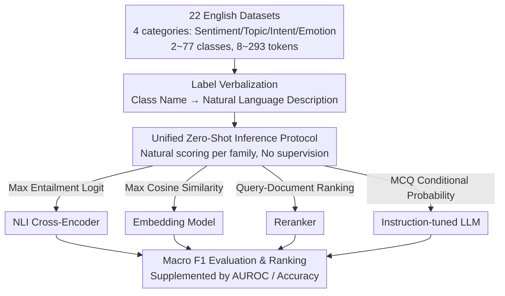

# BTZSC: A Benchmark for Zero-Shot Text Classification Across Cross-Encoders, Embedding Models, Rerankers and LLMs

**Conference**: ICLR2026  
**arXiv**: [2603.11991](https://arxiv.org/abs/2603.11991)  
**Code**: [GitHub](https://github.com/IliasAarab/btzsc)  
**Area**: Information Retrieval  
**Keywords**: zero-shot classification, benchmark, reranker, embedding model, NLI

## TL;DR
The authors propose the BTZSC benchmark (spanning 22 datasets), which for the first time systematically compares four major model families—NLI Cross-Encoders, Embedding Models, Rerankers, and instruction-tuned LLMs (38 models in total)—under a unified zero-shot protocol. The study finds that Qwen3-Reranker-8B achieves a new SOTA with a macro $F1=0.72$, while embedding models offer the optimal trade-off between precision and latency.

## Background & Motivation

**Background**: Zero-shot text classification (ZSC) eliminates the need for expensive labeling by directly matching text with human-readable label descriptions. Early mainstream methods transformed classification into Natural Language Inference (NLI) tasks, utilizing Cross-Encoders to determine the entailment relationship between text and labels.

**Limitations of Prior Work**: Recent years have witnessed rapid progress in Embedding Models, Rerankers, and instruction-tuned LLMs. However, there is currently no benchmark that fairly compares these four model families under a unified zero-shot protocol. Although the MTEB benchmark is comprehensive, its classification evaluation relies on supervised linear probes, which are not truly zero-shot.

**Key Challenge**: Existing evaluations either focus on a single model family or incorporate supervised signals, failing to accurately measure the capability gaps and applicable scenarios of various models under strictly zero-shot conditions.

**Goal**: Construct a standardized zero-shot text classification benchmark covering multiple task types, domains, and label scales to systematically compare performance, scaling properties, and efficiency across model families.

**Key Insight**: Selecting 22 public datasets covering four categories (sentiment, topic, intent, and emotion detection) and utilizing unified label verbalization and inference protocols to ensure all models are evaluated under identical conditions.

**Core Idea**: Build BTZSC, the first benchmark for unified evaluation of NLI Cross-Encoders, Embedding Models, Rerankers, and LLMs in zero-shot text classification.

## Method

### Overall Architecture
BTZSC is an evaluation benchmark rather than a specific model architecture. It aims to answer: under **true zero-shot** conditions (where no labeled data is accessed), which mechanism among NLI Cross-Encoders, Embedding Models, Rerankers, and instruction-tuned LLMs performs best for text classification. The pipeline operates as follows: first, 22 English datasets are selected covering diverse tasks, domains, and label granularities. Dry category names are rewritten into natural language descriptions via **label verbalization**. Then, the four model families score "text-label" pairs using their most natural mechanisms within the zero-shot protocol. Finally, all 38 models are ranked by macro F1, supplemented by AUROC and accuracy for validation.

### Key Designs

**1. Multi-dimensional Dataset Design: Avoiding bias through broad coverage**
If a benchmark only selects a specific task or domain, the conclusions regarding model superiority are difficult to generalize. BTZSC thus selects datasets across four dimensions: task diversity (sentiment, topic, intent, emotion detection), label granularity (ranging from 2 to 77 classes), domain diversity (news, social media, product reviews, encyclopedia, politics, etc.), and document length (8 to 293 tokens). To ensure these 22 datasets are distinct, the authors quantified vocabulary overlap using weighted Jaccard similarity, confirming sufficient diversity for broad applicability.

**2. Label Verbalization: Converting dry category names into semantically rich descriptions**
Directly matching raw labels (e.g., "positive") yields thin information, making it difficult for models to fully utilize semantic understanding. Label verbalization rewrites each category into a complete sentence. For example, the positive class in Amazon Polarity is verbalized as "The overall sentiment within the Amazon product review is positive." This provides more contextual anchors, transforming text-label matching from "word matching" to "sentence matching," thereby better leveraging the semantic representation capabilities of each family.

**3. Unified Zero-Shot Inference Protocol: Fair comparison of diverse mechanisms**
The inference mechanisms of the four families differ significantly. The protocol specifies the most natural scoring method for each while strictly maintaining zero-shot status (no supervised signals): NLI Cross-Encoders treat each candidate label as an entailment hypothesis and take the max entailment logit; Embedding models compute cosine similarity between text and label descriptions; Rerankers treat text as a query and label descriptions as documents for ranking; Instruction-tuned LLMs use a multiple-choice prompt and take the option with the highest conditional probability.

**4. Evaluation Metrics: Counteracting imbalance with macro F1 and isolating thresholds with AUROC**
Since datasets vary significantly in class counts (2~77) and distributions are often imbalanced, using accuracy would allow majority classes to dominate. BTZSC uses macro F1 as the primary metric to weight each class equally. For NLI entailment capability, AUROC is used as it does not rely on a fixed decision threshold, thereby bypassing interference from threshold selection and probability calibration.

## Key Experimental Results

### Main Results

| Model Family | Representative Model | Topic F1 | Sentiment F1 | Intent F1 | Emotion F1 | Average F1 | Average Acc |
|----------|---------|---------|---------|---------|------------|---------|---------|
| Base Encoder | bert-large | 0.34 | 0.38 | 0.15 | 0.08 | 0.30 | 0.40 |
| NLI Cross-Enc | deberta-v3-large-nli-triplet | 0.50 | 0.90 | 0.45 | 0.42 | **0.60** | 0.62 |
| Reranker | Qwen3-Reranker-8B | — | — | — | — | **0.72** | 0.76 |
| Embedding | gte-large-en-v1.5 | — | — | — | — | 0.62 | 0.65 |
| LLM | Mistral-Nemo-12B | — | — | — | — | 0.67 | 0.71 |

### Scaling & Efficiency Analysis

| Analysis Dimension | Key Findings |
|----------|---------|
| Reranker Scaling | Monotonic improvement with parameters; 8B reaches 0.72 F1 |
| Embedding Scaling | Saturates at 0.60-0.62 F1 after several hundred million parameters |
| LLM Scaling | Steepest gain between 3B and 8B, catching up with best embedding models |
| Precision-Latency Trade-off | Embedding models occupy the Pareto frontier (High precision + Low latency) |
| NLI→ZSC Transferability | Linear positive correlation for Cross-Encoders; no correlation for Embedding models |

### Key Findings
- Reranker (Qwen3-Reranker-8B) sets a new ZSC SOTA with a macro $F1=0.72$, outperforming the best NLI Cross-Encoder by +12 F1.
- Embedding models (gte-large-en-v1.5) achieve 0.62 F1 without cross-attention, approaching Cross-Encoders but with significantly faster inference.
- NLI Cross-Encoders tend to saturate as the backbone size increases; DeBERTa-v3 remains the strongest backbone.
- LLMs are particularly strong in topic classification (max F1 0.69) but weaker in emotion detection.
- Even the small Qwen3-Reranker-0.6B outperforms all NLI Cross-Encoders.
- NLI capability is not a good predictor of ZSC performance for Embedding models—the structure of the embedding space is key.

## Highlights & Insights
- **First Unified Evaluation of Four Families**: Fills the gap in MTEB regarding zero-shot classification and identifies Rerankers as a severely underrated ZSC model family.
- **Unexpected Rise of Rerankers**: Repositions Rerankers from Information Retrieval as the optimal solution for ZSC. This provides deployment guidance: use Rerankers for high precision and Embedding models for low latency.
- **NLI-ZSC Transferability Analysis**: Reveals that the relationship between NLI capability and ZSC performance is model-family dependent. This means ZSC performance in embedding models cannot be improved simply by enhancing NLI scores.
- **Reusable Design**: The label verbalization strategy and unified evaluation protocol can be directly migrated to multilingual or other classification tasks.

## Limitations & Future Work
- Only covers English datasets; multilingual zero-shot classification capability remains unevaluated.
- Potential data leakage risk where pre-training data might contain benchmark datasets, though checks were performed.
- Lacks evaluation of larger LLMs (>12B) to determine if LLMs could surpass Rerankers at scale.
- Results may be sensitive to the quality of label verbalization, but a sensitivity analysis was not conducted.
- Evaluates only single-label classification, excluding multi-label scenarios.

## Related Work & Insights
- **vs MTEB**: MTEB uses supervised linear probes; BTZSC is purely zero-shot, better reflecting inherent semantic understanding.
- **vs Yin et al. (2019)**: The earliest NLI-ZSC benchmark had only 3 datasets and covered only Cross-Encoders; BTZSC expands this to 22 datasets across 4 families.
- **vs TTC23**: Only evaluates prompt-based methods for topic classification, excluding embedding and Reranker models.
- **vs Lepagnol et al. (2024)**: Evaluates only small models (100M-1B), lacking comparisons with larger embeddings and Rerankers.
- For practical applications requiring zero-shot classification, this work provides a clear guide: choose Rerankers for precision and Embedding models for latency.

## Rating
- Novelty: ⭐⭐⭐⭐ First unified evaluation of the four families, though the methodology is a benchmark rather than an algorithm.
- Experimental Thoroughness: ⭐⭐⭐⭐⭐ 22 datasets × 38 models, including scaling, efficiency, and NLI transferability analyses.
- Writing Quality: ⭐⭐⭐⭐⭐ Clear structure, well-defined conclusions, and rich visualizations.
- Value: ⭐⭐⭐⭐ Provides crucial empirical evidence for model selection in the field of zero-shot classification.

<!-- RELATED:START -->

## Related Papers

- [\[ICLR 2026\] ZeroGR: A Generalizable and Scalable Framework for Zero-Shot Generative Retrieval](zerogr_a_generalizable_and_scalable_framework_for_zero-shot_generative_retrieval.md)
- [\[ACL 2026\] PL-MTEB: Polish Massive Text Embedding Benchmark](../../ACL2026/information_retrieval/pl-mteb_polish_massive_text_embedding_benchmark.md)
- [\[ACL 2026\] SkMTEB: Slovak Massive Text Embedding Benchmark and Model Adaptation](../../ACL2026/information_retrieval/skmteb_slovak_massive_text_embedding_benchmark_and_model_adaptation.md)
- [\[ICLR 2026\] Let LLMs Speak Embedding Languages: Generative Text Embeddings via Iterative Contrastive Refinement](let_llms_speak_embedding_languages_generative_text_embeddings_via_iterative_cont.md)
- [\[CVPR 2025\] EZSR: Event-based Zero-Shot Recognition](../../CVPR2025/information_retrieval/ezsr_event-based_zero-shot_recognition.md)

<!-- RELATED:END -->
