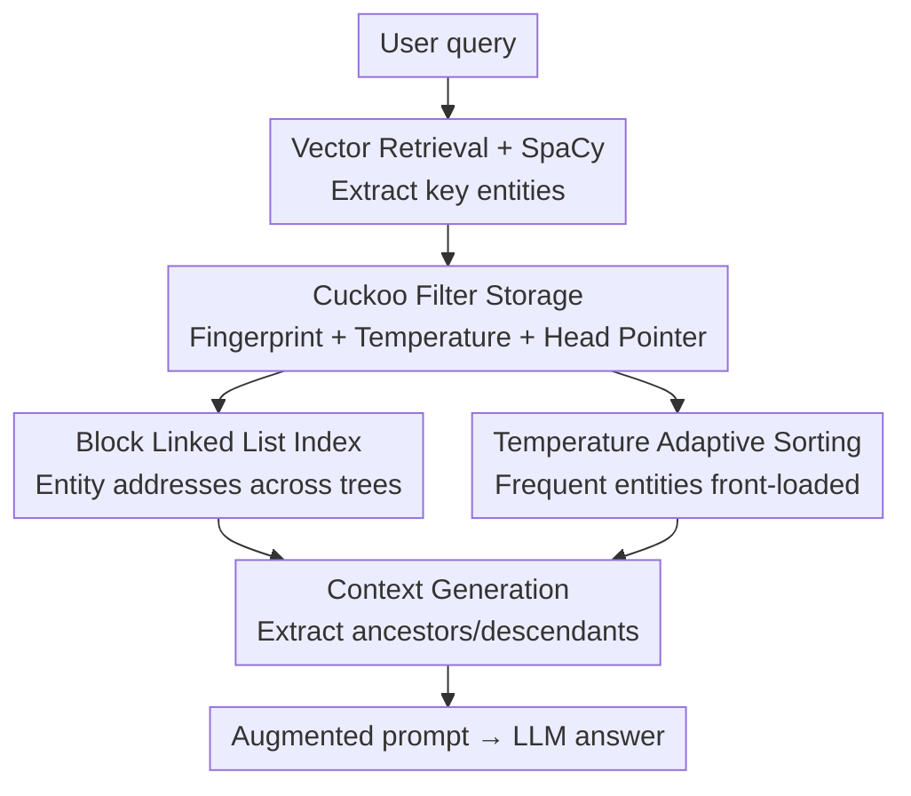

# CFT-RAG: An Entity Tree Based Retrieval Augmented Generation Algorithm With Cuckoo Filter

**Conference**: ICLR2026  
**OpenReview**: [https://openreview.net/forum?id=4y25Ifytn8](https://openreview.net/forum?id=4y25Ifytn8)  
**Code**: https://github.com/TUPYP7180/CFT-RAG-2025  
**Area**: Information Retrieval / RAG  
**Keywords**: Tree-RAG, Cuckoo Filter, Entity Tree, Retrieval Acceleration, Temperature Sorting

## TL;DR
CFT-RAG integrates a Cuckoo Filter into the entity localization stage of Tree-RAG. By combining fingerprints, block linked lists, and temperature-based sorting, it reduces the complexity of "searching entities in a forest" from $O(n)$ breadth-first search to approximately $O(1)$. On the DART dataset, it achieves an 800%+ speedup in retrieval compared to naive Tree-RAG, while simultaneously improving generation accuracy.

## Background & Motivation
**Background**: Retrieval-Augmented Generation (RAG) mitigates the "knowledge solidification" issue in Large Language Models (LLMs) by accessing external knowledge bases. Tree-RAG (T-RAG) builds upon standard RAG by introducing a hierarchical entity tree, organizing entities into a forest based on "parent-child subordination." During retrieval, it traverses the hierarchy to extract multi-level ancestors and descendants, providing the generative model with a richer, more structured context for improved accuracy and coherence.

**Limitations of Prior Work**: Retrieval performance is the primary bottleneck in Tree-RAG. Experimental results (Table 1) show that retrieval time accounts for 10% to 72% of the total response time. Naive Tree-RAG utilizes Breadth-First Search (BFS) to compare entities one by one within the forest. As datasets grow and trees deepen, the time required to locate all occurrences of an entity increases sharply, leading to poor scalability.

**Key Challenge**: To maintain "structural richness," Tree-RAG must manage a massive entity forest. However, a larger forest results in slower entity lookups—there is a direct conflict between structural expressiveness and retrieval efficiency. The linear traversal of BFS does not provide any optimization for membership queries.

**Goal**: To significantly enhance the entity retrieval efficiency of Tree-RAG without sacrificing generation quality. This is decomposed into two sub-problems: (1) achieving near-constant time for "checking entity existence and location"; and (2) supporting memory-efficient updates (insertion/deletion) for massive, dynamically updated entities.

**Key Insight**: The authors observe that "entity localization" is essentially a **set membership query + multi-location address retrieval** problem. The Cuckoo Filter is a data structure designed specifically for fast membership queries, supporting $O(1)$ lookups, deletions, and memory savings via 12-bit fingerprints, making it more flexible than a Bloom Filter. Integrating it into the entity localization stage addresses the bottleneck directly.

**Core Idea**: An "improved Cuckoo Filter" replaces BFS for entity localization. Fingerprints are used for membership queries, block linked lists store entity addresses across trees, and temperature variables reorder entities in buckets based on access frequency. This combination reduces retrieval from linear traversal to a table lookup.

## Method

### Overall Architecture
The input to CFT-RAG is a user query, and the output is an LLM response enhanced by retrieved context. The pipeline modifies only the "entity localization" component of the naive Tree-RAG. The query undergoes vector retrieval to recall relevant documents, followed by entity extraction via SpaCy. The critical change is that the system no longer performs BFS in the entity forest; instead, it queries an **externally maintained Cuckoo Filter** for entity fingerprints. Upon a hit, it follows the block linked list to retrieve all addresses of the entity across various trees, extracting hierarchical context (ancestors/descendants). Finally, it synthesizes the context, system prompt, and query into a final prompt for the LLM.

The data preprocessing stage (performed once during indexing) transforms raw data into an entity forest: SpaCy performs entity recognition, and dependency parsing (using GPT-4 + open-source NLP libraries) extracts "subordination/inclusion/dependency" relations. Transitive relations, cycles, self-loops, and duplicate edges are filtered to ensure a valid tree structure. The filtration infrastructure is secondary; the primary innovation lies within the filter mechanism.

### Key Designs

**1. Cuckoo Filter for Entity Localization: Replacing BFS with $O(1)$ Lookup**

Naive Tree-RAG uses BFS to find all positions of an entity in the forest, with time complexity growing linearly with the number of entities. CFT-RAG constructs an auxiliary Cuckoo Filter where each entity is stored as a 12-bit **fingerprint** in fixed-size buckets, reducing query complexity to $O(1)$. Unlike Bloom Filters, Cuckoo Filters support both membership queries and deletions, making them suitable for dynamic knowledge bases. Fingerprints save significant memory compared to raw text. When the load factor exceeds a threshold, the filter **doubles its capacity** using a power-of-two expansion and performs re-hashing. This maintains a high load rate (>70% in experiments) while keeping hash collisions extremely low—experimental results show only 0–1 false positives per thousand entities with 1024 buckets.

**2. Block Linked Lists for Multi-location Addresses: Linking Every Occurrence**

A single entity may appear in multiple trees or several positions within the forest. Identifying a fingerprint only confirms existence; the system must retrieve all addresses to construct the hierarchical context. Each entry in the filter bucket stores three items: the entity fingerprint, a temperature variable, and a pointer to the head node of a **block linked list**. This list chains the addresses of the entity across different trees. Block linked lists are chosen over standard linked lists for higher space utilization and more efficient access patterns, reducing the total number of nodes. After a fingerprint hit, the system traverses the block linked list to visit every node of the entity, extracting multi-level ancestors $H_{up}=\{h_1,\dots,h_n\}$ and descendants $H_{down}=\{h_1',\dots,h_n'\}$ for the context.

**3. Temperature-Adaptive Sorting: Front-loading "Hot Entities"**

Cuckoo Filters perform **linear** searches within a bucket. If a popular entity is at the end of the bucket, it requires a full scan. The authors attach a **temperature** variable to each block linked list head node to record access frequency. Every time an entity is hit, its temperature increments by 1. When a bucket is idle (not queried in the current round), the fingerprints and pointers within the bucket are reordered based on temperature, moving "hot" entities to the front. This enables faster linear scanning for high-frequency entities in subsequent queries, leveraging entity locality. This optimization incurs **no extra space** cost as the temperature is stored within the linked list head, yet significantly reduces retrieval time for entity-heavy queries. Ablation studies (Figure 5) show that retrieval time after the first round is markedly shorter due to this reordering.

### Method Example
Suppose a query hits entity $x$. The system calculates $f(x)=\text{fingerprint}(x)$ and performs linear matching in candidate buckets $bucket[i_1]$ and $bucket[i_2]$. If a hit occurs, the entity's temperature increments by 1, and its block linked list `head` pointer is returned. The system traverses the linked list from `head`; for each location `loc`, it extracts $n$ ancestors $H_{up}$ and descendants $H_{down}$, storing pairs $(h_i, h_i')$ into the context. After traversing all blocks, these hierarchical relations are fused with the query. If no fingerprint matches, a null pointer is returned.

### Loss & Training
This method provides retrieval acceleration at the data structure level and does not involve model training or loss functions. The core RAG architecture is implemented in Python, while critical data structures like the Cuckoo Filter are optimized in C++ for performance.

## Key Experimental Results

### Main Results
1,000 questions were selected from each of three datasets: MedQA (large-scale), AESLC, and DART (medium-scale). Accuracy was evaluated via LangSmith (using Doubao as the judge model), with results averaged over 108 runs. Hardware: H100 GPU + 22-core CPU + 220 GiB RAM.

| Dataset | Method | Retrieval Time (s) | Time Ratio (%) | Accuracy (%) |
|--------|------|------|----------|------|
| MedQA | Naive T-RAG | 19.45 | 58 | 65 ± 5 |
| MedQA | ANN T-RAG | 7.65 | 25 | 67 ± 4 |
| MedQA | ANN G-RAG | 8.78 | 26 | 61 ± 6 |
| MedQA | **Ours (CFT-RAG)** | **5.24** | **16** | **69 ± 4** |
| AESLC | Naive T-RAG | 12.87 | 62 | 55 ± 5 |
| AESLC | ANN T-RAG | 2.52 | 13 | 56 ± 6 |
| AESLC | **Ours (CFT-RAG)** | **0.97** | **5** | **57 ± 5** |
| DART | Naive T-RAG | 16.03 | 74 | 65 ± 5 |
| DART | ANN T-RAG | 3.28 | 15 | 66 ± 5 |
| DART | **Ours (CFT-RAG)** | **1.81** | **9** | **68 ± 5** |

CFT-RAG achieved the lowest retrieval time across all datasets. In DART, time dropped from 16.03s to 1.81s (~1/9th of Naive T-RAG, an 800%+ speedup). Accuracy also improved (69% vs 65% on MedQA). CFT-RAG outperformed T-RAG and G-RAG versions already accelerated by Approximate Nearest Neighbor (ANN) search. The authors note that the advantage of CFT-RAG is most pronounced in multi-hop questions requiring high entity-relation precision.

### Ablation Study

| Configuration | Key Observation | Explanation |
|------|---------|------|
| With Temperature Sorting | Retrieval time drops significantly after the first round | Reordering based on frequency front-loads hot entities |
| Without Temperature Sorting | Constant retrieval time across rounds | Linear search in buckets fails to exploit locality |

### Key Findings
- **Temperature sorting is a "free lunch"**: It consumes no additional space (reusing head nodes) but provides continuous acceleration for entity-rich or multi-round queries.
- **Near-zero error rate**: Maintaining a load factor >70% with power-of-two expansion keeps hashing conflicts negligible (0–1 errors per thousand entities).
- **Maximum gain in complex multi-hop problems**: The combination of structured localization and fast membership queries excels when precise entity relations are required.

## Highlights & Insights
- **Precise Application of Classical Data Structures**: Cuckoo Filters are typically used for membership queries in networking or streaming. The authors correctly identified that Tree-RAG localization is fundamentally a membership + address retrieval problem. This "replacing inefficient algorithms with the right data structure" approach is transferable to any structured RAG system.
- **Three-Layer Synergy**: Fingerprints handle existence checks, block linked lists handle multi-location retrieval, and temperature sorting addresses the constant factor of linear bucket scans. This reduces an $O(n)$ problem to near $O(1)$ through clear division of labor.
- **Caching Locality via Temperature**: Borrowing the "front-loading" concept from LRU/cache logic for bucket sorting provides significant acceleration with zero extra overhead—a clever engineering trick applicable to other linear-scan index structures.

## Limitations & Future Work
- **Dependency on Entity Forest Quality**: The acceleration depends on the quality of SpaCy extraction and dependency parsing. If the tree construction is flawed, the retrieval—though fast—will be inaccurate.
- **Limited Gain for Specific Scenarios**: Temperature-based benefits are only prominent in multi-round queries or those with repetitive "hot" entities. There is no gain for cold starts or uniform entity distributions.
- **Single Evaluation Metric**: Accuracy is scored by LangSmith + Doubao without human evaluation or multi-dimensional quality analysis. The focus remains heavily on "retrieval time" rather than holistic generation quality.
- **Lack of Comparison with Latest Structured RAGs**: Baselines are Naive/ANN models. Comparisons with more robust hierarchical or graph methods like RAPTOR or GraphRAG in terms of speed-quality trade-offs are missing.

## Related Work & Insights
- **vs Naive Tree-RAG (Fatehkia et al., 2024)**: T-RAG uses BFS with $O(n)$ complexity that scales poorly; CFT-RAG uses Cuckoo Filters to reach $O(1)$, serving as a drop-in acceleration for the same framework.
- **vs ANN Tree-RAG / ANN Graph-RAG**: While ANN (FAISS/HNSW) accelerates recall via approximation, CFT-RAG provides exact membership queries and structured retrieval, proving faster and more accurate in experiments.
- **vs RAPTOR (Sarthi et al., 2024)**: RAPTOR builds trees via recursive embedding-clustering-summarization for semantic understanding but lacks retrieval efficiency optimization; CFT-RAG is complementary, focusing specifically on "speed."
- **vs Graph-RAG / EMG-RAG (Wang et al., 2024)**: Graph structures offer strong relational expression but involve high construction and computational costs. CFT-RAG is more lightweight.

## Rating
- Novelty: ⭐⭐⭐⭐ Effectively maps Cuckoo Filters + Block Linked Lists + Temperature Sorting to Tree-RAG bottlenecks.
- Experimental Thoroughness: ⭐⭐⭐ Significant speedup demonstrated across three datasets, though baselines and ablations could be more diverse.
- Writing Quality: ⭐⭐⭐⭐ Clear logical flow from motivation to data structures and algorithms.
- Value: ⭐⭐⭐⭐ Retrieval efficiency is a real-world bottleneck for RAG deployment; this method is lightweight and easily integrated.

<!-- RELATED:START -->

## Related Papers

- [\[ICML 2026\] Hierarchical Abstract Tree for Cross-Document Retrieval-Augmented Generation](../../ICML2026/information_retrieval/hierarchical_abstract_tree_for_cross-document_retrieval-augmented_generation.md)
- [\[ACL 2026\] Retrieval-Augmented Tutoring for Algorithm Tracing and Problem-Solving in AI Education](../../ACL2026/information_retrieval/retrieval-augmented_tutoring_for_algorithm_tracing_and_problem-solving_in_ai_edu.md)
- [\[ICLR 2026\] Bridging Draft Policy Misalignment: Group Tree Optimization for Speculative Decoding](bridging_draft_policy_misalignment_group_tree_optimization_for_speculative_decod.md)
- [\[ACL 2026\] Disco-RAG: Discourse-Aware Retrieval-Augmented Generation](../../ACL2026/information_retrieval/disco-rag_discourse-aware_retrieval-augmented_generation.md)
- [\[ICLR 2026\] GRO-RAG: Gradient-aware Re-rank Optimization for Multi-source Retrieval-Augmented Generation](gro-rag_gradient-aware_re-rank_optimization_for_multi-source_retrieval-augmented.md)

<!-- RELATED:END -->
