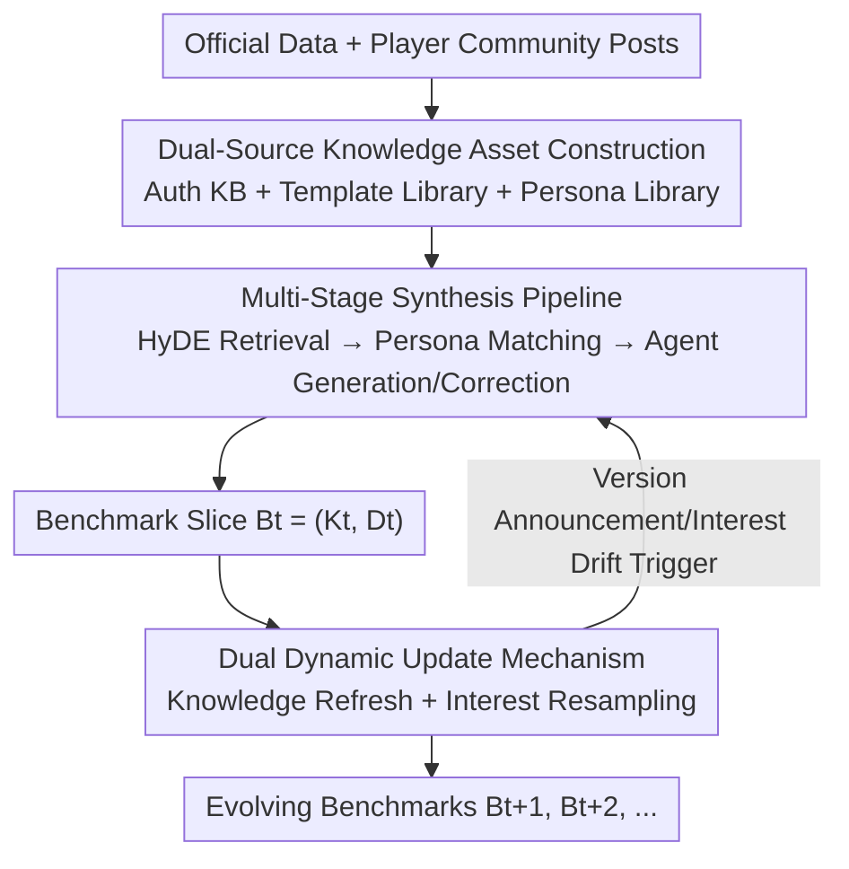

# ChronoPlay: A Framework for Modeling Dual Dynamics and Authenticity in Game RAG Benchmarks

**Conference**: ICLR2026  
**OpenReview**: [https://openreview.net/forum?id=NLFxQedK9y](https://openreview.net/forum?id=NLFxQedK9y)  
**Code**: https://github.com/hly1998/ChronoPlay  
**Area**: RAG Evaluation / Dynamic Benchmarks / Games  
**Keywords**: Game RAG, Dynamic Benchmarks, Knowledge Evolution, Interest Drift, Automatic Synthesis

## TL;DR
ChronoPlay is the first RAG benchmark generation framework for the gaming domain. It utilizes a "dual-source synthesis engine" (official knowledge to ensure factual accuracy + player community templates to ensure question authenticity) for automated data creation. It further implements a "dual dynamic update mechanism" (refreshing knowledge based on version updates and resampling question distributions by detecting interest drift via JS divergence), allowing the benchmark to evolve with game versions and player focus, thereby exposing RAG system performance fluctuations that static benchmarks fail to detect.

## Background & Motivation
**Background**: The advancement of Retrieval-Augmented Generation (RAG) is largely driven by benchmarks, evolving from static benchmarks like NQ and HotpotQA to dynamic benchmarks like HOH and GrowOVER that use monthly snapshots to keep pace with real-world information. Online gaming represents a high-value scenario for RAG (e.g., intelligent assistants, automated customer service bots), yet **no RAG benchmark currently exists for the gaming domain**, leaving these applications without standardized evaluation.

**Limitations of Prior Work**: The gaming ecosystem consists of two continuously evolving entities—the game itself and the player community. The authors define the resulting core challenge as **Dual Dynamics**. On one hand, **Knowledge Evolution** occurs: patches and version updates cause game content and rules to change frequently, making static benchmarks quickly obsolete. On the other hand, **User Interest Drift** occurs: player focus shifts systematically from novice tutorials to late-game content and advanced strategies. Existing dynamic benchmarks (e.g., HOH, GrowOVER, EvolvingQA, REALTIMEQA) focus solely on knowledge updates and completely ignore interest drift.

**Key Challenge**: The pace of dual dynamics makes manual maintenance of a "fresh" benchmark nearly impossible. Given the variety of games, **automatic synthesis is the only feasible path**. However, current automatic synthesis methods sacrifice **authenticity** for knowledge timeliness: a benchmark filled with "grammatically correct but unrealistic" questions is essentially invalid for user-centric domains.

**Goal**: To create a game RAG benchmark that (1) updates continuously and automatically, (2) tracks both knowledge evolution and interest drift, and (3) ensures questions reflect real player inquiries.

**Key Insight**: Authenticity is explicitly decomposed into two mineable assets: official knowledge for factual correctness and player communities for question templates and preferences. Dynamics are split into two independent update paths: entity-level knowledge refreshing and distribution-level interest resampling.

**Core Idea**: By combining "dual-source synthesis" and "dual dynamic updates," game RAG evaluation is transformed from a static snapshot into a living benchmark that evolves alongside the game lifecycle and adheres to real-world player interest distributions.

## Method

### Overall Architecture
ChronoPlay generates an **evolving benchmark sequence** $B = \{B_1, B_2, ..., B_t, ...\}$. Each temporal slice $B_t = (K_t, D_t)$ consists of a retrieval corpus $K_t$ and an evaluation set $D_t$. Each sample in the evaluation set is a six-tuple $d = (Q, A, C_{ref}, \theta, \tau, \sigma)$, representing the question, answer, reference knowledge snippets, question topic, timestamp, and involved in-game entities, respectively.

The framework integrates two core components: a **Dual-source Data Synthesis Pipeline** responsible for "generating authentic and factually correct questions," and a **Dual Dynamic Update Mechanism** responsible for "evolving these questions alongside the game and players." The synthesis stage processes official and community data into three assets: an authoritative knowledge base, a template library, and a persona library. A data synthesis agent then links these to generate questions with quality self-checks. The update stage uses NER to identify entities affected by version announcements to refresh stale questions and employs weighted JS divergence to detect interest drift for resampling topic distributions.

### Key Designs

**1. Dual-Source Knowledge Asset Construction: Decoupling Accuracy and Authenticity**

The challenge lies in the fact that raw community questions are noisy and lack guaranteed accuracy, while official knowledge alone fails to produce realistic player-like questions. ChronoPlay decouples these into three reusable assets. The **Authoritative Knowledge Base** $K_{auth}$ is derived from game wikis and official patch notes, where each snippet is formalized as $(k_c, k_\tau, k_\sigma)$. Raw HTML and tables are processed via DOM tree analysis and LLM formatting into searchable snippets $k_c$. Official release dates serve as $k_\tau$, and entities $k_\sigma = E(k_c)$ are extracted via a Self-ICL based NER function $E(\cdot)$. The **Question Template Library** $T_{comm}$ and **User Persona Library** $U_{comm}$ are derived from the community. Experts build a hierarchical topic classification $\Theta$ (6 categories, 21 subcategories). LLMs then extract reusable elements: question templates $p$ paired with topics $\theta$, and user personas $u$. Making templates and personas "game-agnostic" is key to cross-game scalability.

**2. Multi-Stage Synthesis Pipeline: HyDE Retrieval + Persona Matching + Agent Self-Correction**

To organically combine these assets, the pipeline first indexes $K_{auth}$ snippets. Following the HyDE approach, the LLM generates a **hypothetical QA pair** $(Q_{hypo}, A_{hypo})$ from a template $(p, \theta)$. Its embedding is more effective than the raw template at locating relevant snippets $C_{ref}=\{k_1,...,k_n\}$ in the $K_{auth}$ vector space. The persona library $U_{comm}$ is then searched for the best match using the hypothetical pair; personas are included only if similarity exceeds a threshold $\lambda_p$. Finally, a **Data Synthesis Agent** generates the 6-tuple using a sampled question type $q_t$, the template, retrieved snippets, and the persona. The agent includes a **Quality Control Loop**: each candidate is scored by an LLM-as-Judge. If it fails, the agent retries with a different template from the same topic $\theta$ to ensure stable output for each topic.

**3. Dual Dynamic Update Mechanism: Entity-Level Knowledge Refresh + Distribution-Level Interest Tracking**

This is the core of ChronoPlay's "living" benchmark, comprising two independent paths. The **Knowledge Evolution Path** responds to discrete events like official announcements $A_{new}$. A monitoring module uses $E(\cdot)$ to identify affected entities $\sigma_{update}=E(A_{new})$ and isolates the **stale subset**:

$$D_{stale} = \{d \in D_t \mid \sigma(d) \cap \sigma_{update} \neq \emptyset\}$$

Valid questions $D_{valid}$ are retained, while stale topics are fed back into the synthesis pipeline to generate $D_{new}$, resulting in $D_{t+1} = D_{valid} \cup D_{new}$. The **Interest Drift Path** monitors topic distributions $P_c$ vs. $P_r$ within a sliding window $W$. Collective interest drift is detected when the **Weighted JS Divergence** exceeds a threshold $\lambda_{JSD}$. The standard JSD is modified using a mixture distribution $M=\frac{1}{2}(P_c+P_r)$ and topic weights $w_\theta = M(\theta)^\gamma / \sum_{\theta'\in\Theta} M(\theta')^\gamma$, making the detector robust to low-frequency noise. Upon detection, resampling is triggered to align $B_{t+1}$ with the current community distribution $P_c$.

## Key Experimental Results

The framework was instantiated on three games: Dying Light 2 (DL2), Dune: Awakening (Dune), and PUBG Mobile (PUBG). Retrieval was tested using BM25, BGE-M3, Qwen3-Embedding, and text-embedding-3. Generation was tested using six models (GPT-4o, DeepSeek-V3, etc.) with evaluation via LLM-as-Judge on correctness and faithfulness.

### Main Results: Significant Retriever Fluctuations (Recall@3)

| Game/Phase | BM25 | Qwen3-Emb | BGE-M3 | text-emb-3 |
|-----------|------|-----------|--------|------------|
| DL2 Phase 3 | 0.403 | 0.338 | 0.367 | **0.551** |
| DL2 Phase 4 | 0.323 | 0.273 | 0.309 | **0.419** |
| Dune Phase 3 | 0.314 | 0.341 | 0.038 | **0.381** |
| PUBG Phase 1 | 0.415 | 0.515 | 0.482 | **0.528** |
| PUBG Phase 4 | 0.237 | 0.332 | 0.308 | **0.338** |

**Key Findings**: ① **No single retriever remains superior across all phases.** ② Performance **fluctuates significantly between phases**; for instance, DL2 Phase 4 saw a collective drop because "Gameplay Mechanics" questions, which are more complex, surged from 17% to 31%. ③ BGE-M3 collapsed on "Dune" (Recall as low as 0.028), likely due to the model's inability to generalize to the game's specific terminology.

### Ablation Study: Contribution of Synthesis Modules to Authenticity (Win Rate %)

| Configuration | LLM Avg. Win Rate | Human Eval Win Rate |
|------|--------------|--------------|
| Full Pipeline | **33.3** | **32.7** |
| w/o Hypothesis Q&A | 24.8 | 28.0 |
| w/o User Persona | 22.0 | 22.0 |
| w/o Question Template | **19.9** | **17.3** |

Competitive evaluation (LLM-as-Judge and expert human assessment) shows that **Question Templates are the lifeblood of authenticity**. Removing them caused the sharpest decline, as community-derived templates are the primary source of realistic player phrasing and intent.

## Highlights & Insights
- **Dual Dynamic Modeling**: Hierarchically layering "dynamics" into orthogonal dimensions (Knowledge vs. Interest) is the most significant contribution. It highlights that "what players care about" and "what the game updates" are independent factors that must both be modeled.
- **HyDE as a Semantic Bridge**: Using HyDE in data synthesis—generating a hypothetical QA pair to index the vector space rather than the raw template—enables more precise mapping of player-style templates to correct knowledge snippets.
- **Weighted JSD for Drift Detection**: The modified JSD provides a lightweight, reusable tool that focuses on significant trends and resists low-frequency noise, making it an ideal trigger for benchmark refreshing.
- **Cross-Game Reusability**: By making templates and personas game-agnostic, the framework can be applied to new games simply by swapping the authoritative knowledge base, establishing a strong engineering foundation for continuous automation.

## Limitations & Future Work
- **Static Personas**: Current personas are static group profiles; future work aims to incorporate **personalized histories and dynamic user states** to support stateful RAG architectures.
- **Dependency on LLM-as-Judge**: While cross-validated by experts, authenticity evaluation remains subjective. Further statistical analysis of judge preference consistency is needed.
- **Subjective Phase Partitioning**: The division of timelines into phases depends on manual identification of interest shifts, which may introduce bias into the volatility conclusions.

## Related Work & Insights
- **Vs. Static QA Benchmarks**: Unlike NQ or HotpotQA, which operate in closed, static worlds, ChronoPlay transforms evaluation into a time-evolving sequence.
- **Vs. Knowledge-Driven Dynamic Benchmarks**: While HOH and GrowOVER focus on knowledge evolution, they ignore user interest drift. ChronoPlay identifies "interest drift" as an independent and critical pathway.
- **Vs. Low-Latency Fact-Driven Methods**: Real-time benchmarks like REALTIMEQA focus on timeliness (news/preprints) but remain limited to the knowledge dimension and do not guarantee authenticity for user-centric scenarios.

## Rating
- Novelty: ⭐⭐⭐⭐⭐ First game RAG benchmark with explicit modeling of dual dynamics and authenticity.
- Experimental Thoroughness: ⭐⭐⭐⭐ Extensive cross-game and multi-phase testing, though limited to action/competitive genres.
- Writing Quality: ⭐⭐⭐⭐⭐ Clear definitions, sound framework logic, and well-motivated derivation.
- Value: ⭐⭐⭐⭐ Provides a standard evaluation for game RAG and a methodology transferable to other dual-evolution domains like e-commerce or social media.

<!-- RELATED:START -->

## Related Papers

- [\[ACL 2026\] MTR-Suite: A Framework for Evaluating and Synthesizing Conversational Retrieval Benchmarks](../../ACL2026/information_retrieval/mtr-suite_a_framework_for_evaluating_and_synthesizing_conversational_retrieval_b.md)
- [\[ICLR 2026\] Revela: Dense Retriever Learning via Language Modeling](revela_dense_retriever_learning_via_language_modeling.md)
- [\[AAAI 2026\] Cog-RAG: Cognitive-Inspired Dual-Hypergraph with Theme Alignment Retrieval-Augmented Generation](../../AAAI2026/information_retrieval/cog-rag_cognitive-inspired_dual-hypergraph_with_theme_alignment_retrieval-augmen.md)
- [\[ICLR 2026\] Frustratingly Simple Retrieval Improves Challenging, Reasoning-Intensive Benchmarks](frustratingly_simple_retrieval_improves_challenging_reasoning-intensive_benchmar.md)
- [\[ACL 2026\] Domain-Specific Data Generation Framework for RAG Adaptation](../../ACL2026/information_retrieval/domain-specific_data_generation_framework_for_rag_adaptation.md)

<!-- RELATED:END -->
