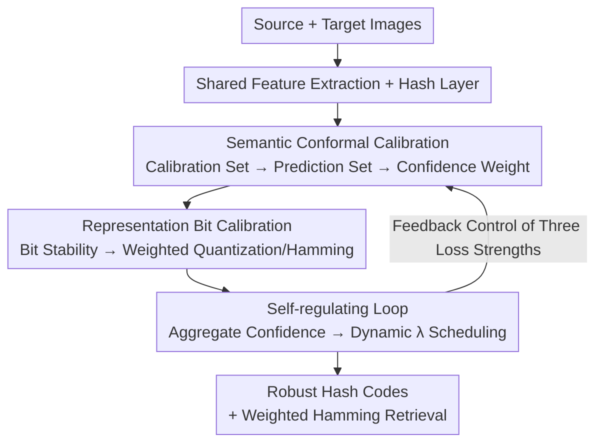

# Conformalized Hierarchical Calibration for Uncertainty-Aware Adaptive Hashing

**Conference**: ICLR2026  
**OpenReview**: [https://openreview.net/forum?id=fBmRLVAw4T](https://openreview.net/forum?id=fBmRLVAw4T)  
**Code**: To be confirmed  
**Area**: Information Retrieval / Cross-domain Hashing  
**Keywords**: Deep Hashing, Unsupervised Domain Adaptation, Conformal Prediction, Uncertainty Quantification, Approximate Nearest Neighbor Search

## TL;DR
To address the persistent issues of pseudo-label noise and blind domain alignment in Unsupervised Domain Adaptive Hashing (UDAH), COLA introduces a "conformal hierarchical calibration" framework. It quantifies sample reliability at the semantic level using the size of conformal prediction sets and predicts the stability of each hash bit at the representation level. By upgrading uncertainty from heuristic thresholds to continuous weights with statistical guarantees, and utilizing a self-regulating closed loop for dynamic multi-objective loss scheduling, COLA achieves new SOTA mAP results on Office-Home, Office-31, and Digits datasets.

## Background & Motivation
**Background**: Deep hashing, which replaces floating-point distances with bitwise operations, is a key technology for large-scale Approximate Nearest Neighbor (ANN) retrieval, widely used in recommendation systems, visual search, and RAG. However, real-world deployment inevitably encounters domain shift (changes in imaging equipment, style, or background distribution), causing trained models to suffer from semantic confusion and overconfidence on target domains. Unsupervised Domain Adaptive Hashing (UDAH) aims to bridge this gap by transferring knowledge from a labeled source domain to an unlabeled target domain via two main paths: **pseudo-labeling** (generating supervision signals from the model's own predictions) and **domain alignment** (reducing feature discrepancies via adversarial training or distribution matching).

**Limitations of Prior Work**: The performance of both paths is hindered by the unreliable and heuristic handling of model uncertainty. The paper highlights three specific issues: ① Reliance on simple heuristics like softmax thresholds to filter pseudo-labels, though softmax scores are not reliable indicators of correctness, especially as neural networks often make "confident mistakes" on out-of-distribution samples; ② Lack of verifiable characterization of uncertainty, where heuristic methods lack theoretical guarantees and are extremely sensitive to manual thresholds; ③ Treating uncertainty as a monolith, failing to distinguish between "semantic judgment uncertainty" and "bit-level representation stability."

**Key Challenge**: Retrieval quality depends on both "what to learn" (credibility of pseudo-labels) and "how to encode" (robustness of hash codes). Existing methods use a coarse scalar confidence to manage both, which is neither reliable nor hierarchical.

**Goal**: To upgrade UDAH from "fragile heuristic confidence" to a "hierarchical uncertainty quantification framework with strict statistical guarantees," allowing quantified uncertainty to both filter samples and tune losses.

**Key Insight**: The authors introduce conformal prediction, a **distribution-free** framework that constructs a prediction set for any new sample such that the true label is contained within the set with a probability of at least $1-\alpha$. The **size of the prediction set naturally serves as a theoretically grounded measure of uncertainty**. Extending this idea from the semantic level to the bit level allows for the calibration of both "judgment" and "representation."

**Core Idea**: Replace single-point pseudo-labels and uniform domain alignment with a two-level calibration of "conformal prediction set size + bit stability," and use a self-regulating loop to treat these uncertainties as endogenous control signals to dynamically balance multi-objective optimization.

## Method

### Overall Architecture
COLA (Conformal Hierarchical Calibration Adaptive Hashing) aims to prevent noise from pseudo-labels and fragile bits from degrading retrieval under domain shift. The pipeline involves passing source and target images through a shared feature extractor, followed by **semantic-level conformal calibration**—selecting source samples close to the target domain as a calibration set to calculate conformal prediction sets for target samples. The inverse of the set size denotes semantic confidence, weighting pseudo-label learning and domain alignment. This is followed by **representation-level bit calibration**, where a lightweight bit head predicts the stability of each hash bit. This bit confidence weights the quantization loss and constructs an "uncertainty-aware weighted Hamming distance." Finally, a **self-regulating loop** aggregates average semantic and bit confidence into control signals to dynamically adjust the weights for pseudo-supervision, alignment, and quantization losses.

### Key Designs

**1. Semantic Conformal Calibration: Replacing single-point pseudo-labels with coverage-guaranteed prediction sets**

This level addresses the unreliability of softmax thresholds. COLA first **constructs a calibration set close to the target domain**: it calculates the target feature centroid and selects the $r_{cal}\%$ (default 20%) source samples with the smallest Euclidean distance to this centroid to form the calibration set $D_{cal}$. A non-conformity score $s(x,y)=1-\hat p(y\mid x)$ measures the incompatibility between a sample and a label. For any target sample $x_t$, the prediction set is defined as:

$$C(x_t) = \{y\in\mathcal{Y}\mid s(x_t,y)\le \hat q_W\},$$

where $\hat q_W$ is the weighted quantile threshold. A key design is that $\alpha_t$ **is dynamic rather than fixed**: it varies linearly with source validation accuracy to adapt to the model's evolving performance. The set size is converted to a weight $w^{sem}_t=1/|C(x_t)|$, combined with a soft label $\tilde y_t(c)$ normalized within the set. This achieves dual protection: **inter-sample** (suppressing high-uncertainty samples) and **intra-sample** (avoiding absolute supervision on ambiguous samples).

Theorem 3.1 provides theoretical backing: while domain shift violates the exchangeability required by standard conformal prediction, the coverage guarantee degrades gracefully. The target domain coverage lower bound is $1-\alpha_t-d_{TV}\big(s(X_{train},Y_{train}),s(X_{test},Y_{test})\big)$, where the error term is the Total Variation distance between conformity distributions. This reveals the **true role of domain alignment**: reducing feature distribution discrepancy implicitly reduces this error, making uncertainty quantification more accurate. Consequently, confidence also **guides domain alignment** by weighting the MMD loss based on batch-average semantic confidence.

**2. Representation Bit Calibration: Predicting the stability of each hash bit**

While the semantic level handles "what to learn," this level handles "how to encode." COLA uses a **self-supervised proxy task** to quantify bit reliability: robust bits should remain stable under slight input perturbations. Specifically, Gaussian noise is added to feature $f_i$ to get $f'_i$, and bit-wise stability labels $v_{i,k}=\mathbb{I}\{\text{sign}(h_{i,k})=\text{sign}(h'_{i,k})\}$ are generated. A lightweight head $G_{bit}(\cdot)$ predicts the $L$-dimensional bit confidence vector $w^{bit}\in[0,1]^L$ using binary cross-entropy.

Bit confidence functions in both training and retrieval. During training, a **weighted quantization loss** is used: $L_{quant}=\frac{1}{|B|L}\sum_x\sum_k \text{stop\_grad}(w^{bit}_{x,k})\cdot\max(0,1-|h_{x,k}|)$, applying stronger constraints on reliable bits. At retrieval, an **Uncertainty-Aware Weighted Hamming Distance (UWHD)** is constructed: $d_{UWHD}(x_q,x_d)=\sum_k w_{q,k}\cdot\frac12(1-b_{q,k}b_{d,k})$, where bits with lower confidence contribute less to the distance.

**3. Self-regulating Loop: Using uncertainty to schedule multi-objective optimization**

COLA uses the aggregated batch-average semantic confidence $\bar w^{sem}_{B_t}$ and bit confidence $\bar w^{bit}_{B_t}$ as endogenous control signals to define dynamic weights $\lambda_{target}$ and $\lambda_{quant}$. This naturally implements an **automatic warm-up**: early in training, high uncertainty leads to small $\lambda$ values, preventing the model from aggressively adapting to noisy target data. As training progresses and uncertainty decreases, target adaptation is gradually scaled up.

### Loss & Training
The total objective integrates all modules through the self-regulating mechanism:

$$L_{total} = L_{source} + L_{bit\_head} + \lambda_{target}L_{target} + \lambda_{align}L_{align} + \lambda_{quant}L_{quant}.$$

$L_{source}$ is the supervised source loss, $L_{bit\_head}$ trains the bit confidence head, and the other terms represent weighted pseudo-supervision, alignment, and quantization, with weights dynamically scheduled.

## Key Experimental Results

### Main Results
On Office-Home and Office-31 cross-domain retrieval tasks, COLA outperforms 13 baselines (mAP%):

| Dataset/Task | Metric | COLA | COUPLE (Runner-up) | IDEA |
|------|------|------|------|------|
| Office-Home Pr→Re | mAP% | **67.04** | 63.94 | 59.18 |
| Office-Home Ar→Re | mAP% | **57.35** | 54.14 | 51.19 |
| Office-31 We→Ds | mAP% | **87.28** | 85.26 | 84.97 |
| 12-task Average | mAP% | **62.59** | 60.29 | 57.03 |

On Digits (MNIST↔USPS), mAP increased from COUPLE's 68.53 to **70.40**, with more significant gains in longer bit lengths (96/128).

### Ablation Study
(Office-Home, 64-bit, avg mAP%). SC=Semantic Calibration, RC=Representation Calibration, SR=Self-Regulation:

| Config | SC | RC | SR | Avg mAP% | Description |
|------|----|----|----|------|------|
| COLA(None) | | | | 49.14 | Baseline backbone |
| COLA-SC | ✓ | | | 49.43 | Semantic calibration only |
| COLA-RC | | ✓ | | 51.76 | Bit calibration only |
| COLA-SR | | | ✓ | 51.55 | Self-regulation only |
| w/o SC | | ✓ | ✓ | 54.53 | Without semantic calibration |
| w/o RC | ✓ | | ✓ | 55.21 | Without bit calibration |
| w/o SR | ✓ | ✓ | | 54.74 | Without self-regulation |
| COLA(Full) | ✓ | ✓ | ✓ | **57.31** | Full model |

### Key Findings
- All modules provide positive gains. **Representation-level calibration (RC, +2.62) and self-regulation (SR, +2.41) contribute more individually than semantic calibration (SC, +0.29)**, suggesting bit stability and dynamic scheduling are critical in hashing.
- SC remains vital: removing it (w/o SC) leads to a larger drop than removing RC (w/o RC) in some contexts, and the full synergy of the three components is required to reach 57.31.
- A calibration ratio $r_{cal}=20\%$ is optimal; dynamic $\alpha_t$ evolves with training, confirming that fixed thresholds underperform.

## Highlights & Insights
- **Prediction set size as an uncertainty measure**: Unlike scalar softmax, set size provides a distribution-free reliability signal with coverage guarantees without requiring sampling.
- **Theoretical re-interpretation of domain alignment**: Theorem 3.1 frames domain alignment as a means to suppress the Total Variation error in conformal coverage, unifying alignment and uncertainty quantification.
- **Bit-level stability proxy task**: Training a head to predict bit flips under perturbation allows for "uncertainty-aware" retrieval without sacrificing the $O(1)$ speed advantage of hashing.
- **Implicit warm-up via self-regulation**: Endogenous scheduling reduces hyperparameter sensitivity by aligning the adaptation process with the model's "cognitive state."

## Limitations & Future Work
- The coverage guarantee depends on the Total Variation error; **under extreme domain shift, this bound may become loose**, and the performance collapse boundary is not fully explored.
- The assumption that Gaussian noise represents real-world domain-induced bit flips requires further validation.
- The calibration set selection relies on Euclidean distance in feature space, which might fail if source and target domains are highly entangled.
- Lack of evaluation on billion-scale retrieval systems regarding latency/throughput trade-offs of UWHD.

## Related Work & Insights
- **vs. Heuristic Thresholds (e.g., FixMatch)**: Heuristics are sensitive and lack guarantees; COLA uses prediction set sizes with adaptive thresholds.
- **vs. Traditional UDAH (e.g., COUPLE, IDEA)**: Prior methods use uniform alignment and treat uncertainty as a monolith; COLA uses hierarchical calibration and achieves a 2.3% mAP improvement over COUPLE.
- **vs. Bayesian Uncertainty**: Bayesian methods often require multiple forward passes; COLA provides coverage guarantees via distribution-free conformal prediction without expensive sampling.

## Rating
- Novelty: ⭐⭐⭐⭐⭐ First to introduce hierarchical conformal calibration to UDAH and unify alignment with coverage guarantees.
- Experimental Thoroughness: ⭐⭐⭐⭐ Extensive benchmarks and ablations, though missing massive-scale engineering stress tests.
- Writing Quality: ⭐⭐⭐⭐⭐ Clear progression from motivation and theory to modular design.
- Value: ⭐⭐⭐⭐ Provides a reusable paradigm for statistically guaranteed uncertainty quantification in hashing and domain adaptation.

<!-- RELATED:START -->

## Related Papers

- [\[NeurIPS 2025\] AcuRank: Uncertainty-Aware Adaptive Computation for Listwise Reranking](../../NeurIPS2025/information_retrieval/acurank_uncertainty-aware_adaptive_computation_for_listwise_reranking.md)
- [\[ICLR 2026\] Hierarchical Encoding Tree with Modality Mixup for Cross-modal Hashing](hierarchical_encoding_tree_with_modality_mixup_for_cross-modal_hashing.md)
- [\[ICLR 2026\] Query-Level Uncertainty in Large Language Models](query-level_uncertainty_in_large_language_models.md)
- [\[ICLR 2026\] Hierarchical Concept-based Interpretable Models](hierarchical_concept-based_interpretable_models.md)
- [\[ICLR 2026\] Deep Global-sense Hard-negative Discriminative Generation Hashing for Cross-modal Retrieval](deep_global-sense_hard-negative_discriminative_generation_hashing_for_cross-moda.md)

<!-- RELATED:END -->
