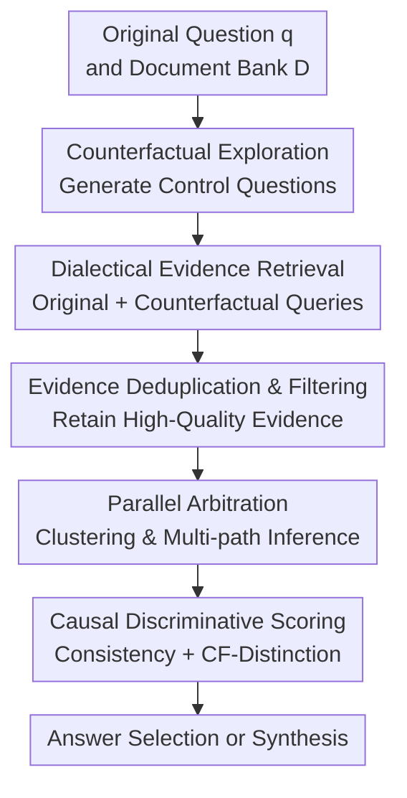

# Counterfactual Reasoning for Retrieval-Augmented Generation

**Conference**: ICLR2026  
**OpenReview**: [https://openreview.net/forum?id=9U51rOnGko](https://openreview.net/forum?id=9U51rOnGko)  
**Code**: https://github.com/CF-RAG/CF-RAG  
**Area**: Information Retrieval / RAG  
**Keywords**: Counterfactual Reasoning, Retrieval-Augmented Generation, Evidence Arbitration, Correlation Trap, Robust QA  

## TL;DR
CF-RAG embeds counterfactual query generation, dialectical evidence retrieval, and parallel evidence arbitration into the RAG inference process. It distinguishes between evidence that truly determines an answer and merely highly correlated distracting evidence by testing whether the evidence supports only the original query and not similar counterfactual ones, significantly enhancing RAG robustness in multi-hop QA, long-tail entity, and noisy retrieval scenarios.

## Background & Motivation
**Background**: The fundamental paradigm of RAG involves retrieving a set of semantically related documents based on a user's question and then passing these documents to an LLM to generate an answer. This paradigm has become a standard infrastructure in open-domain question answering, fact-checking, and knowledge-intensive dialogue systems. Subsequent work has introduced various improvements regarding when to retrieve, what to retrieve, how to compress or filter context, and how to perform self-reflection.

**Limitations of Prior Work**: The authors point out that while many RAG systems can find relevant documents, they struggle to judge which evidence truly determines the answer. This failure is termed the "Correlation Trap": models are overwhelmed by a large amount of "relevant-looking" evidence while ignoring a small amount of more discriminative evidence. For instance, when asking for the lead actor of *The Dark Knight*, retrieval results might contain numerous reviews praising Heath Ledger's performance as the Joker. These documents are highly relevant to the movie and frequently mention words like "star" or "performance," but they do not answer the relational question of "who is the lead actor." Standard RAG systems easily mistake these strong correlation signals for answer support, eventually identifying Heath Ledger instead of Christian Bale.

**Key Challenge**: The problem is not merely excessive retrieval noise, but rather the conflation of "relevance" and "causal discriminability." Traditional retrieval scores tend to reward documents with the same topic, entities, and keywords. However, the correct answer often depends on a finer conceptual boundary, such as protagonist vs. antagonist, director vs. actor, or current year vs. past year. If a system only asks "how similar is this evidence to the original question," it cannot determine if the evidence equally supports a similar question with a different answer.

**Goal**: This paper aims to enable RAG to perform explicit counterfactual testing during inference: first constructing counterfactual questions with the same topic but different expected answers, and then checking if the candidate evidence can distinguish the original question from these counterfactual ones. Thus, the system must not only find text supporting the answer but also verify that the text supports *only* that answer rather than broadly supporting a set of related but distinct questions.

**Key Insight**: Instead of formal causal graphs or causal effect estimation, "counterfactuals" are interpreted as an evidence discriminative test. If a piece of evidence truly determines an answer, it should have high support for the original question and low support for the counterfactual question. If it is merely topically relevant, it will often support both. This discriminative signal can be directly integrated into RAG's retrieval, sampling, generation, and re-ranking pipelines.

**Core Idea**: Use counterfactual queries to transform the retrieval space into a dialectical evidence space of "original query evidence + control query evidence," then use parallel arbitration to select answers that are both consistent with the evidence and pass the counterfactual discrimination test.

## Method

### Overall Architecture
The input to CF-RAG is the original question $q$ and a document library $D$, and the output is the final answer with its rationale. The overall process is divided into two main stages: Counterfactual Exploration is responsible for generating multiple counterfactual questions from the original question and retrieving documents for both to construct an evidence space that exposes conflicts; Parallel Arbitration handles the clustered evidence by sampling multiple parallel reasoning paths to generate candidate answers, which are then scored based on internal consistency and causal discriminability.

This method acts more as an inference-time framework rather than a newly trained model. In default settings, the system generates $N=3$ counterfactual queries, clusters evidence into $K=4$ topical clusters, generates $M=3$ parallel drafts, and uses $\lambda=0.4$ to balance consistency and the causal discrimination score. Finally, if candidates are highly consistent, the highest-scored answer is selected; if conflicts are significant, a fused answer is synthesized from the top-3 candidates.

### Key Designs
**1. Counterfactual Exploration: Exposing Spurious Evidence via Similar Questions with Different Answers**

Standard RAG retrieves only around the original question $q$, creating a one-way "relevance echo chamber." CF-RAG generates a set of counterfactual questions $Q_{cf}$ that maintain topical consistency with the original question but implement controlled changes in roles, time, entities, categories, or scope. For example, "Who is the lead actor in The Dark Knight?" might become "Who played the main villain in The Dark Knight?" or "Who is the lead actor in Batman Begins?". These are not random rewrites but are specifically designed to check which relationship a piece of evidence supports.

The process is formalized as a semantic transformation function $\tau_i: Q \rightarrow Q$. Candidate counterfactual questions must pass a verification function $V(q,q')$: ensuring $sim_{sem}(q,q') > \theta_{sim}$ to stay on topic, while $L(q) \neq L(q')$ ensures they seek different answers. An informativeness score $Info(q,q') = \alpha Div_{sem}(q,q') + \beta Div_{ans}(q,q') + \gamma Rel_{dom}(q,q')$ prioritizes queries with semantic differences and distinct answer spaces within the same domain.

**2. Dialectical Evidence Retrieval: Transforming Retrieval into a Contrastive Evidence Space**

The system retrieves $R(q,D) \cup \bigcup_{q' \in Q_{cf}} R(q',D)$. The goal is to introduce potentially conflicting perspectives. If reviews of Heath Ledger are retrieved for both the original question and the "who is the villain" counterfactual, they will show low discriminative power. Conversely, documents explicitly stating Christian Bale plays the lead will more specifically support only the original query.

To manage space, the paper uses embedding similarity to remove duplicates (where $sim_{emb}(e,e') > \theta_{dedup}$) and filters based on quality $Q(e)$ and max relevance $\max_{q' \in \{q\} \cup Q_{cf}} s(q',e)$.

**3. Parallel Arbitration: Multi-path Reasoning to Prevent Pollution from Strong Correlations**

To avoid a situation where dominant but incorrect evidence overwhelms key evidence, CF-RAG clusters filtered evidence by topic and samples parallel subsets $E_j$. Spectral clustering is used on an affinity matrix $W_{ij}=\exp(-\|e_i-e_j\|^2 / 2\sigma^2)$.

Each inference path samples evidence using temperature-controlled weights $w_{jm}$ to ensure paths cover various topics while maintaining diversity. This allows different combinations of evidence (e.g., reviews vs. cast lists) to guide independent candidate answers $(a_j,r_j)$.

**4. Causal Discriminative Scoring: Rewarding Evidence that "Only Supports the Original Question"**

The arbitration score includes internal consistency $\phi_{coh}$ (checking if $a_j$ matches $E_j$) and the critical causal discriminative score $\phi_{causal}$:

$$
\phi_{causal}(E_j,q,Q_{cf}) = \frac{1}{|E_j|}\sum_{e\in E_j}\left[s(q,e)-\max_{q'\in Q_{cf}}s(q',e)\right]
$$

This score measures whether evidence support for the original question is significantly higher than its support for the strongest counterfactual query. If evidence equally supports "who is the villain," its causal contribution to the "lead actor" question is low. The final base score is $\Psi_j=(1-\lambda)\phi_{coh}+\lambda\phi_{causal}$.

### Loss & Training
CF-RAG is primarily an inference-time framework and does not require fine-tuning of the base LLM. Experiments used Llama-3-8B-Instruct and Llama-2-7B-chat as backbones, BAAI/bge-reranker-large for fine-grained scores $s(q,e)$, and all-MiniLM-L6-v2 with FAISS for dense retrieval. Hyperparameters include $N=3$ counterfactual queries, $K=4$ clusters, $M=3$ parallel hypotheses, and $\lambda=0.4$.

## Key Experimental Results

### Main Results
Evaluation was conducted on HotpotQA, TriviaQA, PopQA, MusiQue, and PubHealth using the Exact Match (EM) metric. Significant gains were observed in multi-hop QA (HotpotQA and MusiQue).

| Method | HotpotQA | TriviaQA | PopQA | MusiQue | PubHealth | Avg |
|------|----------|----------|-------|---------|-----------|------|
| Standard RAG (Llama-3-8B) | 36.04 | 31.12 | 42.46 | 21.41 | 48.58 | 35.92 |
| Self-RAG (Llama-2-7B) | 28.49 | 64.39 | 53.97 | 20.58 | 73.19 | 48.12 |
| Speculative-RAG (Mistral-7B) | 49.00 | 74.24 | 57.54 | 31.57 | 76.60 | 57.79 |
| CF-RAG (Llama-2-7B) | 79.29 | 76.15 | 67.22 | 48.78 | 78.24 | 69.94 |
| CF-RAG (Llama-3-8B) | 88.58 | 81.02 | 73.57 | 54.59 | 83.36 | 76.22 |

CF-RAG (Llama-3-8B) reached 88.58 on HotpotQA, far exceeding the strongest baseline. This confirms its effectiveness in tasks requiring cross-document connections and relationship identification.

### Ablation Study
| Configuration | HotpotQA | PopQA | Description |
|------|----------|-------|------|
| Full CF-RAG | 88.58 | 73.57 | Complete system |
| w/o Counterfactual | 78.52 (↓11.36%) | 69.03 (↓6.17%) | Lacks control questions to detect spurious evidence |
| w/o Evidence Division | 84.29 (↓4.84%) | 67.29 (↓8.54%) | Conflict evidence interferes more easily |
| w/o Causal Verification | 73.19 (↓17.37%) | 63.47 (↓13.73%) | Most significant drop, confirms core component |

### Key Findings
- **Hyperparameters**: Optimal balance at $N=3, K=4, M=3$. Further increases yield diminishing returns and higher latency.
- **Causal Weight**: Best performance at $\lambda=0.4$. Both $\lambda=0$ (pure consistency) and $\lambda=1.0$ (pure causal) are inferior.
- **Adversarial Robustness**: With 16 high-similarity but irrelevant distractors, Standard RAG dropped to 8.55 EM, while CF-RAG maintained 60.57.
- **Failure Analysis**: CF-RAG reduced "Spurious Correlation" errors from 56.7% to 13.3%.
- **Efficiency**: Average latency on HotpotQA was 2.92s, roughly 1.4x Standard RAG but lower than Self-RAG (4.72s).

## Highlights & Insights
- The paper operationalizes "causality" into a practical evidence discriminative standard: $s(q,e)-\max_{q'}s(q',e)$. 
- Counterfactual Exploration addresses the blind spot of "similarity" by requiring the exclusion of alternative explanations.
- Parallel Arbitration offers value for production systems where key evidence is often drowned out; clustering and multi-path generation are more effective than simple concatenation.
- Theoretical analysis suggests that discriminative scores are insensitive to the scaling of spurious evidence quantity.

## Limitations & Future Work
- **Counterfactual Quality**: The system's upper bound depends on the quality of $Q_{cf}$. Poorly generated queries reduce discriminative power.
- **Scope**: Mainly evaluated on English QA; effectiveness in multilingual or subjective generation tasks remains to be verified.
- **Reranker Dependency**: Causal scores rely on the base reranker's $s(q,e)$, meaning biases in the reranker might still propagate.
- **Latency**: While manageable, parallel generation adds costs for high-concurrency environments.

## Related Work & Insights
- **vs Standard RAG**: CF-RAG introduces counterfactual queries to evaluate unique support rather than just topical relevance.
- **vs Self-RAG**: Unlike Self-RAG's internal reflection tokens, CF-RAG uses external counterfactual controls and explicit scoring during inference.
- **vs Speculative-RAG**: While both use parallel paths, CF-RAG uses them specifically for causal arbitration to select the most discriminative candidate.
- **vs Traditional Counterfactual NLP**: Usually used for offline explanation or data augmentation, CF-RAG integrates counterfactuals directly into the online inference pipeline.

## Rating
- Novelty: ⭐⭐⭐⭐☆
- Experimental Thoroughness: ⭐⭐⭐⭐☆
- Writing Quality: ⭐⭐⭐⭐☆
- Value: ⭐⭐⭐⭐⭐

<!-- RELATED:START -->

## Related Papers

- [\[ICLR 2026\] The Topology of Reasoning: Augmenting Generation with Retrieved Cell Complexes for Text-Graph QA](topology_of_reasoning_retrieved_cell_complex-augmented_generation_for_textual_gr.md)
- [\[ACL 2025\] Toward Structured Knowledge Reasoning: Contrastive Retrieval-Augmented Generation on Experience](../../ACL2025/information_retrieval/toward_structured_knowledge_reasoning_contrastive_retrieval-augmented_generation.md)
- [\[ICLR 2026\] CFT-RAG: An Entity Tree Based Retrieval Augmented Generation Algorithm With Cuckoo Filter](cft-rag_an_entity_tree_based_retrieval_augmented_generation_algorithm_with_cucko.md)
- [\[ICLR 2026\] When to use Graphs in RAG: A Comprehensive Analysis for Graph Retrieval-Augmented Generation](when_to_use_graphs_in_rag_a_comprehensive_analysis_for_graph_retrieval-augmented.md)
- [\[ACL 2026\] ChatR1: Reinforcement Learning for Conversational Reasoning and Retrieval Augmented Question Answering](../../ACL2026/information_retrieval/chatr1_reinforcement_learning_for_conversational_reasoning_and_retrieval_augment.md)

<!-- RELATED:END -->
