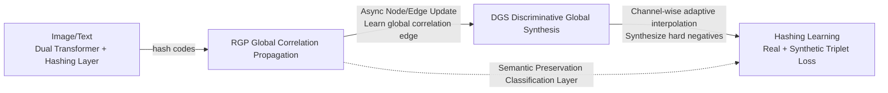

# Deep Global-sense Hard-negative Discriminative Generation Hashing for Cross-modal Retrieval

**Conference**: ICLR 2026  
**OpenReview**: [https://openreview.net/forum?id=GAQEsnnQtG](https://openreview.net/forum?id=GAQEsnnQtG)  
**Code**: [https://github.com/QinLab-WFU/DGHDGH](https://github.com/QinLab-WFU/DGHDGH)  
**Area**: Cross-modal Retrieval / Cross-modal Hashing / Hard Negative Generation  
**Keywords**: Cross-modal Hashing, Hard Negative Generation, Graph Message Propagation, Hamming Co-space, Channel-wise Interpolation  

## TL;DR
DGHDGH introduces "Hard Negative Generation" (HNG) into cross-modal hashing for the first time. It utilizes a cross-modal structural graph for bidirectional iterative message propagation to perceive **global sample correlation**. Based on this, it performs **channel-wise, difficulty-adaptive** anchor-negative interpolation to synthesize hard negatives that are close to the anchor but do not violate other category boundaries, thereby training a more discriminative Hamming co-space.

## Background & Motivation
- **Background**: Deep Cross-modal Hashing Retrieval (DCHR) projects images/text into a shared compact binary Hamming space, enabling heterogeneous samples with similar semantics to obtain similar codes, thus transforming cross-modal retrieval into efficient hash lookups. To improve discriminability, it is crucial to provide "more informative" signals during training. Hard negatives provide stronger adversarial gradients, pushing the model to learn finer boundaries.
- **Limitations of Prior Work**: Hard negative "mining" is limited by the scarcity of naturally occurring hard samples within a mini-batch. Consequently, hard negative "generation" (HNG) emerged, typically using linear interpolation between existing negative samples to synthesize harder ones. However, existing HNG methods **look almost exclusively at local anchor-negative correlations**, ignoring the global geometric structure of the embedding space.
- **Key Challenge**: Interpolating solely based on a single anchor-negative pair may result in generated samples **incorrectly intruding into the distribution of third-party categories**. For example, interpolating a purple image anchor with a blue text negative might result in a synthetic point falling into a red category region. This "semantic boundary violation" is particularly fatal in the already restricted discriminative cross-modal co-space, ultimately weakening discriminability.
- **Goal**: Explicitly model **global inter-class relationships** during the generation phase, ensuring synthesized negative samples possess appropriate difficulty while respecting the semantic manifold and preserving the overall distribution of the co-space.
- **Core Idea**: **[Global-sense + Channel-wise Difficulty Adaptation]** A graph network is first used to learn global correlations (RGP) across the entire batch. These correlations then guide independent, channel-wise interpolation (DGS) that progressively increases in difficulty during training. This is achieved **without additional generator networks**, making it plug-and-play, lightweight, and efficient.

## Method

### Overall Architecture
DGHDGH consists of three sequential stages: Dual Transformers for extracting hash codes → RGP using graph message propagation to learn global correlations → DGS for channel-wise adaptive interpolation to synthesize hard negatives. Finally, discriminative hash learning is performed using a triplet loss with real + synthetic negatives. The training alternates between "generation optimization" and "hashing learning."

### Key Designs

**1. RGP Global Correlation Propagation: Upgrading "Local Interpolation" to "Global Perception" via Graphs.** This addresses the root cause of "semantic boundary violation." The hash codes of the entire batch are placed into a structural graph $G=(V,E)$, where nodes $V_i^{k=0}=\tilde h_i$ store sample embeddings and edges $E_{ij}^{k=0}=\tilde h_i\odot\tilde h_j$ encode pairwise correlations. **Three graphs (Image, Text, and Cross-modal) are maintained in parallel with shared parameters**, allowing the cross-modal semantic gap to be bridged through joint updates. Message propagation uses a **dual Transformer for asynchronous alternating updates of nodes and edges**: node messages are propagated first, followed by edge messages, ensuring node information is continuously injected into subsequent edge updates. The node Transformer uses MMSA with a positive sample mask—each node acts as an anchor and only interacts with its negative samples (masking out positive samples, especially the cross-modal counterparts), avoiding subtle differences between negative samples being overwhelmed by high attention weights. Neighborhood edge information is then fused back into the nodes: $V_i'=\mathrm{LN}\big(\mathrm{MMSA}(V^k)_i+\sum_j E_{ij}^k+V_i^k\big)$. The edge Transformer uses cross-attention to incorporate node information into edges: $E_{ij}'=\mathrm{LN}\big(\mathrm{CA}(E_{ij}^k,V_i^{k+1},V_j^{k+1})+E_{ij}^k\big)$, allowing each edge to perceive the correlation of its key points from a global perspective and adaptively adjust synthesis difficulty. After $n_2$ iterations, the edges encode sufficient global correlation.

**2. DGS Channel-wise Difficulty Adaptive Synthesis: Letting each dimension independently decide "how deep to interpolate" based on global correlation.** Unlike traditional interpolation where all channels share a single coefficient, DGS passes the final edge $E_{an}^{n_2}$ of each anchor-negative pair through a fully connected layer + Sigmoid to obtain a **channel-wise interpolation vector** $\lambda_{an}=\mathrm{Sigmoid}(\mathrm{FC}(E_{an}^{n_2}))$. This provides adaptive fusion weights for each channel. The interpolation itself becomes progressively harder during training:

$$\tilde h_{an}'=\begin{cases}(1-\eta)\tilde h_a+\eta\tilde h_n,&\text{if }d_{ap}<d_{an}\\ \tilde h_n,&\text{otherwise}\end{cases},\quad \eta=\big(d_{ap}+\lambda_{an}\tau(d_{an}-d_{ap})\big)/d_{an}$$

where the **self-paced scaling factor** $\tau=e^{-1/l_{avg}}$ is determined by the average loss $l_{avg}$ from the previous epoch. As the model fits and $l_{avg}$ decreases, $\tau$ tightens the upper bound of the interpolation interval, making the synthesized negative samples harder. This ensures the difficulty evolves with convergence, preventing excessively hard samples in early training stages.

**3. Triple Constraints for Generation Optimization: Making synthetic samples harder, semantically consistent, and diverse.** The samples synthesized by DGS must satisfy three criteria, corresponding to three losses: **Semantic Preservation** $L_{sp}=\mathrm{CE}(\mathrm{CL}(\tilde h_{an}'),l_n)$—an additional classification layer (trained only on real samples with no gradient backpropagation for synthetic samples) constrains the synthetic samples to remain within the semantics of the original negative class; **Interpolation Similarity** $L_{is}=1-\cos(\tilde h_{an}',\tilde h_a)$—forces synthetic samples to be closer to the anchor (harder); **Coefficient Diversity** $L_{cd}=1-\sigma(\lambda_{a-})$—uses the standard deviation of all interpolation coefficients under the same anchor to encourage differentiation between pairs, preventing synthesis collapse. The weighted sum is $L_{go}=\gamma_{is}L_{is}+\gamma_{sp}L_{sp}+\gamma_{cd}L_{cd}$.

**4. Alternated Discriminative Hashing Learning: Feeding real and synthetic negative samples into triplets.** Hashing learning uses standard triplet loss, starting with real samples $L_{real}$ (covering I→I/I→T/T→I/T→T combinations), then introducing DGS-synthesized hard negatives $L_{syn}$. The total hashing loss is $L_{hl}=L_{real}+\gamma_{syn}L_{syn}$, where $\gamma_{syn}=1-e^{1/L_{go}}$ gradually increases the proportion of hard negatives as the graph network converges. Two semantic preservation classification layers with cross-modal shared parameters ($L_{sp1}$ for hash codes, $L_{sp2}$ for post-propagation nodes) maintain semantic consistency. Training alternates between $L_{go}$ and $L_{hl}$, promoting synergy between "sample generation" and "hash code learning."

## Key Experimental Results

### Main Results
On three benchmarks (MIRFLICKR-25K / NUS-WIDE / MS COCO), all methods use the CLIP ViT-B/32 backbone. mAP@all(%) is reported. The table below selects the I→T task:

| Method | Source | MIRFLICKR 64bit | NUS-WIDE 128bit | MS COCO 128bit |
|------|------|----------------|-----------------|----------------|
| DNpH | TMM'24 | 85.88 | 71.58 | 68.74 |
| DHaPH | TKDE'24 | 85.31 | 71.55 | 75.43 |
| DECH | AAAI'25 | 83.83 | 72.41 | 68.49 |
| DDBH | TCSVT'25 | 86.10 | 72.29 | 78.24 |
| **DGHDGH** | **Ours** | **87.13** | **73.76** | **79.19** |

Ours achieves SOTA or near-SOTA performance across both I→T and T→I directions and all four code lengths. On MS COCO 128bit, the I→T result is approximately 0.95 points higher than the strongest baseline, DDBH.

### Ablation Study
Component ablation (MIRFLICKR-25K, cross-ablation of three loss terms, average mAP for I→T / T→I):

| $L_{is}$ | $L_{sp}$ | $L_{cd}$ | Avg. I→T | Avg. T→I |
|:---:|:---:|:---:|:---:|:---:|
| | | | 81.64 | 80.04 |
| ✓ | | | 83.20 | 81.13 |
| | ✓ | | 83.97 | 82.07 |
| ✓ | ✓ | | 85.61 | 83.68 |
| | ✓ | ✓ | 85.81 | 83.90 |
| ✓ | ✓ | ✓ (Full) | **87.13** | **85.35** |

Module-level ablation shows that: w/o RGP (direct interpolation from initial edges), w/o DGS (removing generation phase), w/o EMF (removing edge message fusion in RGP), and w/o HAP (removing adaptive parameters in DGS) all lead to performance drops, verifying the contribution of each component.

### Key Findings
- Using the **Fisher ratio** and P@H≤2 to measure discriminability, DGHDGH achieves the highest inter-class separability in most settings, confirming that "global-sense HNG makes the co-space more discriminative."
- Among the three generation losses, $L_{sp}$ (Semantic Preservation) contributes the most individually, indicating that preventing "semantic drift" in synthetic samples is key to the effectiveness of HNG. Their combination yields further gains.
- As a plug-and-play module, it can enhance existing cross-modal hashing methods without requiring additional generator networks.

## Highlights & Insights
- **Explicit introduction of "global geometry" into negative sample generation**: Utilizing triple-graph parallelism with asynchronous node/edge propagation specifically corrects the legacy problem of local interpolation "intruding into third-party categories."
- **Dual-level difficulty adaptation (Channel-wise + Temporal)**: $\lambda_{an}$ allows varying interpolation depths across different channels, while $\tau$ enables self-paced difficulty growth synchronized with convergence, providing a finer grain than single-coefficient interpolation.
- **Generator-free architecture**: Interpolation vectors are derived directly from edges obtained via graph propagation, making it lighter, more stable, and easier to transfer compared to GAN-based HNG.

## Limitations & Future Work
- Maintaining three graphs (Image/Text/Cross-modal) with dual Transformer message propagation results in an $O(B^2)$ edge scale within a batch. Memory/computation overhead for large batches or datasets warrants attention (batch size 128 was used).
- Evaluations focused on three classic small-to-mid scale retrieval benchmarks. Performance on larger scale, long-tail, or open-domain cross-modal retrieval remains to be verified.
- The coupling of multiple scheduling factors (e.g., $\tau=e^{-1/l_{avg}}$, $\gamma_{syn}=1-e^{1/L_{go}}$) suggests the need for a more systematic analysis of robustness regarding hyperparameters and training stability.

## Related Work & Insights
- **Families of Information Learning**: Mining-based (e.g., Distance-Weighted Sampling) vs. Augmentation-based (GANs, interpolation like DAS, memory like XBM). This work belongs to the generative branch of augmentation but fills the "global geometry" dimension.
- **Prior HNG**: Works like HDML are based on local neighborhood synthesis and struggle to align with global geometry; this paper specifically targets that gap.
- **Inspiration**: Grafting "global structure perception via graph message propagation" onto "sample synthesis" is a generalizable paradigm. Any metric or contrastive learning scenario using interpolation for hard sample generation can benefit from using global correlation to constrain synthetic boundaries.

## Rating
- **Novelty**: ⭐⭐⭐⭐ First to introduce hard negative generation into cross-modal hashing. The combination of "global graph perception + channel-wise adaptive difficulty + generator-free" has a clear problem motivation and targeted solution.
- **Experimental Thoroughness**: ⭐⭐⭐⭐ Solid evaluation across three benchmarks, four code lengths, bidirectional I2T/T2I, and comparisons with multiple information learning methods. Includes Fisher ratio/P@H metrics and fine-grained ablation; however, lacks ultra-large scale validation.
- **Writing Quality**: ⭐⭐⭐⭐ Motivation clearly illustrated regarding "semantic violation." Methodological formulas are complete, and module responsibilities are well-defined. High readability.
- **Value**: ⭐⭐⭐⭐ Plug-and-play and generator-free, offering insights for both cross-modal hashing and broader hard negative generation. Open-sourced.

<!-- RELATED:START -->

## Related Papers

- [\[ICLR 2026\] Hierarchical Encoding Tree with Modality Mixup for Cross-modal Hashing](hierarchical_encoding_tree_with_modality_mixup_for_cross-modal_hashing.md)
- [\[ICLR 2026\] Improving Semantic Proximity in Information Retrieval through Cross-Lingual Alignment](improving_semantic_proximity_in_information_retrieval_through_cross-lingual_alig.md)
- [\[ICLR 2026\] Hybrid Deep Searcher: Scalable Parallel and Sequential Search Reasoning](hybrid_deep_searcher_scalable_parallel_and_sequential_search_reasoning.md)
- [\[ACL 2025\] HASH-RAG: Bridging Deep Hashing with Retriever for Efficient, Fine Retrieval and Augmented Generation](../../ACL2025/information_retrieval/hash-rag_bridging_deep_hashing_with_retriever_for_efficient_fine_retrieval_and_a.md)
- [\[ICLR 2026\] Demystifying Deep Search: A Holistic Evaluation with Hint-free Multi-Hop Questions and Factorised Metrics](demystifying_deep_search_a_holistic_evaluation_with_hint-free_multi-hop_question.md)

<!-- RELATED:END -->
