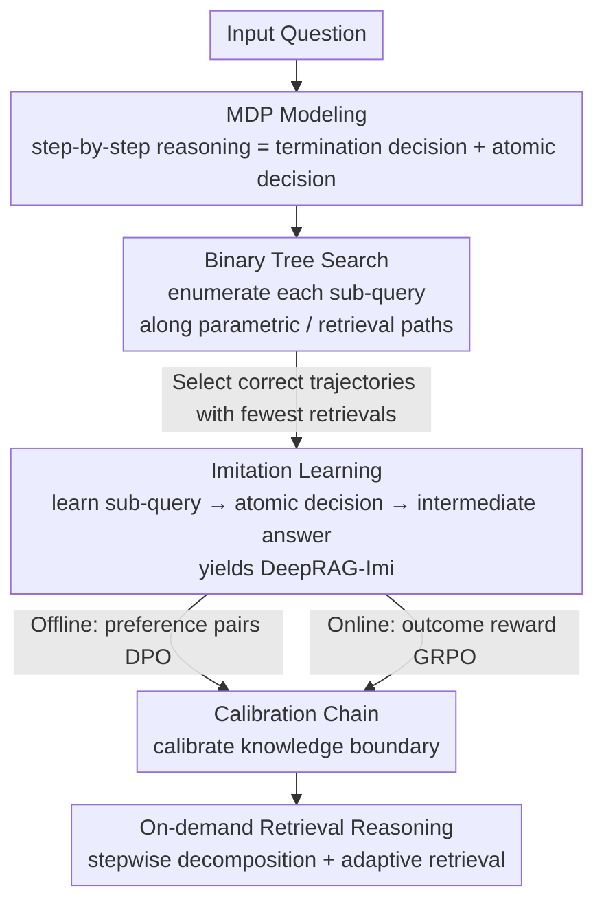

# DeepRAG: Thinking to Retrieve Step by Step for Large Language Models

**Conference**: ICLR2026  
**OpenReview**: [https://openreview.net/forum?id=VI2YaggHIF](https://openreview.net/forum?id=VI2YaggHIF)  
**Code**: https://github.com/icip-cas/DeepRAG  
**Area**: Information Retrieval / Retrieval-Augmented Generation (RAG) / LLM Reasoning  
**Keywords**: Adaptive Retrieval, Retrieval-Augmented Generation, Knowledge Boundaries, Markov Decision Process, Reinforcement Learning

## TL;DR
DeepRAG formalizes the "reasoning while retrieving" process as a Markov Decision Process (MDP). It enables LLMs to autonomously decide whether to "use internal knowledge or perform external retrieval" for each sub-problem during step-by-step problem decomposition. Through a three-step pipeline—binary tree search for data synthesis, imitation learning, and calibration training—DeepRAG achieves a 25.41% relative improvement in answer accuracy across five QA datasets while significantly reducing retrieval frequency.

## Background & Motivation
**Background**: Retrieval-Augmented Generation (RAG) has become the mainstream paradigm for knowledge-intensive tasks by providing external knowledge to LLMs to mitigate factual hallucinations. Recent works further incorporate "reasoning" by decomposing complex questions into multiple sub-queries, performing iterative retrieval, and gradually approaching the final answer.

**Limitations of Prior Work**: Existing "reasoning + retrieval" schemes suffer from two primary issues. First, **inadequate task decomposition**—LLMs often generate sub-queries that are imprecise or insufficiently atomic, leading to the retrieval of noisy information. Second, **redundant retrieval**—models often perform mindless retrieval for sub-problems that could be answered using the model's own parametric knowledge (e.g., common sense facts like "What are the films in The Lord of the Rings trilogy?"), which introduces irrelevant documents and degrades answer quality.

**Key Challenge**: The root cause is that LLMs **do not know their own knowledge boundaries**. To achieve "retrieval only when necessary," the model must accurately judge whether it can answer a sub-query internally. However, existing adaptive RAG methods rely on either extra-trained classifiers (classifier-based), threshold-sensitive confidence metrics (confidence-based), or direct LLM self-judgment (LLM-based)—the former two are cumbersome and brittle, while the latter is unreliable due to the model's inaccurate perception of its own knowledge boundaries.

**Goal**: To enable any LLM to perform "on-demand retrieval"—dynamically deciding the knowledge source at each step of problem decomposition to maximize accuracy while minimizing retrieval overhead.

**Key Insight**: The authors draw inspiration from how humans search for information online—humans do not search for every thought but proceed with existing knowledge, searching only when encountering unknown facts. Formalizing this process allows for a unified decision framework that simultaneously optimizes decomposition, retrieval timing, and answering.

**Core Idea**: Modeling retrieval-augmented reasoning as an MDP. At each step, the model makes dual atomic decisions: "whether to terminate" and "retrieval vs. parametric knowledge." The model is then trained to calibrate its knowledge boundaries using rewards that penalize retrieval costs, achieving the goal of "thinking before deciding to retrieve."

## Method

### Overall Architecture
DeepRAG addresses the challenge of making autonomous and accurate decisions between internal parametric knowledge and external retrieval during multi-step reasoning. The process is formalized as an MDP and trained into any LLM via a three-stage pipeline: first, **binary tree search** enumerates all combinations of "parametric vs. retrieval" for training sub-queries to identify optimal trajectories (correct answers with minimal retrieval); second, **imitation learning** is performed on these trajectories to teach the model the basic pattern of "sub-query generation → atomic decision → intermediate answer," resulting in DeepRAG-Imi; third, a **Chain of Calibration** is employed to specifically reinforce the model's awareness of its knowledge boundaries—using DPO on preference data for the offline variant (DeepRAG-RLoff) and GRPO with outcome rewards for the online variant (DeepRAG-RLon).

During inference, the model generates sub-queries step-by-step. For each sub-query, it performs a termination decision (whether to continue decomposing) followed by an atomic decision (retrieve or not), looping until the final answer is provided.

### Key Designs

**1. MDP Modeling: Converting "Reasoning while Retrieving" into an Optimizable Sequence**

Existing methods treat decomposition, retrieval timing, and answering as isolated components with heuristic processing, preventing end-to-end optimization of the joint goal "minimize retrieval while maximizing accuracy." DeepRAG formalizes the reasoning process as a quadruple $(S, A, P, R)$. The **state** $s_t = (x, (q_1, r_1), \dots, (q_t, r_t))$ records the original question $x$ and the generated sub-query-intermediate answer pairs. The **action** $a_{t+1} = (\sigma_{t+1}, \delta_{t+1})$ consists of two sub-decisions: the termination decision $\sigma_{t+1} \in \{\text{continue}, \text{terminate}\}$ determines whether to decompose the next sub-query, and the atomic decision $\delta_{t+1} \in \{\text{retrieve}, \text{parametric}\}$ determines whether to retrieve documents or use parametric knowledge. The **reward** is settled only after the final answer: $R = -C(o) \times T(s_t)$, where $C(o)$ denotes correctness (1 if correct, $\infty$ if incorrect) and $T(s_t)$ is the cumulative retrieval cost. This reward structure ensures that **correctness is prioritized** (since an incorrect answer leads to $C(o)=\infty$, minimizing the reward), and among correct answers, **efficiency is optimized** (fewer retrievals yield higher rewards).

**2. Binary Tree Search: Mining the Minimal-Retrieval Correct Path**

To train the model for atomic decisions, supervision signals are needed to define when to retrieve, but manual annotation is prohibitively expensive. DeepRAG uses binary tree search to synthesize these signals: for a given training question, the model iteratively generates sub-queries, expanding two branches for each—a parametric node (using model knowledge) and a retrieval node (using external documents). This forms a binary tree for each sub-query. The search uses a **priority queue sorted by retrieval frequency** (Alg. 1); it expands the trajectory with the lowest retrieval cost first and returns immediately upon reaching a correct termination state. If no correct answer is found after exhaustive search, the sample is discarded. This ensures the identified trajectory is the "shortest correct path," providing a gold standard for "necessary retrieval" without human intervention.

**3. Imitation Learning: Distilling Optimal Trajectories with Document Masking**

In the first stage, the model learns the basic flow of "sub-query generation → atomic decision → intermediate answer" by imitating optimal trajectories to obtain DeepRAG-Imi. A key detail is the application of a **masked loss** to the retrieved documents $d_i$: the loss is calculated only on the tokens of the sub-queries and intermediate answers, not the retrieved text. The loss function is:

$$L = -\sum_{1 \le i \le n} \log \left[ \Pr(q_i \mid s_{i-1}) + \Pr(a_i \mid s_{i-1}, q_i, d_i) \right]$$

where $d_i$ is empty for non-retrieval steps. Masking document loss prevents the model from memorizing noisy or irrelevant retrieved text, focusing training on the core skills of decomposition and reasoning based on available information.

**4. Chain of Calibration: Fine-tuning the Knowledge Boundary**

While imitation learning establishes the process, the **atomic decision** (knowing one's knowledge boundary) remains the most critical and difficult component. The Chain of Calibration provides two variants for this purpose. **Offline Calibration (DeepRAG-RLoff)**: The Stage I model re-searches for optimal paths using Alg. 1 to construct preference pairs (preferring parametric answers if the optimal path uses parametric knowledge, and vice versa), followed by DPO fine-tuning:

$$L = -\log \sigma\left( \beta \log \frac{\pi_\theta(y_w \mid s_i, q_i)}{\pi_{\text{ref}}(y_w \mid s_i, q_i)} - \beta \log \frac{\pi_\theta(y_l \mid s_i, q_i)}{\pi_{\text{ref}}(y_l \mid s_i, q_i)} \right)$$

where $y_w / y_l$ are the preferred/non-preferred segments. **Online Calibration (DeepRAG-RLon)**: An online GRPO with outcome rewards is utilized. Drawing from "over-long reward shaping," the authors propose **over-retrieve reward shaping**: given a maximum retrieval budget $T$, the reward is:

$$R = \begin{cases} 0, & \text{invalid format} \\ \text{score}_{\text{format}}, & \text{incorrect but valid format} \\ 1 - \alpha \times \min(T, T(s_{t+1})), & \text{correct} \end{cases}$$

This pushes the model toward being "both accurate and efficient" by prioritizing correctness, then format, and finally penalizing excess retrieval.

### A Walkthrough Example
Consider the question: "What is the total runtime of all The Lord of the Rings movies?"
- **Step 1**—Sub-query: "What are the Lord of the Rings movies?". This is common knowledge; the atomic decision is **parametric**. The model lists the trilogy (The Fellowship of the Ring, The Two Towers, The Return of the King) without wasting a search.
- **Step 2/3/4**—Queries for the runtime of each movie. These precise figures exceed parametric knowledge; the atomic decision is **retrieve**. It finds 178, 179, and 201 minutes from Wikipedia.
- **Step 5**—Sub-query: "What is the total runtime?". Only a calculation is needed: $178+179+201=558$. The atomic decision is **parametric**, and the model computes the sum.
- The termination decision triggers after Step 5, yielding the final answer: 558 minutes.

The process triggers retrieval only for the three steps requiring external facts, relying on internal knowledge for common sense and computation—a direct demonstration of "on-demand retrieval."

### Loss & Training
The three stages utilize distinct objectives: Stage I (Binary Tree Search) involves no gradients and performs data synthesis (4,000 samples for imitation, 1,000 for calibration). Imitation learning uses cross-entropy with document masking (Eq. 1). Calibration uses DPO for the offline variant (Eq. 2) and GRPO with over-retrieve rewards for the online variant (Eq. 3, with $\text{score}_{\text{format}}=0.1, \alpha=0.1, T=5$). For synthesis, Qwen-2.5-72B generates query decompositions and retrieved nodes, while the target model generates parametric nodes.

## Key Experimental Results

### Main Results
Evaluation was conducted on HotpotQA, 2WikiMultihopQA (in-domain), and PopQA, WebQuestions, MuSiQue (out-of-domain) using EM/F1 metrics. The table below shows Average (Avg) scores on Llama-3-8B:

| Method | Type | Avg |
|------|------|--------|
| CoT-Retrieve | Reasoning Baseline | 34.90 |
| Search-R1 | RL Retrieval | 36.54 |
| R1-Searcher++ | Current Strongest Baseline | 40.85 |
| DeepRAG-Imi | Ours (Imitation) | 39.78 |
| DeepRAG-RLoff | Ours (Offline Calibration) | 41.47 |
| **DeepRAG-RLon** | **Ours (Online Calibration)** | **42.36** |

DeepRAG-RLon outperforms the strongest baseline R1-Searcher++ (40.85) with a score of 42.36 on Llama-3-8B. On Qwen-2.5-32B, DeepRAG-RLon reached 41.05, leading all baselines. The "25.41% relative improvement" refers to the overall gain against certain baselines mentioned in the abstract.

### Efficiency and Knowledge Boundaries

| Method | EM | Avg Retrieval Frequency | Time (s/q) |
|------|-----|------------|-----------|
| Auto-RAG | 17.40 | 4.52 | 0.71 |
| Search-R1 | 27.70 | 0.51 | 0.64 |
| DeepRAG-Imi | 30.00 | 0.43 | 0.67 |
| DeepRAG-RLoff | 32.70 | 0.28 | 0.50 |
| DeepRAG-RLon | 30.00 | **0.14** | **0.40** |

(Retrieval frequency on WebQuestions, Table 2. DeepRAG achieves higher accuracy with far fewer retrievals than iterative methods.)

Knowledge Boundary Alignment (2WikiMultihopQA, Table 3): DeepRAG-RLon achieved an MCC of 0.543 and a balanced accuracy of 0.801 in measuring whether retrieval decisions match parametric knowledge, significantly higher than FLARE (MCC≈0), TAARE (0.078), and R1-Searcher++ (0.458).

### Ablation Study

| Configuration | Avg Score | Avg Retrieval | Description |
|------|--------|---------|------|
| Imitation: Least-retrieval path (Default) | 44.6 | 0.98 | Both accurate and efficient |
| Imitation: Most-retrieval path (most) | 41.12 | 2.11 | Performance drops with more retrieval |
| Imitation: Random path (random) | 40.56 | 1.81 | Worst performance |
| Calibration: Optimal path nodes (Default) | 47.67 | 1.37 | Complete |
| Calibration: All-nodes preference (all-node) | 45.3 | 1.56 | More noise |
| Calibration: Sentence-level preference (sentence-wise) | 21.14 | 0.57 | Severe degradation |

### Key Findings
- **Fewer retrievals $\neq$ weaker performance**: Imitation learning on "least-retrieval" paths yielded higher average scores than "most-retrieval" paths (44.6 vs. 41.12), confirming that over-retrieval can harm answers due to noise or long contexts.
- **Adaptive is superior to both extremes**: Pure parametric knowledge (25.32) and pure retrieval (45.39) were both inferior to DeepRAG's adaptive approach (47.67).
- **Online calibration generalizes better**: DeepRAG-RLon showed an average gain of 2.85 on three out-of-domain datasets, whereas DeepRAG-RLoff gained only 0.91.
- **Cleaner decomposition**: Sub-queries from DeepRAG contain fewer pronouns and conjunctions, being more atomic; most problems are decomposed in 3-5 steps, with retrieval concentrated in 0-2 rounds.

## Highlights & Insights
- **Reward function embeds "Accuracy first, Efficiency second"**: The reward $R = -C(o) \times T(s_t)$, utilizing $C(o)=\infty$, elegantly ensures that an "incorrect" status overwhelms the retrieval cost term, achieving a strict lexicographical preference for correctness without manual weight tuning.
- **Binary Tree Search + Priority Queue = Automated Gold Standard**: It converts the labeling of knowledge boundaries into a search problem for the shortest correct path, ensuring the first solution found is the optimal trajectory for MDP rewards.
- **Masked loss prevents noise memorization**: The detail of masking retrieval document loss ensures the model learns decision-making and reasoning rather than rote memorization of potentially noisy external context.
- **Offline/Online flexibility**: Providing both DPO and GRPO variants allows for adaptation to different computational constraints and rollout capabilities.

## Limitations & Future Work
- **Dependency on accurate decomposition**: The method assumes complex questions can be decomposed into atomic sub-queries; it may struggle with open-ended or creative tasks that resist decomposition.
- **Correctness relies on EM matching**: The $C(o)$ reward component uses Exact Match, which may be inaccurate for long-form answers or tasks requiring semantic equivalence, limiting extension to pure generative tasks.
- **Training data bias**: Data synthesis is based on multi-hop QA (HotpotQA/2WikiMultihopQA); whether the calibrated knowledge boundaries transfer to domains with significantly different knowledge structures requires further verification.
- **Binary Tree Search overhead**: Exhaustively searching paths for every training question incurs computational costs, posing challenges for large-scale data synthesis.

## Related Work & Insights
- **vs. Classifier/Confidence-based Adaptive RAG (UAR / FLARE / DRAGIN)**: These methods rely on extra classification heads or threshold-sensitive uncertainty; DeepRAG uses the LLM's own generation to explore boundaries without extra parameters or brittle thresholds.
- **vs. LLM-based Adaptive (Self-RAG / TAARE)**: While these let the model decide, they are unreliable due to poor self-awareness; DeepRAG uses a Chain of Calibration to specifically harden this awareness.
- **vs. RL Retrieval (Search-R1 / R1-Searcher++)**: These optimize retrieval quality via RL but often ignore efficiency; DeepRAG's over-retrieve reward shaping explicitly writes cost into the reward, leading to fewer retrievals.
- **vs. Iterative Retrieval (IterDRAG / Auto-RAG)**: These often fall into redundant retrieval loops; DeepRAG uses atomic decisions to trigger retrieval only when necessary.

## Rating
- Novelty: ⭐⭐⭐⭐ Formalizing "reasoning while retrieving" as an MDP with binary tree search for boundary supervision is a complete and novel framework.
- Experimental Thoroughness: ⭐⭐⭐⭐⭐ Uses two backbones, five datasets (in/out-of-domain), and includes comprehensive analysis of efficiency, knowledge alignment, and ablations.
- Writing Quality: ⭐⭐⭐⭐ Clear motivation and methodology; figures (human cognition analogy, architecture) aid understanding significantly.
- Value: ⭐⭐⭐⭐⭐ End-to-end, applicable to any LLM, and significantly reduces retrieval costs, offering direct utility for RAG deployment.

<!-- RELATED:START -->

## Related Papers

- [\[ICLR 2026\] Q-RAG: Long Context Multi‑Step Retrieval via Value‑Based Embedder Training](q-rag_long_context_multistep_retrieval_via_valuebased_embedder_training.md)
- [\[ICLR 2026\] Query-Level Uncertainty in Large Language Models](query-level_uncertainty_in_large_language_models.md)
- [\[ICLR 2026\] TokMem: One-Token Procedural Memory for Large Language Models](tokmem_one-token_procedural_memory_for_large_language_models.md)
- [\[ICLR 2026\] MLP Memory: A Retriever-Pretrained Memory for Large Language Models](mlp_memory_a_retriever-pretrained_memory_for_large_language_models.md)
- [\[ICLR 2026\] Expert Heads: Robust Evidence Identification for Large Language Models](expert_heads_robust_evidence_identification_for_large_language_models.md)

<!-- RELATED:END -->
