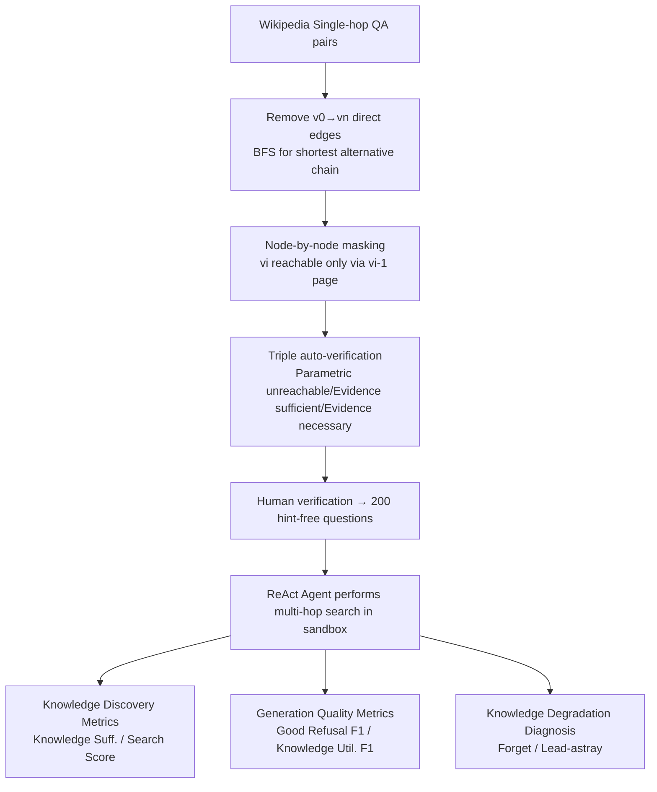

# Demystifying Deep Search: A Holistic Evaluation with Hint-free Multi-Hop Questions and Factorised Metrics

**Conference**: ICLR 2026  
**OpenReview**: [https://openreview.net/forum?id=x4zQDewgHg](https://openreview.net/forum?id=x4zQDewgHg)  
**Code**: TBD  
**Area**: Information Retrieval / Deep Search Agent Evaluation  
**Keywords**: Multi-hop QA, RAG Evaluation, Web Agent, Hint-free Questions, Factorised Metrics, Refusal Calibration  

## TL;DR
Addressing the two major issues of "reasoning path leakage in questions" and "reliance on a single pass rate" in current deep search evaluations, this paper constructs **WebDetective**, a hint-free multi-hop QA benchmark (controlled Wikipedia sandbox + full traceability), and a set of factorised metrics that decouple "Search Sufficiency / Knowledge Utilisation / Refusal Behaviour." After evaluating 25 frontier models, it reveals that current systems are proficient at **executing** given reasoning paths but generally fail to **autonomously discover** them, showing poor synthesis despite sufficient evidence and an almost complete failure to provide appropriate refusals when evidence is missing.

## Background & Motivation
- **Background**: RAG systems and Web Agents are increasingly being evaluated on multi-hop deep search tasks, requiring models to perform multi-step exploration, generate hypotheses, aggregate evidence, and synthesise answers to overcome common searcher hurdles like "I can't find it."
- **Limitations of Prior Work 1 (Path Hinting)**: Most benchmarks embed reasoning clues within the question. Classic multi-hop QA (e.g., HotpotQA) belongs to **Path-Hinting (PH)**, where the reasoning chain is directly written in the question ("Who is the husband of the stepmother of Kane Cornes' brother?"), causing the task to degenerate into "following a map." Newer benchmarks (BrowseComp, WebShaper) belong to **Specification-Hinting (SH)**, using unique attributes to point to target entities, which essentially becomes constraint filtering rather than exploratory search. Both types of hinting provide scaffolding rare in reality, failing to examine true autonomy.
- **Limitations of Prior Work 2 (Single Pass Rate)**: A single pass rate merges distinct failure modes into one number—"excellent search but poor synthesis," "premature abandonment," "over-reliance on parametric knowledge," and "refusing when it should continue" are all mixed together, making it impossible to locate the root cause of problems.
- **Key Challenge**: Evaluation should measure **path discovery**, but existing benchmarks actually only measure **path execution**; failures need to be diagnosed, but a single metric masks these patterns.
- **Goal**: Create a benchmark and metric system that is hint-free, traceably controlled, and capable of multi-mode diagnosis to "deconstruct" the capability gaps of deep search agents.
- **Core Idea**: **Question De-Hinting + Environment Co-design**—de-hinting questions alone is insufficient, as shortcuts still exist in open corpora (pseudo-co-occurrence, direct search of intermediate entities). Thus, a **node-by-node masked Wikipedia sandbox** is paired to force the requirement that "following entities can only be discovered by visiting predecessor pages." Evaluation is then **factorised** into three groups: Knowledge Discovery / Generation Quality / Knowledge Degradation.

## Method

### Overall Architecture
WebDetective consists of three parts: **(1) Hint-free multi-hop questions** + **(2) A controlled, traceable Wikipedia sandbox (Co-design principle)** + **(3) Factorised diagnostic metrics beyond pass rate**. Additionally, it provides an agent baseline, **EvidenceLoop**, designed based on diagnostic conclusions. The entire evaluation pipeline allows 25 frontier models to perform interleaved "Reason-Search-Observe" in a ReAct manner on 200 questions (2–4 hops), tracking their access trajectories page-by-page to precisely distinguish between "not searched," "searched but not utilized," and "should have refused but didn't."

### Key Designs

**1. Hint-Free QA: Restoring information needs to the simplest sentence.** Given a question $q$ and a corpus $C$, the agent must autonomously discover and combine a string of atomic evidence $E=\{e_1,\dots,e_n\}$, where each $e_i$ is located on the page of entity $v_i$ and links to $v_{i+1}$, forming a reasoning chain $v_0\!\to\!v_1\!\to\!\cdots\!\to\!v_n$. Then, the reasoning function $R_{func}:E\to a^*$ synthesises the answer. The paper defines any information in the question that leaks $R_{func}$ or identifies $v_n$ as a hint $h$: PH satisfies $h_{PH}=\text{Encode}(R_{func})$ (direct encoding of the reasoning chain), while SH satisfies $h_{SH}=\{s_1,\dots,s_k\}$ (a set of constraints narrowing the search space to a unique entity). This work requires $h=\varnothing$—for example, rewriting "Who is the husband of the stepmother of..." into a plain "Who is the father of Kane Cornes?", forcing the model to discover $E$ and $R_{func}$ itself, which is the core capability of "transforming simple information needs into self-constructed reasoning structures."

**2. Co-design Masking: Using the environment to block shortcuts and force "honest multi-hop" logic.** De-hinting questions is not enough: in an open corpus, "Kane" and the answer entity might co-occur in unrelated contexts, or intermediate entities might be directly searchable, allowing the agent to bypass the intended reasoning chain without revealing whether it truly discovered it. To address this, the sandbox enforces the constraint:
$$v_i \text{ is discoverable} \iff \text{agent has visited } page(v_{i-1}),$$
meaning each entity mention is masked along the reference chain. The next-hop entity can only be reached by visiting its predecessor page, eliminating corpus-based pseudo-shortcuts while still allowing multiple valid reasoning strategies. This method is not bound to Wikipedia; any domain satisfying "factual corpus + entity-level link graph + path-based masking" (e.g., news archives, research libraries, enterprise knowledge bases) can use the same pipeline.

**3. Factorised Metrics: Splitting "Correct/Wrong" into "Evidence Presence" and "Evidence Utilization".** The Knowledge Discovery layer uses **Knowledge Sufficiency** (whether evidence is complete; missing evidence is checked via directional probes like "Kane Cornes has brother ___?") and **Search Score** (retrieval effectiveness, with extra points for "fewer hops + parametric knowledge," while acknowledging alternative paths). The Generation Quality layer defines **Good Refusal F1** (whether to refuse when evidence is insufficient) and **Knowledge Utilisation F1** (whether to synthesise correctly when evidence is sufficient) under the cross-classification of Presence (S)/Insufficiency (I) and Attempt (A)/Refusal (N). These are combined into:
$$\text{GenScore}=\frac{F1_{GR}+F1_{KU}}{2}\cdot \text{KnowledgeScore},$$
weighted by the knowledge sufficiency rate to prevent "always refuse" from gaming the score—points are awarded only if evidence is retrieved AND properly handled (correct synthesis or reasonable refusal).

**4. Knowledge Degradation Diagnosis (Forget vs Lead-astray): Explaining "Why wrong answers occur when evidence is available."** Models often fail even with Knowledge Sufficiency ($KS(d)=1$). **Knowledge Forget** captures "forgetting" failures where a model can answer a separate probe correctly but fails to use parametric knowledge when placed in a full context. **Lead-astray** captures "distraction" failures where the model is misled by irrelevant pages, failed attempts, or exploration noise, resulting in an incorrect answer despite available clean evidence. These metrics further pinpoint failures as "insufficient search / overconfident hallucination / weak synthesis / reasoning degradation under noise."

**5. EvidenceLoop Mechanism: An agent workflow derived from diagnostic conclusions.** Targeting the synthesis bottleneck identified by the benchmark, three mechanisms are designed: **Iterative Refinement + Backtrack** (each round features $N$ solvers exploring different paths, refined by an extraction agent and aggregated by a synthesis agent; if no conclusion is reached after $R_{max}$ rounds, it falls back to synthesis only, distinguishing "insufficient exploration" from "weak synthesis"); **Evidence Memory System** (each piece of evidence is assigned a unique EID; the agent sees summaries and retrieves full text as needed to avoid being overwhelmed by long documents while maintaining the evidence chain); **Verification Loop** (the answer is split into atomic claims, each with an EID; a verification agent checks if claims are entailed by sources, support the answer, and are relevant. A refusal triggers feedback for the solver to fix it within the budget; a pass terminates immediately—explicitly binding refusal to "incomplete evidence").

## Key Experimental Results

### Main Results (25 frontier models, 200 questions 2–4 hops, 40 tool calls / 32K context limit)

| Model | Knowledge Suff.(%) | Search(%) | Generation(%) | Good Refusal F1(%) | Knowledge Util. F1(%) | Pass@1(%) |
|------|------:|------:|------:|------:|------:|------:|
| o3-Pro | 71.0 | 78.0 | 20.86 | 9.37 | 49.40 | **56.0** |
| GPT-5 | 79.0 | **80.0** | 23.21 | 8.89 | 49.58 | 50.5 |
| Grok-4 | 74.0 | 77.5 | **34.71** | 37.63 | **56.19** | 50.5 |
| o3 | 70.0 | 76.0 | 18.29 | 3.29 | 48.97 | 53.5 |
| Claude-Opus-4.1 | 74.0 | 76.5 | 28.53 | 28.57 | 48.54 | 44.5 |
| Qwen3-235B-Think | 72.5 | 72.0 | 11.15 | 6.56 | 24.19 | 21.5 |
| Doubao-1.6-Flash | 54.5 | 57.5 | 20.00 | **53.95** | 19.46 | 13.5 |
| DeepSeek-R1 (Base) | 61.5 | 65.5 | 10.57 | 18.81 | 15.55 | 20.0 |
| **EvidenceLoop (Ours, Base DeepSeek-R1)** | 61.5 | 62.5 | 12.61 | 17.98 | 23.79 | 25.0 |

- **Frontier models are far from saturated**: The strongest o3-Pro achieves only 56.0% Pass@1; GPT-5/Grok-4 are at 50.5%, with most below 40%.
- **Decoupling of Search, Generation, and Accuracy**: GPT-5 has 80.0% Search but only 23.21% Generation; Qwen3-235B has 72.0% Search but only 11.15% Generation—synthesis (not retrieval) is the key bottleneck.
- **Refusal capabilities are underdeveloped**: The best Good Refusal F1 is only 53.95% (Doubao-1.6-Flash); top-tier models like GPT-5 (8.89%) and o3-Pro (9.37%) are severely low, almost never refusing properly when evidence is lacking.

### Ablation Study / Behavior Profiling & Degradation Analysis

| Behavior Profile | Know./Refuse/Util. | Pass@1 | Rep. Models | Failure Mode |
|------|------|------:|------|------|
| Strong but Overconfident | High/Low/High | 50–56% | GPT-5, o3-Pro | Overconfidence → Hallucination |
| Well-Calibrated Elite | High/Med/High | 44–51% | Grok-4, Claude-Opus-4.1 | Occasional Over-caution |
| Synthesis Bottleneck | High/Low/Low | 18–22% | Qwen3-235B, Tongyi-DR | Has evidence but can't link hops |
| Conservative Middle | Med/Med/Med | 29–39% | Claude-Sonnet-4, GLM-4.5 | Answers but refuses; under-utilized |
| Weak and Confused | Med/Low/Low | 20–22% | o4-Mini, DeepSeek-R1 | Poor Synthesis + Poor Calibration |
| Self-Aware Weakness | Low/High/Low | 13–18% | Doubao, Gemini-Flash | Generally incompetent (but refuses well) |

- **Targeted Gains of EvidenceLoop**: Compared to the base DeepSeek-R1, Pass@1 increased 20.0→25.0 (+25% relative), Generation 10.57→12.61 (+19%), and Knowledge Utilisation F1 15.55→23.79 (**+53% relative**)—the evidence buffer and verification loop directly address the synthesis bottleneck.
- **Forgetting outweighs distraction**: Across all models, $Forget - Lead\text{-}astray = +10.35$ percentage points, indicating that failures after achieving knowledge sufficiency stem more from "failing to use available evidence during synthesis" than from "being misled by noise."
- **Robustness to Test-Time Scaling (TTS)**: On Claude-Opus-4.1, as context expanded from 8K to 32K, Generation and Pass@1 saturated around 34% and 50% respectively; EvidenceLoop remained stable across various breadth–iterations—reconfirming that the bottleneck sits in synthesis, not search.

### Key Findings
1. **No model scores high on "Knowledge Sufficiency / Proper Refusal / High Utilisation" simultaneously**—current architectures seem forced to choose between "capability" and "epistemic humility."
2. **Three concurrent failure modes**: Search failure (still 21–46% for top models), Synthesis failure (utilisation peaks at 56%), and Calibration failure (top models are systematically overconfident; weak models lack calibration signals).
3. **Stable evidence maintenance (rather than raw retrieval capability) is the deciding factor for deep search performance.**

## Highlights & Insights
- **"Co-design" is the masterstroke**: Linking "question de-hinting" with "environment masking" makes "true autonomous path discovery" verifiable and traceable for the first time, rather than relying on ambiguous signals from the open web.
- **Factorised metrics are far more informative than pass rate**: Splitting "Correct/Wrong" into Knowledge Sufficiency × Generation Quality, then further refining with Forget/Lead-astray, provides actionable diagnosis: "improve search," "improve synthesis," or "improve calibration."
- **GenScore's sufficiency weighting is clever**: Using KnowledgeScore as a multiplier structurally prevents gaming via "universal refusal."
- **Diagnosis-driven design loop**: EvidenceLoop is not just another SOTA attempt, but a proof of concept showing how benchmarks can guide specific architectural improvements by targeting identified bottlenecks.

## Limitations & Future Work
- **Limited absolute gains**: While EvidenceLoop shows significant relative improvements, absolute performance remains low (25% Pass@1), showing it is far from practical use.
- **Benchmark scale**: Only 200 questions across 2–4 hops, currently instantiated only on Wikipedia. While the method is claimed to be transferable to other corpora, this has not yet been empirically demonstrated.
- **Sandbox vs. Reality Gap**: Real-world web search doesn't have "node-by-node masking." While the sandbox aids controlled diagnosis, a gap exists between it and the noise/redundant path distribution of the open web.
- **Unresolved synthesis bottleneck**: The paper precisely identifies the problem as "failure to synthesise despite sufficient evidence," but EvidenceLoop's verification loop is only a mitigation; deeper multi-hop synthesis and calibration mechanisms remain open problems.

## Related Work & Insights
- **Multi-hop QA Benchmark Lineage**: From HotpotQA (PH) to BrowseComp / WebShaper (SH), this work conceptualises "hints" as $h$ and explicitly removes them, providing a critical response to the idea that "difficulty often comes from the scaffolding."
- **Web Agent / Deep Research**: Complementary to Tongyi-DeepResearch and various ReAct-style agents—while those focus on "how to search better," this work focuses on "measuring the true gap between search and synthesis."
- **Refusal and Calibration**: Including "Good Refusal" in the primary metrics aligns with research on LLM uncertainty/abstention, reminding the community that "knowing when you don't know" is as vital as "knowing how to answer."

## Rating
- **Novelty**: ⭐⭐⭐⭐⭐ — The formalization of "hints" (PH/SH/HF) + co-design environment masking + factorised diagnostics represents a paradigmatic shift in deep search evaluation.
- **Experimental Thoroughness**: ⭐⭐⭐⭐ — Comprehensive evaluation of 25 models, 6 metrics, behavior profiling, and degradation analysis; points deducted for the 200-question scale and Wikipedia-only instantiation.
- **Writing Quality**: ⭐⭐⭐⭐⭐ — Clear definitions, intuitive use of the Kane Cornes example, and logically progressive metric derivation.
- **Value**: ⭐⭐⭐⭐⭐ — Provides both a traceable diagnostic benchmark and a closed-loop demonstration that diagnosis can lead to architectural improvements for autonomous reasoning agents.

<!-- RELATED:START -->

## Related Papers

- [\[ICLR 2026\] FrugalRAG: Less is More in RL Finetuning for Multi-hop Question Answering](frugalrag_less_is_more_in_rl_finetuning_for_multi-hop_question_answering.md)
- [\[ICLR 2026\] Hybrid Deep Searcher: Scalable Parallel and Sequential Search Reasoning](hybrid_deep_searcher_scalable_parallel_and_sequential_search_reasoning.md)
- [\[AAAI 2026\] Magnitude Matters: A Superior Class of Similarity Metrics for Holistic Semantic Understanding](../../AAAI2026/information_retrieval/magnitude_matters_a_superior_class_of_similarity_metrics_for_holistic_semantic_u.md)
- [\[AAAI 2026\] REAP: Enhancing RAG with Recursive Evaluation and Adaptive Planning for Multi-Hop Question Answering](../../AAAI2026/information_retrieval/reap_enhancing_rag_with_recursive_evaluation_and_adaptive_planning_for_multi-hop.md)
- [\[ICLR 2026\] MergePRAG: Orthogonal Merging of Passage-experts for Multi-hop Parametric RAG](mergeprag_orthogonal_merging_of_passage-experts_for_multi-hop_parametric_rag.md)

<!-- RELATED:END -->
