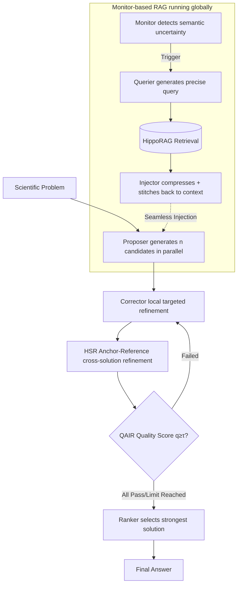

# Eigen-Agent: Adaptive Multi-Agent Scientific Reasoning with Monitor-Based RAG

**Conference**: ICLR 2026  
**OpenReview**: [https://openreview.net/forum?id=bGtmGTbmaz](https://openreview.net/forum?id=bGtmGTbmaz)  
**Code**: [https://github.com/tangxiangru/Eigen-1](https://github.com/tangxiangru/Eigen-1)  
**Area**: Information Retrieval / Multi-Agent Scientific Reasoning  
**Keywords**: Monitor-based RAG, implicit retrieval, multi-agent, scientific reasoning, hierarchical refinement, quality-aware iteration  

## TL;DR
Eigen-Agent utilizes a triad of "token-level monitored implicit retrieval + anchor-reference hierarchical refinement + quality-aware iteration" to eliminate the "tool tax" where explicit RAG interrupts reasoning and prevents multi-agent systems from averaging strong solutions into weak ones. It achieves a state-of-the-art accuracy of 48.3% on HLE Bio/Chem Gold while reducing token usage by 53.5% and agent steps by 43.7%.

## Background & Motivation
**Background**: LLMs have performed well on general and medium-difficulty reasoning benchmarks like MMLU and GPQA. However, performance drops sharply when entering expert-level biology/chemistry questions such as Humanity's Last Exam (HLE). Such problems require both deep domain knowledge and complex multi-step reasoning, hitting two structural weaknesses of existing systems.

**Limitations of Prior Work**: The authors performed error attribution on 149 HLE Bio/Chem questions and identified two types of architectural failures. First, **explicit retrieval fragments reasoning**: existing RAG (single-turn, iterative, reasoning-aware) requires "pausing reasoning → constructing query → processing results → rebuilding context," interrupting the logical flow each time. Solving a Watterson estimation problem in population genetics requires 8-10 such interruptions, doubling agent steps and decreasing coherence—termed the "tool tax." Second, **democratic multi-agent systems dilute strong solutions**: mainstream multi-agent pipelines follow a symmetric "generate-criticize-synthesize-select" process that averages all candidates equally, mixing high-quality and low-quality solutions, which wastes computation and lowers the ceiling. Error analysis further showed 92.8% of failures involved reasoning errors and 88.7% involved knowledge gaps, with high overlap—indicating that failures in knowledge and reasoning are entangled.

**Key Challenge**: Knowledge injection must be "seamless without interrupting reasoning," yet explicit tool calls are inherently disruptive; multi-agent systems must "collect various strengths," but symmetric averaging often drags down good solutions.

**Goal**: Inject external knowledge without sacrificing reasoning coherence while using structured (rather than democratic) collaboration to refine multiple candidates into a single high-quality solution.

**Core Idea**:
- **Implicit Retrieval (Monitor-based RAG)**: Retrieval is no longer a tool actively called by the agent but a "sentinel" that continuously monitors the reasoning flow at the token level, silently injecting evidence only when semantic uncertainty is detected, fundamentally eliminating the tool tax.
- **Hierarchical Rather Than Averaged Collaboration (HSR + QAIR)**: Candidate solutions are organized into an "anchor-reference" structure for targeted refinement, followed by quality-score-driven iterations that only rework substandard solutions, mimicking the "main idea + supporting patches" hierarchy in expert collaboration.

## Method

### Overall Architecture
Eigen-Agent integrates global retrieval, role-based reasoning, and high-level refinement into a single pipeline. The foundation is **Monitor-based RAG**: it runs globally during reasoning, where the Monitor detects internal knowledge deficits, the Querier converts uncertain segments into precise queries, and the Injector compresses and seamlessly stitches retrieved evidence back into the context. Above this base, the Proposer first generates multiple candidates in parallel, and the Corrector performs local targeted refinement on each solution without viewing others. Subsequently, HSR introduces cross-solution refinement (anchor-reference interaction), and QAIR evaluates overall quality, re-invoking the Corrector if necessary. Finally, the Ranker selects the strongest solution as the answer. Monitor-based RAG is model-agnostic and can theoretically be embedded into other reasoning systems without re-architecting.

### Key Designs

**1. Monitor-based RAG: Downgrading retrieval from "active call" to "passive injection" to eliminate the tool tax.** This implicit retrieval system consists of three relaying components. The Monitor acts as a sentinel, periodically scanning the reasoning trajectory to output a binary decision $\text{Monitor}(\text{context}) \in \{0,1\}$, triggering retrieval only when "insufficient knowledge" is determined. To balance timeliness and cost, it uses a sliding window of 512 characters with a 128-character overlap to ensure uncertainty markers across boundaries are not missed without increasing latency. Once triggered, the Querier converts the uncertain segment into one or more queries $[\text{query}_1,\dots,\text{query}_n]=\text{Querier}(\text{context})$, focusing on extracting a minimal keyword set to precisely characterize the point of uncertainty. Finally, the Injector filters and compresses raw retrieval results into "redundancy-free, utility-focused" brief evidence, then rewrites and blends it into the Proposer's reasoning context: $\text{additional context}=\text{Injector}(\text{context},\text{RAG results})$. This ensures evidence improves accuracy without breaking the narrative coherence.

**2. Hierarchical Solution Refinement (HSR): Using anchor-references instead of democratic averaging for targeted cross-solution refinement.** HSR challenges the assumption that all solutions should contribute equally. Given a set of candidates $S=\{s_1,\dots,s_n\}$, one solution is designated as the anchor $s_i$ while the others $R=S\setminus\{s_i\}$ serve as references. Rotating the anchor ensures every solution is refined by its peers, preventing premature convergence. This is formalized as $s_i'=\text{Refine}(s_i,R)$, where $\text{Refine}(\cdot)$ is LLM-driven multi-dimensional refinement: logical completion, numerical correction, method replacement, and expression polishing. This systematically fixes anchor weaknesses while preserving its strengths.

**3. Quality-Aware Iterative Reasoning (QAIR): Selective reworking gated by quality scores to ensure convergence.** QAIR introduces evaluation-driven control after HSR. For each refined solution $s'$, an LLM evaluator scores it 0-5 across logic, answer, and explanation dimensions, producing a composite score: $q(s')=0.2\cdot q_{\text{logic}}(s')+0.6\cdot q_{\text{answer}}(s')+0.2\cdot q_{\text{explanation}}(s')$. Answers reaching the threshold $\tau=3$ are kept, while substandard ones are sent back to the Corrector for reworking with specific suggestions: $\tilde{s}=\text{Corrector}(s',\text{suggestion}(s'))$. QAIR only iterates on the failed subset to ensure efficient convergence while maintaining quality.

## Key Experimental Results

### Main Results
HLE Bio/Chem (149 questions, o3-mini as judge), SuperGPQA Biology (hard split), and TRQA Literature:

| Model | HLE Bio/Chem | SuperGPQA Hard | TRQA |
|---|---|---|---|
| GPT-5 | 22.82 | 61.96 | 50.58 |
| Grok-4 | 30.20 | 66.30 | 46.51 |
| SciMaster (DeepSeek V3.1) | 34.92 | 66.30 | 51.74 |
| **Ours (Pass@1)** | **48.30** | **69.57** | **54.65** |
| Ours (Pass@5) | 61.74 | 78.26 | 79.07 |

On HLE, Pass@1 is +13.4 points higher than the strongest agent baseline SciMaster and ~+18 points higher than the strongest frontier LLM (Grok-4).

### Ablation Study
Incremental setup on the full HLE Bio/Chem set (Baseline: 5 Proposers + web search, no paper RAG):

| Configuration | Accuracy (%) | Tokens (K) | Steps |
|---|---|---|---|
| Baseline (No Ext. Knowledge & No RAG) | 25.3 | 483.6 | 43.4 |
| + Papers (Explicit RAG) | 41.4 | 470.6 | 94.8 |
| + Monitor only | 34.5 | 218.4 | 51.3 |
| + Monitor + Querier | 36.8 | 213.0 | 51.7 |
| + Monitor + Querier + Injector | 40.3 | 229.5 | 53.1 |
| + … + HSR | 43.7 | 214.0 | 52.9 |
| + … + HSR + QAIR (Complete) | **48.3** | 218.9 | 53.4 |

Component removal ablation shows that removing (Monitor, Querier, Injector) results in similar accuracy (48.5%) but tokens surge to 461.3K and steps to 95.3, indicating that the Monitor's value lies primarily in **computational efficiency**. Removing HSR or QAIR drops accuracy to 44.8% and 43.7% respectively, showing these components primarily **improve precision**.

### Key Findings
- **Quantifying the Tool Tax**: Explicit RAG increased accuracy from 25.3% to 41.4% but caused agent steps to jump from 43.4 to 94.8. Monitor-based RAG halved tokens (470.6K→218.4K) and steps (94.8→51.3) for equivalent knowledge gains.
- **Bottleneck in Fusion, Not Querying**: Adding the Querier alone provided a small gain (36.8%), suggesting the main bottleneck is evidence integration (solved by the Injector, reaching 40.3%).
- **Retrieval Backends**: Among Vanilla, Vanna, HippoRAG, and LightRAG, HippoRAG was selected as the default due to its fine-grained retrieval and graph-structured indexing.
- **Diversity Dichotomy**: Retrieval tasks benefit from solution diversity, while reasoning tasks favor consensus—consistency scores correlate strongly with accuracy (r=0.881 for retrieval tasks, r=0.840 for reasoning).

## Highlights & Insights
- **The "Tool Tax" Concept**: Quantifying the intuitive cost of explicit RAG interrupting reasoning into measurable token/step overhead is insightful, clearly separating components into "cost-saving" (Monitor) and "accuracy-boosting" (HSR+QAIR).
- **Implicit Retrieval Paradigm**: Token-level monitoring + uncertainty triggering + seamless injection is a clean inversion of the "explicit tool call" paradigm found in ReAct/IRCoT.
- **Anchor Rotation Design**: HSR uses "rotating anchors refined by peers" to avoid the dilution of democratic averaging and the premature convergence of single-solution refinement.
- **Data-Driven Collaboration**: Analyzing the relevance of diversity versus consensus by task type to guide aggregation strategies is methodologically solid.

## Limitations & Future Work
- **Narrow Domain**: Experiments are concentrated on Bio/Chem/Med scientific reasoning; cross-domain generalization remains to be verified.
- **Dependency on Strong Bases**: The system relies on DeepSeek-V3.1 (64K context) + HippoRAG + Serp API; it is sensitive to the quality of the base model and external retrieval libraries.
- **Monitor Trigger Reliability**: Sliding window detection is heuristic; the trade-off costs of missed detections versus redundant retrievals lack systematic robustness analysis.
- **Subjective QAIR Scoring**: Quality scores are LLM-derived; weights (0.2/0.6/0.2) and the threshold $\tau=3$ are empirically set, and evaluator bias could propagate to convergence decisions.

## Related Work & Insights
- **Three Paradigms of RAG Evolution**: Single-turn (REALM, RAG) is efficient but non-adaptive; iterative (Self-RAG, FLARE) improves grounding but increases API calls by 3-5x; reasoning-aware (RAT, ReAct) is tightly coupled but still explicit. Ours fills the gap for "continuity + efficiency" via implicit injection.
- **Multi-Agent Reasoning**: Democratic collaboration (SciMaster, LLM-Debate) treats candidates equally and wastes computation on weak solutions; structured reasoning (ToT, GoT) lacks quality awareness. HSR/QAIR fills the "hierarchical + adaptive depth" gap.
- **Declarative vs. Procedural**: Unlike DSPy which compiles tasks into prompt programs (stage-level adaptation), this work uses runtime procedural control (Monitor/Querier/Injector), allowing for finer-grained adaptation.

## Rating
- **Novelty**: ⭐⭐⭐⭐ — Monitor-based implicit RAG's inversion of retrieval into a background service and the "tool tax" concept are paradigm innovations.
- **Experimental Thoroughness**: ⭐⭐⭐⭐ — Comprehensive benchmarks, bidirectional ablations, and token/step quantification clearly delineate component contributions.
- **Writing Quality**: ⭐⭐⭐⭐ — Driven by real error cases with high-information diagrams and clear ablation interpretations.
- **Value**: ⭐⭐⭐⭐ — Record-breaking 48.3% on HLE Bio/Chem with halved token costs offers direct value for efficient scientific agents.

<!-- RELATED:START -->

## Related Papers

- [\[ACL 2026\] MASS-RAG: Multi-Agent Synthesis Retrieval-Augmented Generation](../../ACL2026/information_retrieval/mass-rag_multi-agent_synthesis_retrieval-augmented_generation.md)
- [\[ACL 2025\] MAIN-RAG: Multi-Agent Filtering Retrieval-Augmented Generation](../../ACL2025/information_retrieval/main-rag_multi-agent_filtering_retrieval-augmented_generation.md)
- [\[ACL 2026\] End-to-End Optimization of LLM-Driven Multi-Agent Search Systems via Heterogeneous-Group-Based Reinforcement Learning](../../ACL2026/information_retrieval/end-to-end_optimization_of_llm-driven_multi-agent_search_systems_via_heterogeneo.md)
- [\[AAAI 2026\] Mem-PAL: Towards Memory-based Personalized Dialogue Assistants for Long-term User-Agent Interaction](../../AAAI2026/information_retrieval/mem-pal_towards_memory-based_personalized_dialogue_assistants_for_long-term_user.md)
- [\[ICLR 2026\] MergePRAG: Orthogonal Merging of Passage-experts for Multi-hop Parametric RAG](mergeprag_orthogonal_merging_of_passage-experts_for_multi-hop_parametric_rag.md)

<!-- RELATED:END -->
