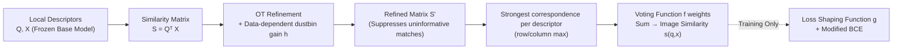

# ELViS: Efficient Visual Similarity from Local Descriptors that Generalizes Across Domains

**Conference**: ICLR 2026  
**OpenReview**: [https://openreview.net/forum?id=9nphGvSatt](https://openreview.net/forum?id=9nphGvSatt)  
**Code**: [https://github.com/pavelsuma/ELViS](https://github.com/pavelsuma/ELViS)  
**Area**: Instance-level Image Retrieval / Re-ranking / Single-source Domain Generalization  
**Keywords**: image retrieval, re-ranking, local descriptors, optimal transport, domain generalization, Chamfer similarity  

## TL;DR
ELViS performs image pair re-ranking in "similarity space" rather than "appearance space": it first refines the similarity matrix of local descriptors using Optimal Transport (OT) with data-dependent dustbin gains, then sums the strongest correspondence of each descriptor as a "vote" weighted by a learnable function to compute image-level similarity. With 1/20th of the parameters and several times the speed, it significantly outperforms Transformer-based re-ranking methods in cross-domain retrieval.

## Background & Motivation
**Background**: State-of-the-art (SOTA) solutions for instance-level image retrieval (finding the same specific object—a landmark, painting, or product—in a database) typically follow a two-stage pipeline: first, a coarse list is retrieved using global descriptors, followed by fine re-ranking using local descriptors. Current popular re-ranking methods like RRT, AMES, and R2Former are Transformer-based models that directly process descriptor vectors and learn image pair similarity through attention.

**Limitations of Prior Work**: These methods are almost exclusively "trained on one domain and tested on the same domain"—models trained on landmark data (GLDv2) are evaluated only on landmarks, masking a critical issue: they suffer from severe overfitting and performance drops when moved to unseen domains (products, artwork, mixed domains). Since the essence of retrieval is that "training instances and test instances are naturally disjoint," and collecting cross-domain instance-level labels is extremely expensive, **generalization to unseen domains is the true core problem retrieval needs to solve**, yet most works avoid it.

**Key Challenge**: Transformer re-rankers are highly expressive but lack inductive bias and interpretability. Because they process "what objects look like" (descriptor appearance), they naturally memorize the appearance distribution of the training domain. Conversely, manual Chamfer similarity generalizes well but is too weak and non-learnable. How can one maintain generalization while introducing just the right amount of learnability?

**Goal**: To learn an image-image similarity re-ranking model that is lightweight, fast, possesses strong inductive bias, is interpretable, and generalizes across domains, all while using frozen foundation model (DINOv2/DINOv3/SigLIP2) features.

**Core Idea**: **Operate in "similarity space" rather than "appearance space"**—do not process the descriptors themselves, but rather the "correspondence patterns" formed by their pairwise similarities. Correspondence patterns are more universal and transferable than appearance (echoing the self-similarity observations of Shechtman & Irani in classical CV). Building on this, ELViS uses OT to refine the similarity matrix and aggregate it via learnable voting counts, explicitly encoding the classical prior that "the number of strong correspondences is a robust indicator of image similarity" into the architecture.

## Method

### Overall Architecture
Given matrices $Q, X \in \mathbb{R}^{D\times M}$ containing $M$ local descriptors each (taken from frozen foundation model patch tokens, reduced via a learnable linear projection + LayerNorm + $\ell_2$ normalization), the core of ELViS is processing their similarity matrix $S = Q^\top X \in \mathbb{R}^{M\times M}$. The entire pipeline consists of three steps: **(1) Refine $S$ into $S'$ using Optimal Transport (OT) with dustbins**, suppressing correspondences from uninformative descriptors like background; **(2) Take the strongest correspondence for each descriptor as a vote, weight it via a learnable function $f$, and sum** to obtain the image-level similarity; **(3) During training, apply a learnable function $g$ to reshape the BCE penalty curve, which is discarded at inference**. Only the OT dustbin gain network $h$, voting function $f$, training loss shaping function $g$, and descriptor projection layer are learnable, resulting in very few parameters (96K).

### Key Designs

**1. Re-ranking in Similarity Space: Correspondence patterns as first-class citizens.** Unlike RRT/AMES which feed descriptor vectors into Transformers, ELViS immediately reduces image pairs to a similarity matrix $S=Q^\top X$. All subsequent processing occurs on this matrix. This choice yields three benefits: the similarity matrix characterizes "how well patches from two images match," a signal more abstract and cross-domain invariant than "what a patch looks like"; it naturally reduces the input dimensionality from descriptor vectors to scalar similarities, keeping parameters and latency minimal; and it ensures every step of the pipeline corresponds to intuitive semantics (refining match, selecting strongest match, counting matches). The authors also provide experimental evidence: all similarity-based models are more robust on OOD data, while descriptor-based models perform slightly better ID but drop significantly OOD, proving that "operating in similarity space" is itself a source of generalization.

**2. Optimal Transport Refinement with Data-dependent Dustbin Gains.** Using $S$ directly for matching allows background or non-discriminative descriptors to form strong correspondences, polluting the similarity. ELViS frames refinement as an OT problem: find a doubly stochastic matrix $P$ that maximizes $\langle P, \hat S\rangle_F + \lambda H(P)$, solved differentiably via Sinkhorn-Knopp iterations. The key innovation is in the dustbin design—augmenting the matrix to $(M{+}1)\times(M{+}1)$:

$$\hat S = \begin{pmatrix} S & u \\ v^\top & \omega \end{pmatrix}, \quad u_i = h(q_i),\; v_i = h(x_i)$$

Where $u, v$ represent the gain for each descriptor in the query/gallery image to be "thrown into the dustbin" (not matched). While previous works like SuperGlue used fixed or learnable **scalars** for dustbins, ELViS uses a two-layer MLP $h$ to **predict gains per descriptor content**: higher gain means a descriptor is more likely to be discarded. After solving, the augmented rows/columns are dropped, retaining $S' = P_{1:M,1:M}$. Ablations show this step is vital—removing the dustbin leads to a 23.5 mAP crash, and reducing data-dependent gains to scalars drops mAP by 2.4.

**3. Learnable Voting and Counting: From local to global similarity.** For the refined $S'$, each descriptor retains only its strongest correspondence as a vote: $s'_i = \max_j S'_{i,j}$ and $s'_j = \max_i S'_{i,j}$. Summing these votes directly equals Chamfer similarity (already a strong generalization baseline). ELViS goes further by using a two-layer MLP $f:\mathbb{R}\to[0,1]$ (with GELU and sigmoid output) to adaptively reshape the strength of each vote before counting:

$$s(q,x) = \sum_{i=1}^{M} f(s'_i) + \sum_{j=1}^{M} f(s'_j)$$

This inherits the classic retrieval prior that "more strong correspondences imply higher similarity," but replaces manual RBF/monomial kernels with a learnable $f$. The existence of $f$ is critical: removing it forces the descriptor projection layer to handle "adjusting correspondence strength," making it more dependent on descriptor appearance and more prone to overfitting (OOD drops by 1.2 in ablations).

**4. Training Loss Shaping Function $g$, discarded at inference.** Standard BCE calculates $-\log p$ / $-\log(1{-}p)$ for predicted similarity $p=s(q,x)$. ELViS first passes $p$ through a learnable function $g:\mathbb{R}\to[0,1]$ (two-layer MLP + sigmoid), calculating $-\log g(p)$ / $-\log(1{-}g(p))$. This optimizes the similarity under a concept "warped" by $g$. $g$ learns an approximately piecewise-linear shape that shifts slopes where positive and negative samples overlap, thereby emphasizing or de-emphasizing prediction errors in different ranges. Since $g$ is monotonic (as observed in practice), it only scales similarity without changing the ranking, allowing it to be discarded at inference—akin to "discardable projection heads" in self-supervised learning or "learnable temperatures" in contrastive learning. Ablations indicate $g$ contributes 5.4 mAP and is necessary for effective training.

## Key Experimental Results

### Main Results (mAP, DINOv2, grouped by training domain)

| Training Domain | Method | ID | OOD | avg |
|---|---|---|---|---|
| Landmarks GLDv2 | No re-ranking | 42.5 | 38.9 | 39.8 |
| Landmarks GLDv2 | Chamfer+OT† | 42.2 | 50.2 | 48.2 |
| Landmarks GLDv2 | RRT⋆ | 51.1 | 48.6 | 49.2 |
| Landmarks GLDv2 | R2Former† | 50.6 | 48.6 | 49.1 |
| Landmarks GLDv2 | AMES⋆ | 52.4 | 49.7 | 50.4 |
| Landmarks GLDv2 | **ELViS† (Ours)** | 50.5 (-1.9) | **55.0 (+4.8)** | **53.9 (+3.2)** |
| Products SOP | AMES⋆ | 56.7 | 41.4 | 43.3 |
| Products SOP | **ELViS† (Ours)** | 54.9 (-2.2) | **51.0 (+5.3)** | **51.5 (+5.8)** |

†=Similarity-based model, ⋆=Descriptor-based model. Green parentheses indicate gains over the runner-up. Using DINOv3/SigLIP2 local descriptors (trained on landmarks), ELViS achieved OOD gains of +3.5 / +5.7 and avg gains of +2.9 / +4.3, respectively. On the challenging ILIAS dataset (100M+ gallery), Gains over the runner-up exceeded 23% (Landmark trained) and 36% (Product trained).

### Ablation Study (mAP, Landmark trained)

| Configuration | ID | OOD | avg |
|---|---|---|---|
| ELViS Full | 50.5 | 55.0 | 53.9 |
| w/o dustbin | 23.1 (-27.4) | 32.8 (-22.2) | 30.4 (-23.5) |
| w/o data-dependent gain (reduced to scalar) | 48.8 | 52.4 | 51.5 (-2.4) |
| w/o $f$ | 50.8 (+0.3) | 53.8 | 53.1 (-0.8) |
| w/o $g$ | 45.6 | 49.5 | 48.5 (-5.4) |
| w/o $f,g$ | 47.3 | 48.5 | 48.2 (-5.7) |
| w/o descriptor projection | 48.4 | 51.7 | 50.8 (-3.1) |

### Complexity Comparison

| Method | Parameters (K) | Latency (µs/pair) |
|---|---|---|
| Chamfer+OT | 0 | 98 |
| RRT | 2232 | 656 |
| R2Former | 202 | 782 |
| AMES | 2130 | 952 |
| **ELViS (Ours)** | **96** | **101** |

### Key Findings
- ELViS ranks first in avg across all settings, with cross-domain gains of +2.9 to +5.8 mAP. It uses ~20x fewer parameters than AMES/RRT and has latency comparable to zero-parameter Chamfer+OT (~9x faster than AMES).
- Similarity-based models (including ELViS) are generally stronger in OOD and slightly weaker ID; descriptor-based Transformers show the opposite—confirming the trade-off between "strong inductive bias vs. overfitting the training domain."
- "Frozen base model + manual Chamfer+OT" is a strong OOD baseline (ranking 2nd in 3 out of 4 settings). ELViS's value lies in significantly improving it with minimal learnable parts without sacrificing speed/interpretability.
- Due to its speed, ELViS can re-rank more candidate images within a fixed time budget, stacking additional gains.
- High data efficiency: ELViS consistently outperforms AMES using anywhere from 0.2% to 100% of the training subset. To address the ID gap, the authors proposed an ELViS+AMES hybrid (replacing the projection layer with AMES Transformer blocks), raising ID from 50.5 to 52.1 and avg to 54.0, with only a slight OOD drop.

## Highlights & Insights
- **"Changing the Space" is the root of generalization**: Shifting re-ranking from appearance space to similarity/correspondence space is a simple yet powerful paradigm shift that explains why similarity-based models are inherently more stable OOD.
- **Data-dependent dustbins** upgrade SuperGlue's scalar dustbin to per-descriptor predicted gains. This is the most critical learnable component (removal causes a 23 mAP crash) and is naturally interpretable (visible which patches are deemed uninformative).
- **Discardable Loss Shaping $g$** borrows the concept of projection heads or learnable temperatures and applies it to BCE: it warps the similarity concept only during training and is discarded at inference without changing rank—a lightweight trick contributing 5+ mAP.
- Every step of the pipeline corresponds to intuitive semantics (refining → selecting → counting). Interpretability is maintained throughout, and performance visualizations (shapes of $f$ and $g$, correspondences in Fig 4) all validate the design motivations.

## Limitations & Future Work
- **ID (In-Domain) performance is still weaker than SOTA descriptor models** by about 1-2 mAP, requiring the ELViS+AMES hybrid to bridge the gap at the cost of ELViS's lightweight and speed advantages.
- The method is positioned as a **second-stage re-ranker**; it depends on the quality of the candidate list from upstream global retrieval and does not solve the first-stage recall issue.
- The monotonicity of $g$ is observed empirically rather than strictly enforced. Forcing weights to be non-negative to guarantee monotonicity caused a slight performance drop, leaving this as an area for exploration.
- It assumes an equal number of descriptors for both images to be equivalent to Chamfer; behavior in cases of unequal lengths is not fully detailed.
- While evaluations cover 8 domains, "foundation models have seen massive data, making it hard to define if a test image is truly 'unseen'"; the strictness of cross-domain evaluation is limited by the base model's training distribution.

## Related Work & Insights
- **Re-ranking Genealogy**: From BoW + geometric constraints/RANSAC to deep local descriptors (DELF), and then to Transformer-based (RRT, AMES) vs. similarity-based (ViSiL for video, CVNet 4D conv for images, R2Former sparse transformers). ELViS belongs to the similarity-based lineage but is simpler and faster.
- **OT for Aggregation**: Unlike Chowdhury et al., who used OT with Lagrange multipliers for cross-modal matching in sketch retrieval, ELViS uses entropy-regularized OT + a fully differentiable counting mechanism designed for cross-domain generalization.
- **Single-Source Domain Generalization**: Systematic introduction of the single-source DG perspective from classification into instance-level retrieval, accompanied by a unified 8-dataset benchmark protocol distinguishing ID/OOD—this benchmark is itself a contribution to the community.
- **Inspiration**: In tasks where "features are strong but prone to overfitting," moving the model from raw feature space to an abstract relational/similarity space, paired with explicit inductive biases and minimal learnable parts, is a reproducible path to balancing performance, efficiency, and generalization. Discardable training-time modules like $g$ are also worth migrating to other metric learning losses.

## Rating
- **Novelty**: ⭐⭐⭐⭐ While re-ranking in similarity space exists (ViSiL/R2Former), the combination of data-dependent dustbin gains, learnable voting counts, and discardable loss shaping $g$ is fresh. The single-source DG perspective + 8-domain benchmark is also a first.
- **Experimental Thoroughness**: ⭐⭐⭐⭐ Comprehensive matrix evaluation across 8 datasets × 2 training domains × 3 base models, complete component ablations, complexity comparisons, data efficiency curves, and hybrid architectures. ID shortfalls are honestly reported.
- **Writing Quality**: ⭐⭐⭐⭐ Logic from motivation to design to validation is clear. Each component is backed by visualization and ablation. Formulae and figures are precise, with an interpretability narrative throughout.
- **Value**: ⭐⭐⭐⭐ Achieving significant cross-domain gains over heavy Transformers with 1/20 of the parameters and multiple times the speed has direct utility for real-world retrieval systems (multi-domain, low compute, need for interpretability). The benchmark also supports future research.

<!-- RELATED:START -->

## Related Papers

- [\[ICLR 2026\] Welfarist Formulations for Diverse Similarity Search](welfarist_formulations_for_diverse_similarity_search.md)
- [\[ICLR 2026\] MILCO: Learned Sparse Retrieval Across Languages via a Multilingual Connector](milco_learned_sparse_retrieval_across_languages_via_a_multilingual_connector.md)
- [\[ICLR 2026\] AdaCache: Adaptive Caching and Context Augmentation for Efficient LLM Serving](adacache_adaptive_caching_and_context_augmentation_for_efficient_llm_serving.md)
- [\[CVPR 2025\] GOAL: Global-Local Object Alignment Learning](../../CVPR2025/information_retrieval/goal_global-local_object_alignment_learning.md)
- [\[ICLR 2026\] RAEE: A Robust Retrieval-Augmented Early Exit Framework for Efficient Inference](raee_a_robust_retrieval-augmented_early_exit_framework_for_efficient_inference.md)

<!-- RELATED:END -->
