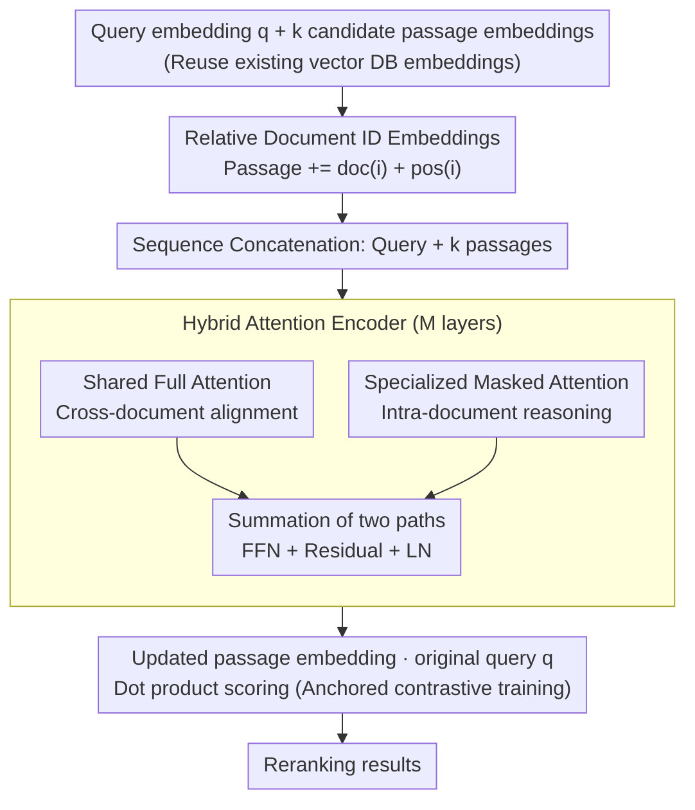

# Embedding-Based Context-Aware Reranker

**Conference**: ICLR 2026  
**arXiv**: [2510.13329](https://arxiv.org/abs/2510.13329)  
**Code**: [GitHub](https://github.com/BorealisAI/EBCAR)  
**Area**: Information Retrieval / RAG Efficiency  
**Keywords**: Reranking, RAG, Embedding Retrieval, Cross-Paragraph Reasoning, Hybrid Attention

## TL;DR

This paper proposes EBCAR, a lightweight reranking framework operating in the embedding space. By introducing structural information through document ID embeddings and passage position encodings, combined with a hybrid mechanism of shared full attention and specialized masked attention for cross-paragraph reasoning, EBCAR achieves the best average nDCG@10 on the ConTEB benchmark with only 126M parameters. Its inference speed is over 150x faster than LLM-based rerankers.

## Background & Motivation

RAG systems typically segment long documents into short passages for retrieval and reranking. While this passage-level indexing improves retrieval granularity, it introduces challenges requiring cross-paragraph reasoning: anaphora resolution (e.g., who does "he" refer to?), entity disambiguation (e.g., multiple paragraphs mention birthdays, but which one belongs to the target person?), and aggregation of scattered evidence.

**Limitations of Prior Work**: (1) **Low Efficiency**: Whether pointwise (monoBERT), pairwise (duoT5), or listwise (RankGPT, ICR), existing methods require feeding raw text into large PLMs for inference, resulting in massive computational overhead; (2) **Lack of Cross-Paragraph Context Modeling**: Most methods score each passage independently without considering the relationships between passages originating from the same document.

**Core Idea**: Operates directly in the embedding space—leveraging existing passage embeddings from vector databases. It uses a lightweight Transformer encoder to introduce document structural information and cross-paragraph interactions, achieving efficient and context-aware reranking.

## Method

### Overall Architecture

EBCAR performs reranking entirely within the embedding space to solve the problem where rerankers cannot see cross-paragraph context after RAG segments long documents, while avoiding the slowness of repeatedly running LLMs. The process follows a single forward pass: given a query embedding $q$ and $k$ candidate passage embeddings $\{p_1, ..., p_k\}$ from the same encoder, it first injects document structure into each passage using **Document ID Embeddings** and position encodings. Then, the query and passages are concatenated into a sequence and fed into an $M$-layer Transformer encoder with **Hybrid Attention** for cross-paragraph interaction. Finally, the dot product of the updated passage embeddings and the **original query embedding** is used as the reranking score. Since the process does not touch raw text, it can directly reuse existing embeddings in vector databases.

### Key Designs

**1. Relative Document ID Embeddings: Informing the model of passage origins**

When RAG segments long documents, passages originally belonging to the same document become isolated in retrieval results, making it impossible for the model to determine if "he" in one segment refers to a character in the previous one. EBCAR overlays a document ID embedding $\text{doc}(i)$ and a passage position encoding $\text{pos}(i)$ onto each passage, i.e., $\tilde{p}_i = p_i + \text{doc}(i) + \text{pos}(i)$, explicitly encoding "source relationships" and "passage order" into the representation. The **Key Insight** is that document IDs are **locally relative**—they are not globally unique identifiers but are dynamically assigned for the candidate set ($k$=20 passages) of each query. The embedding table size is at most $k \times d$, and the same table is reused during training and inference. This allows the model to identify intra-document passages and support reasoning while ensuring practicality: no ID space expansion or retraining is needed when adding new documents.

**2. Shared Full Attention + Specialized Masked Attention: Balancing cross-document alignment and intra-document reasoning**

A single attention mechanism cannot simultaneously satisfy two needs—aligning scattered evidence across different documents and performing anaphora resolution or entity disambiguation within the same document. EBCAR parallels two complementary modules in each Transformer layer: Shared Full Attention is standard multi-head attention allowing the query and all passages to attend to each other, capturing global cross-document relationships. Specialized Masked Attention restricts each passage's visibility to only the query and passages from the same document via a mask—the mask matrix is 0 at $(i,j)$ if passage $j$ and passage $i$ share the same source or if $j$ is the query, and $-\infty$ otherwise. This forces the model to aggregate context only within the document. The outputs of both modules are summed, followed by FFN, residual connections, and LayerNorm. This division of labor allows full attention to handle "breadth" and masked attention to handle "depth."

**3. Anchored Query Contrastive Training: Avoiding query semantic drift**

Training utilizes the InfoNCE contrastive loss, but with a counter-intuitive detail—the anchor for similarity calculation is the **original unmodified query embedding** $q$, rather than the updated query representation from the encoder. The loss is formulated as $\mathcal{L}_{\text{contrast}} = -\log \frac{\exp(\text{sim}(q, \hat{p}^+))}{\exp(\text{sim}(q, \hat{p}^+)) + \sum_j \exp(\text{sim}(q, \hat{p}_j^-))}$, where positive passage $\hat{p}^+$ is pulled closer and negatives $\hat{p}_j^-$ are pushed away, while $q$ remains stable. If the query representation were updated with the passage context, it could be "drifted" by candidate passages, making the scoring baseline unreliable. Fixing the anchor ensures all passage representations align to a stable query semantic reference. During training, the top-20 passages retrieved by Contriever are used as candidates; if the positive is absent, it replaces the 20th passage to ensure supervision. Passages are randomly shuffled to eliminate ranking bias. The optimizer is Adam with a learning rate of $1 \times 10^{-3}$, training for up to 20 epochs with early stopping (patience=5).

## Key Experimental Results

### Main Results

**Table 1: nDCG@10 on ConTEB benchmark (8 datasets)**

| Method | Parameters | MLDR | SQuAD | Football | Geog | Insurance | Average | Throughput |
|------|--------|------|-------|----------|------|-----------|------|--------|
| Contriever | - | 60.23 | 54.63 | 5.95 | 46.39 | 2.75 | 35.45 | 29.67 |
| RankZephyr | 7B | 82.34 | 69.06 | 11.63 | 72.91 | 3.51 | 50.03 | 0.17 |
| ICR (Llama) | 8B | 83.93 | 69.09 | 10.91 | 73.10 | 4.16 | 50.35 | 0.19 |
| **Ours** | **126M** | 75.26 | **71.62** | **80.19** | **81.30** | **40.74** | **64.92** | **29.33** |

**Key Comparison**: EBCAR leads significantly on Football (80.19 vs 11.63), Geography (81.30 vs 73.10), and Insurance (40.74 vs 4.76), all of which require cross-paragraph reasoning. Its throughput (29.33 qps) is 154x faster than ICR (0.19 qps).

### Ablation Study

**Table 2: Component Ablation (nDCG@10)**

| Method | SQuAD | Football | Geog | Insurance |
|------|-------|----------|------|-----------|
| w/o Pos | 60.87 | 42.88 | 62.44 | 34.16 |
| w/o Hybrid | 47.52 | 41.93 | 60.34 | 36.00 |
| w/o Both | 40.13 | 5.28 | 43.70 | 2.88 |
| **Ours** | **71.62** | **80.19** | **81.30** | **40.74** |

- Removing position information impacts Insurance the most (40.74 $\rightarrow$ 34.16), as this dataset relies heavily on document structure.
- Removing hybrid attention impacts SQuAD the most (71.62 $\rightarrow$ 47.52), due to the need for cross-paragraph semantic matching.
- Removing both leads to a catastrophic performance drop, verifying the complementarity of the components.

### Key Findings

- Operating in the embedding space balances efficiency and cross-paragraph reasoning without processing raw text.
- The locally relative design of Document ID embeddings makes the model generalizable (valid even when switching retrievers—verified on E5).
- Pointwise models (monoBERT/monoT5) perform worse than Contriever on ConTEB because they cannot utilize cross-paragraph signals.
- EBCAR's inference efficiency (29.33 qps) is nearly identical to the Contriever retriever itself (29.67 qps).

## Highlights & Insights

- The approach of "reranking in the embedding space" is novel in the reranking field, bypassing expensive PLM inference.
- The hybrid attention design is elegant: full attention for global association and masked attention for intra-document reasoning.
- The locally relative design of Document IDs solves practical deployment issues—no need for global unique IDs; new documents are plug-and-play.
- The advantage in cross-paragraph reasoning tasks is extremely significant (80 vs 12 on Football), highlighting the importance of modeling document structure.

## Limitations & Future Work

- In scenarios not requiring cross-paragraph reasoning (e.g., MLDR), performance is slightly lower than LLM rerankers (75 vs 84).
- Information bottleneck in the embedding space: passages are compressed into fixed-size embeddings, losing fine-grained textual details.
- Only validated on ConTEB; evaluations on traditional benchmarks like BEIR/TREC DL are missing.
- The number of candidate passages is fixed at 20; scalability for larger candidate sets remains to be verified.

## Related Work & Insights

- **ICR** (Chen et al., 2025): Inference-time reranking based on LLM attention, effective but extremely slow.
- **RankGPT** (Sun et al., 2023): Prompts LLMs to directly generate ranked lists, relying on APIs.
- **ConTEB** (Conti et al., 2025): A benchmark evaluating cross-paragraph reasoning capabilities of retrieval/reranking systems.
- Insight: The idea of injecting structural priors in the embedding space could be extended to other retrieval-augmented tasks.

## Rating

- **Novelty**: ⭐⭐⭐⭐ Combination of embedding space reranking and hybrid attention is novel, though paragraph interaction has been explored.
- **Experimental Thoroughness**: ⭐⭐⭐⭐ Thorough ablation on ConTEB, but lacks traditional IR benchmarks and larger-scale tests.
- **Writing Quality**: ⭐⭐⭐⭐ Clear motivation and intuitive diagrams, though some parts are slightly verbose.
- **Value**: ⭐⭐⭐⭐⭐ Balances efficiency and effectiveness; highly practical for RAG deployment scenarios requiring cross-paragraph reasoning.

<!-- RELATED:START -->

## Related Papers

- [\[ICLR 2026\] Beyond RAG vs. Long-Context: Learning Distraction-Aware Retrieval for Efficient Knowledge Grounding](beyond_rag_vs_long-context_learning_distraction-aware_retrieval_for_efficient_kn.md)
- [\[ICLR 2026\] Think Then Embed: Generative Context Improves Multimodal Embedding](think_then_embed_generative_context_improves_multimodal_embedding.md)
- [\[ACL 2025\] EXIT: Context-Aware Extractive Compression for Enhancing Retrieval-Augmented Generation](../../ACL2025/information_retrieval/exit_context-aware_extractive_compression_for_enhancing_retrieval-augmented_gene.md)
- [\[ICLR 2026\] Attributing Response to Context: A Jensen-Shannon Divergence Driven Mechanistic Study of Context Attribution in Retrieval-Augmented Generation](attributing_response_to_context_a_jensen-shannon_divergence_driven_mechanistic_s.md)
- [\[ICLR 2026\] On the Theoretical Limitations of Embedding-Based Retrieval](on_the_theoretical_limitations_of_embedding-based_retrieval.md)

<!-- RELATED:END -->
