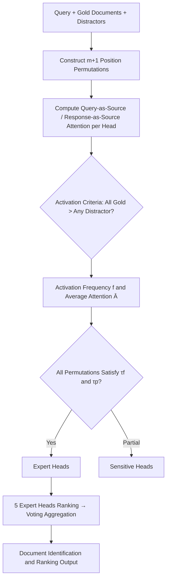

# Expert Heads: Robust Evidence Identification for Large Language Models

**Conference**: ICLR 2026  
**OpenReview**: [https://openreview.net/forum?id=rdKL5Uxyim](https://openreview.net/forum?id=rdKL5Uxyim)  
**Code**: [Xuan-Van/ExpertHead](https://github.com/Xuan-Van/ExpertHead)  
**Area**: Information Retrieval / Attention Interpretability  
**Keywords**: Attention Heads, Evidence Identification, Position Sensitivity, Document Ranking, Hallucination Detection  

## TL;DR
By analyzing attention distributions under document permutation perturbations, the authors identify a small subset of "Expert Heads" that consistently focus on gold documents regardless of their position. Using these heads' votes as a zero-shot signal for document retrieval and ranking significantly outperforms dense retrievers on HotpotQA, 2Wiki, and MuSiQue.

## Background & Motivation
**Background**: LLMs demonstrate strong multi-document reasoning (RAG, multi-hop QA) capabilities, yet they suffer from a notorious "position sensitivity" issue—evidence at the beginning or end of the context is noticed, while evidence in the middle is often ignored (i.e., "lost-in-the-middle"). Existing research primarily observes this phenomenon or uses external re-ranking, lacking a mechanistic characterization of which internal model components are responsible for identifying evidence.

**Limitations of Prior Work**: The authors trace the root of position sensitivity to the attention mechanism itself—numerous attention heads over-attend to sequence boundaries and fail to focus on critical content in the middle. If the overall attention is contaminated by position bias, naive evidence localization based on "which token has the highest attention" becomes unreliable.

**Key Challenge**: While attention is position-sensitive, models do occasionally reason correctly. This suggests that not all heads are biased by position—**certain heads must be position-immune and focused on task-relevant evidence**. The challenge lies in reliably identifying and utilizing these heads among hundreds or thousands of candidates.

**Goal**: To formally define and stably identify these "position-robust, gold-document-focused" attention heads, characterize their hierarchical patterns across different architectures, and verify their utility as interpretable, low-overhead signals for evidence identification and ranking.

**Core Idea**: (1) **Permutation Perturbation as a Probe**: Insert gold documents at different positions and track individual head activations; (2) **Strict Activation Criteria**: Require a head's attention on *all* gold documents to be higher than *any* distractor, rather than simply taking the top attention, to eliminate positional illusions; (3) **Cross-Permutation Stability Filtering**: Only heads satisfying the criteria across all permutations are promoted to "Expert Heads."

## Method

### Overall Architecture
Given a query, several distractors, and gold documents, the authors construct $m+1$ permutations by varying the insertion position of the gold documents. For each permutation and each head, they calculate average attention to documents from both a "Query-as-Source" and "Response-as-Source" perspective to determine "activation." Stability filtering is then performed using activation frequency and average attention across all permutations to differentiate between Sensitive Heads (satisfied in at least one permutation) and Expert Heads (satisfied in all). Finally, the 5 selected Expert Heads independently rank candidate documents by attention scores, which are aggregated via voting for the final document ranking.

### Key Designs

**1. Dual Perspective Attention: Decoupling "What is Seen" vs. "What is Used"**  
The authors recognize that evidence identification behaves differently during the "understanding phase" and the "generation phase." They define two source types for any document $D$. Query-as-Source measures the average attention from query tokens to a document $A^{(l,h)}_{Q\to D}=\frac{1}{|Q||D|}\sum_{q\in Q}\sum_{d\in D}A^{(l,h)}_{q,d}$, reflecting what the model deems important during context comprehension. Response-as-Source uses the generated response tokens $R$ as the source, capturing evidence actually utilized during answer generation. It was observed that Query-perspective heads are fewer and more concentrated (like a spotlight), while Response-perspective heads are more numerous and dispersed (like a floodlight).

**2. Strict Activation Criteria: Eliminating Positional Illusions**  
Instead of identifying heads with the highest attention, which are prone to boundary biases, the authors use a binary criterion: a head $(l,h)$ is "activated" under permutation $\pi$ if and only if its attention to *every* gold document is strictly greater than its attention to *any* distractor document: $A^{(l,h)}_{\text{src}\to G_j}>A^{(l,h)}_{\text{src}\to D_i},\ \forall j,\forall i$. This "win against all distractors" condition naturally excludes heads that show high attention merely because a document is at a sequence boundary.

**3. Frequency × Strength Statistics and Stability Filtering**  
Beyond the binary criterion, two statistics quantify a head's reliability: activation frequency $f^{(l,h)}_\pi=\frac{1}{|S|}\sum_{s\in S}\text{Activated}(l,h)^{\pi,s}_{\text{src}}$ measures consistency across samples, and average attention $\bar{A}^{(l,h)}_\pi$ measures focus on gold documents. Thresholds are set at $\tau_f=0.6$ (activation rate > 60%) and $\tau_p=0.9$ (attention in the top 10% percentile). A head is a Sensitive Head if it passes these thresholds in one permutation; it becomes an **Expert Head** only if it passes in **all permutations**.

**4. Expert Head Voting: Zero-Training Retriever**  
The identified Expert Heads serve as a zero-shot document ranker. For a given query and set of candidates, 5 Expert Heads each produce an independent ranking based on their Query-to-Candidate attention scores. These rankings are aggregated via voting. This process requires no parameter updates or additional training, making it highly efficient.

## Key Experimental Results

### Main Results
Document identification and ranking (P@2 / NDCG@2 / MAP) on multi-hop QA datasets (2 gold documents + 8 distractors). Results for LLaMA-3-8B and representative baselines:

| Method | HotpotQA P@2 | HotpotQA NDCG@2 | 2Wiki P@2 | MuSiQue P@2 |
|---|---|---|---|---|
| BM25 | 57.47 | 50.23 | 52.77 | 49.30 |
| BGE (Strongest Dense Baseline) | 75.23 | 69.45 | 77.12 | 70.25 |
| LLM Rank (Direct Ranking) | 66.31 | 70.06 | 76.49 | 69.63 |
| **Expert Heads (Q)** | 88.23 | 89.97 | 73.47 | 82.18 |
| **Expert Heads (R)** | **90.72** | **91.98** | 77.30 | 83.57 |

Response-perspective Expert Heads significantly outperform BGE and direct LLM ranking on HotpotQA (P@2 improved from 75.23 to 90.72). Similar trends were observed across Mistral and Qwen.

### Ablation Study
Layer and threshold ablations on LLaMA-3-8B / HotpotQA:

| Dimension | Finding |
|---|---|
| Layer-wise | Middle layers contribute most; lower layers are limited; **the last layer drops significantly** (model prepares for next token generation). |
| Threshold Sensitivity | Stricter thresholds result in fewer Expert Heads, but performance increases—filtering low-information heads preserves a more professional subset. |
| Head Count | Even a very small number of expert heads provides robust gains. |

### Key Findings
- **Architecture-Specific Hierarchy**: Expert Heads in LLaMA / Mistral are concentrated in middle layers (semantic integration), while in Qwen, they are located in deeper layers (evidence selection).
- **Activation Strength ↔ Answer Correctness**: Expert Heads activate more frequently and intensely when answers are correct; activation weakens and attention disperses during incorrect answers, leading to hallucinations.
- **Understanding vs. Generation Drift**: Query-perspective Expert Heads are a more focused subset of Response-perspective heads, indicating that the generation phase recruits a larger group of heads for evidence integration.

## Highlights & Insights
- **Mechanistic Characterization of Position Sensitivity**: By using permutation perturbations and universal quantifier stability filtering, the authors provide an operational definition of "position-immune heads."
- **Interpretability as a Zero-Training Retriever**: Voting by just 5 heads outperforms specialized retrievers like BGE and ColBERTv2 without any additional training.
- **Multi-Purpose Signal**: Expert Head activation serves as a ranking signal, a hallucination diagnostic, and can guide context pruning or RLHF reward design.
- **Strict Criteria Engineering**: The "all-gold-over-any-distractor" condition is significantly cleaner than naive top-attention for eliminating positional artifacts.

## Limitations & Future Work
- **Dependency on Gold Supervision**: Identification of Expert Heads relies on known gold/distractor labels. Unsupervised localization of these heads in real-world RAG scenarios remains an open problem.
- **Limited Scale and Task Variety**: Experiments were confined to a 2-gold + 8-distractor multi-hop QA setting. Stability in longer contexts or non-QA tasks needs verification.
- **Lack of End-to-End Downstream Verification**: The authors focused on retrieval/ranking metrics to isolate attention contributions; end-to-end improvements in final generation quality were mentioned but not exhaustively tested.
- **Manual Parameter Tuning**: Layer distribution varies by model; migrating to new architectures requires re-running permutation perturbation analysis.

## Related Work & Insights
- **Lost-in-the-middle / Position Sensitivity** (Liu et al. 2023): This work provides a mechanistic answer—it is not a total model failure, but rather a bias in the majority of heads while a minority remains immune.
- **Attention Head Anatomy** (Induction heads, retrieval heads): Expert Heads can be seen as a formalized, quantifiable version of "evidence retrieval heads."
- **Retrieval and Re-ranking**: Offers a new path for using a model's internal attention for retrieval without training, relevant for context pruning and RAG.
- **Hallucination Detection**: Using internal attention as a factuality diagnostic aligns with research on internal states, providing a more fine-grained signal.

## Rating
- Novelty: ⭐⭐⭐⭐ — Defining expert heads via permutation stability and using them as a zero-shot retriever is a self-consistent and novel approach.
- Experimental Thoroughness: ⭐⭐⭐⭐ — Main experiments across three models and three datasets are solid, though end-to-end QA validation and larger document scales are missing.
- Writing Quality: ⭐⭐⭐⭐ — Logical progression from phenomenon to definition to application; clear diagrams and well-explained criteria.
- Value: ⭐⭐⭐⭐ — High extrinsic value as the signal spans retrieval, hallucination detection, and context compression.

<!-- RELATED:START -->

## Related Papers

- [\[ICLR 2026\] MLP Memory: A Retriever-Pretrained Memory for Large Language Models](mlp_memory_a_retriever-pretrained_memory_for_large_language_models.md)
- [\[ICLR 2026\] TokMem: One-Token Procedural Memory for Large Language Models](tokmem_one-token_procedural_memory_for_large_language_models.md)
- [\[ICLR 2026\] Query-Level Uncertainty in Large Language Models](query-level_uncertainty_in_large_language_models.md)
- [\[ICLR 2026\] DeepRAG: Thinking to Retrieve Step by Step for Large Language Models](deeprag_thinking_to_retrieve_step_by_step_for_large_language_models.md)
- [\[ACL 2026\] How Large Language Models Balance Internal Knowledge with User and Document Assertions](../../ACL2026/information_retrieval/how_large_language_models_balance_internal_knowledge_with_user_and_document_asse.md)

<!-- RELATED:END -->
## Related Papers

- [\[ICLR 2026\] MLP Memory: A Retriever-Pretrained Memory for Large Language Models](mlp_memory_a_retriever-pretrained_memory_for_large_language_models.md)
- [\[ICLR 2026\] TokMem: One-Token Procedural Memory for Large Language Models](tokmem_one-token_procedural_memory_for_large_language_models.md)
- [\[ICLR 2026\] Query-Level Uncertainty in Large Language Models](query-level_uncertainty_in_large_language_models.md)
- [\[ICLR 2026\] DeepRAG: Thinking to Retrieve Step by Step for Large Language Models](deeprag_thinking_to_retrieve_step_by_step_for_large_language_models.md)
- [\[ACL 2026\] How Large Language Models Balance Internal Knowledge with User and Document Assertions](../../ACL2026/information_retrieval/how_large_language_models_balance_internal_knowledge_with_user_and_document_asse.md)

<!-- RELATED:END -->
