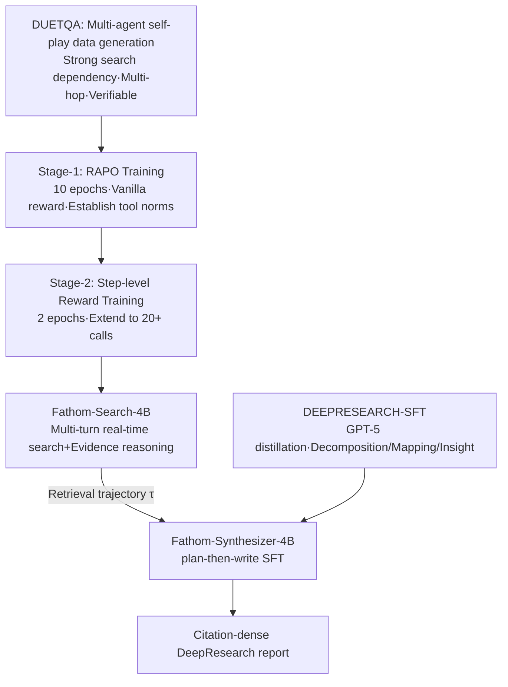

# Fathom-DeepResearch: Unlocking Long Horizon Information Retrieval and Synthesis for SLMs

**Conference**: ICLR 2026  
**OpenReview**: [https://openreview.net/forum?id=FS1KoskTtD](https://openreview.net/forum?id=FS1KoskTtD)  
**Code**: [https://github.com/FractalAIResearchLabs/Fathom-DeepResearch](https://github.com/FractalAIResearchLabs/Fathom-DeepResearch)  
**Area**: information retrieval / agentic RL  
**Keywords**: DeepResearch, tool-augmented RL, multi-turn retrieval, GRPO, step-level reward, report synthesis  

## TL;DR
An open-source DeepResearch system built using two 4B small models: Fathom-Search-4B handles multi-turn real-time web search and evidence reasoning (stably exceeding 20 tool calls), while Fathom-Synthesizer-4B synthesizes retrieval trajectories into citation-dense research reports. By utilizing the DUETQA dataset, RAPO optimization algorithm, and controllable step-level rewards, the system pushes open-source DeepSearch to levels approaching closed-source systems.

## Background & Motivation
- **Background**: Tool-integrated reasoning enables LLMs to autonomously call search engines and browse websites. DeepResearch agents have demonstrated superhuman performance in open-ended information retrieval, but leading systems like OpenAI/Gemini DeepResearch remain closed-source.
- **Limitations of Prior Work**: A significant gap exists between open-source frameworks and closed-source systems, centered on four points: (1) **Unstable GRPO training in multi-turn tool interaction**: Text returned by external tools causes policy distribution drift and decoding collapse, while saturation of intra-group relative advantage leads to gradient explosions; (2) **Reward hacking and inefficient tool calling**: Sparse rewards based only on final correctness cause agents to collapse into repetitive tool calls, and RL often merely amplifies SFT priors without providing controllability over cognitive behavior; (3) **Low information uncertainty in training data**: Datasets like TriviaQA/HotpotQA can be answered using model parameters or minimal queries, failing to expose agents to real network retrieval noise; (4) **Difficulty handling open-ended queries**: Existing work focuses on closed-set QA, lacking the ability to synthesize information for questions without standard answers requiring multi-perspective integration.
- **Key Challenge**: Enabling Small Language Models (SLMs) to be both "proactive in tool use" and "efficient" during long-horizon, high-uncertainty retrieval while avoiding the instability and tool-spamming induced by sparse rewards + GRPO.
- **Goal**: Construct an end-to-end open-source DeepSearch and synthesis system that stably extends tool calls to 20+, allows explicit control over exploration/verification behaviors, and provides open-ended report synthesis capabilities.
- **Core Idea**: **A "Data + Algorithm + Reward + Synthesis" Quadruplet**—generating search-dependent data via multi-agent self-play (DUETQA), stabilizing multi-turn RL with the zero-overhead RAPO algorithm, managing reward hacking and retrieval trade-offs with controllable step-level rewards, and transforming trajectories into cited reports via a "plan-then-write" synthesizer.

## Method

### Overall Architecture
The system consists of two specialized models trained from Qwen3-4B: **Fathom-Search-4B** (DeepSearch, performing evidence reasoning via real-time web search) and **Fathom-Synthesizer-4B** (synthesizing multi-turn retrieval trajectories into citation-dense reports). The Search model training integrates three advancements: DUETQA dataset $\rightarrow$ RAPO stabilized multi-turn RLVR $\rightarrow$ Two-stage step-level reward shaping. The Synthesizer model is distilled using the DEEPRESEARCH-SFT corpus following a plan-then-write protocol.

### Key Designs

**1. DUETQA: Generating "search-mandatory" data via multi-agent self-play.** Existing datasets are often bypassable via parametric knowledge or short-circuiting multi-hop reasoning. DUETQA uses three models to generate verifiable QA pairs: M1 (O3) and M2 (O4-mini) serve as proxy crawlers with search to generate questions and independent verifications; M3 (GPT-4o) acts as a search-less baseline verifier. Two generation modes are used: Mixture of Themes (sampling $k\in[5,7]$ themes from 200+ categories to chain facts) and Seeded Question (rewriting from a 100-question seed pool), mandating at least one hop citing information post-2024 to ensure $P(a\mid q, M_{\text{no-search}})\ll P(a\mid q, M_{\text{search}})$. A confusion pass is applied (coarsening dates, converting values to qualitative descriptors) to strip surface clues. Only samples where search-enabled models agree and the search-less baseline fails are kept. 4,889 high-quality samples were released.

**2. RAPO: Zero-overhead modification of GRPO to prevent multi-turn collapse.** In GRPO, the intra-group reward standard deviation $\sigma_R$ determines signal strength. When all rollouts in a group succeed (saturated) or fail (cascading error), $\sigma_R=0$, causing vanishing advantages and unstable updates. RAPO introduces three techniques without increasing rollout costs: **Dataset Pruning**—dropping questions with $\text{SolveRate}(q)=\frac{1}{G}\sum_i \mathbb{1}[R_i>0] \ge 0.9$ at the end of epochs to form a curriculum; **Advantage Scaling**—scaling token-level advantages of "good" groups inversely by frequency $\tilde A_{i,t}=\frac{G}{G_{\text{good}}}\hat A_{i,t}$ when information is sparse in a batch; and a **Replay Buffer**—maintaining recent successful trajectories ($R(q,o^\star)>0.5$) to re-inject variance if a current epoch fails entirely, anchoring the model to high-quality reference points.

**3. Controllable Step-level Rewards: Mitigating reward hacking and regulating behavior.** Vanilla rewards $r_i=0.1\cdot R_i^{\text{format}}+0.9\cdot R_i^{\text{answer}}$ only assess final correctness, inducing repetitive tool use. Ours makes the correctness branch dependent on "cognitive behavior + marginal utility" labels (classified by a GPT-4.1 judge): Search calls are split into UNIQUESEARCH / REDUNDANTSEARCH, and web queries into EXPLORATION / VERIFICATION (limited to $B_v$ times per claim) / REDUNDANTQUERY. Defining redundancy rate $\rho=\frac{n_{\text{redS}}+n_{\text{redQ}}}{T}$ and novelty increments $\Delta_S=n_{\text{uniqS}}-n_{\text{redS}}$, $\Delta_Q=n_{\text{uniqQ}}-n_{\text{redQ}}$, the reward is: if correct, $r_i=0.1 R_i^{\text{format}}+\max((1-\rho),0.5)$ (penalizing redundancy even if correct); if incorrect, $r_i=0.1 R_i^{\text{format}}+c_1\min(1,\frac{\Delta_S}{C_S})+c_2\min(1,\frac{\Delta_Q}{C_Q})$ (crediting genuine non-redundant exploration). We set $c_1=c_2=0.2$ to maintain **monotonicity** (incorrect rewards never exceed correct ones). $C_S, C_Q,$ and $B_v$ act as knobs to explicitly tune retrieval breadth, depth, and duration.

**4. Fathom-Synthesizer-4B: Plan-then-write for citation-dense reports.** Using SFT on Qwen3-4B, multi-hop trajectories are transformed into decision-level reports. The model first performs planning in a private `<think>` block $\pi=(\pi_{\text{decomp}},\pi_{\text{map}},\pi_{\text{insight}})$: decomposing the problem into sub-questions for the skeleton, mapping evidence (URLs/citations) to sections, and specifying insight strategies. It then generates the public report $r$ (Executive Summary + organized body + de-duplicated Sources). Citations are strictly limited to URLs explored during the Search phase and constrained by $\pi_{\text{map}}$ to improve accuracy. The DEEPRESEARCH-SFT corpus includes 2,500 open-ended questions distilled from GPT-5. Effective window size is extended to 65,536 tokens via YaRN RoPE scaling.

## Key Experimental Results

### Main Results
Accuracy (%) of Fathom-Search-4B across 5 DeepSearch benchmarks and 4 general reasoning benchmarks:

| Model | SimpleQA | FRAMES | WebWalker | Seal0 | Musique | DS Avg | HLE | AIME-25 | GPQA-D | MedQA | GR Avg |
|---|---|---|---|---|---|---|---|---|---|---|---|
| o3 (with search, closed) | 96.0 | 86.8 | 57.0 | 49.5 | 51.2 | **68.1** | 27.4 | 88.9 | 85.4 | 95.4 | 74.3 |
| GPT-4o (with search, closed) | 84.4 | 63.7 | 31.6 | 15.3 | 37.5 | 46.5 | 4.3 | 71.0 | 53.0 | 88.2 | 54.1 |
| WebSailor-3B | 87.1 | 44.4 | 52.2 | 9.0 | 27.4 | 44.0 | 7.4 | 40.0 | 45.5 | 51.3 | 36.0 |
| II-Search-4B | 88.2 | 58.7 | 40.8 | 17.1 | 31.8 | 47.3 | 7.4 | 60.0 | 51.5 | 72.1 | 47.8 |
| **Fathom-Search-4B (Stage-1)** | 88.1 | 57.2 | 39.0 | 19.8 | 31.3 | 47.1 | 6.7 | 60.0 | 55.6 | 75.4 | 49.4 |
| **Fathom-Search-4B (Stage-2)** | **90.0** | **64.8** | **50.0** | **22.5** | **33.2** | **52.1** | 9.5 | 70.0 | 60.1 | 75.4 | **53.8** |

On DeepResearch-Bench (open-ended report generation), Fathom-DeepResearch achieved an overall score of 45.47, surpassing Perplexity-DeepResearch (42.25) and Grok Deeper Search (40.24). Its Depth (45.14) is second only to Gemini-2.5-Pro DeepResearch.

### Ablation Study
RAPO vs. GRPO (Stage-1) and Step-level vs. Vanilla rewards (Stage-2):

| Configuration | SimpleQA | FRAMES | WebWalker | Seal0 | Avg. Tokens |
|---|---|---|---|---|---|
| GRPO | 87.8 | 55.2 | 33.8 | 14.4 | 9,000 |
| **RAPO** | 88.1 | 57.2 | 39.0 | **19.8** | **5,000** |
| Vanilla Reward (Stage-2) | 88.2 | 58.2 | 43.2 | 21.6 | 5,500 |
| **Step-level Reward (Stage-2)** | **90.0** | **64.8** | **50.0** | **22.5** | 14,500 |

### Key Findings
- **RAPO is accurate and efficient**: Compared to GRPO, Seal0 improved by 5.4 points while reducing average tokens from 9,000 to 5,000. While GRPO increases response length to spam redundant tool calls without gaining accuracy, RAPO remains stable and efficient.
- **Step-level rewards trade length for depth**: In Stage-2, tokens increased from 5,500 to 14,500, yielding substantial gains (+6.8 on WebWalker, +6.6 on FRAMES), representing "controlled long-horizon retrieval" rather than redundant bloat.
- **SLMs approach closed-source performance**: The system composed of two 4B models is SOTA among open-source models, approaching or exceeding GPT-4o (with search) on several metrics.

## Highlights & Insights
- **Explicitly decomposing reward hacking into cognitive behaviors**: Categorizing steps into UNIQUE/REDUNDANT × SEARCH/QUERY allows "exploration intent" to be scored, distinguishing effective retrieval from tool spamming.
- **Zero additional rollout cost for RAPO**: Pruning, scaling, and replaying are performed on existing rollouts, making the method easily applicable to any GRPO pipeline.
- **Three-knob controllable retrieval**: $C_S, C_Q, B_v$ allow researchers to explicitly tune the breadth, depth, and verification strength of retrieval, turning long-horizon tool use from a black box into a controllable variable.
- **Synthesis decoupled from retrieval**: Search generates trajectories while the Synthesizer generates reports; plan-then-write strictly anchors citations to explored URLs, balancing factuality and readability.

## Limitations & Future Work
- **Limited test-time scaling in RAPO**: The replay buffer anchors trajectories to prevent collapse but may hinder adaptation to even longer reasoning horizons; Stage-2 would saturate before 6,000 tokens without step-level rewards.
- **Fragile synchronous training pipelines**: Current reliance on synchronous training is inefficient at scale; shifting to an asynchronous framework is the proposed next step.
- **Judge dependency on strong models**: Step-level reward labels and training data rely on GPT-4.1/GPT-5, meaning distillation quality is capped by the teacher models.

## Related Work & Insights
- **DeepResearch Systems**: OpenAI/Gemini DeepResearch (closed benchmarks), Kimi-Researcher, Doubao-DeepResearch. Ours is a rare end-to-end "retrieval+synthesis" solution for the open-source community.
- **Tool RL / RLVR**: GRPO (Shao et al.), DAPO (Yu et al.), RECALL; this work directly addresses the instability of GRPO in multi-turn tool scenarios.
- **DeepSearch Data Synthesis**: WebSailor's SailorFog-QA. DUETQA uses multi-agent self-play with temporal constraints and cross-model verification to enforce search dependency.
- **Inspiration**: Reward design can be "behavior-level" rather than just "outcome-level." Labeling the marginal utility of intermediate steps is a generalizable strategy for managing reward hacking in long-horizon agents.

## Rating
- Novelty: ⭐⭐⭐⭐ The zero-overhead RAPO combination and "cognitive behavior + marginal utility" step-level rewards are highly targeted, and DUETQA's generation strategy is clever.
- Experimental Thoroughness: ⭐⭐⭐⭐ Extensive testing across 9 benchmarks + DeepResearch-Bench, with clear ablations and token efficiency analysis.
- Writing Quality: ⭐⭐⭐⭐ Logical flow from pain points to methodology; technical definitions of formulas and symbols are sound.
- Value: ⭐⭐⭐⭐ Entirely open-source (models+data+algorithm); highly valuable for reproducing and deploying high-performance DeepResearch systems.

<!-- RELATED:START -->

## Related Papers

- [\[ICLR 2026\] Long-Document QA with Chain-of-Structured-Thought and Fine-Tuned SLMs](long-document_qa_with_chain-of-structured-thought_and_fine-tuned_slms.md)
- [\[ICLR 2026\] AMemGym: Interactive Memory Benchmarking for Assistants in Long-Horizon Conversations](amemgym_interactive_memory_benchmarking_for_assistants_in_long-horizon_conversat.md)
- [\[ICLR 2026\] Improving Semantic Proximity in Information Retrieval through Cross-Lingual Alignment](improving_semantic_proximity_in_information_retrieval_through_cross-lingual_alig.md)
- [\[ACL 2026\] BRIEF-Pro: Universal Context Compression with Short-to-Long Synthesis for Fast and Accurate Multi-Hop Reasoning](../../ACL2026/information_retrieval/brief-pro_universal_context_compression_with_short-to-long_synthesis_for_fast_an.md)
- [\[ICLR 2026\] Beyond RAG vs. Long-Context: Learning Distraction-Aware Retrieval for Efficient Knowledge Grounding](beyond_rag_vs_long-context_learning_distraction-aware_retrieval_for_efficient_kn.md)

<!-- RELATED:END -->
