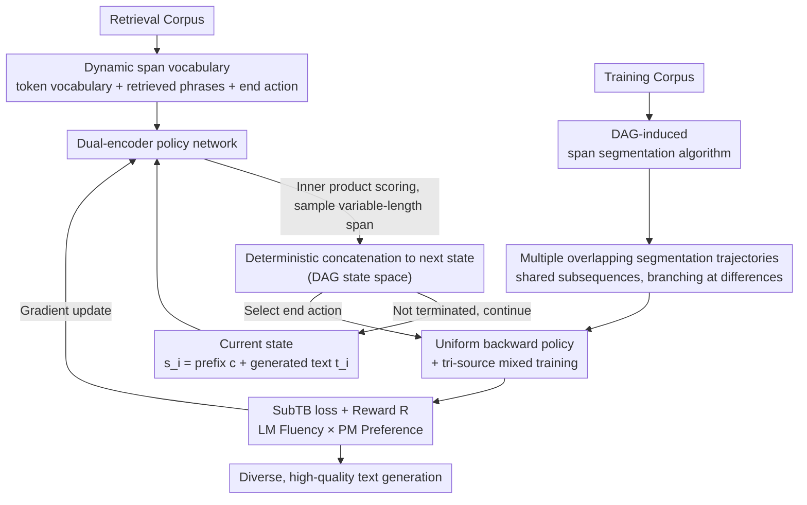

# Flow of Spans: Generalizing Language Models to Dynamic Span-Vocabulary via GFlowNets

**Conference**: ICLR 2026  
**arXiv**: [2602.10583](https://arxiv.org/abs/2602.10583)  
**Code**: [GitHub](https://github.com/sappho-x/Flow-of-Spans)  
**Area**: Information Retrieval  
**Keywords**: GFlowNets, Dynamic Vocabulary, span generation, DAG state space, text generation

## TL;DR

Ours proposes FoSS, which introduces GFlowNets to span-level language models for the first time. By constructing a DAG-structured state space to replace the traditional token-by-token tree structure, it achieves more flexible and diverse text generation, with MAUVE scores improving by up to 12.5%.

## Background & Motivation

Standard autoregressive language models generate text token-by-token using a fixed, finite vocabulary. This approach has two inherent limitations: (1) a fixed vocabulary restricts the granularity of generation; (2) token-level generation forms a tree-like state space (where each state has only one unique predecessor), limiting the ability of the model to explore alternative generation paths.

Recent works have introduced dynamic vocabularies and variable-length generation units (e.g., CoG, kNN-LM), allowing the model to sample retrieved text spans. However, these methods overlook a crucial fact: the same sentence can be composed of different combinations of span lengths (e.g., "ABCDEFGH" can be decomposed into "AB-CD-EFGH" or "AB-C-DE-FG-H"), which inherently constitutes a Directed Acyclic Graph (DAG) structure rather than a tree structure. Existing methods do not explicitly model this DAG space, resulting in limited exploration of combinatorial paths.

GFlowNets are powerful generative models that excel at efficient exploration and generalization within DAG-structured state spaces. However, previous work applying GFlowNets to language models remained in the token-level tree space, failing to realize the full potential of GFlowNets.

## Method

### Overall Architecture

FoSS redefines text generation as GFlowNets sampling on a Directed Acyclic Graph (DAG): each state is a concatenation of a prefix $c$ and the already generated text $t_i$. Each step selects a variable-length segment (word or multi-word phrase) from a dynamic span vocabulary and deterministically appends it to the end until a termination action is chosen, after which a reward model scores the terminal text. The key difference is that span-level actions allow the same state to be reached via multiple different trajectories—for example, the state "ABCD" can be reached via "AB→ABCD" or "AB→ABC→ABCD"—thereby upgrading the state space from a degenerate token-level tree to a true DAG, allowing GFlowNets to explore multiple equivalent combinatorial paths fully.

To make this DAG sampling trainable, FoSS completes three components: a **DAG-induced span segmentation algorithm** to segment training text into multiple overlapping trajectories, injecting supervision signals with branching into the DAG; a **dual-encoder policy network** to score candidate spans in the dynamic vocabulary via inner products at each step to determine which edge the state follows; and a **uniform backward policy + tri-source mixed training** strategy to make the existence of multiple incoming edges for a state a learnable objective, ensuring stable exploration in a massive combinatorial space. These three components are ultimately paired with rewards for LM fluency and PM preference, optimized end-to-end using Sub-trajectory Balance (SubTB).

### Key Designs

**1. DAG-induced span segmentation algorithm: Expanding training text into multiple overlapping trajectories**

The prerequisite for DAG exploration is that the training data itself contains branches. On top of standard forward maximum matching, FoSS adds a controlled random early stop: when scanning candidate phrases, each span determines whether to be extracted as a whole phrase with probability $p_r$, or to continue being segmented. Given a set of thresholds $P = \{p_0{=}0, p_1, \dots, p_n\}$, the same document is segmented into multiple trajectories of varying lengths (e.g., "AB-CD-EFGH" and "AB-C-DE-FG-H"). They share common subsequences but branch at different positions, naturally inducing a DAG structure rather than a single-path tree. This step explicitly incorporates the ignored fact that "the same sentence has multiple span combinations" into the training signal.

**2. Dual-encoder policy network: Matching context and candidate spans via inner product**

The forward policy scores all candidates in the dynamic vocabulary at each step. FoSS uses two encoders for this task. The prefix encoder is a causal attention Transformer (initialized from GPT-2) that encodes the current state into a context vector $h_i$. The span encoder is a bidirectional Transformer (initialized from BERT) that encodes candidate phrases into vectors $v_a$. For a phrase from position $s$ to $e$ in a retrieved document, the start and end position embeddings are transformed by an MLP and concatenated to form the complete phrase representation. The forward policy distribution is defined as $P_{\text{SLM}}(a \mid s_i; \theta) \propto \exp(h_i^\top v_a)$, using the inner product of context and candidate to measure compatibility. Candidates come from a dynamic vocabulary composed of three sources: a fixed token-level vocabulary $V$, a set of phrases $T$ of length 2–8 tokens retrieved from an external corpus, and the termination action. Replacing the retrieval database updates the vocabulary, which is the root of the domain adaptation achieved by simply swapping the retrieval source.

**3. Uniform backward policy + tri-source mixed training: Learning from multiple incoming edges in a DAG**

Because a state in a DAG can have multiple incoming edges, the backward policy is no longer deterministic as in a tree ($P_B{=}1$), but instead assigns uniform probabilities to all possible suffixes of that state under the dynamic vocabulary—this is where the model perceives that "multiple paths lead to the same text." During training, a mini-batch mixes trajectories from three sources: those sampled online by the forward policy, high-reward trajectories from a reward-prioritized replay buffer, and trajectories constructed from the training set. The first epoch uses offline data to cold-start, after which offline and online trajectories are mixed at a ratio of 0.2/0.8 to balance exploration coverage and the exploitation of high-reward regions.

### Loss & Training

The learning objective utilizes Sub-trajectory Balance (SubTB): for a complete trajectory, the loss is summed over all valid sub-trajectory pairs and constrained by an indicator function to be calculated only between complete sentence boundaries. This concentrates learning signals on meaningful sentence transitions, avoiding wasted effort on partial spans. The reward consists of a weighted geometric mean of two complementary terms: the Language Model (LM) term measures fluency via the likelihood of a sequence given a prefix, and the Preference Model (PM) term is a discriminator trained with a Bradley-Terry objective and score-centering regularization to distinguish between human text and model-generated text. The weight $\alpha$ adjusts the trade-off between fluency and preference alignment. Both LM and PM are based on GPT-2 with full-parameter fine-tuning. Subsequent ablations show that removing either term results in a drop in MAUVE, confirming their respective roles in "readability" and "human-likeness."

## Key Experimental Results

### Main Results

**Table 1: Open-domain text generation MAUVE scores**

| Method | In-Domain Greedy | In-Domain Nucleus | OOD Nucleus | Scaling Nucleus |
|------|:---:|:---:|:---:|:---:|
| Transformer w/ FT | 19.87 | 23.43 | 26.85 | 21.31 |
| kNN-LM | 19.92 | 22.50 | 24.75 | 23.39 |
| CoG | 26.01 | 26.14 | 28.14 | 26.97 |
| GFlowNets-FT | 26.58 | 29.61 | 28.62 | - |
| **FoSS** | **30.78** | **31.65** | **32.17** | **33.79** |

FoSS leads across the board, scoring 5.51% higher than CoG and 2.04% higher than GFlowNets-FT in In-Domain Nucleus.

**Table 2: GPT-4 Pairwise Evaluation (FoSS vs. baselines)**

| Comparison Method | FoSS Better | Tie | FoSS Worse |
|----------|:---:|:---:|:---:|
| Transformer | 53% | 19% | 28% |
| kNN-LM | 67% | 15% | 18% |
| CoG | 42% | 31% | 27% |
| GFlowNets-FT | 55% | 29% | 16% |

**Table 3: Accuracy on knowledge-intensive tasks**

| Method | TruthfulQA | OpenBookQA | ARC-Challenge |
|------|:---:|:---:|:---:|
| Transformer w/ FT | 28.76 | 22.71 | 24.00 |
| CoG | 29.38 | 24.29 | 24.34 |
| **FoSS** | **30.45** | **26.20** | **24.63** |

### Ablation Study

| Variant | In-Domain MAUVE | Diversity | OOD MAUVE |
|------|:---:|:---:|:---:|
| FoSS w/o DAG (degenerated to tree) | 29.61 | 65.72 | 28.62 |
| FoSS w/o PM | 28.25 | 89.91 | 30.49 |
| FoSS w/o LM | 29.09 | 92.77 | 29.79 |
| **FoSS (Full)** | **31.65** | 92.48 | **32.17** |

### Key Findings

1. **DAG structure is essential**: After removing the span structure and making the state space degenerate into a tree, MAUVE drops significantly (31.65 to 29.61), and Diversity plummets from 92.48 to 65.72.
2. **Complementary LM and PM rewards**: Removing either component individually leads to a decrease in MAUVE; PM-only yields the highest Diversity but sees a significant drop in MAUVE.
3. **Excellent scalability**: Performance gains remain stable across model scales (GPT-2 base to XL), training data volume, and retrieval database size.
4. **Domain adaptation capability**: Updating only the retrieval database allows Ours to outperform in-domain fine-tuned Transformers; with just 0.47% of the data, it surpasses fully trained CoG.

## Highlights & Insights

- First to combine span-level generation with GFlowNets, constructing a true DAG state space.
- A probabilistic span segmentation algorithm generates multiple overlapping paths for the same text via random early stops.
- Inference efficiency is comparable to standard Transformers because span-level generation reduces the number of decoding steps.
- Surpasses fully trained baseline methods with as little as 0.47% of training data.

## Limitations & Future Work

1. Experiments are primarily based on GPT-2 scale; performance on larger-scale LLMs remains unclear.
2. Dependence on an external retrieval database requires pre-encoding source text collections, increasing deployment complexity.
3. Training involves multiple components (policy network, reward model, retriever), making the workflow relatively complex.
4. Evaluated only on English tasks; cross-lingual generalization capability is unknown.

## Related Work & Insights

This paper combines the DAG exploration capabilities of GFlowNets with dynamic vocabulary language models, serving as a novel intersection. It provides reference value for research into LLM generation diversity and retrieval-augmented generation. The idea of span-level generation can also inspire draft strategy designs in speculative decoding.

## Rating

- Novelty: ⭐⭐⭐⭐⭐ (First DAG + GFlowNets construction in span-level LM)
- Technical Depth: ⭐⭐⭐⭐⭐ (Complete MDP formalization + SubTB training + Dual-component rewards)
- Experimental Thoroughness: ⭐⭐⭐⭐ (Multi-dimensional evaluation + GPT-4 judgment + Ablation + Scalability)
- Practicality: ⭐⭐⭐ (Dependency on retrieval database, higher deployment hurdle)
- Writing Quality: ⭐⭐⭐⭐ (Clear structure, intuitive diagrams)

<!-- RELATED:START -->

## Related Papers

- [\[ICLR 2026\] Query-Aware Flow Diffusion for Graph-Based RAG with Retrieval Guarantees](query-aware_flow_diffusion_for_graph-based_rag_with_retrieval_guarantees.md)
- [\[ICLR 2026\] Graph-based Nearest Neighbors with Dynamic Updates via Random Walks](graph-based_nearest_neighbors_with_dynamic_updates_via_random_walks.md)
- [\[ICLR 2026\] Expert Heads: Robust Evidence Identification for Large Language Models](expert_heads_robust_evidence_identification_for_large_language_models.md)
- [\[ICLR 2026\] MLP Memory: A Retriever-Pretrained Memory for Large Language Models](mlp_memory_a_retriever-pretrained_memory_for_large_language_models.md)
- [\[ICLR 2026\] TokMem: One-Token Procedural Memory for Large Language Models](tokmem_one-token_procedural_memory_for_large_language_models.md)

<!-- RELATED:END -->
