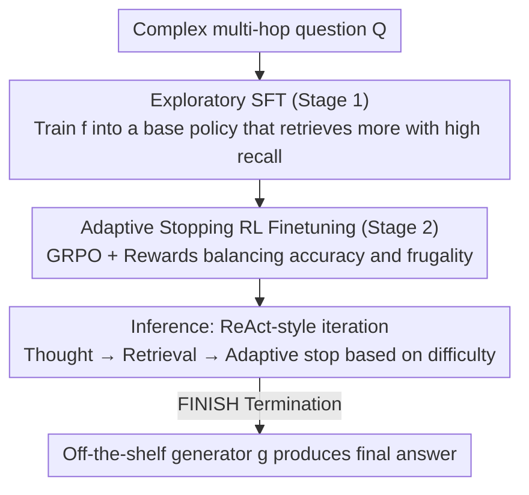

# FrugalRAG: Less is More in RL Finetuning for Multi-hop Question Answering

**Conference**: ICLR 2026  
**OpenReview**: [https://openreview.net/forum?id=uQKtwdJN0o](https://openreview.net/forum?id=uQKtwdJN0o)  
**Code**: To be confirmed  
**Area**: Information Retrieval / RAG / Multi-hop Question Answering  
**Keywords**: Retrieval-Augmented Generation, Multi-hop QA, Reinforcement Learning Finetuning, Adaptive Retrieval, Test-time Compute

## TL;DR
FrugalRAG proposes a two-stage "Explore-then-Frugal" finetuning framework: the first stage uses supervised finetuning (SFT) to transform a small model into an exploratory policy that maximizes evidence recall through multiple retrieval queries; the second stage applies GRPO reinforcement learning (RL) to teach the model to "decide when to stop based on question difficulty." Consequently, on multi-hop QA tasks like HotPotQA, it reduces the number of retrievals by nearly half using only 1,000 training samples while maintaining or even improving answer accuracy.

## Background & Motivation
**Background**: The dominant paradigm for multi-hop question answering (multi-hop QA) is Retrieval-Augmented Generation (RAG)—the language model decomposes complex questions into a sequence of sub-queries, retrieving a batch of documents for each, and reasoning to generate the next sub-query iteratively until the original question can be answered. Recent works such as DeepSeek-R1 have applied RL to reasoning-heavy tasks like mathematics and coding with great success, naturally prompting attempts to port the "reward based on final answer" RL approach to RAG.

**Limitations of Prior Work**: The authors observe that this path yields diminishing returns for multi-hop QA. A naive ReAct strategy (allowing up to 10 sub-queries) achieves higher document recall (63%) on HotPotQA than SOTA RL methods like Search-R1. This implies the bottleneck in multi-hop QA is not "insufficient reasoning steps," but rather that "retrieval steps are not used efficiently." Most questions ideally require only 2-3 retrievals, yet existing RL methods either use rigid fixed budgets or blindly increase retrieval steps, lengthening latency. More critically, data costs are prohibitive: methods like SelfRAG, CoRAG, and Search-R1 require 90k–100k annotated QA samples, which are virtually unobtainable in real-world business scenarios (e.g., private document repositories).

**Key Challenge**: There is a direct trade-off between coverage (higher recall generally requires more retrievals) and efficiency (fewer retrievals mean lower latency). Existing RL methods attempt to optimize both objectives in a single end-to-end target, leading to unstable training—the model either over-retrieves or terminates too early.

**Goal**: (1) Train a model that retrieves on-demand, answering correctly with minimal queries; (2) Use only 1,000 training samples (an order of magnitude fewer than prior work); (3) Avoid reliance on final answer annotations, using only ground-truth documents for supervision.

**Key Insight**: The authors observe that "coverage" and "knowing when to stop" should be learned through different means. Coverage can be achieved by allowing the base model to issue high-quality queries repeatedly (via the ReAct framework) without RL. Conversely, "when to stop" involves comparison and trade-offs between different rollout lengths—a task where RL signals excel.

**Core Idea**: Decouple RAG into an "Exploration Stage" and an "Answer Generation" stage. Use RL not to increase reasoning steps, but to optimize them—first SFT an exploratory base policy with high recall, then apply RL to learn self-adaptive pruning of redundant retrieval depth.

## Method

### Overall Architecture
The core agent in FrugalRAG is a "reasoner" language model $f$. Given a complex question $Q$, at step $h$ ($1 \le h \le B$, where $B$ is the maximum budget), $f$ observes the current context and outputs a "Thought-Action-Query" triplet $(T_h, A_h, S_h)$. The query $S_h$ is sent to the retriever $R(\cdot)$, which returns documents $D_h = R(S_h)$. The context accumulates $\{Q\} \cup \{(D_h, T_h, A_h, S_h)\}$ until $f$ outputs a special FINISH action to terminate at jump $h_{\text{term}}$ (or reaches budget $B$). After termination, a **separate, off-the-shelf, non-trainable** generator $g$ produces the final answer based on $Q$ and the accumulated context. Decoupling the reasoner ($f$) from the generator ($g$) ensures that performance gains are attributed to the retrieval strategy itself rather than implicit training of the generator.

Training proceeds in two sequential stages: **Stage 1 (Exploration)** uses SFT to train $f$ into a base policy $f_S$ that maximizes evidence coverage; **Stage 2 (Frugality)** uses GRPO RL on top of $f_S$ to teach it to "stop once evidence is sufficient," thereby adaptively allocating retrieval steps based on difficulty. Training only requires ground-truth documents $Y$ (used to calculate recall as feedback), not final answer annotations.

### Key Designs

**1. Decoupled "Exploration → Frugality": Separating Coverage and Termination**

The authors split multi-hop RAG into two distinct tasks and argue they require different learning approaches. Forcing them into a single RL objective leads to failure (observed as models either over-retrieving or stopping too early). "Coverage" is a deterministic goal—as long as the base model is allowed to issue queries repeatedly, recall will increase; thus, SFT is sufficient. "When to stop," however, requires weighing the cost of an extra retrieval against the current evidence confidence, comparing the quality of different rollouts. This decision-making process involving comparisons and long-term rewards is naturally suited for RL. SFT builds a high-recall baseline, and RL then performs "subtraction" on it. This is the essence of "Less is More": using RL to optimize (prune) steps rather than adding them.

**2. Stage 1 Exploratory SFT: Training a High-Recall Base Policy**

To address "over-confidence" where models stop without sufficient exploration, Stage 1 prioritizes recall over efficiency. Data is constructed by performing ReAct-style rollouts: at each step, $n$ bootstrapped prompts sample $n$ candidate triplets $(T_h^i, A_h^i, S_h^i)$. After retrieving and deduplicating documents against the context, the candidate with the highest recall relative to ground-truth labels is added to the next step's context. A key technique involves two types of runs: one allowing the model to generate FINISH to end early, and another forbidding FINISH until the budget $B$ is filled. The latter yields higher recall but lacks the "when to stop" signal. Therefore, SFT uses a mix of **90% no-FINISH + 10% FINISH** trajectories. This ensures the model learns the exploration/recall distribution while keeping the FINISH action within the output distribution for the next stage. Stage 1 only uses 1,000 samples.

**3. Stage 2 Adaptive Stopping RL Reward: Punishment and Reward based on Optimal Stop Points**

This is the core design for deciding at which step to stop. The authors define the **optimal stopping point** $h^*$: given a full rollout from $f_S$, $h^*$ is the smallest step where document recall $c$ first reaches threshold $\tau$ (the inflection point where further retrieval yields no gain). Normalized deviation is defined as:

$$\Delta = \frac{|h_{\text{term}} - h^*|}{B}$$

The reward is segmented into three cases (Eq. 1): If recall is met ($c \ge \tau$) but the model stops late ($\Delta > 0$), it is penalized by $\log\frac{1-\Delta}{\Delta}$ (clipped to $[-R_{\max}, R_{\max}]$). A perfect stop at $h^*$ ($\Delta = 0$) receives a reward $R_{\max} + \alpha \cdot \frac{h^*}{B}$—the bonus is proportional to $h^*/B$, meaning harder questions requiring more steps get higher rewards for stopping accurately. If recall is not met ($c < \tau$, early stop), $h_{\text{term}}$ is set to $B$ to encourage continued exploration. Rewards decrease monotonically with $|\Delta|$ and peak at $h_{\text{term}} = h^*$. A **format reward** $R_f$ is also added ($-0.5$ for failed retrieval due to formatting, $+0.5$ for success), averaged per step. **GRPO** is used for optimization, sampling $v$ triplets per step. This reward explicitly models efficiency as an optimizable goal without needing final answer labels.

**4. Data Efficiency and Generator Decoupling: 1,000 Samples + Ground-truth Docs**

By using recall as feedback, FrugalRAG eliminates the need for "question → answer" annotations. Only ground-truth documents $Y$ are needed, and the two stages combined use only 1,000 samples—orders of magnitude fewer than SelfRAG (150k) or Search-R1 (>100k). Decoupling the generator $g$ ensures that gains are attributable to the retrieval strategy rather than generator finetuning. Experiments show that swapping generators (e.g., Qwen2.5-7B → 32B) further improves performance, confirming modularity and transferability.

### Mechanism
In HotPotQA, the base policy $f_S$ typically issues ~6 queries (FrugalRAG-Explore searches $\approx 5.99$), yielding high recall (86.4%) but high latency. After Stage 2 RL, the model learns to output FINISH at the step where recall hits $\tau$ ($h^*$). Average retrievals drop to ~2.05, and while recall slightly dips to 82.8%, MBE (Accuracy) actually increases from 67.70 to 68.47. For harder questions (e.g., 4-hop questions in MuSiQue), the $\frac{h^*}{B}$ bonus encourages more queries and later stops. On the 2Wiki dataset, retrieval frequency correlates strongly with difficulty ($r=0.82$).

### Loss & Training
- **Stage 1**: Standard cross-entropy to predict the $(T_h, A_h, S_h)$ triplet; full-parameter finetuning for 1 epoch, learning rate $2\times10^{-5}$, weight decay 0.01, max sequence length 4096, 1000 samples.
- **Stage 2**: GRPO; Total Reward = average of main reward $R$ (Eq. 1) and format reward $R_f$. Range: $[-R_{\max}-0.5,\, R_{\max}+\alpha+0.5]$.
- Base model: Qwen2.5-7B-Instruct; TRL library; prompt bootstrapping based on DsPy.

## Key Experimental Results

### Main Results
Using ColBERTv2 retriever and Qwen2.5-7B-Instruct as generator, Stage 2 RL halves retrieval count while slightly improving accuracy:

| Method | Dataset | MBE | Recall | Avg. Searches |
|------|--------|------|--------|--------------|
| Zero-Shot RAG | HotPotQA | 51.00 | 59.05 | 1 |
| ReAct + DsPy | HotPotQA | 64.20 | 79.60 | 2.76 |
| FrugalRAG-Explore 7B | HotPotQA | 67.70 | 86.40 | 5.99 |
| **FrugalRAG 7B** | HotPotQA | **68.47** | 82.80 | **2.05** |
| FrugalRAG-Explore 7B | 2Wiki | 47.60 | 68.90 | 5.99 |
| **FrugalRAG 7B** | 2Wiki | **48.93** | 63.50 | **2.95** |
| FrugalRAG-Explore 7B | MuSiQue | 30.10 | 59.10 | 5.93 |
| **FrugalRAG 7B** | MuSiQue | **33.72** | 54.00 | **3.02** |

Comparison using E5-base-v2 against 14 SOTA baselines (HotPotQA): FrugalRAG with only 1k samples outperforms methods using 8k-100k+ samples:

| Method | # Training Samples | MBE | Recall | Searches |
|------|-----------|------|--------|----------|
| R1-Searcher | 8k | 57.66 | 69.10 | 2.22 |
| Search-R1 | >100k | 46.20 | 48.20 | 1.28 |
| CoRAG | >100k | 58.20 | 64.30 | 4.00 (Fixed) |
| **FrugalRAG-7B + Qwen2.5-7B** | **1000** | 58.5 | **70.40** | 2.89 |
| **FrugalRAG-7B + Qwen2.5-32B** | **1000** | **61.4** | **70.40** | 2.89 |

### Ablation Study
Comparing Efficiency Tradeoff $\text{Eff} = (\text{MBE}+\text{Recall})/(2\times\text{Searches})$:

| Configuration | HotPotQA Eff | 2Wiki Eff | MuSiQue Eff | Description |
|------|--------------|-----------|-------------|------|
| SFT (with FINISH) | 35.65 | 17.93 | 12.54 | Learn to stop via SFT, no Stage 2 RL |
| FrugalRAG-Explore | 12.87 | 9.73 | 7.52 | Exploration only, no budget control |
| **FrugalRAG (Full)** | **36.90** | **19.05** | **14.52** | Optimal two-stage efficiency |

### Key Findings
- **Stage 2 RL is the primary efficiency driver**: Removing it (FrugalRAG-Explore) causes searches to spike to ~6 and Eff to plummet. While SFT-with-FINISH is decent, the full version is consistently better across all datasets.
- **Quantifiable Adaptivity**: Retrieval count correlates strongly with difficulty ($r=0.82$ for 2Wiki, $r=0.95$ for MuSiQue), proving the model allocates compute based on need.
- **Zero-shot Generalization to Deep Retrieval**: On BrowseComp-Plus (harder), FrugalRAG-7B (trained on HotPotQA) achieved 20.46% accuracy, **surpassing DeepSeek-R1 600B (16.39%) and Search-R1-32B (11.08%)**. It adaptively increased queries to 7-10, whereas Search-R1 failed to scale, highlighting the robustness of the reward design.

## Highlights & Insights
- **Perspective Shift**: The shift from "using RL to add steps" to "using RL to optimize (reduce) steps" is sharp. By recognizing that ReAct's recall already exceeds SOTA RL, the authors pivot RL's role to pruning, making efficiency an explicit optimization target.
- **Division of Labor**: Using SFT for coverage and RL for termination is a brilliant modular approach. It solves the training instability of a single goal by using the most suitable tool for each sub-problem.
- **Bypassing Answer Labels**: Building rewards on recall thresholds $\tau$ and optimal stop points $h^*$ avoids expensive answer labeling, making this highly attractive for private domain RAG deployments.
- **Clean Attribution**: The frozen generator $g$ ensures results are purely due to the adaptive retrieval strategy, providing high experimental integrity.

## Limitations & Future Work
- **Dependency on Ground-truth Docs**: Reward calculation depends on $h^*$ and $\tau$ derived from ground-truth evidence $Y$. If ground-truth documents are also hard to obtain, this feedback loop breaks.
- **Sacrifice in Recall**: Stage 2 generally sees a small recall dip (e.g., 86.4 → 82.8 on HotPotQA) to achieve efficiency gains. In scenarios where recall is more critical than accuracy, this trade-off may be less desirable.
- **Caveat in Comparisons**: Since retrievers, generators, and sample sizes vary across baselines, MBE/Recall comparisons should be viewed in context (e.g., CoRAG uses >100k samples vs. FrugalRAG's 1,000).
- **Future Directions**: Replacing recall-based rewards with direct answer utility or using self-consistency to estimate $h^*$ in the absence of ground-truth docs could further reduce annotation dependencies.

## Related Work & Insights
- **vs Search-R1 / R1-Searcher**: These use end-to-end RL for final answers, often resulting in "over-retrieval" and high latency without adaptation to difficulty. FrugalRAG uses RL specifically for "when to stop" and requires far less data.
- **vs CoRAG**: CoRAG uses >100k samples and fixed budgets, making it inefficient for simple questions and inflexible for difficult ones. FrugalRAG adapts per question with 1,000 samples.
- **vs LeReT**: LeReT uses preference optimization on hundreds of thousands of docs; FrugalRAG allows for variable jumps and adapts to problem complexity.

## Rating
- Novelty: ⭐⭐⭐⭐⭐ Decoupling "SFT for coverage" and "RL for pruning" is a novel and effective perspective.
- Experimental Thoroughness: ⭐⭐⭐⭐☆ Extensive benchmarks and generalization tests; the recall-accuracy trade-off could be further explored.
- Writing Quality: ⭐⭐⭐⭐☆ Clear motivation and reward formulation.
- Value: ⭐⭐⭐⭐⭐ Exceptional value for private domain RAG due to low data requirement and high efficiency.

<!-- RELATED:START -->

## Related Papers

- [\[AAAI 2026\] REAP: Enhancing RAG with Recursive Evaluation and Adaptive Planning for Multi-Hop Question Answering](../../AAAI2026/information_retrieval/reap_enhancing_rag_with_recursive_evaluation_and_adaptive_planning_for_multi-hop.md)
- [\[ICML 2026\] Less Is More: Elevating RAG via Performance-Driven Context Compression](../../ICML2026/information_retrieval/less_is_more_elevating_rag_via_performance-driven_context_compression.md)
- [\[ICLR 2026\] Demystifying Deep Search: A Holistic Evaluation with Hint-free Multi-Hop Questions and Factorised Metrics](demystifying_deep_search_a_holistic_evaluation_with_hint-free_multi-hop_question.md)
- [\[ICLR 2026\] MergePRAG: Orthogonal Merging of Passage-experts for Multi-hop Parametric RAG](mergeprag_orthogonal_merging_of_passage-experts_for_multi-hop_parametric_rag.md)
- [\[ACL 2026\] ChatR1: Reinforcement Learning for Conversational Reasoning and Retrieval Augmented Question Answering](../../ACL2026/information_retrieval/chatr1_reinforcement_learning_for_conversational_reasoning_and_retrieval_augment.md)

<!-- RELATED:END -->
