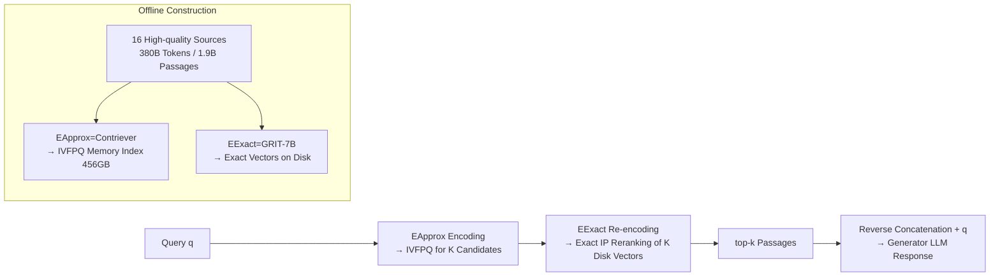

# Frustratingly Simple Retrieval Improves Challenging, Reasoning-Intensive Benchmarks

**Conference**: ICLR 2026  
**OpenReview**: [https://openreview.net/forum?id=9lPq01iKOV](https://openreview.net/forum?id=9lPq01iKOV)  
**Code**: [CompactDS-102GB / compactds-retrieval](https://huggingface.co/datasets/alrope/CompactDS-102GB)  
**Area**: Information Retrieval / Retrieval-Augmented Generation (RAG)  
**Keywords**: Retrieval-Augmented Generation, Reasoning-Intensive Benchmarks, Web-scale Datastore, Two-stage Dense Retrieval, ANN + Exact Search  

## TL;DR
The authors construct COMPACTDS, a high-quality datastore with 380B tokens that enables sub-second retrieval using 456GB of memory on a single machine. They demonstrate that a "frustratingly simple" minimal RAG pipeline consistently delivers significant gains (up to 33% relative improvement) on reasoning-intensive benchmarks such as MMLU, MMLU Pro, GPQA, and MATH, rivaling or exceeding Google Search and complex agentic RAG systems.

## Background & Motivation
**Background**: Retrieval-Augmented Generation (RAG) has been highly successful in factoid QA—retrieving specific facts from curated knowledge bases like Wikipedia and feeding them to the model. However, most RAG benchmarks (Natural Questions, TriviaQA, etc.) are designed around "fact-checking" and often use search engines as oracles.

**Limitations of Prior Work**: Beyond factoid QA, the value of retrieval remains questionable. Several prior works (BehnamGhader 2022, Geng 2024) even report that retrieval is "unhelpful or even harmful" for reasoning-intensive tasks. To bridge this gap, recent work has shifted toward agentic RAG—either relying on commercial search engines (expensive, non-reproducible, unstable) or remaining confined to Wikipedia datastores (too narrow in coverage).

**Key Challenge**: The authors attribute this issue to an overlooked factor: **the lack of an accessible, web-scale datastore aligned with the breadth of pre-training data**. Previous datastores were either too narrow (Wikipedia cannot cover general benchmarks like MMLU/GPQA) or too large to be practical (MASSIVEDS requires 12TB of RAM and multi-minute latency, making it inaccessible to academic institutions). In other words, retrieval is not useless; rather, no one has provided a "broad yet runnable" library for reasoning tasks.

**Goal**: How high can the performance on reasoning-intensive benchmarks be pushed without introducing any fancy agentic mechanisms (using only the minimal "dense retrieval + generation" pipeline)?

**Core Idea**: **① Aggressive filtering of web text**—most web content can be filtered without losing coverage, as a compact high-quality subset suffices; **② Two-stage retrieval**—running Approximate Nearest Neighbor (ANN) in memory to get candidates, followed by exact inner product search on disk for re-ranking, balancing speed and recall. Together, these result in COMPACTDS, the first truly single-machine deployable web-scale datastore.

## Method

### Overall Architecture
COMPACTDS revolves around "how to select data" and "how to retrieve quickly and accurately." In the offline stage, documents from 16 high-quality sources are segmented into 256-token passages (1.9B total). A lightweight encoder $E_{Approx}$ is used to build an IVFPQ memory index, while a strong encoder $E_{Exact}$ saves exact vectors to disk. In the online stage, the query is first encoded by $E_{Approx}$ to retrieve $K$ candidates from the IVFPQ index. Then, $E_{Exact}$ re-encodes the query to perform exact inner product ranking on the $K$ disk-resident vectors to obtain the final top-$k$. These are concatenated in reverse order before the query and fed to the generator LLM. The entire system is a textbook dense retrieval setup; the "innovation" lies in the data recipe and the ANN-to-exact engineering pipeline, hence the self-deprecating title "frustratingly simple."

### Key Designs

**1. Compact and Diverse Data Recipe: Thinning Web via Filtering, Expanding Coverage via Multi-source** The primary question for a datastore is "what to put in." The authors started with Common Crawl (which accounts for 70% of MASSIVEDS) but determined that much of it is low-quality or useless for retrieval. They applied layers of filtering: first taking the union of C4 and DCLM-Baseline (which already undergoes heavy human/model filtering), then using the FineWeb-Edu classifier with a 4.0 threshold to filter by "educational value," compressing 894B tokens of CC down to 172B. Since web data alone is insufficient, they systematically added high-value sources recognized in pre-training corpora: Wikipedia (DPR + RedPajama versions), Books, Educational text, Mathematics (OpenWebMath + NaturalProofs), Academic papers (PeS2o/PubMed/ArXiv), Code (GitHub), and Q&A communities (StackExchange/Reddit). COMPACTDS finalizes at 380.5B tokens, 639M documents, and 1.9B passages. The ablation study is the soul of this design—**no single source is sufficient**. Removing even the weakest sources (ArXiv/Books/GitHub/Reddit) causes performance drops (e.g., -1.8% on GPQA), indicating that long-tail diversity matters. Educational and mathematical expert content contributes the most, while the commonly used DPR Wikipedia is almost neutral or even harmful on average.

**2. ANN-to-Exact Two-stage Dense Retrieval: Splitting "Impossible" Exact Search into Memory + Disk** The engineering bottleneck for web-scale retrieval is memory: 1.9B passages $\times$ 768 dimensions $\times$ 4 bytes requires 5.4TB of vector data, which cannot fit into a single machine for exact search. The authors use **IVFPQ (Inverted File + Product Quantization)** to cluster and quantize the vector space, compressing the index into 456GB of memory to achieve sub-second latency—but quantization is lossy. Thus, the second stage adds **exact inner product search**: ANN recalls $K$ candidates ($K \gg k$, e.g., $100 \le K \le 1000$), and the final $k$ are re-ranked using the original unquantized vectors. Formally, the retrieval goal is $\arg \mathrm{Top}k_{1 \le i \le N} q^\top p_i$, which the two-stage process approximates as "IVFPQ coarse filtering followed by fine-ranking." A crucial aspect is that **different encoders can be used for the two stages**: the ANN stage uses the cheap CONTRIEVER-MSMARCO ($E_{Approx}$), while exact re-ranking uses the stronger but harder-to-index GRITLM-7B ($E_{Exact}$). Ablations prove the performance gain mainly comes from "using a stronger model" rather than "calculating the exact inner product again"—using the same Contriever for exact search yields almost no gain, whereas switching to GRIT pushes the relative gain on MMLU Pro from 26% to 33% and MATH from 14% to 19%. This design is inspired by the "memory ANN + disk exact" paradigm of DiskANN.

**3. Minimal Augmentation and Oracle Upper Bound Probing: Using Results Properly and Quantizing Potential** After obtaining the top-$k$ passages, the augmentation strategy is intentionally kept simple: **reverse-order concatenation** based on relevance (most relevant closest to the query), followed by the query itself, with an optional LLM reranker. To answer "where is the ceiling for this datastore," the authors define an **oracle reranker** as a diagnostic tool: given a query and the ground-truth answer $a$, they score each of the $K$ candidates recalled by COMPACTDS-ANN based on "how much the likelihood of $a$ increases when this passage is appended to the query," selecting the highest-scoring passages for generation. This is not for deployment but to reveal whether the retrieved content is already good enough and the bottleneck is the generator—results show the oracle pushes the average gain for 8B models from 8.0 to 16.2, exceeding the 70B no-retrieval baseline. This indicates the bottleneck lies in whether the generator can avoid being misled by distractors in 100 candidates, rather than retrieval recall issues.

## Key Experimental Results

### Main Results (Llama 3.1 8B Instruct, k=3 unless noted, gain relative to No Retrieval)

| Method | MMLU STEM | MMLU Pro | AGI Eval | MATH | GPQA Phys | AVG |
| :--- | :--- | :--- | :--- | :--- | :--- | :--- |
| No Retrieval | 60.2 | 39.8 | 56.2 | 46.9 | 26.7 | 48.3 |
| Best Single Source | 63.5 (Math) | 47.4 (Edu) | 58.0 | 52.7 | 35.3 | ~51.6 |
| COMPACTDS-ANN only | 64.6 | 47.7 | 58.9 | 50.3 | 26.7 | 52.2 |
| COMPACTDS (ANN→ES) | 64.4 | 49.1 | 60.2 | 55.1 | 33.2 | 54.1 |
| COMPACTDS (k=10) | **66.8** | **53.1** | 58.9 | **55.9** | 29.4 | **55.1** |

Relative gains: MMLU approx. +10%, **MMLU Pro +33.4%**, MATH +19.2%, GPQA Physics +36.2%.

### Ablation Study

| Comparison | Result | Conclusion |
| :--- | :--- | :--- |
| COMPACTDS vs. MASSIVEDS (MMLU) | 75.3 vs. 73.6, **0.5TB vs. 12.4TB RAM** | Surpasses prior work with only 4% RAM; first deployable web-scale library |
| ES with Contriever vs. ES with GRIT | 53.6 vs. 55.1 (AVG) | Gains primarily from "stronger encoder," not exact search itself |
| Removing 4 weakest sources | GPQA drops 1.8% | Long-tail diversity makes a real contribution |
| Oracle Reranking (k=3, pool=100) | AVG gain 8.0 → 16.2, beats 70B base | High retrieval ceiling; bottleneck is the generator |

### Key Findings
- **Consistently effective across model scales and families**: On 70B (Llama 3.3), MMLU STEM +5%, MMLU Pro +13%, MATH +7%; on Mistral 7B and Qwen3 8B, MMLU Pro +10.2% and +11.2% respectively. The exception is GPQA on 70B, where there is no gain (the no-retrieval baseline is already very strong, and CoT capacity is saturated).
- **Rivals/Exceeds Search Engines**: COMPACTDS provides an average relative gain of 14%, while Google Search provides only 6%, with a significant gap on MMLU Pro (54.6 vs. 44.0). This was not observable in prior RAG benchmarks that used search engines as oracles.
- **Rivals/Exceeds Agentic RAG**: Using QwQ 32B on GPQA-Diamond / MATH-500, minimal RAG + COMPACTDS (self-contained) matches or exceeds the complex Search-o1 system which relies on web search.
- **Gains not from data contamination**: Performance only slightly decreased after more rigorous retrospective decontamination using GPT-5-mini, and the main conclusion remained unchanged.

## Highlights & Insights
- **Counter-example of "Simplicity beats Complexity"**: Amidst the popularity of agentic RAG, this paper uses the simplest "retrieval + concatenation" to match or beat complex agent systems, reminding the community that many gains actually come from datastore quality rather than pipeline complexity. It establishes a stronger, reproducible baseline for future agentic RAG research.
- **Data Recipe > Retrieval Algorithm**: The ablation clearly breaks down "which data helps which task" (Educational text for MMLU/GPQA, Math for MATH, PeS2o for GPQA Chemistry). It effectively corrects the field's habit of using DPR Wikipedia as the default, proving it is nearly useless for general reasoning benchmarks.
- **Engineering Accessibility**: Compressing 12.4TB into 0.5TB with sub-second single-machine latency is a substantial contribution that brings web-scale retrieval from "big tech only" back to the academic table.
- **Clever Oracle Diagnosis**: Using "likelihood increase" to define the retrieval upper bound cleanly separates the "insufficient retrieval recall" bottleneck from the "poor generator utilization" bottleneck, indicating that future work should optimize the generation side rather than solely stacking more data.

## Limitations & Future Work
- **Generation Side is the New Bottleneck**: The large gap between the oracle and actual performance (16.2 vs. 8.0 on 8B) indicates that models are easily misled by distractors in multi-passage settings, necessitating post-training that is reranking-aware or CoT-aware.
- **Narrowing Gains on Strong Models**: Gains on some benchmarks (especially GPQA) disappear or shrink for 70B and QwQ models. As CoT capability saturates, the marginal value of retrieval decreases; how to make retrieval complementary to strong reasoning remains unsolved.
- **Static, Single-hop Retrieval**: Does not yet leverage multi-hop or iterative agentic retrieval; the authors explicitly leave integration into agentic workflows and using retrieval for training as future work.
- **Datastore Construction Relies on Existing Filters/Corpora**: The selection of FineWeb-Edu thresholds and source sets is empirical, and the recipe may need recalibration for non-English or new domains.

## Related Work & Insights
- **Paradigm Issues in RAG Evaluation**: This work continues the web-scale datastore line of MassiveDS (Shao 2024) but directly addresses its "undeployable" weakness. It is also orthogonal to parallel work like ReasonIR (which modifies embeddings)—the latter optimizes the encoder, while this work optimizes the datastore and nearest neighbor search.
- **Re-evaluating Agentic RAG**: Compared to prompt-based or RL-based agentic methods like Search-o1 (Li 2025b), this paper argues that "minimal RAG is the foundation of all retrieval systems," suggesting the baseline should be solidified before moving to agents.
- **Engineering Lineage**: The two-stage retrieval directly draws from DiskANN's "memory ANN + disk exact" paradigm. IVFPQ comes from Jégou 2010. The combination of Contriever + GRITLM reflects the general engineering wisdom of "cheap coarse filtering + expensive fine-ranking," which is transferable to other large-scale vector retrieval scenarios.
- **Inspiration**: When implementing retrieval augmentation, instead of obsessing over complex agent pipelines, one should first ask: "Is my datastore broad and runnable, and is it diluted by low-quality data?" Additionally, separately diagnosing the "retrieval quality upper bound" and "generator utilization rate" allows for faster identification of true bottlenecks.

## Rating
- **Novelty**: ⭐⭐⭐⭐ — The method itself is intentionally "simple," but the combination of "aggressive web filtering + ANN-to-exact two-stage" creates the first deployable single-machine web-scale library and systematically overturns the prejudice that "retrieval is unhelpful for reasoning." Both the perspective and conclusions are fresh.
- **Experimental Thoroughness**: ⭐⭐⭐⭐⭐ — 5 reasoning-intensive benchmarks $\times$ 5 models (8B–70B, cross-family), single-source ablations, two-stage ablations, oracle upper bounds, comparisons with search engines and Search-o1, and double decontamination verification. Coverage is exhaustive.
- **Writing Quality**: ⭐⭐⭐⭐ — The logic of Motivation–Diagnosis–Method–Validation is clear, and the table information density is high; some engineering details (disk I/O, index compression) are in the appendix, making the main text slightly dense.
- **Value**: ⭐⭐⭐⭐⭐ — Open-sourcing a reproducible web-scale datastore + strong baseline provides direct and lasting practical value for RAG and agentic RAG research.

<!-- RELATED:START -->

## Related Papers

- [\[ICLR 2026\] Beyond Sequential Reranking: Reranker-Guided Search Improves Reasoning Intensive Retrieval](beyond_sequential_reranking_reranker-guided_search_improves_reasoning_intensive_.md)
- [\[ACL 2026\] VisRet: Visualization Improves Knowledge-Intensive Text-to-Image Retrieval](../../ACL2026/information_retrieval/visret_visualization_improves_knowledge-intensive_text-to-image_retrieval.md)
- [\[ICLR 2026\] Retro*: Optimizing LLMs for Reasoning-Intensive Document Retrieval](retro_optimizing_llms_for_reasoning-intensive_document_retrieval.md)
- [\[ICLR 2026\] RefTool: Reference-Guided Tool Creation for Knowledge-Intensive Reasoning](reftool_reference-guided_tool_creation_for_knowledge-intensive_reasoning.md)
- [\[ICLR 2026\] MRMR: A Realistic and Expert-Level Multidisciplinary Benchmark for Reasoning-Intensive Multimodal Retrieval](mrmr_a_realistic_and_expert-level_multidisciplinary_benchmark_for_reasoning-inte.md)

<!-- RELATED:END -->
