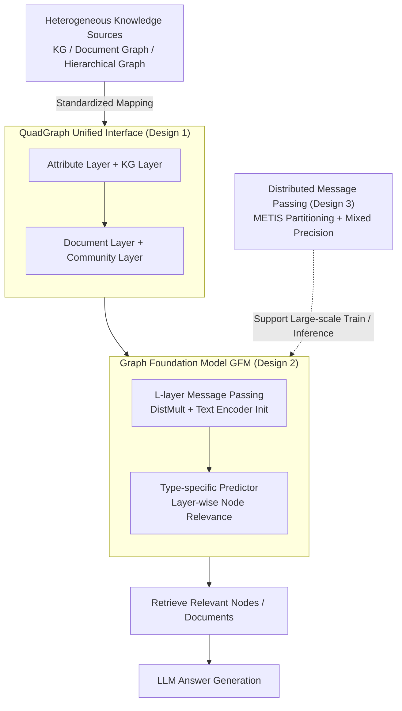

# G-reasoner: Foundation Models for Unified Reasoning over Graph-structured Knowledge

**Conference**: ICLR 2026  
**arXiv**: [2509.24276](https://arxiv.org/abs/2509.24276)  
**Code**: [Project Page](https://rmanluo.github.io/gfm-rag/)  
**Area**: Self-supervised Learning / Graph Foundation Models / RAG  
**Keywords**: graph foundation model, RAG, knowledge graph, GNN, LLM reasoning

## TL;DR
G-reasoner is proposed to standardize heterogeneous knowledge sources via a four-layer unified graph interface called QuadGraph. A 34M-parameter GNN Graph Foundation Model (GFM) is trained to jointly reason over graph topology and text semantics. Combined with LLMs, it outperforms state-of-the-art (SOTA) GraphRAG methods across six benchmarks.

## Background & Motivation

**Background**: LLMs excel at reasoning but are constrained by their static parametric knowledge. RAG enhances LLMs through external knowledge. Graphs naturally model relationships between knowledge entities (e.g., knowledge graphs, document graphs, hierarchical graphs), and GraphRAG attempts to combine both paradigms.

**Limitations of Prior Work**: Existing GraphRAG methods rely on specific graph structure designs (distinct for KGs, document graphs, or hierarchical graphs), heuristic searches (like PageRank), or expensive Agent pipelines involving multiple LLM calls. These approaches suffer from poor generalization and low efficiency.

**Key Challenge**: Different knowledge sources require different graph structures, yet no unified framework can adapt to various graph structures while performing efficient reasoning.

**Goal**: To design a unified graph representation and reasoning framework that is adaptable to multiple knowledge graph structures, efficient, and generalizable.

**Key Insight**: Define a four-layer standardized graph structure, QuadGraph, and utilize a GNN-based graph foundation model for unified reasoning.

**Core Idea**: Unify heterogeneous graphs into QuadGraph (comprising Attribute, KG, Document, and Community layers). Train a GFM to perform joint topological and semantic reasoning to enhance LLMs.

## Method

### Overall Architecture
G-reasoner addresses the issue where different knowledge sources (KGs, document graphs, hierarchical graphs) have distinct structures, forcing previous GraphRAG methods to customize pipelines for specific formats. The core idea is to decouple "graph structure" from "graph reasoning" completely. First, a unified interface, QuadGraph, compresses any heterogeneous knowledge source into a standardized four-layer format. Then, a Graph Foundation Model (GFM) based on a GNN is trained to perform reasoning on this standard format. The pipeline is: Raw Knowledge Sources → QuadGraph Standardization → 34M-parameter GNN forward pass for node relevance → Feeding retrieved nodes/documents to the LLM for answer generation. Importantly, the GFM is trained once on the standardized interface and can transfer to any new knowledge source mapped to QuadGraph, with inference relying on a single forward pass rather than PageRank heuristics or multi-turn LLM calls.

### Key Designs

**1. QuadGraph Unified Interface: Eliminating Structural Dependency via Four Standard Layers**

The pain point lies in the incompatibility of graph structures across different knowledge sources. QuadGraph maps any knowledge source into four fixed layers: Attribute Layer (shared attributes of nodes), Knowledge Graph Layer (entity and relation triplets), Document Layer (unstructured text), and Community Layer (global information obtained via semantic/structural clustering). KGs, document graphs, and hierarchical graphs all fit into this four-layer architecture. For instance, a pure KG resides primarily in the KG layer, while document collections occupy the Document and Community layers. Consequently, the downstream model always interacts with the same interface, absorbing structural differences during standardization so the GFM does not need re-designing for each graph.

**2. GNN Graph Foundation Model (GFM): Joint Reasoning of Topology and Text Semantics**

Topology or text alone is insufficient; GFM calculates both. It is a query-dependent GNN where the message function uses DistMult and node embeddings are initialized with a pre-trained text encoder, carrying text semantics from the start. After $L$ layers of message passing, type-specific predictors estimate the relevance of different node types across the four layers to the query. Since graph reasoning tasks lack labels, weak supervision distillation is employed: a pre-trained text encoder acts as a "teacher" to provide pseudo-labels for node relevance, which are then distilled into the GFM using KL divergence. This allows the GFM to learn from semantic judgments even when manual annotations are scarce.

**3. Distributed Message Passing: Enabling GFM for Large-scale Training and Inference**

Graphs corresponding to knowledge sources can be massive. The METIS algorithm partitions the graph across multiple GPUs, with each device storing only its subgraph. During message passing, aggregation occurs locally before exchanging boundary node information across devices to minimize communication. Combined with mixed-precision training, throughput increases by 2.1x and GPU memory usage decreases by 17.5%, making end-to-end training and single-forward inference on large standardized graphs feasible.

### Loss & Training
The training objective is the log-likelihood of labeled nodes plus $\lambda$ times the KL distillation loss from teacher pseudo-labels. Weakly supervised training is conducted on large-scale, multi-source datasets, allowing the GFM to benefit from both limited ground truth and dense semantic signals provided by the teacher.

## Key Experimental Results

### Main Results: Multi-hop QA + G-bench

| Method | HotpotQA F1 | MuSiQue F1 | 2Wiki F1 |
|------|------|------|------|
| BM25 | 63.4 | 28.8 | 51.2 |
| HippoRAG 2 | 71.1 | 49.3 | 69.7 |
| GFM-RAG | 69.5 | 49.2 | 77.7 |
| **G-reasoner** | **76.0** | **52.5** | **82.1** |

### Ablation Study

| Configuration | Effect |
|------|------|
| No Text Semantic Fusion | Significant drop; topology is insufficient |
| No Weakly Supervised Distillation | Drop due to insufficient labeled data |
| Single Graph Type Training | Poor generalization |
| Full G-reasoner | Best performance |

### Key Findings
- Achieved SOTA across all 6 benchmarks, including Multi-hop QA and G-bench.
- Significantly more efficient than Agent-based methods (e.g., ToG, KAG) due to single-forward pass vs. multiple LLM calls.
- Strong cross-graph generalization; performs well even on unseen graph structures.

## Highlights & Insights
- The four-layer design of QuadGraph effectively unifies KGs, document graphs, and hierarchical graphs with strong abstraction capabilities.
- The weak supervision distillation strategy addresses the practical issue of label scarcity in graph reasoning.
- The efficient 34M-parameter GFM substantially reduces inference costs compared to Agent-based methods.

## Limitations & Future Work
- Whether the four-layer structure of QuadGraph covers all knowledge types; temporal or multi-modal knowledge might require extensions.
- GFM performance depends on the quality of the pre-trained text encoder.
- Only validated in the text domain; multi-modal reasoning remains to be explored.

## Related Work & Insights
- **vs GFM-RAG**: The predecessor work was limited to KGs; G-reasoner extends this to arbitrary graph structures.
- **vs GraphRAG (MS)**: Relies on specific hierarchical graphs and LLM summarization, showing poor generalization.
- **vs HippoRAG**: Uses PageRank for search, failing to fully utilize foundation model capabilities.

## Rating
- Novelty: ⭐⭐⭐⭐ The QuadGraph unified interface and GFM joint reasoning represent significant systemic contributions.
- Experimental Thoroughness: ⭐⭐⭐⭐⭐ Comprehensive coverage across 6 benchmarks, ablations, efficiency analysis, and generalization tests.
- Writing Quality: ⭐⭐⭐⭐ Clear framework and high-quality illustrations.
- Value: ⭐⭐⭐⭐ Provides a scalable, unified solution for GraphRAG.

<!-- RELATED:START -->

## Related Papers

- [\[ICLR 2026\] Youtu-GraphRAG: Vertically Unified Agents for Graph Retrieval-Augmented Complex Reasoning](youtu-graphrag_vertically_unified_agents_for_graph_retrieval-augmented_complex_r.md)
- [\[ICLR 2026\] SynthWorlds: Controlled Parallel Worlds for Disentangling Reasoning and Knowledge in Language Models](synthworlds_controlled_parallel_worlds_for_disentangling_reasoning_and_knowledge.md)
- [\[ICLR 2026\] The Topology of Reasoning: Augmenting Generation with Retrieved Cell Complexes for Text-Graph QA](topology_of_reasoning_retrieved_cell_complex-augmented_generation_for_textual_gr.md)
- [\[ICLR 2026\] RefTool: Reference-Guided Tool Creation for Knowledge-Intensive Reasoning](reftool_reference-guided_tool_creation_for_knowledge-intensive_reasoning.md)
- [\[ACL 2025\] Toward Structured Knowledge Reasoning: Contrastive Retrieval-Augmented Generation on Experience](../../ACL2025/information_retrieval/toward_structured_knowledge_reasoning_contrastive_retrieval-augmented_generation.md)

<!-- RELATED:END -->
