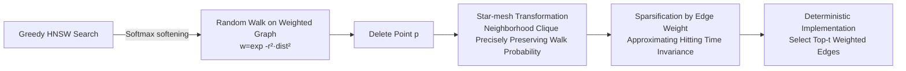

# Graph-based Nearest Neighbors with Dynamic Updates via Random Walks

**Conference**: ICLR 2026  
**OpenReview**: [https://openreview.net/forum?id=l97Kacqdfk](https://openreview.net/forum?id=l97Kacqdfk)  
**Code**: To be confirmed  
**Area**: Information Retrieval / Approximate Nearest Neighbor Search (ANN)  
**Keywords**: HNSW, Vector Deletion, Random Walk, Graph Sparsification, Hitting Time, RAG  

## TL;DR
This paper proposes a novel theoretical framework based on random walks for the HNSW graph index and designs the **SPatch** deletion algorithm—which "clique-ies then sparsifies" in the neighborhood after node deletion—achieving an optimal trade-off across recall, query speed, deletion latency, and memory footprint.

## Background & Motivation
**Background**: HNSW is the most prevalent graph-based ANN index, relying on multi-layered "long-range navigation + short-range precise search" to achieve high throughput and recall, making it a core component of RAG retrieval. While it inherently supports insertions, it lacks efficient deletion capabilities.

**Limitations of Prior Work**: Real-world data is highly dynamic (ad removal, seasonal product turnover, outdated items), making deletion a critical requirement. However, existing solutions have significant drawbacks:

- **Tombstone**: Marks points without removal; provides best recall but never releases memory, and queries slow down as deletions increase (more steps to reach targets).
- **No patch**: Deletes points without graph repair; fast but causes recall collapse (especially under mass deletion).
- **Local reconnect**: Adds edges only within $N(p)$; recall is slightly better than no patch but remains low.
- **FreshDiskANN / Global reconnect**: Uses 2-hop neighborhoods or re-insertion to maintain recall, but deletion is non-local, time-consuming, and difficult to parallelize.

**Key Challenge**: Achieving a balance between recall, query speed, deletion latency, and memory usage has been difficult, and most existing schemes lack theoretical guarantees.

**Goal**: To provide a deletion algorithm that excels across all four metrics with provable guarantees under a unified theoretical framework.

**Key Insight** (🎯 **Random Walk Twin Framework + Hitting Time Preserving Sparsification**): The "greedy search for the nearest neighbor" in HNSW is softened into a "softmax probability random walk based on distance," allowing the graph to be treated as a weighted graph and deletion as a graph sparsification problem. Post-deletion, the star-mesh transformation is used to form a clique in the neighborhood to precisely maintain walk probabilities, followed by sampling-based sparsification by edge weight so that hitting times (expected steps to reach a target) remain approximately invariant.

## Method

### Overall Architecture
The key insight of SPatch is to find a "twin" random walk interpretation for HNSW: replacing greedy search with a softmax walk based on $\exp(-r^2\|q-v\|^2)$ probabilities. The HNSW graph thus becomes a weighted graph parameterized by query $q$. In this view, deleting a point $p$ is equivalent to "eliminating node $p$ while keeping walk statistics as invariant as possible"—first using star-mesh transformation to patch $p$'s neighborhood into a complete graph (precisely preserving walk probability), then sampling and sparsifying by edge weight (approximately preserving hitting time), and finally implementing it as a deterministic top-t selection algorithm.

### Key Designs

**1. Softmax walk: Translating greedy search into random walk** — Original HNSW deterministically moves to $\arg\min_{v\in N(u)}\|q-v\|$ in the neighborhood. This work "softens" it into a walk with probability $\frac{\exp(-r^2\|q-v\|^2)}{\sum_{c\in N(u)}\exp(-r^2\|q-c\|^2)}$ towards neighbor $v$. For sufficiently large $r$, the Gaussian kernel assigns exponentially higher probability to closer points, making the softmax walk almost equivalent to hard greedy search. This re-interprets the graph as a weighted graph where edge weight $w(u,v)=\exp(-r^2\|q-v\|^2)$ depends only on the destination and the query. This provides the theoretical foundation for using sparsification and hitting time tools.

**2. Star-mesh transformation: Precisely preserving walk probability during deletion** — Theoretically, the "optimal" strategy (Theorem 3.1) is to form a clique on $N(p)$ after deleting $p$ to keep search paths equivalent, but this over-densifies the graph. This work proves a refined version (Theorem 4.1): by setting new weights $w'(u,v)=w(u,v)+\frac{w(u,p)\cdot w(p,v)}{\deg(p)}$ for all $u,v\in N(p)$, the transition probability $u\to v$ in the new graph exactly equals the probability of "$u\to p\to v$ or $u\to v$" in the old graph. This star-mesh transformation (derived from Schur complements) "welds" the probability mass through $p$ back between its neighbors.

**3. Sparsification by edge weight + Hitting time guarantees** — To handle the density from the clique, sparsification is applied. Instead of complex spectral sparsification, a simpler "sampling by edge weight" (squared row norm of $\sqrt{W}B$) is used. Sampling $s=200\varepsilon^{-2}$ edges ensures the sparsified Laplacian satisfies $\|\tilde C^\top\tilde C-L\|_F\le\varepsilon\cdot\mathrm{tr}[W]$ (Theorem 4.3). The key contribution is translating this Frobenius norm error into a multiplicative-additive error bound for **hitting time** (Theorem 4.5): the expected steps to the target remain approximately invariant. Sampling by weight naturally keeps "close-point clusters" connected, while HNSW's upper layers handle inter-cluster connectivity.

**4. From random sampling to deterministic top-t selection** — Since the probability of sampling an edge outside the top-t is exponentially small for large $r$, the algorithm simply selects the top-t edges with the largest weights. Engineering optimizations include: selecting $t=\alpha\cdot\lceil\frac{|L|+|R|}{|R|}\rceil$ neighbors $v$ from in-neighbors for each out-neighbor $u$ to maximize $w'(u,v)$, and retaining existing edges while only adding heavy new edges.

## Key Experimental Results

**Settings**: FAISS `HNSWFlatIndex` ($m=32$), extracted as networkx undirected graphs for deletion. Four 1M-scale datasets: SIFT(128d), GIST(960d), MS MARCO MPNet(768d), and MiniLM(384d). Mass deletion setting: cumulative 80% deletion, evaluated every 0.8%. Metrics: top-10 recall, distance calculations (throughput proxy), total deletion latency, and edge count (memory proxy).

### Main Results (Comparison of four metrics, summarized from Figure 2 and Table 1)

| Method | Recall | Query Speed | Deletion Latency | Space |
|------|------|----------|----------|------|
| Tombstone | ✓ Best | ✗ Slow (2.5–3× distance calcs of SPatch) | ✓ | ✗ No Release |
| No patch | ✗ Collapse | ✓ | ✓ | ✓ |
| Local reconnect | ✗ Low | ✓ | ✓ | ✓ |
| FreshDiskANN (2-hop) | ✓ | ✓ | ✗ Slow | ✓ |
| Global reconnect | ✓ | ✓ | ✗ Slow | ✓ |
| **Ours (SPatch)** | ✓ | ✓ | ✓ | ✓ |

Ours is the only method performing well across all four metrics: recall is only slightly lower than Tombstone, but query speed is much higher, memory decreases with deletion, and deletion latency is significantly lower than FreshDiskANN or periodic reconstruction.

### Ablation Study (Softmax walk vs. Greedy Search, Table 2)

| Dataset | Softmax Recall | Greedy Recall | Softmax Dist Calcs | Greedy Dist Calcs |
|--------|--------------|-------------|------------------|------------------|
| MPNet | 89.98% | 91.60% | 1562 | 1722 |
| SIFT | 91.13% | 91.95% | 1049 | 1109 |
| GIST | 71.38% | 72.46% | 1606 | 1653 |
| MiniLM | 89.27% | 90.09% | 1708 | 1802 |

### Key Findings
- Softmax walk and greedy search are highly consistent in recall and throughput, validating the "twin model" as a theoretical proxy for HNSW.
- Hitting time serves as an effective proxy for designing sparsification algorithms despite not being perfectly equivalent to recall.
- Memory usage (represented by edge count) scales down synchronously with deletion.

## Highlights & Insights
- **Elegant bridge between theory and practice**: Elevates heuristic HNSW deletion to a provable framework of "weighted random walks + graph sparsification."
- **Softmax walk twin perspective**: Provides a differentiable and analytical probabilistic interpretation of HNSW, which may be useful for broader theoretical analysis.
- **Metric comprehensiveness**: Optimizes for deletion latency and memory release alongside recall and throughput.

## Limitations & Future Work
- **Connectivity guarantees**: Weight-based sampling might discard weak inter-cluster edges, creating potential risks for queries drifting toward deleted clusters.
- **Gap between hitting time and recall**: Theory guarantees hitting time, but the softmax walk may still stop at local minima, leaving a gap with final recall.
- **Focus on mass deletion**: Evaluated primarily on large-batch deletions; performance under interleaved insertion/deletion workloads requires further study.
- **Implementation pipeline**: The research prototype transfers graphs between FAISS and networkx; production-level integration and parallelization need development.

## Related Work & Insights
- **Graph ANN Theory**: Extends the theoretical understanding of HNSW (Malkov & Yashunin) and greedy search provability (Prokhorenkova & Shekhovtsov) to include the deletion phase.
- **HNSW Deletion Taxonomy**: Categorizes previous works as "deletion + neighborhood patching" and identifies their lack of theoretical guarantees.
- **Graph Sparsification**: Utilizes simpler row-norm sampling instead of spectral sparsification to achieve efficiency suitable for dynamic graph updates.

## Rating
- **Novelty**: ⭐⭐⭐⭐⭐ First to provide a random walk theoretical framework for HNSW deletion.
- **Experimental Thoroughness**: ⭐⭐⭐⭐ Solid testing on 1M-scale datasets across multiple indicators, though missing mixed-load production tests.
- **Writing Quality**: ⭐⭐⭐⭐ Clear logic from motivation to theory and implementation.
- **Value**: ⭐⭐⭐⭐⭐ Directly addresses the critical need for dynamic deletion in RAG/vector databases with a provable and efficient trade-off.

<!-- RELATED:START -->

## Related Papers

- [\[ICLR 2026\] Flow of Spans: Generalizing Language Models to Dynamic Span-Vocabulary via GFlowNets](flow_of_spans_generalizing_language_models_to_dynamic_span-vocabulary_via_gflown.md)
- [\[ICLR 2026\] G-reasoner: Foundation Models for Unified Reasoning over Graph-structured Knowledge](g-reasoner_foundation_models_for_unified_reasoning_over_graph-structured_knowled.md)
- [\[ICLR 2026\] Query-Aware Flow Diffusion for Graph-Based RAG with Retrieval Guarantees](query-aware_flow_diffusion_for_graph-based_rag_with_retrieval_guarantees.md)
- [\[ICLR 2026\] LinearRAG: Linear Graph Retrieval Augmented Generation on Large-scale Corpora](linearrag_linear_graph_retrieval_augmented_generation_on_large-scale_corpora.md)
- [\[ICLR 2026\] Youtu-GraphRAG: Vertically Unified Agents for Graph Retrieval-Augmented Complex Reasoning](youtu-graphrag_vertically_unified_agents_for_graph_retrieval-augmented_complex_r.md)

<!-- RELATED:END -->
