# GRO-RAG: Gradient-aware Re-rank Optimization for Multi-source Retrieval-Augmented Generation

**Conference**: ICLR 2026  
**OpenReview**: [https://openreview.net/forum?id=5zdubHFutd](https://openreview.net/forum?id=5zdubHFutd)  
**Code**: To be confirmed  
**Area**: Information Retrieval / Retrieval-Augmented Generation (RAG)  
**Keywords**: Multi-source RAG, Gradient-aware Re-ranking, Training-free, Source Combination Selection, Submodular Optimization, Generation Loss Alignment  

## TL;DR
GRO-RAG proposes a completely training-free multi-source RAG framework: it first greedily selects complementary retrieval sources using a "relevance-redundancy" submodular objective, then lets a frozen LLM re-rank documents via the inner product of document representations and generation loss gradients obtained through a single forward-backward pass, directly aligning "what to retrieve" with "what the generation target actually needs."

## Background & Motivation
**Background**: Retrieval-Augmented Generation (RAG) has become the mainstream paradigm for injecting external knowledge into LLMs and mitigating hallucinations. In open-domain and multi-hop QA, evidence is often scattered across heterogeneous sources such as encyclopedias, web pages, and forums, leading to Multi-source RAG (MS-RAG), which requires determining which documents are relevant while deciding which sources to trust, combine, or ignore. Recent works like ReAct, UniMS-RAG, and PrefRAG attempt to dynamically schedule multiple sources.

**Limitations of Prior Work**: Most systems handle the source level crudely—either aggregating all sources indiscriminately or statically fixing a single source, ignoring semantic complementarity and redundancy between sources. At the document level, re-ranking models (such as BM25 or Cross-Encoders) score documents only using retrieval-level signals like query-document similarity, **completely ignoring the actual contribution of documents to the downstream generation goal**.

**Key Challenge**: There is a mismatch between retrieval scoring criteria (relevance/similarity) and the criteria that truly determine answer quality (contribution to generation loss). A document with high literal similarity to the query may not necessarily help the model answer correctly, while truly useful evidence might be ranked lower due to low similarity. This creates a disconnect between "what is retrieved" and "what the generation truly needs."

**Goal**: Construct a training-free framework that introduces no additional parameters and is plug-and-play for frozen LLMs, simultaneously addressing the decisions of "which source combinations to pick" and "which documents to use as context," ensuring both serve the final generation objective.

**Core Idea**: **Let the LLM vote for itself**—by reading the gradient of the generation loss with respect to document representations through a single backpropagation. The contribution of each document to reducing generation loss is estimated using the inner product of $\text{document latent representation} \cdot (-\text{loss gradient})$. This is used for re-ranking instead of heuristic similarity. At the source level, submodular optimization balances relevance and redundancy to select complementary source combinations.

## Method

### Overall Architecture
GRO-RAG is a two-stage filtering pipeline: **Source Combination Selection** $\rightarrow$ **Gradient-aware Re-ranking**. Given a query, it first retrieves the top-$m$ candidates for each source and averages them to obtain source representations. A complementary source subset is greedily selected using a submodular score of "relevance $-\lambda \cdot$ redundancy." The candidate documents from these sources are then merged into a mixed pool. A frozen LLM performs one forward pass on the uniform mixture representation to calculate generation loss and one backward pass to obtain gradients. Documents are selected for the prompt based on Top-$k$ gradient inner product scores. The entire process requires only one forward-backward pass without training or additional parameters.

```mermaid
flowchart LR
    Q[Query q] --> SCS
    subgraph SCS[Source Combination Selection]
        R[Each source recall top-m<br/>avg to get source rep s] --> G[Greedy maximization<br/>f=Σcos·q,s − λΣcos·s,s′]
        G --> A[Complementary source subset A*]
    end
    A --> POOL[Merged candidate pool C*·q = d1...dn]
    POOL --> GR
    subgraph GR[Gradient-aware Re-ranking]
        U[Uniform mixture h̄·π̄ = 1/n Σ hi] --> FB[Forward for L<br/>Backward for ∇L]
        FB --> SCORE[Scoring φi = ⟨hi, −∇L⟩]
        SCORE --> TOPK[Select Top-k documents]
    end
    TOPK --> LLM[Frozen LLM generates answer]
```

### Key Designs

**1. Source Combination Selection: Formulating "source selection" as a submodular optimization of relevance and redundancy, solved greedily with approximation guarantees.** Intuitively, a geographic question might find answers in news, Wikipedia, and travel blogs. Merging all leads to redundant sentences about the Danube, wasting context budget, while keeping only Wikipedia might lose unique details useful for follow-up questions. The authors formalize this trade-off as a subset scoring function $f(A;\lambda)=\sum_{s\in A}\cos(q,s)-\lambda\sum_{s,s'\in A,s<s'}\cos(s,s')$. The first term rewards sources aligned with query semantics, and the second penalizes high similarity between sources, interpreted as "rewarding marginal new information and penalizing covered content." The source representation $s=\frac{1}{m}\sum_j \mathbf{d}_{s,j}$ is averaged from the frozen sentence embeddings (sentence-BERT) of the top-$m$ candidates. Since the first term is modular and the redundancy term increases with source count under cosine similarity, the overall $f$ is submodular when $\lambda$ is small. Thus, a greedy algorithm can achieve the classic $(1-1/e)$ approximation guarantee, avoiding exhaustive subset enumeration.

**2. Gradient-aware Re-ranking: Relaxing discrete Top-k to soft weights and deriving gradient inner product scores via first-order Taylor expansion.** Frozen LLMs have limited context and can only accommodate $k$ documents. Instead of training cross-encoders or reusing similarity, the authors relax the binary "keep/discard" choice to non-negative soft weights $\pi \in \Delta_n$ ($\|\pi\|_1=1$) on a simplex. A mixed representation $\bar h(\pi)=\sum_i\pi_i h_i$ is constructed, and generation loss $\mathcal L(\pi)$ is calculated for a reference answer using the soft prompt $\langle q,\bar h(\pi)\rangle$. Since the generator is non-linear and the loss is non-convex, a first-order Taylor expansion is performed at the uniform mixture $\bar\pi=(1/n,\dots,1/n)$: $\mathcal L(\pi)\approx\mathcal L(\bar\pi)+\sum_i\pi_i\langle\nabla_{\bar h}\mathcal L,h_i\rangle$. Minimizing the loss is approximately equivalent to minimizing the linear weighted sum of document scores. Under $k$-sparse simplex constraints, the optimal solution is to pick the top $k$ documents with the largest inner product $\phi_i = \langle h_i,-\nabla_{\bar h}\mathcal L\rangle$. This defines the ranking score $\phi_i$, which measures the sensitivity of the generation loss to the presence of document $i$. A single forward-backward pass ranks all candidates without training, leveraging the LLM's internal gradients.

**3. Theoretical Guarantee: Gradient inner product as an upper bound for leave-one-out loss, extendable to an iterative optimization with linear convergence.** To truly measure the contribution of a document $d_i$, one would ideally remove it and see how much the loss increases (leave-one-out loss): $\mathcal L_{loo}(d_i)=\mathcal L(\bar\pi)-\mathcal L(\bar\pi-\frac{1}{n}e_i)$. However, this requires $n+1$ forward passes. Proposition 3.1 proves that if $\ell_i(t)=\mathcal L(\bar\pi+te_i)$ is locally convex, then $\mathcal L_{loo}(d_i)\le-\phi_i$. Thus, the gradient score $\phi_i$ is an upper bound on the marginal utility, and ranking by $\phi$ prioritizes documents whose absence hurts the loss most. Furthermore, the single-step scoring generalizes to multi-step iterations: each round forms a context with current $\pi^t$, performs a forward-backward pass to get direction $g^t$, updates via gradient descent, and projects back to the $k$-sparse simplex. Proposition 3.2 proves that under $\mu$-strongly convex and $L$-smooth assumptions, this iteration converges linearly with a factor $(1-\eta\mu)$. Each iteration improves the result without requiring parameters.

## Key Experimental Results

### Main Results
On HotpotQA, 2WikiMQA, and MuSiQue multi-hop QA benchmarks using Llama3.1-8B and GLM-4 as generators (F1/EM, %):

| Generator | Method | HotpotQA F1 | HotpotQA EM | 2WikiMQA F1 | 2WikiMQA EM | MuSiQue F1 | MuSiQue EM |
|---|---|---|---|---|---|---|---|
| Llama3.1-8B | w/o Retrieval | 27.8 | 23.1 | 19.7 | 13.9 | 8.4 | 3.5 |
| | Vanilla RAG (Both) | 36.0 | 29.7 | 27.3 | 21.8 | 15.9 | 9.2 |
| | FLARE | 34.5 | 28.6 | 28.5 | 23.0 | 17.3 | 10.7 |
| | CRAG | 34.2 | 25.5 | 22.6 | 17.9 | 16.2 | 9.2 |
| | **GRO-RAG** | **39.1** | **30.9** | **28.9** | 22.8 | **18.6** | 10.3 |
| GLM-4 | w/o Retrieval | 29.4 | 23.6 | 18.6 | 13.5 | 10.3 | 4.1 |
| | Vanilla RAG (Both) | 39.3 | 31.5 | 28.2 | 22.4 | 16.5 | 9.6 |
| | FLARE | 38.6 | 30.7 | 29.7 | 23.8 | 20.2 | 11.6 |
| | CRAG | 38.1 | 30.3 | 24.8 | 20.4 | 17.4 | 9.6 |
| | **GRO-RAG** | **42.8** | **33.6** | **30.3** | 23.7 | **21.1** | **12.4** |

GRO-RAG achieves the best F1 across almost all settings and the best EM in most cases. The advantage is particularly evident on MuSiQue, which has higher document entropy and harder reasoning.

At the retrieval level (local corpus only, NDCG@10), GRO-RAG approaches or even exceeds BGE-M3 on MuSiQue without supervised training:

| Re-ranker | HotpotQA | 2WikiMQA | MuSiQue | Average |
|---|---|---|---|---|
| BM25 | 0.6237 | 0.5760 | 0.3453 | 0.5150 |
| BGE-M3 | 0.6892 | 0.6273 | 0.3922 | 0.5696 |
| E5-base | 0.7013 | 0.6749 | 0.4180 | 0.5981 |
| GRO-RAG (GLM-4) | 0.6538 | 0.6382 | 0.4156 | 0.5692 |

### Ablation Study
Removing Source Combination Selection (SCS) or Gradient Re-ranking (GR) leads to performance drops, with GR being the more critical component (F1/EM):

| Generator | Method | HotpotQA F1 | HotpotQA EM | 2WikiMQA F1 | 2WikiMQA EM | MuSiQue F1 | MuSiQue EM |
|---|---|---|---|---|---|---|---|
| Llama3.1-8B | GRO-RAG | 39.1 | 30.9 | 28.9 | 22.8 | 18.6 | 10.3 |
| | w/o SCS | 38.0 | 30.6 | 26.4 | 21.3 | 17.0 | 10.2 |
| | w/o GR | 37.5 | 30.2 | 23.3 | 19.6 | 16.2 | 9.3 |
| GLM-4 | GRO-RAG | 42.8 | 33.6 | 30.3 | 23.7 | 21.1 | 12.4 |
| | w/o SCS | 40.1 | 31.4 | 28.6 | 22.5 | 20.0 | 11.5 |
| | w/o GR | 37.6 | 28.7 | 25.3 | 20.9 | 16.8 | 9.4 |

### Key Findings
- **Gradient re-ranking is more impactful than source selection**: The drop from removing GR (e.g., GLM-4 on 2WikiMQA F1 30.3 $\rightarrow$ 25.3) is much larger than removing SCS, indicating that "ranking by generation loss" is the core source of Gain.
- **Training-free yet competitive with supervised re-rankers**: Without retrieval supervision, NDCG is comparable to E5/BGE-M3, and even exceeds BGE-M3 on the difficult MuSiQue dataset, proving that generation target gradient signals capture fine-grained relevance missed by static embeddings.
- **Cross-model stability**: Switching from GLM-4 to the smaller Llama3.1-8B causes many baselines to drop significantly, while GRO-RAG's relative gains remain consistent, showing model-agnostic robustness.
- **Iterative/Top-k Sensitivity**: NDCG@10 moves upward as iterations increase. A Top-$k$ of 10 provides the best balance of performance and stability across most datasets.

## Highlights & Insights
- **Redefining "Retrieval Utility" as "Contribution to Generation Loss"**: Using the gradient inner product from a single backpropagation as a ranking signal elegantly aligns the retrieval stage with the generation goal, bypassing the long-standing mismatch between similarity and usefulness.
- **Clean Theoretical and Engineering Design**: Source selection utilizes submodularity for a $(1-1/e)$ greedy guarantee, while re-ranking uses first-order Taylor expansion and simplex constraints to derive the Top-$k$ criterion. It provides solid propositions for LOO loss upper bounds and linear convergence, all while being training-free and low-cost.
- **The "LLM Voting" Perspective**: Delegating document selection to the generator's gradient feedback rather than external heuristics is a concept that could transfer to broader scenarios like context compression and demonstration selection.

## Limitations & Future Work
- **Ambiguous Dataset Count**: The text cites "four benchmarks" in section 4.1 but only lists three (HotpotQA/2WikiMQA/MuSiQue) in the tables, suggesting narrow coverage and a lack of open-domain generation (e.g., NQ, TriviaQA) or larger-scale verification.
- **Dependence on Reference Answers**: Scoring requires calculating loss against a reference answer $a^*$. While feasible for evaluation, online inference has no gold answer. Using pseudo-labels or self-consistency remains undiscussed.
- **Locality of Taylor Expansion**: Single-step scoring is a linearization near the uniform mixture $\bar\pi$. The approximation might distort if the candidate pool is noisy or documents have strong non-linear interactions; multi-step iteration helps but adds overhead.
- **Strong Theoretical Assumptions**: Propositions 3.1 and 3.2 require local or strong convexity and smoothness, which are difficult to verify on real LLM loss surfaces and serve more as intuitive guarantees.

## Related Work & Insights
- **Multi-source RAG Scheduling** (ReAct, UniMS-RAG, PrefRAG, CRAG): Previous works mostly rely on action tokens, self-reflection, or fallback rules. GRO-RAG transforms this into a combinatorial optimization problem with provable approximations via submodular optimization.
- **Generation-aware Retrieval/Re-ranking** (RankRAG, Self-RAG, FLARE): These rely on reflection tokens or self-generated queries but do not explicitly model generation loss; GRO-RAG's gradient inner product provides a tighter path.
- **Insights**: The use of gradients as a utility proxy is consistent with influence functions and data attribution, inspiring the unification of data filtering and in-context example selection under a "loss gradient alignment" framework.

## Rating
- Novelty: ⭐⭐⭐⭐ Using generation loss gradient inner products as a training-free re-ranking signal, combined with submodular source selection and theoretical bounds, is novel and clean.
- Experimental Thoroughness: ⭐⭐⭐ Three multi-hop QA datasets + two LLMs + ablation/retrieval/iterative analysis is relatively complete, but the dataset scope is narrow and lacks large-scale open-domain verification.
- Writing Quality: ⭐⭐⭐⭐ Clear motivation, solid derivations, and easy-to-understand intuition regarding "LLM voting."
- Value: ⭐⭐⭐⭐ Zero training, single forward-backward pass, and plug-and-play nature make it highly attractive for practical RAG deployment.

<!-- RELATED:START -->

## Related Papers

- [\[ACL 2026\] MASS-RAG: Multi-Agent Synthesis Retrieval-Augmented Generation](../../ACL2026/information_retrieval/mass-rag_multi-agent_synthesis_retrieval-augmented_generation.md)
- [\[ACL 2026\] Disco-RAG: Discourse-Aware Retrieval-Augmented Generation](../../ACL2026/information_retrieval/disco-rag_discourse-aware_retrieval-augmented_generation.md)
- [\[ACL 2025\] VISA: Retrieval Augmented Generation with Visual Source Attribution](../../ACL2025/information_retrieval/visa_retrieval_augmented_generation_with_visual_source_attribution.md)
- [\[ICLR 2026\] Query-Aware Flow Diffusion for Graph-Based RAG with Retrieval Guarantees](query-aware_flow_diffusion_for_graph-based_rag_with_retrieval_guarantees.md)
- [\[ACL 2025\] MAIN-RAG: Multi-Agent Filtering Retrieval-Augmented Generation](../../ACL2025/information_retrieval/main-rag_multi-agent_filtering_retrieval-augmented_generation.md)

<!-- RELATED:END -->
