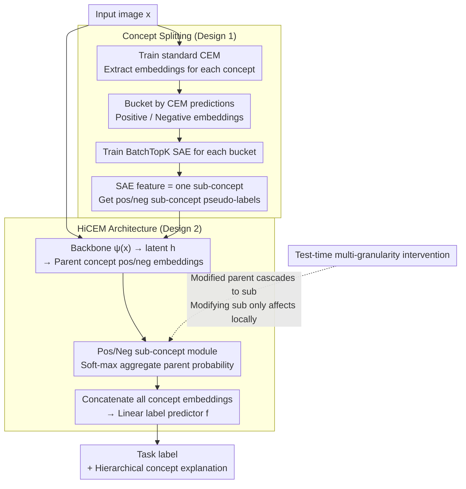

# Hierarchical Concept-based Interpretable Models

**Conference**: ICLR 2026  
**arXiv**: [2602.23947](https://arxiv.org/abs/2602.23947)  
**Code**: None  
**Area**: Explainable AI / Concept Models  
**Keywords**: Concept Embedding Models, Hierarchical Concepts, Concept Splitting, Sub-concept Discovery, Concept Intervention

## TL;DR
HiCEMs introduces hierarchical concept embedding models. Through the Concept Splitting method, it automatically discovers fine-grained sub-concepts in the embedding space of pre-trained CEMs (without additional annotations) to construct a hierarchical concept structure. This allows the model to perform test-time concept interventions at different levels of granularity to improve task performance.

## Background & Motivation
Modern deep neural networks are difficult to interpret due to the opacity of their latent representations, which hinders model understanding, debugging, and debiasing. Concept Embedding Models (CEM) address this by mapping inputs to human-understandable concept representations. However, CEM suffers from two fundamental limitations: (1) it cannot represent relationships between concepts—treating all concepts as flat and independent, ignoring the natural hierarchical structure of concepts (e.g., "feather color" $\rightarrow$ "chest red" / "wing blue"); (2) training hierarchical models requires concept annotations at different levels of granularity, which is extremely costly. The **Key Challenge** is that while hierarchical concept structures are crucial for deep understanding and precise intervention, obtaining multi-level annotated data is impractical. The **Core Idea** of this paper is to automatically discover sub-concepts in the embedding space of existing CEMs via Concept Splitting, constructing a hierarchical concept structure without any additional annotations.

## Method

### Overall Architecture
Concept Embedding Models (CEM) learn each concept as a high-dimensional vector. However, they treat all concepts as flat and independent. Training a hierarchical model of "parent concept $\rightarrow$ sub-concept" usually requires annotating concepts at multiple granularities, which is expensive. The **Key Insight** of this paper is that the embedding space of a CEM already implicitly contains sub-concept structures more fine-grained than the labels (e.g., embeddings trained with a "contains vegetables" label spontaneously encode unlabeled sub-concepts like "contains onions" or "contains carrots"). Thus, HiCEMs follows a two-stage approach: first, train a standard CEM to obtain reliable concept embeddings; second, use **Concept Splitting** to unsupervisedly mine sub-concepts in this embedding space (without new labels). Finally, a **HiCEM** is trained on the discovered hierarchy—its concept bottleneck layer no longer outputs flat vectors but provides hierarchical predictions of "parent concept + positive/negative sub-concepts" for each concept. The label layer performs classification based on this, supporting concept interventions at any granularity during test time. To verify this hierarchical mechanism in a controlled environment, the paper synthesizes the **PseudoKitchens** dataset as a testbed.

### Key Designs

**1. Concept Splitting: Mining unlabeled sub-concepts using Sparse Autoencoders in embedding space**

The premise for discovering sub-concepts without extra labeling is that concept representations already hide information finer than the annotations. This is precisely the difference between CEM and CBM—CBM compresses each concept into a 0/1 scalar, losing fine-grained semantics, whereas CEM learns concepts as high-dimensional embeddings $\hat{c}_i$. These continuous vectors retain visually separable differences (like "wings are striped vs. solid") not present in the labels. Concept Splitting operates in this space: first, run the trained CEM $M$ on the annotated training set to store embeddings $\hat{c}_i$ and predicted probabilities $\hat{p}_i$ for each concept $c_i$. Then, use $M$'s own predictions to split the embeddings of $c_i$ into two buckets: the positive embedding set $E_i^{true}$ where $\hat{p}_i > 0.5$ (concept present), and the negative embedding set $E_i^{false}$ (concept absent). The key step draws from the discovery that SAEs can find interpretable features in neural representations: **train a BatchTopK Sparse Autoencoder separately on these two buckets** (retaining top-k activations within a batch). The SAE on $E_i^{true}$ identifies positive sub-concepts occurring only when $c_i$ is present, while the SAE on $E_i^{false}$ identifies negative sub-concepts. Each SAE feature represents a discovered sub-concept, and samples are assigned sub-concept pseudo-labels based on feature activation. The entire process introduces zero new annotations, simply mining the sub-concept structure that the CEM implicitly learned but never explicitly utilized. Discovered sub-concepts are later assigned semantic names by experts using "prototypes" (training samples that strongly activate the feature).

> ⚠️ The main text uses SAE (BatchTopK) for splitting; the clustering-based approach to find mutually exclusive sub-concepts is an alternative in Appendix A, not the primary method.

**2. HiCEM Architecture: Integrating sub-concepts into prediction with parent probabilities aggregated from sub-probabilities**

Once the hierarchy is mined, an architecture must be designed to utilize it. HiCEM follows the CEM setting of "learning two embeddings (positive and negative) for each concept": the backbone $\psi(x)$ produces latent code $h$, and parent concept embedding generators produce intermediate embeddings $\hat{c}_i^{+0}, \hat{c}_i^{-0}$, which are fed into **positive and negative sub-concept modules**. Within each module, a sub-embedding $\hat{c}_{kj}^{+}$ is learned for each sub-concept of that parent concept. A shared scoring function $s(\cdot)$ calculates each sub-concept probability $\hat{p}_{kj}^{+}$, and the parent's positive embedding $\hat{c}_k^{+}$ is a weighted mixture of these sub-embeddings based on their probabilities. Instead of predicting it separately, the **parent concept presence is aggregated from sub-concept probabilities**: a differentiable "soft-max" takes the strongest positive sub-concept probability as $\hat{p}_k^{+}$ (in practice, probabilities are scaled from $[0,1]$ to $[-10,10]$ before passing through softmax to approximate a true max). Finally, $\hat{p}_i = \tfrac{1}{2}(\hat{p}_i^{+} + (1-\hat{p}_i^{-}))$ and the concept embedding is $\hat{c}_i = \hat{p}_i\hat{c}_i^{+} + (1-\hat{p}_i)\hat{c}_i^{-}$. This design where "parent probability is derived from sub-probabilities" naturally ensures hierarchical consistency—the parent concept can only be present if at least one positive sub-concept is present. All concept embeddings are concatenated into a bottleneck following a linear label predictor $f$. This explicit link allows for **intervention at any granularity** during test time: modifying a parent concept cascades to sub-concepts, while modifying a sub-concept only affects local nodes, making fine-grained intervention more efficient.

**3. PseudoKitchens Dataset: Creating a naturally hierarchical and controllable testbed**

Since it is difficult to precisely control hierarchical combinations of concepts in real-world data, it is hard to cleanly verify if a model truly utilizes the sub-concept structure. This paper uses 3D kitchen rendering to synthesize PseudoKitchens, where kitchenware and food concepts have natural hierarchies. Each concept's presence can be controlled individually during rendering, providing a controllable experimental field to verify if hierarchical concepts are effectively utilized.

### Loss & Training
The training consists of two stages: first, train a standard CEM to convergence and run Concept Splitting to define the hierarchy; then, train HiCEM on that hierarchy. The objective of HiCEM is the **weighted sum of cross-entropy for task and concept predictions**: $\mathcal{L} = \mathbb{E}_{(x,y,c)}\big[\mathcal{L}_{task}(y, f(g(x))) + \alpha\,\mathcal{L}_{CE}(c, \hat{p}(x))\big]$, where hyperparameter $\alpha$ balances concept and task accuracy. Since $\hat{p}(x)$ includes both parent and sub-level probabilities, hierarchical consistency is guaranteed by the aggregation architecture without additional regularization. To improve intervention effectiveness, the **RandInt** strategy from CEM is used during training, where concepts are randomly and independently intervened with probability $p_{int}$.

## Key Experimental Results

### Main Results

| Dataset | Metric | HiCEM | Standard CEM | CBM | Description |
|--------|------|------|----------|------|------|
| MNIST-ADD | Task Acc | ~High | Baseline | Lower | Digit addition task |
| SHAPES | Task Acc | ~High | Baseline | Lower | Shape attribute recognition |
| CUB-200 | Task Acc | Competitive | Baseline | Lower | Fine-grained bird classification |
| AwA2 | Task Acc | Competitive | Baseline | Lower | Animal attribute prediction |
| PseudoKitchens | Task Acc | SOTA | Baseline | Lower | Newly proposed 3D kitchen dataset |

Note: HiCEM maintains accuracy comparable to or better than CEM across all datasets while providing finer-grained explanations.

### Concept Intervention Experiments

| Dataset | Intervention | No Intervention | Coarse Intervention | Fine Intervention (HiCEM) | Description |
|--------|---------|------|---------|---------|------|
| CUB-200 | Incremental | Baseline | Gain | Larger Gain | Fine-grained is more effective |
| AwA2 | Incremental | Baseline | Gain | Larger Gain | Cumulative effect of hierarchy |
| SHAPES | Incremental | Baseline | Gain | Larger Gain | Clear advantage at medium counts |

### User Study

| Evaluation Dimension | Result | Description |
|---------|------|------|
| Sub-concept Interpretability | Users can assign meaningful names to most sub-concepts | Validates that SAE-discovered sub-concepts have human-understandable semantics |
| Explanation Usefulness | Hierarchical explanations are preferred over flat ones | Hierarchy provides more intuitive error tracking paths |
| Intervention Efficiency | Fine-grained intervention requires fewer corrections | Targeting specific sub-concepts is more efficient than coarse corrections |

### Key Findings
- Sub-concepts discovered by Concept Splitting have high human interpretability—on the CUB dataset, "wing color" is split into sub-concepts like "striped wings" and "solid wings."
- Fine-grained concept intervention is more effective than coarse-grained: on CUB, intervening on 5 fine-grained sub-concepts outperforms intervening on 5 coarse parent concepts.
- HiCEM provides richer explanations without sacrificing task accuracy, breaking the common "interpretability vs. accuracy" trade-off.
- Experiments on PseudoKitchens show that HiCEM's advantages are most pronounced in domains with natural concept hierarchies.
- Significant sub-concept structures exist in CEM embedding spaces, confirming that CEM implicitly learns information beyond the annotation granularity during training.
- Different concepts have different optimal split numbers: some naturally contain multiple sub-concepts, while others are "atomic."

## Highlights & Insights
- **Zero-annotation sub-concept discovery**: This is the major contribution—leveraging only the structure of the CEM embedding space formed during training to find sub-concepts without new labels.
- **Hierarchy of interpretability**: Moving from "which concepts the model used" to "which specific aspect of the concept the model used" is a significant step forward for XAI.
- **Refined concept intervention**: Test-time intervention evolves from "fixing a concept" to "fixing the right sub-concept at the right level," greatly improving efficiency.
- **New PseudoKitchens dataset**: Provides a controlled environment for hierarchical concept research, filling a gap in the field.
- **Theoretical Insight**: The discovery that CEM embeddings contain richer information than labels inspires similar explorations in other representation learning methods.

## Limitations & Future Work
- The quality of Concept Splitting relies heavily on the quality of the initial CEM embedding space—if the CEM learns poorly, the clustered sub-concepts may be meaningless.
- Currently only supports one level of splitting (parent $\rightarrow$ sub); multi-level extensions are explored in the companion workshop paper "Digging Deeper."
- Hyperparameters for SAE (sparsity, activation thresholds) and the definition of "meaningful features" still require some manual tuning and validation.
- Scalability to large-scale datasets like ImageNet has not yet been verified.
- The hierarchical consistency constraint might be too strict—in reality, sub-concepts may not strictly belong to a single parent.
- Lack of systematic comparison with attention-based methods (e.g., GradCAM) or feature attribution methods (e.g., SHAP).

## Related Work & Insights
- **Concept Bottleneck Models (CBM)**: The foundational XAI framework; HiCEM introduces hierarchy to it.
- **Concept Embedding Models (CEM)**: The direct predecessor; represents concepts through continuous embeddings rather than binary scalars.
- **Digging Deeper (ICLR 2026 Workshop)**: Follow-up work extending Concept Splitting to multiple levels (MLCS) with the Deep-HiCEMs architecture.
- **Concept Activation Vectors (TCAV)**: Another concept discovery method, but does not build hierarchies.
- **Insights**: The automatic discovery of concept hierarchies can be extended to: (1) Fairness analysis—discovering sub-groups of sensitive attributes; (2) Model debugging—locating precise concept levels for errors; (3) Data augmentation—structured sampling based on concept hierarchies.

## Rating
- Novelty: ⭐⭐⭐⭐⭐
- Experimental Thoroughness: ⭐⭐⭐⭐
- Writing Quality: ⭐⭐⭐⭐⭐
- Value: ⭐⭐⭐⭐⭐

<!-- RELATED:START -->

## Related Papers

- [\[ICLR 2026\] Summaries as Centroids for Interpretable and Scalable Text Clustering](summaries_as_centroids_for_interpretable_and_scalable_text_clustering.md)
- [\[ICLR 2026\] Hierarchical Encoding Tree with Modality Mixup for Cross-modal Hashing](hierarchical_encoding_tree_with_modality_mixup_for_cross-modal_hashing.md)
- [\[ICLR 2026\] HiPRAG: Hierarchical Process Rewards for Efficient Agentic Retrieval Augmented Generation](hiprag_hierarchical_process_rewards_for_efficient_agentic_retrieval_augmented_ge.md)
- [\[ICLR 2026\] Conformalized Hierarchical Calibration for Uncertainty-Aware Adaptive Hashing](conformalized_hierarchical_calibration_for_uncertainty-aware_adaptive_hashing.md)
- [\[ICLR 2026\] Learning Retrieval Models with Sparse Autoencoders](learning_retrieval_models_with_sparse_autoencoders.md)

<!-- RELATED:END -->
