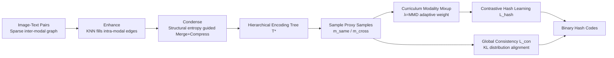

# Hierarchical Encoding Tree with Modality Mixup for Cross-modal Hashing

**Conference**: ICLR 2026  
**OpenReview**: [https://openreview.net/forum?id=Gq7mjFEoDm](https://openreview.net/forum?id=Gq7mjFEoDm)  
**Code**: To be confirmed  
**Area**: Information Retrieval / Cross-modal Hashing  
**Keywords**: Cross-modal Retrieval, Unsupervised Hashing, Encoding Tree, Structural Entropy, Modality Mixup, Curriculum Learning  

## TL;DR
HINT utilizes structural entropy to compress sparse image-text pairings into a hierarchical "encoding tree," excavating multi-granularity semantic communities. By sampling intra-modal and cross-modal proxy samples from the tree, it progressively aligns the two modalities via an MMD-driven curriculum Mixup, achieving more robust unsupervised cross-modal hashing.

## Background & Motivation
- **Background**: Cross-modal retrieval maps images and text into a unified space to calculate similarity. Hashing methods compress high-dimensional vectors into binary codes for approximate nearest neighbor search using Hamming distance, offering extremely fast storage and retrieval, which makes them a mainstream solution for large-scale image-text retrieval. Due to the high cost of annotation, unsupervised cross-modal hashing (using only image-text pairs with contrastive or adversarial learning) has become a research hotspot.
- **Limitations of Prior Work**: ① **Lack of hierarchical semantic structure**—Without category labels, existing methods rely on "image-text pairs," which provide **flat and sparse** supervisory signals. Treating all samples at the same level fails to exploit the multi-level semantic communities naturally present in data (where semantics are similar within communities and distinct between them), leading to poor generalization of hash codes. ② **Difficulty in aligning heterogeneous modalities**—Images and text are inherently heterogeneous in structure and semantics. Existing methods often directly pull two encoders toward the same target, which is difficult to learn and yields suboptimal results.
- **Key Challenge**: Available supervision consists of **flat, sparse** pairing signals, whereas real-world semantics involve **hierarchical, dense** community structures. Furthermore, the modality gap makes "one-step" direct alignment difficult.
- **Goal**: Under an unsupervised setting, recover the hierarchical semantic structure of cross-modal data, mine local communities, and bridge the modality gap in a **progressive** rather than direct manner to learn more discriminative and robust hash codes.
- **Core Idea**: **[From Flat to Hierarchical]** Use structural entropy to compress the sparse pairing graph into an encoding tree (dense within communities, sparse between them); **[From Direct to Progressive]** Sample proxy samples from the tree and use data-driven curriculum Mixup to smoothly transition alignment from "intra-modal" to "cross-modal."

## Method

### Overall Architecture
During testing, HINT only uses the hash model to generate codes. During training, it revolves around an encoding tree with three main steps: first, an "Enhance-Condense" pipeline constructs a hierarchical encoding tree $T^*$ from the sparse pairing graph; next, intra-modal and cross-modal proxy samples are sampled from the tree for each instance, using MMD-driven curriculum Mixup to generate mixed hash codes for contrastive learning; finally, proxy samples are used for distribution consistency alignment from a global perspective. The overall loss is $\mathcal{L}=\mathcal{L}_{hash}+\gamma\mathcal{L}_{con}$.

### Key Designs

**1. Structural Entropy Guided Hierarchical Encoding Tree Construction: Compressing flat sparse graphs into multi-granularity community trees.** This is the foundation of HINT. First, **Enhance**: The original cross-modal graph $G_{inter}$ only contains image-text pairing edges and is too sparse. Therefore, KNN ($k{=}3$) is applied within each modality using cosine similarity $S^*_{(i,j)}=\cos(f^*_i,f^*_j)$ to supplement intra-modal edges, forming tight low-level communities that are merged with pairing edges to obtain $G_{cross}$. Cosine similarity is chosen over L1/L2 because it normalizes vector magnitude and focuses only on semantic direction, making it more suitable for cross-modal comparison. Then, **Condense**: Use **structural entropy** as the objective to condense the graph into an encoding tree. One-dimensional structural entropy $E_1(G)=-\sum_{v}\frac{d_v}{\mathrm{vol}(G)}\log\frac{d_v}{\mathrm{vol}(G)}$ measures the uncertainty of a global random walk; hierarchical structural entropy generalizes this to a tree:

$$\mathcal{E}^T(G)=-\sum_{\alpha\in T}\underbrace{\frac{g_\alpha}{\mathrm{vol}(G)}}_{\text{Information leakage}}\log\underbrace{\frac{V_\alpha}{V_{\alpha^-}}}_{\text{Encoding efficiency}}$$

where $g_\alpha$ is the number of edges exiting subtree $T_\alpha$ (community "leakage"), and $V_\alpha, V_{\alpha^-}$ are the sum of degrees of the subtree and its parent subtree, respectively. The algorithm uses Greedy + BFS traversal, repeatedly attempting two operations and executing them if they reduce structural entropy: **Merge** combines nodes with the same parent into a binary tree, and **Compress** moves subtrees up to a grandfather node to construct local clusters, eventually yielding $T^*=\arg\min \mathcal{E}^T(G)$. The result is a tree with coarse categories at the top, fine concepts in the middle, and instances at the leaves—naturally suited for discriminative hash learning.

**2. Curriculum Modality Mixup: Using MMD to progressively push alignment from intra-modal to cross-modal.** With the tree established, two sets of neighbors are sampled for each sample $f^*_i$: intra-modal neighbors $\mathcal{N}^+$ are aggregated into an intra-modal proxy $m^{same}_i=\frac{1}{|\mathcal{N}^+|}\sum_{j}\phi^*(f^*_j)$, and cross-modal neighbors $\mathcal{N}^-$ are aggregated into a cross-modal proxy $m^{cross}_i$. These proxies serve as "semantically purified" intermediaries and are more robust than individual samples. The mixed hash code is:

$$b^{mix}_i=\mathrm{sign}\Big(\tfrac{\lambda}{1+\lambda}m^{same}_i+\tfrac{1}{1+\lambda}m^{cross}_i\Big),\quad \lambda=\widehat{\mathrm{MMD}}\big(\rho(m^{same},B),\rho(m^{cross},B)\big)$$

Critically, $\lambda$ is **not a manually tuned hyperparameter** but is measured using Gaussian kernel MMD on a mini-batch to reflect the distribution gap between the two modalities. At the start of training, the modality gap is large, $\lambda$ is high, and the mixup favors the intra-modal proxy (learning well-aligned intra-modal features first). As training progresses and the gap closes, $\lambda$ decreases, and the weight smoothly shifts toward the cross-modal proxy—this follows a data-driven **curriculum learning** trajectory (empirically verified by the monotonic decrease of $\lambda$ in Fig. 5). The mixed codes are learned via an InfoNCE-style contrastive loss $\mathcal{L}_{hash}$ with other samples in the batch as negatives. Lemma 4.1 in the paper suggests that mixed proxies are low-variance unbiased estimates of community prototypes under the local community consistency assumption, generating a positive retrieval margin when inter-community separation $\|\mu_{c(i)}-\mu_{c(k)}\|^2$ exceeds the proxy variance $r_i^2$.

**3. Proxy-based Global Consistency Learning: Alignment from a distribution perspective.** While Mixup provides instance-level local alignment, HINT adds a global perspective constraint: the semantic representation of a sample is expressed as its similarity distribution $p(f^*_i)=\{\rho(f^*_i,f^*_j)\mid f^*_j\in B^-\}$ against the opposite modality samples in the batch. It requires consistency between the original sample's distribution and its cross-modal proxy's distribution by minimizing the KL divergence $\mathcal{L}_{con}=\sum_i D_{KL}\big(p(f^*_i)\,\|\,p(m^{cross}_i)\big)$. Since proxy samples have more stable semantics, this global alignment further narrows the modality gap and improves generalization. During training, $\tanh$ is used to substitute for the non-differentiable $\mathrm{sign}$ function; during testing, the tree and proxies are discarded, and only the hash model is used, ensuring minimal inference overhead.

## Key Experimental Results

### Main Results (MAP %, selected 64/128 bit)
Evaluated on three datasets (MIRFlickr-25K / NUS-WIDE / MS-COCO) against 15 baselines (including recent SOTA like VTM-UCH, DEMO, UDDH), HINT leads across all 16–128 bit settings.

| Image→Text | MIRF 64 | MIRF 128 | NUS 64 | NUS 128 | COCO 64 | COCO 128 |
|---|---|---|---|---|---|---|
| UCCH | 72.8 | 73.2 | 64.0 | 64.5 | 56.6 | 57.4 |
| UDDH | 74.0 | 74.6 | 65.1 | 65.9 | 59.0 | 59.9 |
| DEMO | 73.4 | 74.3 | 66.2 | 66.4 | 58.6 | 60.5 |
| VTM-UCH | 73.9 | 74.5 | 66.0 | 66.6 | 58.8 | 60.3 |
| **Ours (HINT)** | **75.1** | **75.5** | **66.5** | **67.3** | **60.4** | **61.1** |

The Text→Image direction also leads comprehensively (MIRF-128 reaches 74.6, COCO-128 reaches 60.8). The paper notes that gains are more pronounced in harder subtasks like Text→Image because text features are sparser and have lower initial quality, making the benefits of hierarchical structure and proxy neighborhood aggregation more significant.

### Ablation Study (MAP %, I→T / T→I)
Components added sequentially: KNN (Intra-modal enhancement), Tree (Hierarchical encoding tree), Curr (Curriculum Mixup), Con (Consistency learning).

| Variant | KNN | Tree | Curr | Con | MIRF | NUS | COCO |
|---|---|---|---|---|---|---|---|
| V1 | | | | | 73.2/72.0 | 64.0/65.1 | 57.9/58.5 |
| V2 | ✓ | | | | 73.8/72.8 | 65.2/65.7 | 59.1/58.9 |
| V3 | ✓ | ✓ | | | 74.2/73.6 | 65.9/66.4 | 60.0/59.5 |
| V4 | ✓ | ✓ | ✓ | | 75.1/74.1 | 67.0/67.3 | 60.7/60.2 |
| **Ours** | ✓ | ✓ | ✓ | ✓ | **75.5/74.6** | **67.3/67.8** | **61.1/60.8** |

### Key Findings
- Every component contributes positively, with the **hierarchical encoding tree (V3) and curriculum progressive alignment (V4) contributing the most**, confirming that hierarchical structure + progressive alignment are core.
- **Hyperparameter Robustness**: Performance improves from $k=1$ to $3$ and drops at $k=5$ due to noise; thus $k=3$ is selected. Performance fluctuations are <2% when $\tau$ varies between 0.1–0.5.
- **Strong Stability**: Standard deviation across 5 random seeds is <1% for all bit lengths; remains superior even with 10% noisy pairings.
- t-SNE visualizations show HINT achieves better alignment in the unified hash space compared to UCCH/DEMO; static tree construction provides a better efficiency-performance tradeoff than iterative updates.

## Highlights & Insights
- **Adapting "Structural Entropy + Encoding Tree" for cross-modal hashing** provides a principled answer for creating hierarchical supervision without labels: using structural entropy to objectively compress communities rather than relying on predefined granularities or external tools.
- **Using MMD as a curriculum driver** transforms the "easy-to-hard" alignment sequence into a data-adaptive, zero-manual-tuning process. This is supported by manifold regularization theory and is a more elegant design than fixed weight annealing.
- **Heavy Training, Light Inference**: The tree and proxies are used only during training. During testing, codes are generated directly, preserving the core "speed" advantage of hashing retrieval.
- The use of Lemma to explain "low-variance proxies + community separation ⇒ positive retrieval margin" provides an interpretable theoretical narrative for the empirical improvements.

## Limitations & Future Work
- **Static Tree Construction**: The paper admits that iterative tree updates performed worse than static ones, suggesting the tree and representation are decoupled in a "build-then-use" fashion. As representations evolve during training, the tree does not update, potentially missing better community partitions. Dynamic or differentiable tree construction is a potential direction.
- **Greedy Construction lacks Global Optimum Guarantee**: BFS + greedy entropy reduction only converges to a stable structure, not necessarily the global minimum structural entropy.
- **Dependence on Pre-trained Encoder Features**: The quality of low-level KNN communities depends on the initial quality of $f^v, f^t$. Under weak encoders, the hierarchical structure might be distorted.
- **Limited to Image-Text Bi-modal Retrieval**: The method has not been verified for three or more modalities or non-retrieval downstream tasks. The validity of the community consistency assumption in long-tail or extreme noise scenarios also requires investigation.

## Related Work & Insights
- **Unsupervised Cross-modal Hashing** (UCCH, DGCPN, DEMO, VTM-UCH, etc.): Mostly rely on sparse image-text relationships for contrastive/adversarial learning, lacking local community mining. HINT differs by explicitly recovering hierarchical structures.
- **Structural Entropy and Encoding Trees** (Li et al. 2018; Zou et al. 2023): Originally used for unsupervised community discovery in graphs; this work is the first to systematically use it as a source of hierarchical supervision for cross-modal hashing.
- **Mixup / Manifold Regularization** (Verma et al. 2019, etc.): HINT transforms Mixup from data augmentation into "curriculum-based progressive alignment between proxy samples" and uses MMD for automatic weighting.
- **Insight**: In any scenario where "supervision is sparse but data is naturally hierarchical" (e.g., unlabeled recommendation, knowledge graph alignment), the "Structural Entropy Hierarchy + Progressive Proxy Alignment" represents a transferable paradigm. Using distribution distance (MMD) to drive curriculum learning rather than manual annealing is a technique worth adopting.

## Rating
- **Novelty**: ⭐⭐⭐⭐ Introducing structural entropy encoding trees to unsupervised cross-modal hashing and driving curriculum Mixup with MMD is a novel combination with solid motivation, even if individual components are clever adaptations of existing tools.
- **Experimental Thoroughness**: ⭐⭐⭐⭐ 3 datasets × 4 bit lengths × 15 baselines, including ablation, hyperparameters, stability, noise robustness, and t-SNE; the chain of evidence is complete.
- **Writing Quality**: ⭐⭐⭐⭐ The three components are logically clear, supported by Lemmas and multiple diagrams. The formulas are dense but the narrative is coherent.
- **Value**: ⭐⭐⭐⭐ Consistently achieves SOTA retrieval performance while maintaining hashing inference efficiency. The "hierarchical supervision + progressive alignment" paradigm has transferable value for unsupervised multimodal learning.

<!-- RELATED:START -->

## Related Papers

- [\[ICLR 2026\] Deep Global-sense Hard-negative Discriminative Generation Hashing for Cross-modal Retrieval](deep_global-sense_hard-negative_discriminative_generation_hashing_for_cross-moda.md)
- [\[ICML 2026\] Hierarchical Abstract Tree for Cross-Document Retrieval-Augmented Generation](../../ICML2026/information_retrieval/hierarchical_abstract_tree_for_cross-document_retrieval-augmented_generation.md)
- [\[ICLR 2026\] Conformalized Hierarchical Calibration for Uncertainty-Aware Adaptive Hashing](conformalized_hierarchical_calibration_for_uncertainty-aware_adaptive_hashing.md)
- [\[ICLR 2026\] Hierarchical Concept-based Interpretable Models](hierarchical_concept-based_interpretable_models.md)
- [\[ICLR 2026\] Bayesian Attention Mechanism: A Probabilistic Framework for Positional Encoding and Context Length Extrapolation](bayesian_attention_mechanism_a_probabilistic_framework_for_positional_encoding_a.md)

<!-- RELATED:END -->
