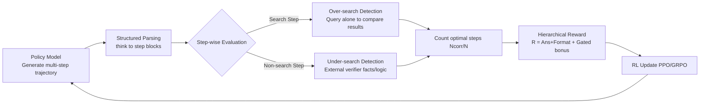

# HiPRAG: Hierarchical Process Rewards for Efficient Agentic Retrieval Augmented Generation

**Conference**: ICLR 2026  
**OpenReview**: [https://openreview.net/forum?id=Gt4v9WBPzm](https://openreview.net/forum?id=Gt4v9WBPzm)  
**Code**: [https://github.com/qualidea1217/HiPRAG](https://github.com/qualidea1217/HiPRAG)  
**Area**: Information Retrieval / Agentic RAG / Reinforcement Learning  
**Keywords**: Agentic RAG, Process Rewards, Reinforcement Learning, over-search, under-search, search efficiency  

## TL;DR
HiPRAG decomposes the reasoning trajectories of agentic RAG into parsable discrete steps, determines online "whether to search" for each decision, and provides a gated hierarchical process reward for RL. This allows the model to improve accuracy while compressing the over-search rate from 27% to 2.3%.

## Background & Motivation
- **Background**: LLM + retrieval has evolved into agentic RAG, where models decide when and what to search through interleaved multi-step reasoning. Recent mainstream approaches (e.g., Search-R1, R1-Searcher) train these "search agents" using RL guided by outcome rewards (final answer correctness).
- **Limitations of Prior Work**: Agents commonly exhibit two types of inefficient search behaviors: **over-search** (retrieving when the answer is already known, wasting compute and introducing noise) and **under-search** (answering via parametric memory when retrieval is necessary, leading to hallucinations). The paper observes that prior baselines have over-search rates exceeding 27%.
- **Key Challenge**: Existing correction methods are inadequate. Penalties based on length or search frequency can be "over-corrected," causing the model to stop searching entirely and exacerbating under-search. Process rewards based on confidence thresholds or knowledge classifiers are crude proxies that often misjudge the timing for search. Learned process reward models can also be biased or weakly correlated with actual step quality. **No method currently provides explicit, step-level feedback for every retrieval decision.**
- **Goal**: Inject fine-grained, knowledge-verifiable process signals into RL to optimize both correctness and search efficiency without compromising basic retrieval capabilities.
- **Key Insight**: **Structured output + online step evaluation + gated hierarchical rewards**. The model is forced to produce trajectories parsable by rules, then each step is judged for redundancy or missing search. Finally, the "ratio of optimal steps" is added as a bonus only when the format and answer are correct.

## Method

### Overall Architecture
HiPRAG integrates three components: (1) A redesigned output format that decomposes trajectories into rule-parsable `<step>` blocks; (2) Online detection of over-search and under-search during RL rollouts; (3) A hierarchical reward function that prioritizes format and answer correctness before applying the process bonus. This mechanism is embedded into standard RL loops (PPO/GRPO). Detection is performed by prompting an external LLM, avoiding the need for a separately trained reward model.

### Key Designs

**1. Decomposing trajectories into parsable discrete steps: Making "step-wise evaluation" engineering-feasible.** Frameworks like Search-R1 store reasoning in a continuous `<think>` block, leading to two problems: blurred step boundaries (one block plan next steps) and implicit non-search steps (steps based on parametric knowledge lack explicit tags). This makes step-wise evaluation slow and error-prone. HiPRAG wraps the entire trajectory in one `<think>` block containing discrete `<step>` blocks. Each step is either a search step—containing `<search>` and `<context>`—or a non-search step. Formally, a trajectory $T=\{s_1,\dots,s_n,a\}$, where a search step is a quadruple $s_i^R=(r_i,q_i,c_i,o_i)$ and a non-search step is $s_i^{NR}=(r_i,o_i)$, with $r_i$ as reasoning, $q_i$ as query, $c_i$ as context, and $o_i$ as the step conclusion. The format is guaranteed via few-shot system prompts and RL format rewards.

**2. Online over-search/under-search detection: Replacing expensive regeneration pipelines with direct prompting.** For each search step, HiPRAG extracts query $q_i$ and feeds it independently to the policy model itself to obtain an answer $o_i'$ without retrieval. An external LLM judge then determines if $o_i'$ and the original step conclusion $o_i$ are semantically equivalent. If so, the search is redundant and labeled as over-search. This is faster and more stable than previous methods that regenerate entire trajectories, as it isolates the core knowledge without breaking the reasoning flow. For non-search steps, an external verifier checks the factual and logical correctness of reasoning $r_i$ and conclusion $o_i$; errors are labeled as under-search. The paper intentionally does not penalize "locally correct but incomplete" steps, as completeness depends on global planning and is hard to judge objectively step-by-step. Detection can be paralleled, and over-search regeneration can be batched to accelerate training.

**3. Gated hierarchical process reward: Learn to answer first, then learn to save.** Directly penalizing search can suppress retrieval capability. Rewards must "focus dynamically"—learning format and correctness early, then shifting to efficiency once basic search ability is established. Let $A(T)\in\{0,1\}$ denote answer correctness (Cover Exact Match), $F(T)\in\{0,1\}$ format compliance, $N(T)$ total steps, and $N_{corr}(T)$ the number of optimal steps (neither over nor under). The reward is defined as:
$$R(T) = A(T)\,(1-\lambda_f) + \lambda_f F(T) + \lambda_p A(T) F(T) \frac{N_{corr}(T)}{N(T)}$$
where $\lambda_f\in[0,1]$ is the format weight and $\lambda_p\ge 0$ is the process bonus coefficient. When $\lambda_p=0$, it simplifies to the outcome+format reward of Search-R1. The process bonus is gated by $A(T)F(T)$, ensuring it only activates when the answer and format are correct. In this case, $R(T)=1+\lambda_p\frac{N_{corr}(T)}{N(T)}$, where the bonus grows linearly with the ratio of optimal steps. This structure prevents excessive punishment for localized reasoning errors while incentivizing the model to clarify its knowledge boundaries. Main experiments use $\lambda_f=0.2$ and $\lambda_p=0.4$.

## Key Experimental Results

### Main Results
Cover Exact Match (%) on seven QA benchmarks:

| Method | NQ | TriviaQA | PopQA | HotpotQA | 2Wiki | MuSiQue | Bamboogle | Avg. |
|---|---|---|---|---|---|---|---|---|
| Direct Inference | 27.0 | 26.8 | 40.1 | 58.7 | 16.0 | 7.9 | 15.9 | 31.8 |
| Standard RAG | 51.2 | 54.7 | 65.7 | 56.9 | 21.6 | 18.5 | 18.6 | 45.3 |
| Search-R1 | 61.2 | 73.6 | 56.5 | 54.0 | 63.6 | 24.8 | 48.4 | 60.3 |
| R1-Searcher++ | 61.0 | 73.5 | 59.0 | 64.2 | 63.2 | 32.3 | 58.7 | 62.1 |
| β-GRPO | 65.0 | 75.0 | 60.0 | 53.0 | 66.0 | 24.0 | 52.0 | 62.5 |
| **HiPRAG-3B** | 68.7 | 75.5 | 66.3 | 57.4 | 67.4 | 24.1 | 41.6 | **65.4** |
| **HiPRAG-7B** | 71.2 | 76.3 | 63.2 | 62.4 | 71.7 | 34.1 | 52.8 | **67.2** |

The average CEM of HiPRAG-7B (67.2%) exceeds the best baseline R1-Searcher++ (62.1%) by 5.1 points. HiPRAG-3B (65.4%) also outperforms all 7B baselines.

### Ablation Study
Average CEM / OSR (Over-Search Rate) / USR (Under-Search Rate) in %, using Qwen2.5-3B-Instruct + PPO (baseline is $\lambda_p=0$):

| Configuration | Avg. CEM↑ | Avg. OSR↓ | Avg. USR↓ |
|---|---|---|---|
| baseline (λp=0) | 59.3 | 6.1 | 47.5 |
| HiPRAG (Full) | 64.1 | 4.9 | 38.1 |
| HiPRAG (over-search only) | 58.8 | 4.9 | 52.7 |
| HiPRAG (under-search only) | 63.3 | 6.6 | 16.9 |
| HiPRAG (λp=0.2) | 59.6 | 5.5 | 44.5 |
| HiPRAG (λp=0.6) | 62.5 | 5.2 | 39.0 |

Enabling only over-search increases USR (saving search at the cost of missing info), while only under-search reduces USR to 16.9% but increases OSR. The combination achieves balance. Best efficiency is seen in Qwen2.5-7B-Instruct + GRPO: 67.2% CEM, 2.3% OSR, 32.6% USR.

### Key Findings
- **Efficiency Breakthrough**: Over-search rate dropped from >27% in baselines to **2.3%**, while the under-search rate also decreased. Average retrievals per question fell from 2.45 (Search-R1) to 1.75 (saving 29%).
- **Small Model Superiority**: HiPRAG-3B+GRPO (64.4%) outperforms the 7B baseline R1-Searcher++ (62.1%) and the 7B version trained with standard rewards (61.2%), suggesting optimizing reasoning processes is more effective than scaling model size.
- **Robust Generalization**: Stable across model families (Qwen2.5 / Llama-3.2), RL algorithms (PPO / GRPO), sizes (3B / 7B), and types (base / instruct). GRPO converges faster to higher peaks.

## Highlights & Insights
- **"To search or not" as an online hard signal**: Over-search uses "independent query result consistency" to judge redundancy, and under-search uses external fact-checking. This avoids unreliable proxies like confidence thresholds or learned PRMs.
- **Gated design is the masterstroke**: The process bonus is gated by answer/format correctness, preventing efficiency gains at the cost of accuracy and allowing the reward to transition naturally from tool usage to tool conservation.
- **Restraint in not penalizing "locally incomplete" steps** reveals a trap in process rewards—blindly pursuing perfection at every step can drive agents toward over-search.

## Limitations & Future Work
- **Reliance on external LLM judges**: GPT-4o-mini and GPT-4o-mini (denoted as 4.1/5 in text) for online evaluation adds cost and limits reproducibility; judge misclassification can pollute rewards.
- **Strict format constraints**: The method relies on a rigid `<step>` XML schema; migrating to free-form reasoning or non-QA tasks requires redesigning the parsing logic.
- **USR remains high**: Even in the best configuration, the under-search rate is 29%~33%, showing that missing searches are not fully resolved. Subjectivity in semantic equivalence/factual correctness remains a noise source.
- Currently validated only on Wikipedia + QA; extension to open-web retrieval or complex tool-use scenarios is yet to be explored.

## Related Work & Insights
- **Agentic RAG and RL**: Builds on ReAct, Search-R1, and R1-Searcher, advancing from "punishing outcome" to "rewarding the retrieval process."
- **Efficient Tool Use**: Shares goals with SMART, OTC, and ToolRL to reduce tool misuse, but uses online step necessity judgment rather than confidence proxies or pre-trained RMs.
- **Insight**: The key to implementing process rewards is not necessarily training a stronger PRM, but designing **low-cost, direct, and verifiable** step-level criteria and safely integrating them with outcome rewards via a gated structure.

## Rating
- **Novelty**: ⭐⭐⭐⭐ — The "independent query" criterion for over-search and the gated reward are clever advancements for agentic RAG process rewards.
- **Experimental Thoroughness**: ⭐⭐⭐⭐ — Solid evidence across seven benchmarks and various model/algorithm combinations, though reliance on proprietary judges is a weakness.
- **Writing Quality**: ⭐⭐⭐⭐ — Clear logic from motivation to reward formulas and experiments.
- **Value**: ⭐⭐⭐⭐ — Compressing over-search from 27% to 2.3% while improving accuracy has direct practical value for cost-sensitive RAG deployment.

<!-- RELATED:START -->

## Related Papers

- [\[ICML 2026\] Hierarchical Abstract Tree for Cross-Document Retrieval-Augmented Generation](../../ICML2026/information_retrieval/hierarchical_abstract_tree_for_cross-document_retrieval-augmented_generation.md)
- [\[ICLR 2026\] RAEE: A Robust Retrieval-Augmented Early Exit Framework for Efficient Inference](raee_a_robust_retrieval-augmented_early_exit_framework_for_efficient_inference.md)
- [\[ICML 2026\] LazyAttention: Efficient Retrieval-Augmented Generation with Deferred Positional Encoding](../../ICML2026/information_retrieval/lazyattention_efficient_retrieval-augmented_generation_with_deferred_positional_.md)
- [\[ICLR 2026\] Hierarchical Concept-based Interpretable Models](hierarchical_concept-based_interpretable_models.md)
- [\[ACL 2025\] Hierarchical Document Refinement for Long-context Retrieval-augmented Generation](../../ACL2025/information_retrieval/hierarchical_document_refinement_for_long-context_retrieval-augmented_generation.md)

<!-- RELATED:END -->
