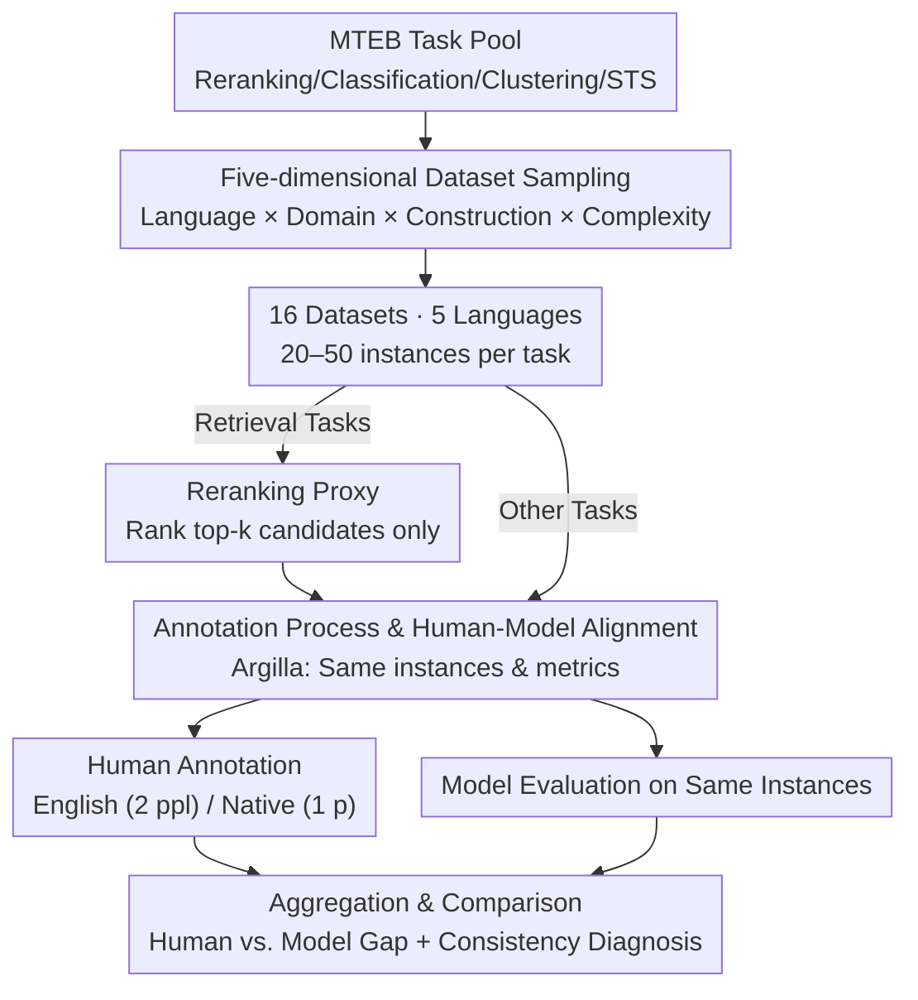

# HUME: Measuring the Human-Model Performance Gap in Text Embedding Tasks

**Conference**: ICLR 2026  
**arXiv**: [2510.10062](https://arxiv.org/abs/2510.10062)  
**Code**: [GitHub](https://github.com/embeddings-benchmark/mteb)  
**Area**: Information Retrieval  
**Keywords**: text embedding, human baseline, MTEB, evaluation framework, multilingual

## TL;DR

Ours proposes the HUME human evaluation framework to systematically measure human performance across 16 datasets in MTEB (Reranking/Classification/Clustering/STS). Findings show humans rank 4th overall (77.6 vs. best model 80.1), revealing that "superhuman" model performance often occurs in tasks with the lowest human agreement. Additionally, the study assesses the feasibility of using 9 LLMs as annotation proxies.

## Background & Motivation

**Background**: Embedding models are central to search, recommendation, and semantic analysis. MTEB provides the most comprehensive model evaluation suite, covering dozens of tasks and hundreds of datasets. However, the interpretability of MTEB scores is severely limited—if a model achieves MAP=0.85 on a reranking task, is that good or bad? Without a human performance reference, this remains impossible to determine. **Limitations of Prior Work**: Current evaluations use the theoretical maximum (e.g., MAP=1.0) as a reference, but inherent ambiguity in NLP tasks and annotator disagreement (plank-2022-problem) make perfect scores both unrealistic and meaningless. This leads to the risk of "blind optimization," where models might replicate annotation artifacts rather than achieving true semantic progress. **Key Challenge**: Generative NLP tasks (translation, summarization, dialogue) have established traditions of human evaluation, but human baselines for embedding tasks are virtually non-existent. GLUE/SuperGLUE have human baselines but only for classification or reasoning; STS reports annotator consistency but does not translate it into comparable performance scores. **Goal**: Establish a systematic, reproducible human performance baseline for MTEB, using human performance as a diagnostic signal (not an upper bound) to understand task quality. **Key Insight**: Conduct multi-annotator experiments across 4 task types, 5 languages (including low-resource), and 16 datasets, while additionally evaluating whether 9 LLMs can act as human proxies. **Core Idea**: Use a standardized framework to measure human performance on embedding tasks, revealing that model "superhuman" performance is often a byproduct of dataset quality issues rather than true model superiority.

## Method

### Overall Architecture

HUME addresses the lack of a "human ruler" for MTEB embedding scores. Its Mechanism is to establish a reproducible human measurement pipeline, allowing humans and models to be compared on the **exact same instances, using the same metrics and protocols**. The pipeline starts from the MTEB task pool, selects 16 representative datasets through **five-dimensional dataset sampling**. Since retrieval tasks are impractical for manual selection from thousands of documents, a **reranking proxy** converts them into manageable ranking judgments. Subsequently, all tasks enter an **annotation process and human-model alignment** based on Argilla, where human annotations and model evaluations are performed on the same downsampled instances. Finally, results are aggregated using the same metrics and protocols to output the human-model gap and diagnose task quality through annotator consistency.

### Key Designs

**1. Five-dimensional Dataset Sampling: Preventing "High-Resource English" Bias**

Sampling only English datasets would restrict the validity of human-model gap conclusions to high-resource scenarios. HUME samples across five dimensions: language diversity (English, Arabic, Russian, Norwegian, Danish, covering resource levels 1–5), domain diversity (News, Social, Wiki, Scientific, Forum), data construction (human-annotated vs. synthetic), task relevance, and complexity variations. Resulting in 16 datasets across 4 task types and 5 languages, this ensures that any "human vs. model" conclusion is not an artifact of a single language or domain—findings like "human +26.6 Gain in Arabic STS" are only possible through this sampling.

**2. Reranking Proxy: Making Retrieval Tasks Feasible for Humans**

Retrieval tasks normally require annotators to identify relevant items from thousands of candidates, which is impractical for humans. HUME uses reranking (evaluating only the ranking quality of top-k candidates) as a semantically equivalent proxy. This preserves the core demographic challenge of "judging which document is more relevant" while reducing the workload to a human-scale level. This proxy applies only to retrieval tasks, allowing them to be aligned with model evaluations.

**3. Annotation Process and Human-Model Alignment: Ensuring Comparability**

Comparisons are meaningless if humans and models use different instances or instructions. HUME uses Argilla to build task-specific annotation interfaces (binary relevance for reranking, category labels for classification, free cluster ID assignment for clustering, 0–5 scales for STS). 20–50 instances are downsampled per task, ensuring humans and models are evaluated on the identical batch using identical protocols (MAP for reranking, Accuracy for classification, V-Measure for clustering, Spearman for STS). Annotation instructions strictly replicate original task definitions to eliminate "instruction-induced gaps." English tasks involve two annotators for consistency calculations, while multilingual tasks are handled by native speakers.

### Loss & Training

As an evaluation framework, HUME does not train models. Statistical significance is calculated using 95% confidence intervals: Wilson Score Intervals for classification accuracy and Fisher $z$ transformation for correlation metrics (STS/Reranking). Based on this, it is determined whether a model truly deviates from human performance; models fall outside the human confidence interval in 14/26 task-language pairs ($p < 0.05$).

## Key Experimental Results

### Main Results

**Humans vs. 13 Embedding Models** (16 datasets, 4 tasks × 5 languages, 26 task-language pairs):

| Evaluated Object | Classification (eng) | Clustering (eng) | Reranking (eng) | STS (eng) | Overall |
| :--- | :--- | :--- | :--- | :--- | :--- |
| Human | 70.3 | 67.4 | 87.2 | 83.1 | **77.6** |
| jasper (Best) | 87.1 | 83.2 | 95.8 | 88.1 | **80.1** |
| e5-mistral-7b | 70.0 | 82.7 | 96.4 | 85.9 | 78.2 |
| SFR-Embedding | 69.8 | 85.1 | 96.3 | 86.4 | 78.3 |
| gte-Qwen2-1.5B | 76.5 | 75.9 | 95.3 | 84.0 | 77.5 |

Humans rank 4th overall (77.6) and score highest in 5/14 aggregated task-language pairs. Human cross-lingual advantages are significant: Arabic Sentiment 95.0 vs. 77.5 (+17.5 Gain), Russian Sentiment 92.5 vs. 81.2, and Arabic STS 67.5 vs. 40.9 (+26.6 Gain).

### Ablation Study

**LLM-as-Annotator** Evaluation (9 LLMs, 19 task-language pairs, excluding clustering):

| Category | Human | GPT-5 | GPT-4.1-mini | Mistral-Small | Qwen3-32B | Best Emb. |
| :--- | :--- | :--- | :--- | :--- | :--- | :--- |
| Classification | 79.1 | 78.9 | 76.1 | 73.8 | 73.0 | 80.3 |
| Reranking | 88.3 | 75.1 | 77.2 | 78.0 | 74.8 | 94.8 |
| STS | 76.5 | 73.0 | 74.9 | 75.0 | 68.6 | 77.1 |
| **Average** | **81.2** | 75.8 | **76.1** | 75.5 | 72.2 | — |

Human and LLM difficulty rankings show a moderate positive correlation ($\rho = 0.52, p < 0.05$), but the gap is largest in reranking tasks (88.3 vs. 78.0), which happens to be the task with the highest human consistency ($\rho = 0.64$–$0.85$).

### Key Findings

1.  **Model "Superhuman" Performance Often Signals Dataset Quality Issues**: In sentiment classification, humans achieved only 45.8% ($\kappa = 0.39$) while the best model reached 87.1%; in ArXiv clustering, humans achieved 49.2% (ARI=-0.001) vs. the model's 84.6%. These "superhuman" feats occur where human agreement is lowest.
2.  **High-Quality Benchmark Identification**: Reranking ($\rho = 0.64$-$0.85$) and toxicity classification ($\kappa = 0.55$) demonstrate high human consistency and serve as reliable evaluation targets.
3.  **Cross-lingual Gap**: Humans show a notable advantage in non-English tasks (29% win rate vs. 0% in English), with the largest advantage in Arabic (67% win rate vs. best model).
4.  **LLMs Cannot Substitute Human Annotators**: The best LLM (GPT-4.1-mini, 76.1%) trails humans by 5.1 points, with the largest gap found in high-consistency reranking tasks.

## Highlights & Insights

-   **Filling a Critical Gap**: MTEB receives its first systematic human performance baseline, which is now integrated into the MTEB package.
-   **Core Insight—Diagnostic Signal, Not Upper Bound**: Variation in human performance reflects task quality rather than human limitations. Low human scores suggest task design issues (vague guidelines, subjectivity) rather than an objective target for models to "surpass."
-   **Counter-intuitive Discovery**: "Superhuman" model performance occurs precisely where human agreement is lowest—implying that models may be replicating consistent label patterns rather than demonstrating superior semantic understanding.
-   **Practical Suggestion**: Benchmark leaderboards should report human consistency metrics. A score of 85% on sentiment classification (Human 45.8%, $\kappa=0.39$) represents a fundamentally different achievement than 85% on reranking (Human 87.2%, $\rho=0.75$).

## Limitations & Future Work

-   Small sample size per task (20–50 instances), prioritizing breadth (16 datasets) over depth.
-   Annotator demographics are limited (male, aged 20–35).
-   Most tasks utilized only two annotators, limiting the completeness of consistency analysis.
-   Lack of deep explanation for the underlying causes of human-model gaps (e.g., training data coverage, cultural bias).
-   The impact of task design features on human consistency was not systematically studied.

## Related Work & Insights

-   **vs. GLUE/SuperGLUE**: Both report human baselines but focus on classification/reasoning, missing embedding tasks.
-   **vs. STS Series**: Reports inter-annotator agreement but does not translate it into comparable performance scores for models.
-   **vs. TREC**: Collects human relevance judgments as gold standards but does not serve as a performance benchmark for humans under model metrics.
-   **Insight**: The quality of an evaluation benchmark (annotation consistency) is as vital as model capacity; "superhuman" scores may signal evaluation noise rather than progress.

## Rating

| Dimension | Rating |
| :--- | :--- |
| Theoretical Depth | ⭐⭐⭐ |
| Novelty | ⭐⭐⭐⭐ |
| Experimental Thoroughness | ⭐⭐⭐⭐ |
| Writing Quality | ⭐⭐⭐⭐ |
| Value | ⭐⭐⭐⭐⭐ |
| Overall Evaluation | ⭐⭐⭐⭐ |

<!-- RELATED:START -->

## Related Papers

- [\[ACL 2026\] SkMTEB: Slovak Massive Text Embedding Benchmark and Model Adaptation](../../ACL2026/information_retrieval/skmteb_slovak_massive_text_embedding_benchmark_and_model_adaptation.md)
- [\[ACL 2026\] PL-MTEB: Polish Massive Text Embedding Benchmark](../../ACL2026/information_retrieval/pl-mteb_polish_massive_text_embedding_benchmark.md)
- [\[ICLR 2026\] Let LLMs Speak Embedding Languages: Generative Text Embeddings via Iterative Contrastive Refinement](let_llms_speak_embedding_languages_generative_text_embeddings_via_iterative_cont.md)
- [\[ACL 2026\] FLARE: Task-Agnostic Embedding Model Evaluation via Normalizing Flows](../../ACL2026/information_retrieval/flare_task-agnostic_embedding_model_evaluation_through_a_normalization_process.md)
- [\[ICLR 2026\] On the Theoretical Limitations of Embedding-Based Retrieval](on_the_theoretical_limitations_of_embedding-based_retrieval.md)

<!-- RELATED:END -->
