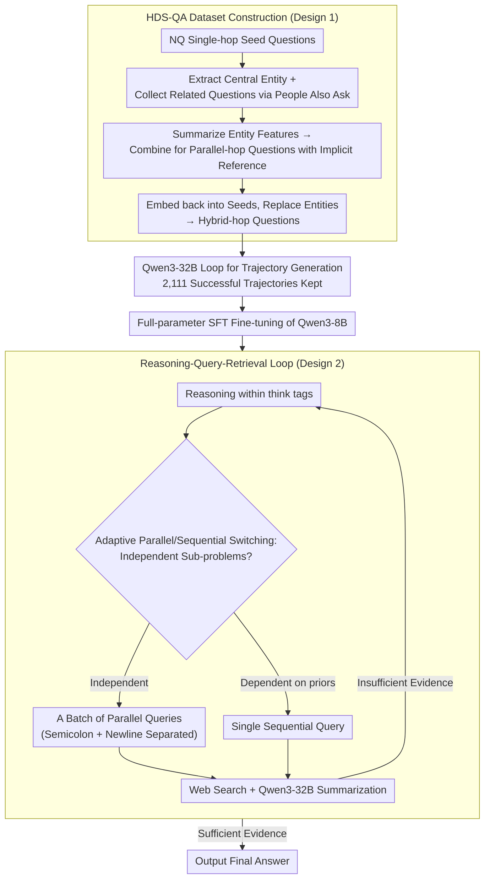

# Hybrid Deep Searcher: Scalable Parallel and Sequential Search Reasoning

**Conference**: ICLR 2026  
**arXiv**: [2508.19113](https://arxiv.org/abs/2508.19113)  
**Code**: None  
**Area**: Information Retrieval  
**Keywords**: Deep Search, Parallel Search, Retrieval-Augmented Generation, Large Reasoning Models, Test-time Search Scaling

## TL;DR

HybridDeepSearcher is proposed, which trains a Large Reasoning Model (LRM) using the HDS-QA dataset to distinguish between parallelizable and sequentially dependent search queries. It achieves a +15.9 F1 improvement on FanOutQA and +11.5 on the BrowseComp subset, while significantly reducing inference latency and demonstrating consistent test-time search scaling capabilities.

## Background & Motivation

Large Reasoning Models (LRMs) such as OpenAI o3 and DeepSeek-R1, combined with Retrieval-Augmented Generation (RAG), form deep research agents that complete complex multi-step tasks through a "reasoning-query-retrieval" loop. However, existing methods have key limitations:

**High Latency**: Purely sequential queries retrieve information one by one, with each query adding to the total latency.

**Incoherent Workflow**: Sequential searching causes models to attempt to answer prematurely or produce repetitive queries.

**Poor Scalability**: When faced with questions requiring exhaustive searches across massive documents, one-by-one querying fails to cover all evidence.

Taking the John Carpenter movie problem as an example: one needs to query the duration of every film. Sequential methods query them individually, which is slow and prone to omissions; whereas **simultaneous querying** of all movie durations is far more efficient and accurate.

Core Problem: **How can LRMs utilize both parallel and sequential search strategies in deep research?**

## Method

### Overall Architecture

This paper addresses the following: enabling deep research agents to both execute independent sub-questions in parallel and handle dependent sub-questions sequentially within the "reasoning-query-retrieval" loop. The solution involves two steps. First, data: existing search training data is either purely single-hop or purely chained multi-hop, preventing models from learning "which sub-questions can be asked simultaneously." Therefore, the authors automatically construct an HDS-QA dataset containing "hybrid-hop" questions—these include both independent, parallelizable sub-questions and sub-questions that depend on previous results. Successful trajectories are generated using Qwen3-32B. Second, training and inference: HybridDeepSearcher is fine-tuned using full-parameter SFT on these trajectories. Every step in the loop, the model uses a generation format with special tokens to decide whether to issue a batch of parallel queries or a single sequential query, continuing until sufficient evidence is gathered.

### Key Designs

**1. HDS-QA Dataset Construction: Creating Hybrid-hop Questions that Require Both Parallel and Sequential Strategies**

To train the ability to be "parallel when appropriate," data demonstrating both strategies is required, yet parallelism is virtually non-existent in current datasets. The authors design a four-step pipeline to manually inject parallelism: first, extract central entities from Natural Questions single-hop seeds; then use Google "People Also Ask" to collect related questions around the entity, keeping only those that retrieve different documents to ensure diversity. Next, summarize retrieved documents into key features of the entity and combine these features to create a parallel-hop question that implicitly refers to the entity—since they refer to the same entity, multiple feature queries are naturally parallelizable. Finally, embed this parallel-hop question back into the original single-hop seed and replace its central entity, adding a layer of sequential dependency and verifying that both parallel and sequential stages require multi-step retrieval. This resulted in 1,987 hybrid-hop questions. Using Qwen3-32B, the "reasoning-query-retrieval" loop was run to generate answer trajectories, allowing multiple parallel queries per step. Each question was repeated 4 times to enrich strategy diversity; 773 questions were answered correctly at least once (pass@4 = 38.9%), collecting 2,111 successful trajectories from 7,948 attempts (trajectory-level success rate approx. 27%), indicating the task's difficulty.

**2. Structured Reasoning-Query-Retrieval Loop: Encoding Parallel and Sequential Queries into Generation Formats via Special Tokens**

Given the data, a parseable protocol for the generation process is needed so the model can "issue multiple queries simultaneously" in one step. The model first reasons within `<think>...</think>` tags, then outputs queries within `<|begin_search_queries|>...<|end_search_queries|>` tags. Multiple parallel queries are separated by semicolons and newlines, allowing a single step to contain either one sequential query or a batch of parallel queries as determined by the model. Each query is executed via a Web Search API, and the returned documents are summarized by an external model (Qwen3-32B) before being fed back into the context, providing evidence while preventing long documents from overwhelming the context. The model iterates until enough evidence is gathered to exit the loop and generate the final answer—this tokenized protocol is the vehicle for explicitly expressing and training the "adaptive switching."

**3. Adaptive Parallel/Sequential Switching: Allowing Models to Choose Strategies Based on Sub-question Dependencies**

With hybrid-hop data and a parseable format, the model learns to make the correct choice at each step. The hybrid-hop data demonstrates both scenarios—independent sub-questions (e.g., "the durations of these twelve films") should be searched in parallel, while sub-questions dependent on previous results (e.g., "first find the director, then check their other work") must proceed sequentially. By imitating these trajectories, the model learns to dynamically judge the current state and explicitly distinguish "currently executing steps" from "future plans" in the reasoning text, making search processes efficient (searching independent sub-questions in one round) without premature answering or redundant querying.

### Loss & Training

Based on Qwen3-8B full-parameter fine-tuning, 2,111 trajectories were used for 1 epoch of training with a learning rate of 3e-5, batch size 4, and 32-step gradient accumulation. Crucially, gradients are not computed for the search result snippets in the trajectories—loss is backpropagated only for the model-generated reasoning and queries. This prevents the model from memorizing specific retrieval content, maintaining generalization. The training takes approximately 30 minutes on 8 A100 40GB GPUs, which is significantly cheaper than RL-based methods.

## Key Experimental Results

### Main Results

| Dataset | Metric | HybridDeepSearcher | RAG-R1 (Prev. SOTA) | Gain |
|--------|------|-------------------|---------------|------|
| MuSiQue | F1 | 31.2 | 29.7 | +1.5 |
| FanOutQA | F1 | 44.1 | 28.2 | **+15.9** |
| FRAMES | F1 | 39.1 | 35.8 | +3.3 |
| MedBrowseComp | MBE | 30.4 | 28.2 | +2.2 |
| BrowseComp-50 | F1 | 17.2 | 5.7 | **+11.5** |

AUC (Efficiency-Effectiveness Trade-off): Achieved the highest value across all benchmarks, indicating the model reaches higher accuracy with fewer search rounds.

### Ablation Study

| Method | MuSiQue Coverage | FanOutQA Coverage | FRAMES Coverage |
|------|---------------|----------------|--------------|
| Search-o1 | 33.4% | 38.3% | 44.8% |
| DeepResearcher | 38.8% | 49.9% | 49.0% |
| RAG-R1 | 35.9% | 53.2% | 48.0% |
| **Ours** | **40.7%** | **61.0%** | **55.8%** |

Evidence coverage saw the largest increase on FanOutQA (+7.8pp), which has the most labeled evidence links and requires extensive parallel retrieval.

### Key Findings

1. **Test-time Search Scaling** (Core Advantage):
    - HybridDeepSearcher performance **continually improves** with more search turns and API calls.
    - Baselines like RAG-R1 see **performance stagnation** after 2-3 rounds.
    - Particularly evident on BrowseComp-50, where other methods barely benefit from increased search budgets.

2. **Efficiency Advantage**: Achieves higher accuracy with fewer search rounds.
    - On FanOutQA, results surpass other methods' 5+ round results in approximately 3 rounds.

3. **Failure of Non-iterative Methods**: Direct generation and standard RAG performed poorly (F1 of 0.0/1.8 on BrowseComp-50), proving these benchmarks require external knowledge and multi-step reasoning.

4. **Case Study Insights**:
    - For the John Carpenter problem in FRAMES, HybridDeepSearcher queried 12 movie durations in parallel to find the correct answer (Starman, 115 min), while DeepResearcher guessed "The Thing" and Search-o1 fell into a query loop.

## Highlights & Insights

1. **Unified Parallel and Sequential Search**: First to systematically train LRMs to distinguish between parallelizable and dependent queries, filling a gap in existing work.
2. **Clever Dataset Construction**: The automated HDS-QA pipeline introduces parallelism via "People Also Ask" from NQ seeds, which is elegant and scalable.
3. **SFT Superiority over RL**: Fine-tuning with just 2,111 trajectories outperformed RL methods using GRPO (e.g., Search-R1, DeepResearcher), highlighting the importance of high-quality hybrid search demonstration data.
4. **Search Scalability**: This is one of the few works demonstrating consistent test-time search scaling where performance does not saturate with increasing compute budget.
5. **Low Training Cost**: micro-tuning for only 30 minutes on 8 A100s makes the cost much lower than RL training.

## Limitations & Future Work

1. Only SFT was used; combining with preference optimization (DPO/RLHF) using successful and failed trajectories from HDS-QA could further improve performance.
2. Summarization of search queries relies on an external model (Qwen3-32B), increasing system complexity and API costs.
3. HDS-QA is only based on Natural Questions, potentially limiting domain coverage.
4. Multi-agent collaborative search was not explored.
5. BrowseComp-50 only selected 50 problems that o3 could solve, which might introduce selection bias in evaluation.

## Related Work & Insights

- **Search-o1**: A prompt-based iterative reasoning-query-retrieval framework using sequential single-query search.
- **Search-R1 / DeepResearcher**: Uses GRPO to enhance search reasoning but lacks parallel search demonstrations in training.
- **RAG-R1**: A multi-query baseline with strong performance but lacking search scalability.
- **APR**: Adaptive Parallel Reasoning, but only validated on toy tasks like Countdown.

Insight for RAG system design: Treating "when to parallelize vs. search sequentially" as an explicit training signal is more effective than simply increasing reasoning power. Hybrid search strategies may be a critical capability for large-scale deep research agents.

## Rating
- Novelty: ⭐⭐⭐⭐
- Experimental Thoroughness: ⭐⭐⭐⭐⭐
- Writing Quality: ⭐⭐⭐⭐
- Value: ⭐⭐⭐⭐⭐

<!-- RELATED:START -->

## Related Papers

- [\[ICLR 2026\] Beyond Sequential Reranking: Reranker-Guided Search Improves Reasoning Intensive Retrieval](beyond_sequential_reranking_reranker-guided_search_improves_reasoning_intensive_.md)
- [\[ICLR 2026\] SynthWorlds: Controlled Parallel Worlds for Disentangling Reasoning and Knowledge in Language Models](synthworlds_controlled_parallel_worlds_for_disentangling_reasoning_and_knowledge.md)
- [\[ICLR 2026\] Demystifying Deep Search: A Holistic Evaluation with Hint-free Multi-Hop Questions and Factorised Metrics](demystifying_deep_search_a_holistic_evaluation_with_hint-free_multi-hop_question.md)
- [\[ICLR 2026\] Summaries as Centroids for Interpretable and Scalable Text Clustering](summaries_as_centroids_for_interpretable_and_scalable_text_clustering.md)
- [\[ICLR 2026\] ZeroGR: A Generalizable and Scalable Framework for Zero-Shot Generative Retrieval](zerogr_a_generalizable_and_scalable_framework_for_zero-shot_generative_retrieval.md)

<!-- RELATED:END -->
