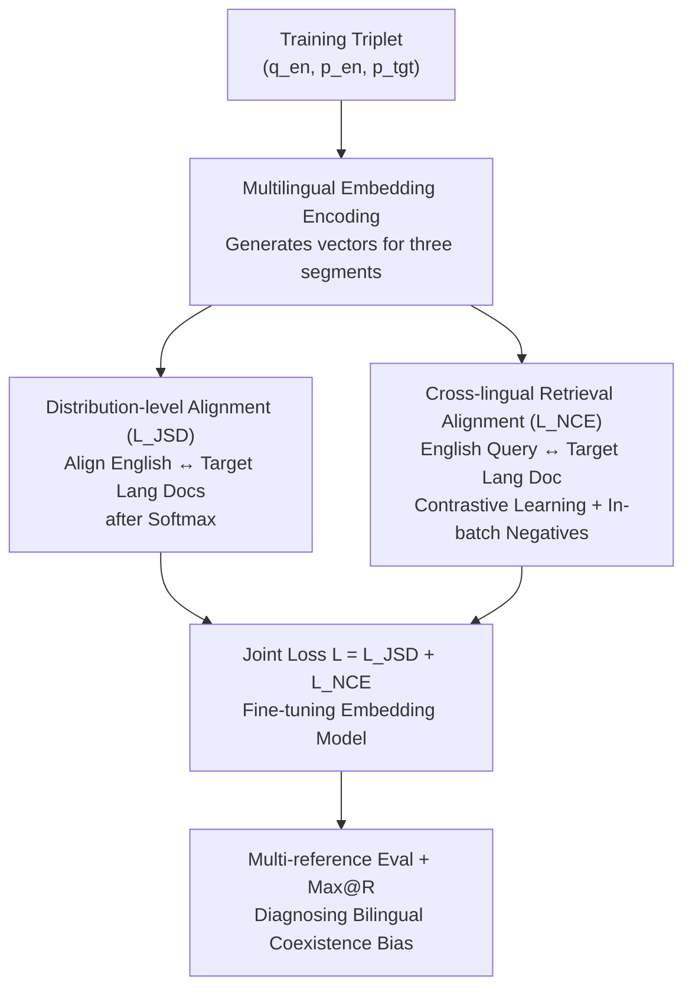

# Improving Semantic Proximity in Information Retrieval through Cross-Lingual Alignment

**Conference**: ICLR 2026  
**OpenReview**: [https://openreview.net/forum?id=NvKvW5k6Kk](https://openreview.net/forum?id=NvKvW5k6Kk)  
**Code**: TBD  
**Area**: Information Retrieval / Cross-Lingual Retrieval / Multilingual Representation  
**Keywords**: Cross-Lingual Retrieval, Semantic Alignment, Jensen-Shannon Divergence, English Bias, Max@R

## TL;DR
Targeting real-world retrieval scenarios where "documents in two languages coexist," this paper reveals that mainstream multilingual embeddings blindly rank irrelevant English documents ahead of relevant documents in the target language. It proposes a new evaluation scenario and the Max@R metric to quantify this bias, while utilizing JSD distribution-level alignment and InfoNCE retrieval losses to significantly improve cross-lingual alignment and flatten performance gaps across languages using only 2.8k samples, without harming monolingual retrieval.

## Background & Motivation
**Background**: Conventional evaluation of Cross-Lingual Information Retrieval (CLIR) assumes that "query language $\neq$ document language, and the document pool contains only one language"—the query is in language A, while the document pool is entirely in language B, measuring whether the model can recall across languages. Multilingual Information Retrieval (MLIR) mixes three or more languages into a single document pool for ranking. Both are standard benchmarks for multilingual embedding models (e.g., multilingual-e5, gte, jina, bge-m3).

**Limitations of Prior Work**: This "single-language document pool" setup masks a critical issue in real-world scenarios. In practice, document pools often feature **bilingual coexistence**—containing both English documents and documents in the target language same as the query. The authors observe that when the query is in Chinese and the document pool contains both relevant Chinese documents and irrelevant English documents, most multilingual retrievers **prioritize irrelevant English documents**, pushing the correct Chinese documents to much lower positions.

**Key Challenge**: The root cause lies in **cross-lingual semantic misalignment** within the embedding space and a **systematic bias towards high-resource languages (English)**. Two semantically equivalent text segments (one in English, one in the target language) may have a cosine similarity as high as 0.99, yet their **distributions** across embedding dimensions remain severely misaligned (Figure 1: for the same 0.99 similarity, the distribution overlap area produced by InfoNCE training is 18.61, while the proposed method reduces it to 7.98). Conventional metrics like MAP/MRR/NDCG@k are not designed for "one query corresponding to multiple parallel ground-truths" and fail to detect this bias.

**Goal**: The objectives are two-fold: ① Design an evaluation scenario and metric capable of exposing and quantifying the "bilingual coexistence bias"; ② Propose a training strategy to truly repair cross-lingual misalignment at the embedding level.

**Key Insight**: Since the problem stems from "high similarity but misaligned distributions," optimization should not merely focus on similarity scores but rather **directly align the embeddings of the two languages at the distribution level**.

**Core Idea**: Treat embedding vectors as probability distributions via softmax and use Jensen-Shannon Divergence (JSD) to align the distributions of English and target language documents (to fix misalignment). Simultaneously, apply InfoNCE to bring English queries and target language documents closer (to fix English bias). Both losses are optimized jointly.

## Method

### Overall Architecture
The approach follows two main lines. **Evaluation side**: The authors construct a "Multi-reference Cross-lingual Scenario"—where English and target language documents are fully parallel in the pool, and each query has two equivalent ground-truths (English and target language versions). A new metric, Max@R, measures "the rank required to recall all relevant documents." **Training side**: Using a triplet dataset $(q_{en}, p_{en}, p_{tgt})$ (English query, English positive document, target language positive document), the model is fine-tuned to satisfy two objectives—aligning the embedding distributions of English and target language documents ($L_{JSD}$) and improving the retrieval similarity between English queries and target language documents ($L_{NCE}$). The total loss is their sum:

$$L = \mathbb{E}_{(q_{en},p_{en},p_{tgt})}[L_{JSD} + L_{NCE}]$$

Despite the extremely small training data (2.8k English query-doc pairs from MIRACL, with target language documents translated from English positives via GPT-4o), the method is universally effective across four mainstream embedding models.

### Key Designs

**1. Multi-reference Cross-lingual Scenario + Max@R Metric: Quantifying "English Bias"**

This serves as the diagnostic foundation, addressing the limitation that conventional CLIR cannot measure bilingual coexistence bias. The authors design a document pool where English and the target language are **fully parallel**, meaning each query $q$ has a set of parallel ground-truth documents $R_q = \{r_1, \dots, r_m\}$ (different language versions of the same content). An ideal model should rank these equivalent documents at the very top **regardless of language**. To measure "complete recall," given the ranked results $D'(q)=\{d'_1, \dots, d'_n\}$, the metric is defined as:

$$\text{Max@R} = \max(\{i \mid d'_i \in R_q\})$$

This represents the "rank of the worst-performing relevant document"—i.e., how deep one must search to retrieve all documents in $R_q$. A lower Max@R is better. For cross-dataset comparability, a log-normalized version Max@R$_{norm}$ is provided, mapping the maximum rank of each query to 0–100: $\text{Max@R}_{norm}=\frac{1}{|Q|}\sum_q [100\times\frac{\log_2|D|-\log_2(\text{Max@R})}{\log_2|D|-\log_2|R|}]$, where $|D|$ is the pool size and $|R|$ is the number of ground-truths. This metric immediately exposes risks: multilingual-e5's Max@R reaches 650.95 under Chinese queries, meaning hundreds of documents must be browsed for complete recall—a problem invisible in conventional CLIR settings.

**2. Distribution-level Semantic Alignment $L_{JSD}$: Aligning Embedding Shapes, Not Just Scores**

Addressing the core contradiction where "similarity is 0.99 but distributions are misaligned." Instead of the conventional approach of modeling query-doc similarity as a distribution to approximate a reference, this work **directly treats the embedding vector itself as a probability distribution over dimensions**. Given English doc embedding $z_{d_{en}}\in\mathbb{R}^{dim}$ and target language doc embedding $z_{d_{tgt}}\in\mathbb{R}^{dim}$, a softmax converts vectors into "categorical distributions over dimensions": $P(z)_i = \frac{\exp(z_i)}{\sum_k \exp(z_k)}$. JSD is used instead of KL divergence because KL is asymmetric; JSD computes the average KL divergence of both distributions to their midpoint $M=\frac12(P+Q)$: $\text{JSD}(P\|Q)=\frac12 D_{KL}(P\|M)+\frac12 D_{KL}(Q\|M)$. The loss is the **square root** of JSD:

$$\min L_{JSD} = \sqrt{\text{JSD}(P(z_{d_{en}})\,\|\,P(z_{d_{tgt}}))} + \epsilon$$

The choice of the square root is significant—$\sqrt{\text{JSD}}$ satisfies the three metric axioms (identity, symmetry, triangle inequality), forming a valid metric space. Minimizing it as a strict "distance" between cross-lingual distributions is more effective at aligning linguistic probability structures at the dimensional level than simply compressing similarity scores.

**3. Cross-lingual Retrieval Alignment $L_{NCE}$: Correcting English Bias via Contrastive Learning**

Aligning document distributions alone is insufficient for retrieval; searchability between queries and documents must be optimized separately. The authors use InfoNCE contrastive loss, where the positive pair is the **English query $q_{en}$ paired with the target language document $p_{tgt}$** (rather than the English document), and negative examples are queries from other instances in the batch:

$$\min L_{NCE} = -\frac{1}{n}\sum_i \log \frac{\exp(s(p_{tgt_i}, q^+_{en_i}))}{\exp(s(p_{tgt_i}, q^+_{en_i})) + \sum_j \exp(s(p_{tgt_i}, q^-_{en_{ij}}))}$$

where $s(p,q)$ is the cosine similarity. The key is that the positive pair is **deliberately cross-lingual**: directly boosting the "English query ↔ target language document" similarity while suppressing irrelevant items, thereby correcting the bias towards English documents. Ablations show retrieval fails without this term (see below), making it complementary to $L_{JSD}$.

### Loss & Training
The final objective is the equal-weighted sum $L = \mathbb{E}[L_{JSD}+L_{NCE}]$, used to fine-tune off-the-shelf multilingual embedding models on $(q_{en},p_{en},p_{tgt})$ triplets. The training set is minimal (2.8k pairs from MIRACL-English, with the target language side translated via GPT-4o), covering 10 languages (AR/ZH/ES/TH/VI reported in the main results).

## Key Experimental Results

### Main Results
Evaluation of four backbones (multilingual-e5-base, gte-multilingual-base, jina-embeddings-v3, bge-m3) on XQuAD and Belebele (fully parallel benchmarks) in the "Multi" (bilingual coexistence) scenario using Comp@10↑, Max@R↓, and Max@R$_{norm}$↑. The proposed method (Ours) shows comprehensive improvements over the Base, especially on non-English queries:

| Model / Setting | Query | Metric | Base | Ours |
|------|------|------|------|------|
| multilingual-e5 · En+Zh (XQuAD) | Zh | Comp@10 | 0.50 | 55.88 |
| multilingual-e5 · En+Zh (XQuAD) | Zh | Max@R↓ | 650.95 | 23.10 |
| multilingual-e5 · En+Ar (XQuAD) | Ar | Comp@10 | 8.91 | 53.53 |
| jina-v3 · En+Es (XQuAD) | En | Comp@10 | 68.32 | 75.63 |
| gte-multilingual · En+Th (Belebele) | Th | Comp@10 | 77.11 | 78.67 |

The most dramatic result is for multilingual-e5 with Chinese queries: Max@R dropped from 650.95 to 23.10, and Comp@10 surged from near-zero (0.50) to 55.88.

### Ablation Study
Max@R$_{norm}$ (English/Target queries) results on Belebele (Multi scenario), comparing the removal of individual losses and a "doc-doc similarity" baseline $L_{NCEpsg}$:

| Configuration | jina-v3 Th (En/Tgt) | Description |
|------|---------------------|------|
| Baseline | 68.03 / 64.65 | Original model |
| $L_{NCEpsg}$ | 72.35 / 68.66 | Only aligns English doc ↔ Target lang doc similarity |
| **Ours** | **76.69 / 69.63** | Joint JSD + InfoNCE |
| w/o $L_{JSD}$ | 71.90 / 68.19 | Distribution alignment removed; CLIR alignment drops |
| w/o $L_{NCE}$ | 15.47 / 14.26 | Retrieval loss removed; retrieval fails almost entirely |

### Key Findings
- **Strong Complementarity**: Removing $L_{JSD}$ causes both embedding alignment and overall retrieval to decline. Removing $L_{NCE}$ is even more fatal—jina-v3's Max@R$_{norm}$ on Th crashes from 76.69 to 15.47, indicating that aligning distributions without optimizing query-document similarity collapses retrieval capability.
- **Superiority over Doc-Doc Similarity**: $L_{NCEpsg}$ (aligning bilingual doc similarity) improves over the baseline, but the proposed method consistently leads—proving that "directly aligning representation distributions" is more fundamental and effective for downstream query-doc retrieval than simply increasing similarity scores.
- **Flattening Language Bias**: The English-target language performance gap for jina-v3 (En+Zh) decreased from 6.89%p to 1.77%p (XQuAD) and from 4.45%p to 0.12%p (Belebele), significantly improving linguistic fairness.
- **No Harm to Monolingual Retrieval**: In Mono-Same / Mono-Cross settings, the method maintains or slightly improves baseline performance, with small gains on target language queries—suggesting that alignment indirectly enhances monolingual representation quality rather than sacrificing it for cross-lingual gains.

## Highlights & Insights
- **Sharp Diagnosis of "High Similarity $\neq$ True Alignment"**: Figure 1's example of 0.99 cosine similarity with doubled distribution overlap effectively highlights the blind spots of existing training objectives.
- **Treating Embeddings as Distributions for JSD Alignment**, specifically using the square root to maintain a valid metric space, is a clean and reusable trick applicable to any cross-modal or cross-domain task requiring distribution-level alignment.
- **Deliberate Cross-Lingual Positive Pairs (English Query ↔ Target Lang Doc)** in InfoNCE directly treats "English bias" as a correction target, a simple yet effective remedy.
- **The Max@R Metric** fills a gap in evaluating "full recall of parallel ground-truths," exposing risks in bilingual scenarios better than MAP/MRR/NDCG.
- **High Cost-Efficiency**: Achieving universal improvements across four models using only 2.8k samples and GPT-4o translation.

## Limitations & Future Work
- Target language documents were translated from English via GPT-4o, which introduces translation noise and cultural/semantic distortion; performance on authentic human-parallel corpora is not fully verified.
- The evaluation relies heavily on "fully parallel" benchmarks (XQuAD, Belebele). In reality, document pools are rarely fully parallel, leaving the robustness in noisy, non-parallel corpora unproven.
- Only "English + One Target Language" bilingual pools were studied; the bias dynamics and method effectiveness in trilingual or mixed multilingual pools (true MLIR) remain unexplored.
- The equal weighting of $L_{JSD}$ and $L_{NCE}$ was not extensively tuned, and the sensitivity of the softmax approach to embedding numerical scales warrants more analysis.

## Related Work & Insights
- **vs. Traditional CLIR Knowledge Transfer / Shared Space** (Litschko, Huang et al.): These often assume purely monolingual or multilingual pools, relying on optimal transport or multi-stage distillation; this work focuses on the ignored reality of "bilingual coexistence" and provides a metric to detect hidden biases therein.
- **vs. Contrastive Retrieval Optimizing Query-Doc Similarity**: This paper argues that optimizing similarity scores alone is insufficient for robust semantic proximity and distribution alignment is necessary ($L_{JSD}$ vs pure InfoNCE).
- **vs. Explicit Multilingual Embedding Alignment** (Hu et al. 2020 using parallel corpora for sentence-level alignment): Those works focus on general representation alignment rather than specific bilingual mixture challenges in retrieval.
- **vs. $L_{NCEpsg}$ (Doc-Doc Similarity)**: While both aim to bridge languages, aligning representation distributions is shown to be more effective for downstream retrieval than aligning scalar similarity scores.

## Rating
- **Novelty**: ⭐⭐⭐⭐ Bilingual coexistence scenario + Max@R metric + JSD distribution alignment is a novel and well-targeted combination.
- **Experimental Thoroughness**: ⭐⭐⭐⭐ 4 models × 2 benchmarks × multiple scenarios + clean ablations, though limited to synthetic parallel data.
- **Writing Quality**: ⭐⭐⭐⭐ Problem definition, Figure 1 diagnosis, and formulaic derivations are clear and intuitive.
- **Value**: ⭐⭐⭐⭐ Low-cost, plug-and-play improvement for multilingual retrieval fairness with a reusable diagnostic framework.

<!-- RELATED:START -->

## Related Papers

- [\[ACL 2025\] Cross-Lingual Relevance Transfer for Document Retrieval](../../ACL2025/information_retrieval/cross-lingual_relevance_transfer_for_document_retrieval.md)
- [\[ICLR 2026\] Mapping Semantic & Syntactic Relationships with Geometric Rotation](mapping_semantic_syntactic_relationships_with_geometric_rotation.md)
- [\[ICLR 2026\] Seeing Through Words: Controlling Visual Retrieval Quality with Language Models](seeing_through_words_controlling_visual_retrieval_quality_with_language_models.md)
- [\[ICLR 2026\] Deep Global-sense Hard-negative Discriminative Generation Hashing for Cross-modal Retrieval](deep_global-sense_hard-negative_discriminative_generation_hashing_for_cross-moda.md)
- [\[ICLR 2026\] Lean Finder: Semantic Search for Mathlib That Understands User Intents](lean_finder_semantic_search_for_mathlib_that_understands_user_intents.md)

<!-- RELATED:END -->
