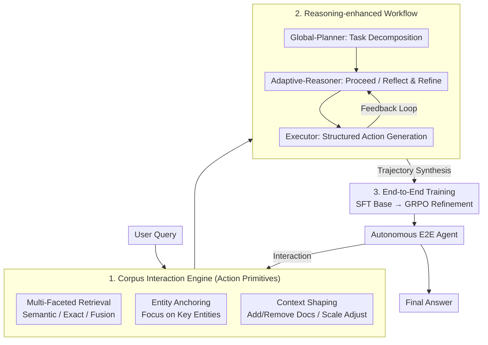

# Interact-RAG: Reason and Interact with the Corpus, Beyond Black-Box Retrieval

**Conference**: ICLR 2026  
**OpenReview**: [https://openreview.net/forum?id=yHUjWb6eMe](https://openreview.net/forum?id=yHUjWb6eMe)  
**Area**: Agent / Retrieval-Augmented Generation (RAG)  
**Keywords**: Agentic RAG, Corpus Interaction, Fine-grained Retrieval, SFT+RL, GRPO

## TL;DR
Addressing the limitation where existing agentic RAG treats retrieval as a "black-box query" and agents can only repeatedly rephrase queries, this paper proposes Interact-RAG. By introducing a "Corpus Interaction Engine," the retrieval process is decomposed into fine-grained action primitives: multi-faceted retrieval, entity anchoring, and context shaping. This is coupled with a "Plan-Reason-Execute" workflow for trajectory synthesis, followed by SFT+RL to train an end-to-end autonomous agent. It achieves an average improvement of 22.5% over the second-best method across six RAG benchmarks.

## Background & Motivation

**Background**: RAG has evolved from single-retrieval Static RAG to multi-step Iterative RAG, and now to the cutting-edge Agentic RAG—where an LLM agent autonomously decides "when to retrieve, what to search for, and how to analyze results." This is typically driven by prompt-based multi-agent collaboration or end-to-end SFT+RL training to enhance reasoning and adaptivity.

**Limitations of Prior Work**: Despite paradigm shifts, nearly all agentic RAG systems share a fundamental flaw—they treat the retrieval process as an opaque black box. Agents can only "issue a query and passively receive a set of text chunks," usually via an embedding-based semantic retriever. Agents cannot observe internal retrieval states or perform fine-grained interventions, trapping exploration in a trial-and-error loop of "rephrasing the query."

**Key Challenge**: Retrieval failures are often not due to "incorrect query semantics" but rather differences in evidence expression (e.g., asking for a "release date" when the text says "is a 1976 thriller") or distracting entities with similar semantics (e.g., retrieving "The Hound of Death" instead of "The Jaws of Death"). Such failures cannot be bypassed by synonym rephrasing based on semantic similarity; black-box retrieval lacks structured capabilities like **exact matching, entity focusing, and noise filtering**.

**Goal**: To upgrade the agent from a "passive query issuer" to an "active retrieval process controller" by providing fine-grained manipulation tools and teaching it to navigate complex multi-step interaction processes strategically.

**Key Insight**: The authors argue for "dismantling the black box," allowing the agent to manipulate the corpus directly like a human researcher: choosing retrieval strategies (semantic/exact/weighted fusion), anchoring entities, and actively adding/removing context documents. However, since prompting LLMs to master this complex flow is difficult, a hierarchical workflow is designed to serve as both a zero-shot solver and a data synthesizer, finally distilling the strategy into an end-to-end agent.

**Core Idea**: A triplet of an "Interactive Corpus Engine + Reasoning-enhanced Workflow + SFT/RL Training" to transform retrieval from "black-box querying" into a "transparent and controllable interaction process."

## Method

### Overall Architecture

Interact-RAG consists of three core components: (1) **Corpus Interaction Engine**: provides fine-grained primitives for multi-strategy retrieval, entity anchoring, and context shaping; (2) **Reasoning-enhanced Workflow**: decomposes agent behavior into "Global-Planner → Adaptive-Reasoner → Executor," serving as both a zero-shot solution and a high-quality trajectory synthesizer; (3) **End-to-end Training**: uses synthesized trajectories for SFT followed by GRPO reinforcement learning to create an **autonomous agent** that runs the entire process without an explicit multi-module architecture.

At runtime, the agent reads history and outputs a "reasoning thought" followed by a set of concurrent actions $A_t=\{a_{t1},a_{t2},\dots\}$ (encapsulated as structured `<tool_call>` function calls). After execution, the engine returns aggregated retrieval content and key metadata (doc IDs, similarity scores) in a `<tool_response>`, allowing the agent to perform strategic analysis and dynamically adjust next steps.

### Key Designs

**1. Corpus Interaction Engine: Dismantling the Black Box with Action Primitives**

This component addresses the "query-only" bottleneck by defining an interaction action space $\mathcal{A}_{CI}$ with three classes of primitives. **Multi-Faceted Retrieval** provides `semantic_search` (dense embedding retrieval) and `exact_search` (sparse retrieval for keywords/terms), plus `weighted_fusion(ws, we)` to balance both. **Anchored Matching** uses `entity_match(entity)` to focus search on specific entities, suppressing distractions. **Context Shaping** allows the agent to carve the context: `include_docs`/`exclude_docs` force-keep or filter documents, and `adjust_scale(n)` adapts retrieval volume to sub-problem complexity.

Implementing these structural capabilities (exact match, filtering) solves failures that rephrasing cannot. The engine leverages SQLite Full-Text Search (FTS) for efficiency. Even with multiple strategy calls, it returns a **single integrated context** to maintain efficiency.

**2. Reasoning-enhanced Workflow: Plan-Reason-Execute as Solver and Synthesizer**

To steer the LLM through complex interactions, behavior is split into three modules. The **Global-Planner** generates a high-level roadmap. The **Adaptive-Reasoner** is the cognitive core: it chooses to **Proceed** if information is sufficient, or **Reflect & Refine** if progress is stalled (e.g., diagnosing failure and switching to `exact_search` to find a specific term). The **Executor** translates strategies into structured function calls.

This decoupling improves reliability and enables two functions: a training-free zero-shot RAG method and a data synthesis engine. It produces clean reasoning trajectories for training without the wordy or off-topic outputs often found in native Large Reasoning Models (LRM).

**3. SFT + RL Two-Stage Training: Internalizing Strategies into a Single Agent**

The goal is an autonomous agent without multi-module overhead. In the **SFT Phase**, the model learns planning and tool usage by predicting thought and action sequences from successful workflow trajectories (where the answer matches the ground truth). In the **RL Phase**, GRPO (Group Relative Policy Optimization) is used for policy exploration. In both phases, **retrieved information tokens are masked** during loss calculation to prevent the model from overfitting to external text instead of learning interaction strategies.

The reward function focuses on syntactic legality and answer correctness:

$$R(\tau) = -1 + \mathbb{I}\{\tau_{valid}\} + \mathbb{I}\{\tau_{valid}\}\cdot\mathbb{I}\{y_{ans}\}$$

A $-1$ penalty encourages formatted output; legality (syntax/format) offsets this; and the correctness reward is **gated** by legality to ensure only well-formatted outputs receive points for correct answers.

### Loss & Training
GRPO objective (with importance sampling ratio $\rho_\theta$, clipping $1\pm\epsilon$, and KL divergence $\beta D_{KL}(\pi_\theta\|\pi_{ref})$). Backbone: Qwen3-8B (also Qwen2.5-7B). Synthesis: 4.8K SFT trajectories + 7.1K QA pairs for RL. Data: NQ+HotpotQA+MuSiQue. Retriever: e5-base-v2, top-3 chunks.

## Key Experimental Results

### Main Results

EM score comparison across six benchmarks (Qwen3-8B backbone):

| Method | 2Wiki | Musique | Bamboogle | NQ | PopQA | AVG-EM |
|------|-------|---------|-----------|------|-------|--------|
| Std-RAG | 35.9 | 13.7 | 37.1 | 37.3 | 31.4 | 37.6 |
| MA-RAG | 45.5 | 18.0 | 34.6 | 40.2 | 35.5 | 39.3 |
| Search-R1† | 50.9 | 25.5 | 45.3 | 49.3 | 43.1 | 45.2 |
| S-DeepSearch† | 54.0 | 18.6 | 37.0 | 40.6 | 39.4 | 40.2 |
| **Interact-RAG** | **69.6** | **34.8** | **50.9** | **56.0** | **52.8** | **51.6** |

Average EM is 9.7 points higher than Search-R1 (22.5% relative gain), using only 12K QA pairs vs Search-R1's 170K. Multi-hop gains are significant (Musique +36.4%).

### Ablation Study

Component Ablation (EM, Qwen3-8B):

| Config | 2Wiki | Musique | PopQA | Description |
|------|-------|---------|-------|------|
| Interact-RAG | 69.6 | 34.8 | 56.0 | Full Model |
| w/o Interaction | 63.4 (-8.9%) | 30.1 (-10.9%) | 50.2 (-10.4%) | Degrades to Black-box |
| w/o SFT | 59.0 (-15.2%) | 26.4 (-21.9%) | 52.2 (-6.8%) | No SFT Stage |
| w/o RL | 65.2 (-6.3%) | 28.1 (-16.9%) | 45.6 (-18.6%) | No RL Stage |

Interaction Primitives Ablation (EM):

| Config | 2Wiki | Musique | PopQA |
|------|-------|---------|-------|
| Interact-RAG | 69.6 | 34.8 | 56.0 |
| w/o Multi-Faceted | 66.0 | 34.6 | 55.1 |
| w/o Anchored Matching | 66.3 | 34.4 | 53.4 |
| w/o Context Shaping | 68.8 | 33.6 | 55.2 |
| w/o All Interactions | 63.4 | 30.1 | 50.2 |

### Key Findings
- **Interaction is Foundational**: Removing interaction consistently degrades performance, proving fine-grained control is essential.
- **SFT vs RL**: SFT establishes the framework for planning/tool use (crucial for Musique), while RL discovers more strategic behaviors (crucial for PopQA).
- **Synergy of Primitives**: Multi-faceted and anchored matching are vital for factual precision (2Wiki), while context shaping benefits noisy datasets (Musique).
- **Effective Zero-shot**: The training-free workflow outperformed MA-RAG significantly.
- **Highly Efficient**: Interact-RAG achieves higher EM with fewer action iterations compared to query-only benchmarks.

## Highlights & Insights
- **Opening the Black Box**: Framing the issue as a lack of structural capability rather than poor query wording is a strong diagnostic insight.
- **Workflow as Solver and Factory**: The three-module workflow allows a general LLM to generate high-quality, concise reasoning data for SFT without LRM-style verbosity.
- **Concurrent Actions + Aggregated Context**: Allowing multiple primitives per round while returning one context optimizes flexibility without context-window overhead.
- **Token Masking for Strategy**: Masking retrieval content tokens forces the model to learn the "how to search" logic rather than memorizing external facts.

## Limitations & Future Work
- Scalability of FTS and additional indexing for extremely large-scale or unstructured corpora was not fully explored.
- Evaluation focused on Wikipedia QA; performance on specialized domains (e.g., medical, private documents) or long-form document RAG needs validation.
- Survivor bias in data synthesis: only successful trajectories were kept, potentially wasting signals in unsuccessful attempts.
- Reward is outcome-based; process-oriented rewards could further refine retrieval quality or reduce redundant actions.

## Related Work & Insights
- **vs Search-R1**: Both train E2E agents, but Search-R1 remains a black-box query model. Interact-RAG surpasses it by 9.7 EM with much less data by changing the action space.
- **vs MA-RAG**: MA-RAG uses multi-agent collaboration but is limited by the black box; Interact-RAG’s workflow and distal agent model outperform it with lower inference overhead.
- **vs S-DeepSearcher / R-Search**: These optimize query generation or reward signals, whereas Interact-RAG modifies the fundamental action space.

## Rating
- Novelty: ⭐⭐⭐⭐⭐ Transforming retrieval into a controllable interaction is a significant paradigm shift in agentic RAG.
- Experimental Thoroughness: ⭐⭐⭐⭐⭐ Comprehensive benchmarks, multi-level ablations, and efficiency analysis.
- Writing Quality: ⭐⭐⭐⭐ Clear logic and problem framing, though some minor chart numbering inconsistencies exist.
- Value: ⭐⭐⭐⭐⭐ Achieves SOTA gains with minimal data and offers a practical training-free workflow.

<!-- RELATED:START -->

## Related Papers

- [\[ACL 2026\] Beyond Black-Box Interventions: Latent Probing for Faithful Retrieval-Augmented Generation](../../ACL2026/information_retrieval/beyond_black-box_interventions_latent_probing_for_faithful_retrieval-augmented_g.md)
- [\[ICLR 2026\] Beyond RAG vs. Long-Context: Learning Distraction-Aware Retrieval for Efficient Knowledge Grounding](beyond_rag_vs_long-context_learning_distraction-aware_retrieval_for_efficient_kn.md)
- [\[ICLR 2026\] Beyond Text-Only: Towards Multimodal Table Retrieval in Open-World](beyond_text-only_towards_multimodal_table_retrieval_in_open-world.md)
- [\[ICLR 2026\] Query-Aware Flow Diffusion for Graph-Based RAG with Retrieval Guarantees](query-aware_flow_diffusion_for_graph-based_rag_with_retrieval_guarantees.md)
- [\[ICLR 2026\] Fathom-DeepResearch: Unlocking Long Horizon Information Retrieval and Synthesis for SLMs](fathom-deepresearch_unlocking_long_horizon_information_retrieval_and_synthesis_f.md)

<!-- RELATED:END -->
