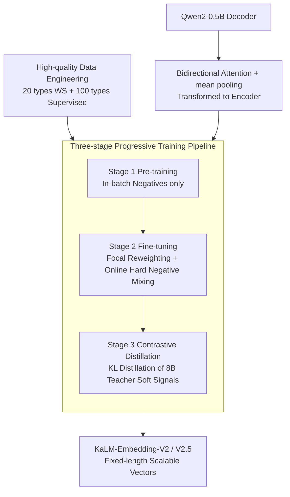

# KaLM-Embedding-V2: Superior Training Techniques and Data Inspire A Versatile Embedding Model

**Conference**: ICLR 2026  
**OpenReview**: [https://openreview.net/forum?id=Y7qzhvWhcz](https://openreview.net/forum?id=Y7qzhvWhcz)  
**Code**: https://kalm-embedding.github.io/ (Available)  
**Area**: Text Embedding / Information Retrieval  
**Keywords**: Text Embedding, Contrastive Learning, Contrastive Distillation, Hard Negatives, Multi-stage Training

## TL;DR
This paper transforms a 0.5B Qwen2 decoder into a fully bidirectional encoder, coupled with a "Pre-training → Fine-tuning → Contrastive Distillation" three-stage pipeline, Focal-style reweighting, online hard negative mixing, and high-quality data engineering covering 100+ categories. This allows KaLM-Embedding-V2.5 to achieve SOTA results in the <1B parameter segment on MTEB Chinese and English benchmarks, even competing with models 3–26 times larger.

## Background & Motivation
**Background**: Text embeddings serve as the underlying infrastructure for retrieval, reranking, classification, STS, and RAG. Over the past two years, the mainstream approach has been using LLMs (Mistral / Qwen, etc.) as the backbone, employing contrastive learning to push semantically similar texts closer and dissimilar ones further apart, while relying on massive data scale or synthetic data for performance gains.

**Limitations of Prior Work**: Most high-performance embedding models come from the industry, featuring private data, closed training code, commercial restrictions, and poor reproducibility. Simultaneously, they focus almost entirely on "data scale/synthesis," with little systematic exploration of the **training techniques** and **data quality** themselves. There is a lack of clarity on how architectural design, training objectives, and data strategies should be orchestrated to fully extract the embedding potential within LLMs.

**Key Challenge**: Practical deployment prioritizes **versatility** (one model for all tasks) and **compactness** (small parameters, fast inference). However, existing SOTAs are either very large (7B–13B) or closed-source black boxes, making it difficult to achieve both. Smaller models often fail to improve performance by simply accumulating data.

**Goal**: To achieve SOTA in the <1B parameter range with an open-source, commercially viable, and reproducible embedding model at the compact 0.5B scale, and to systematically answer "which combination of training techniques and data quality is most effective."

**Key Insight**: Instead of mindlessly expanding data scale, the authors focus on three overlooked dimensions simultaneously: architecture (removing causal masks, enabling bidirectional attention), training objectives (preventing optimization from being skewed by a sea of easy samples), and data (fine-grained classification + hard negative mining + exemplar-based multi-class labeling).

**Core Idea**: A four-pronged approach—"bidirectional architecture + three-stage progressive training + difficulty-aware training objectives + high-quality data engineering"—is used to systematically inject the knowledge of LLMs into a 0.5B embedding model.

## Method

### Overall Architecture
KaLM-Embedding-V2 starts from Qwen2-0.5B: First, **architectural modification** is performed—removing the decoder's causal attention mask to make it fully bidirectional and using simple mean-pooling to compress variable-length token representations into a fixed-length vector $E \in \mathbb{R}^d$. The modified model is trained along a **three-stage progressive pipeline**: Stage 1 involves pre-training on 20+ categories of weakly-supervised large-scale data (using only in-batch negatives) to learn general representations; Stage 2 involves fine-tuning on 100+ categories of high-quality supervised data, utilizing a "hard negative engine" with **Focal reweighting + online hard negative mixing**; Stage 3 performs **contrastive distillation** to extract fine-grained soft signals from a Qwen3-Embedding-8B teacher. The entire pipeline is supplied by **high-quality data engineering** covering retrieval, classification, clustering, STS, and pair classification. The model undergoing only pre-training and fine-tuning is called V2, while the one including contrastive distillation is V2.5.

### Key Designs

**1. Bidirectional Attention + mean pooling Architecture Modification: Transforming Decoders into Qualified Encoders**

Decoder LLMs inherently possess causal masks, where each token can only attend to the preceding context. This is a natural disadvantage for representation learning, which requires understanding the full sentence semantics to compress it into a vector. This paper directly removes the causal mask and enables full bidirectional attention during both training and inference, allowing each token to see the entire context. The pooling layer $P(\cdot)$ uses simple mean-pooling instead of a learnable head, averaging token representations $T_{emb}=K(T)$ into a single vector $E=P(T_{emb})$. The query side is prepended with optional task instructions $q_{inst} = \text{Instruct: }\{\text{task instruction}\}\text{ Query: } q$. Symmetric tasks (STS, pair classification) also prepend instructions to the passage. This modification enables the 0.5B model to produce highly discriminative representations; ablation studies show that removing bidirectional attention leads to a consistent performance drop.

**2. Three-stage Progressive Training Pipeline: Awakening Embedding Capabilities from Coarse to Fine**

Training on high-quality data in a single step wastes the generalization benefits of large-scale weakly-supervised data and fails to capture fine-grained differences. This paper splits training into three stages: **Pre-training** uses InfoNCE (Equation 3, in-batch negatives only) on 470M samples across 20+ categories of noisy weakly-supervised data to establish a general foundation; **Fine-tuning** uses an objective with hard negatives (Equation 7) on 6M samples across 100+ categories of high-quality supervised data, deliberately using smaller batches to mitigate the in-batch false negative problem; **Contrastive Distillation** stops feeding coarse-grained hard labels and instead distills soft signals from a stronger teacher. This progression allows representations to transition smoothly from "coarse-grained generalization" to "fine-grained discrimination," which is the source of the V2→V2.5 improvement.

**3. Focal Reweighting + Online Hard Negative Mixing: Focusing Optimization on Hard Samples**

Standard contrastive loss treats every sample equally, resulting in the optimization direction being dominated by a vast number of easy samples. Borrowing from Focal Loss, this paper weights samples based on difficulty: the higher the positive sample probability $p_i = e^{s(q_i,p_i^+)/\tau}/Z_i$ (i.e., the easier the sample), the smaller the weight $w_i = (1-p_i)^\gamma$. The loss becomes $\mathcal{L} = \mathbb{E}_{i\in N}[-w_i \log p_i]$, where a larger $\gamma$ shifts focus toward harder samples ($\gamma=0$ reduces to uniform weighting). However, another problem exists: offline-mined hard negatives become "easy" after several training epochs. Traditional re-mining every few thousand steps is costly. Thus, the paper proposes **online hard negative mixing**—synthesizing new hard negatives by interpolating existing hard negative features. This is done via pairwise mixing $\tilde{h}_i^- = \lambda p_{i,j}^- + (1-\lambda) p_{i,k}^-$ ($\lambda \sim \text{Beta}(2,2)$) or similarity-weighted list mixing $\tilde{s}_i^- = \sum_m \lambda_m p_{i,m}^-$ ($\sum_m \lambda_m = 1$). After normalization, these are included in the denominator $Z_i$ as extra hard negatives. This provides "informative" hard negatives continuously with almost zero overhead. Ablation results show that removing Focal reweighting causes the largest performance drop among all components.

**4. High-quality Data Engineering: Fine-grained Classification + Hard Negative Mining + Exemplar-based Multi-class Labeling**

Quality is the key lever for small models to match large ones. This paper organizes 20+ categories for pre-training and 100+ categories for fine-tuning/distillation, unifying them into a "query / positive / hard negative" retrieval format with three quality-assurance mechanisms: **Hard Negative Mining**—since most retrieval data only has query-positive pairs, the trained model is used to retrieve candidates, sampling 7 negatives from ranks 50–100 (neither too easy nor too similar to the positive); **Persona Synthesis**—using Qwen2-72B-Instruct with Persona Hub personas to generate 550,000 synthetic samples across 6 task types to increase coverage; **Exemplar-based Multi-class Labeling**—for clustering/classification data, instead of just using the "label text" as the positive, **exemplars** from the same class are randomly sampled as positives, while samples from different classes are used as negatives. This alleviates the issue that some datasets have too few categories or insufficient hard negatives. This method shows particularly significant improvement (Chinese Clustering +8.38) in ablation studies.

### Loss & Training
Contrastive learning uses InfoNCE, where the denominator $Z_i$ includes the positive, in-batch negatives, and in-batch hard negatives, superimposed with online synthetic hard negatives. The fine-tuning/distillation stages uniformly apply the Focal weight $w_i$. Contrastive distillation uses KL divergence to align the temperature-scaled similarity distributions of the teacher and student $\mathcal{L}_{KL}=D_{KL}(P_t\|P_s)$, where $P_t(i)=e^{z_{t,i}/\tau}/\sum_j e^{z_{t,j}/\tau}$. Additionally, Matryoshka Representation Learning (MRL) is applied to both contrastive and KL losses, allowing vectors to maintain performance at lower dimensions such as 256.

## Key Experimental Results

### Main Results
Evaluation covers MTEB Chinese (cmn, v1) and English (eng, v1), where MTK = Mean(Task) and MTY = Mean(Type).

| Model | Params | cmn MTK | eng MTK | Avg MTK | Avg MTY |
|------|--------|---------|---------|---------|---------|
| Qwen3-Embedding-0.6B | 596M | 66.33 | 66.76 | 66.55 | 65.53 |
| jina-embeddings-v3 | 572M | 61.82 | 65.51 | 63.67 | 62.19 |
| gte-multilingual-base | 305M | 62.94 | 61.40 | 62.17 | 62.01 |
| KaLM-Embedding-V1 | 494M | 63.78 | 64.94 | 64.36 | 63.03 |
| **KaLM-Embedding-V2** | 494M | 68.15 | 67.47 | 67.81 | 66.71 |
| **KaLM-Embedding-V2.5** | 494M | **70.93** | **69.33** | **70.13** | **69.16** |
| Qwen3-Embedding-8B (Ref) | 8B | 73.84 | – | – | – |
| NV-Embed-v2 (Ref) | 7B | – | 72.31 | – | – |

Compared to V1, V2 improves +4.37 MTK in Chinese and +2.53 MTK in English. V2.5 further pushes the <1B segment to 70.13 avg MTK, approaching models with billions of parameters, while using only about 6M samples and 2–4 GPUs for fine-tuning/distillation (vs. 19M samples for Qwen3-Embedding-0.6B).

### Ablation Study
| Configuration | cmn MTK | eng MTK | Description |
|------|---------|---------|------|
| KaLM-Embedding-V2.5 (Full) | 70.93 | 69.33 | Full model |
| w/o Focal Reweighting | 69.41 | 68.70 | Largest drop (cmn −1.52) |
| w/o Online Hard Negative Mixing | 70.54 | 68.91 | Small consistent drop |
| w/o Bidirectional Attention | 70.50 | 68.94 | Small consistent drop |

| Analysis Item | Key Result | Conclusion |
|--------|---------|------|
| Exemplar vs. Label Labeling | cmn Clustering 73.09 vs 64.71 (+8.38) | Exemplar-based labeling provides huge gains for clustering |
| Distillation: CL+KL / only KL / only CL | cmn 70.93 / 70.72 / 68.31 | KL is the main signal, CL is auxiliary; combination is optimal |
| Temperature coefficient τ (Low/Mid/High) | Mid(0.05) is optimal | Too small makes teacher distribution too sharp; too large makes it too flat |

### Key Findings
- **Focal Reweighting contributes the most**: Removing it caused the sharpest drop in both Chinese and English, indicating that "optimization dominated by easy samples" is indeed the main bottleneck for small model performance.
- **KL is the primary force in contrastive distillation**: "Only CL" dropped to 68.31, while "Only KL" maintained 70.72, suggesting that soft signals teach fine-grained discrimination better than hard labels.
- **Exemplar-based multi-class labeling is specialized for clustering**: Replacing "label text as positive" with "same-class exemplar as positive" caused clustering task performance to soar.
- **Temperature sensitivity**: KL distillation is sensitive to $\tau$; a teacher distribution that is too sharp or too flat weakens the learning signal.

## Highlights & Insights
- **Online Hard Negative Mixing is the ROI King**: Synthesizing hard negatives via feature interpolation avoids the expensive "re-mining every few thousand steps" cycle. It provides informative hard negatives continuously with almost zero overhead—this idea can be migrated to any contrastive training task.
- **Difficulty-awareness throughout objective design**: Focal reweighting and hard negative mixing both answer "how to make the model focus on hard samples." One adjusts weights, the other creates samples; they are complementary.
- **Exemplar-based labeling "Retrieval-izes" data**: Using same-class exemplars instead of dry labels as positives naturally creates richer semantic contrasts for classification and clustering data.
- **Fully Open-source and Commercially Viable**: Models, code, and data are all open and licensed for commercial use, making this a scarce resource for both academic reproduction and industrial implementation.

## Limitations & Future Work
- **Not trained on massive multilingual corpora**: Although the appendix shows decent multilingual performance, it is not optimized for it, so cross-lingual retrieval might lag behind specialized multilingual models.
- **Distillation depends on a strong teacher**: The gains in V2.5 are built upon the Qwen3-Embedding-8B teacher; without a suitable teacher, this stage's benefits are hard to replicate.
- **Lack of direct evaluation for synthetic negative quality**: Whether the "synthetic hard negatives" from feature interpolation are always semantically reasonable and whether they introduce false hard negatives was not individually quantified.
- **Future Directions**: Combining online hard negative mixing with curriculum learning, dynamically adjusting $\gamma$ and $\lambda$, or exploring self-distillation to eliminate reliance on external large teachers.

## Related Work & Insights
- **vs. NV-Embed / E5-Mistral etc.**: These follow the "heavy backbone + massive data" route with parameters starting at 7B; this paper reaches comparable performance on 0.5B via training techniques and data quality, winning on compactness and reproducibility.
- **vs. Qwen3-Embedding-0.6B**: Both are strong baselines in the <1B segment, but this paper achieves higher MTEB scores with fewer samples (6M vs. 19M) and less compute, highlighting that "training techniques > pure data accumulation."
- **vs. Traditional Offline Hard Negative Mining**: Traditional methods are costly and delayed; this paper uses online feature mixing for real-time synthesis, offering better efficiency and continuity.
- **vs. Hard-label-only Contrastive Distillation**: This paper distills temperature-scaled soft similarity distributions, which can transmit fine-grained differences between positives and negatives rather than just learning "who is the positive."

## Rating
- Novelty: ⭐⭐⭐⭐ While individual components (Bidirectional, Focal, Distillation) have precedents, the combination of online hard negative mixing + exemplar labeling + systematic orchestration offers tangible engineering innovation.
- Experimental Thoroughness: ⭐⭐⭐⭐⭐ Comprehensive MTEB Chinese/English comparison with 18 models, thorough component-level ablation + analysis of temperature/labeling/distillation, plus OOD, Matryoshka, and multilingual appendices.
- Writing Quality: ⭐⭐⭐⭐ Clear structure, complete formulas, and well-explained innovation dimensions.
- Value: ⭐⭐⭐⭐⭐ Fully open-source and commercially viable, SOTA in the 0.5B segment, highly practical for both academic research and industrial deployment.

<!-- RELATED:START -->

## Related Papers

- [\[ICLR 2026\] HUME: Measuring the Human-Model Performance Gap in Text Embedding Tasks](hume_measuring_the_human-model_performance_gap_in_text_embedding_tasks.md)
- [\[ICLR 2026\] Reusing Pre-training Data at Test Time is a Compute Multiplier](reusing_pre-training_data_at_test_time_is_a_compute_multiplier.md)
- [\[ICLR 2026\] Uncertainty-driven Embedding Convolution](uncertainty-driven_embedding_convolution.md)
- [\[ICLR 2026\] On the Theoretical Limitations of Embedding-Based Retrieval](on_the_theoretical_limitations_of_embedding-based_retrieval.md)
- [\[ICLR 2026\] Embedding-Based Context-Aware Reranker](embedding-based_context-aware_reranker.md)

<!-- RELATED:END -->
