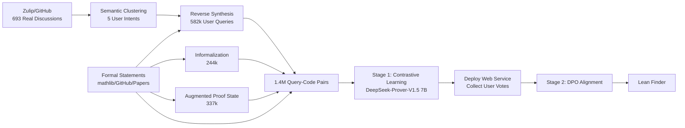

# Lean Finder: Semantic Search for Mathlib That Understands User Intents

**Conference**: ICLR 2026  
**OpenReview**: [https://openreview.net/forum?id=5XNnnbEcu5](https://openreview.net/forum?id=5XNnnbEcu5)  
**Code**: [https://leanfinder.github.io](https://leanfinder.github.io)  
**Area**: Information Retrieval / Formal Mathematics / Lean Theorem Proving  
**Keywords**: Semantic Search, Lean/mathlib, User Intents, Contrastive Learning, DPO Preference Alignment, Code Retrieval  

## TL;DR
Addressing the pain point that mathlib4 retrieval "only aligns with machine-translated informalization but fails to match real mathematician queries," Lean Finder utilizes "reverse-engineered synthetic user queries + multimodal contrastive learning + DPO preference alignment" to train a user-intent-oriented Lean semantic retriever. It achieves a 30%+ improvement over existing engines and GPT-4o on real-world queries.

## Background & Motivation
**Background**: Lean 4 and its community library mathlib4 (230k+ theorems, 110k+ definitions) are transforming mathematical discovery into a machine-verifiable collaborative process. LLM theorem provers and auto-formalization are advancing rapidly. However, the first step in writing a proof is often "finding the right lemma"—given the massive library size and shifting naming conventions, tools like `#find` or Loogle, which rely on exact name or goal state matching, often fail.

**Limitations of Prior Work**: Recent LLM semantic search engines (Lean Search, Herald, Lean State Search, etc.) treat "informalization of formal statements" as the query side for training. This essentially aligns with **neutral machine-translated expressions** rather than **how real users actually ask**. PCA visualization (Figure 2) demonstrates that this gap objectively exists: the distribution of LLM-generated informalizations covers only a subspace of the real Zulip/GitHub user query distribution.

**Key Challenge**: In the same mathematical context, mathematicians ask questions with their own **motivations, perspectives, and abstraction levels**. The paper provides a telling example—two queries involving algebraic elements $x,y$ and minimal polynomials in a field extension: Query 1 asserts an isomorphism between simple extensions, while Query 2 asks if "$y$ being a root of the minimal polynomial of $x$ implies equality of their minimal polynomials." These "user latent variables" cannot be inferred through purely syntactic informalization.

**Goal**: To build a **user-centric Lean/mathlib4 retrieval engine capable of understanding mathematician intents**. **Core Idea (Reverse Engineering Synthetic Queries + Preference Alignment)**: Since real annotated user queries are scarce (only 693 found online), the process is reversed—assuming every formal statement is the answer to some unknown user query, synthsizing large-scale query data from the perspective of real mathematician queries, and aligning the retriever to user needs using real preferences collected after deployment.

## Method

### Overall Architecture
Lean Finder consists of three components: first, **clustering user intents** from real public discussions; then, **synthetically generating large-scale user queries** based on these intents, combined with multiple input modalities (informalization, proof state, formal statement) to form a training set of 1.4 million query-code pairs. This is followed by **two-stage training**—contrastive learning to establish multimodal alignment, and DPO preference alignment using real user votes + LLM feedback—resulting in an embedding model that is both high-performing and aligned with user preferences.

### Key Designs

**1. Reverse-engineered User Query Synthesis: Cluster intent first, then backward reason from answers.** Real user queries cannot be annotated at scale—not only is the volume extremely small (only 693 answerable queries), but because many are open mathematical questions and mathlib4 is continuously evolving, it is impossible to trace back to an exact formal statement answer for every query. The paper bypasses this by scraping five active Zulip channels (new members, lean4, mathlib4, Is there code for X, metaprogramming/tactics), filtering for questions "answerable by Lean statements" using GPT-4o, and using OpenAI o3 for iterative clustering to summarize five types of mathematician intent—**finding existing code/lemmas, metaprogramming/tactic issues, typeclass/instance/axiom issues, daily proof engineering, and library design/large-scale formalization** (Table 1). After intent classification, reverse synthesis is performed: GPT-4o determines **which intent categories** a formal statement fits (avoiding force-fitting into irrelevant clusters), then generates queries for each selected cluster using formal/informal statements as context. PCA shows these synthetic queries are significantly closer to real user clusters than simple informalizations.

**2. Largest Lean Multimodal Code Retrieval Dataset: One retriever for four input types.** To account for the various query formats real users use, the training set includes four modalities: synthetic user queries, informalization, augmented proof state, and formal statement, totaling 1.4 million pairs. Data sources include mathlib4, GitHub repositories linked to research papers, and domain libraries to ensure coverage of frontier mathematics. Informalization follows the Herald approach, providing GPT-4o with rich context (dependencies/neighboring statements) for better quality. **Augmented proof state** is a highlight—on top of the raw proof state (subgoals + context + target), GPT-4o synthesizes a natural language description of "the intended direction of the next step," simulating the real expression of a user searching for usable lemmas and allowing for finer-grained retrieval. The formal statement modality retains only the declaration and removes the proof body, covering scenarios where a "user only remembers part of the statement."

**3. Contrastive Learning for Multimodal Alignment.** Uses DeepSeek-Prover-V1.5-RL 7B as the base model (pre-trained on Lean 4 syntax and proof tasks). In a decoder-only architecture, only the last token sees the full context, so the hidden state of the last token in the final layer is taken as the embedding. Training constructs groups of size $G$: each query $q_i$ is paired with one positive example $c_i^+$ and $G-1$ negatives. A batch of $B$ groups forms the candidate set $C_b$ ($|C_b|=B\cdot G$). Token-level augmentation $\tilde q_i$ (simulating typos or incomplete recall) is applied to queries. All candidates except the positive pair are treated as in-batch negatives, optimizing contrastive loss with temperature $\tau$:

$$\mathcal{L}_{\text{contrastive}} = -\frac{1}{B}\sum_{i=1}^{B}\log\frac{\exp\big(\mathrm{Sim}(\tilde q_i, c_i^+)/\tau\big)}{\sum_{c\in C_b}\exp\big(\mathrm{Sim}(\tilde q_i, c)/\tau\big)}$$

**4. Adapting DPO for Retriever Preference Alignment.** After deploying as a web service, two levels of preference are collected: up/down votes for single results (retrieval-level), and blind model-level preferences for Lean Finder vs. Lean Search (from both online user choices and GPT-4o evaluations of Zulip queries), resulting in 1154 preference triplets $(q,c^+,c^-)$. The sequence likelihood in standard DPO is replaced with "the probability of a candidate statement based on query-code similarity," where $\theta$ is the current policy and $\theta_{\text{ref}}$ is the reference retriever from contrastive training, with $\beta$ controlling deviation:

$$\mathcal{L}_{\text{DPO}} = -\mathbb{E}_{(q,c^+,c^-)\sim P}\Big[\log\sigma\big(\beta\big[(\mathrm{Sim}_\theta(q,c^+)-\mathrm{Sim}_\theta(q,c^-)) - (\mathrm{Sim}_{\theta_{\text{ref}}}(q,c^+)-\mathrm{Sim}_{\theta_{\text{ref}}}(q,c^-))\big]\big)\Big]$$

To prevent preference alignment from degrading general retrieval capability, DPO is trained jointly with contrastive loss: $\mathcal{L} = \mathcal{L}_{\text{DPO}} + \lambda\,\mathcal{L}_{\text{contrastive}}$.

## Key Experimental Results

### Main Results: Retrieval Performance Across Input Modalities
The test set includes 1000 informalized statements, 1000 formal statements, 1000 synthetic queries, and 2224 proof states. Formal statement inputs are injected with 20% token random replacement to simulate noise.

**Table 2 (Informalized / Synthetic Query / Augmented Stmt, Recall@1 / R@5 / R@10 / MRR)**

| Model | Informalized R@1 | Synthetic Query R@1 | Augmented Stmt R@1 |
|---|---|---|---|
| **Lean Finder** | **64.2** / 88.9 / 93.3 / 0.75 | **54.4** / 84.4 / 91.4 / 0.68 | **82.7** / 97.0 / 97.7 / 0.89 |
| Lean Search | 49.2 / 76.5 / 82.5 / 0.61 | 47.1 / 77.7 / 83.7 / 0.60 | 59.2 / 81.9 / 85.5 / 0.69 |
| GPT-4o (full name) | 14.8 | 13.6 | 39.7 |
| GPT-4o (stem match) | 21.1 | 17.8 | 48.2 |

**Table 3 (Proof State input, Recall@1 / R@5 / R@10 / MRR)**

| Model | Augmented Proof State R@1 | Raw Proof State R@1 |
|---|---|---|
| **Lean Finder** | **24.6** / 56.8 / 67.9 / 0.40 | **8.3** / 30.1 / 40.0 / 0.19 |
| Lean State Search | 4.99 / 27.7 / 39.6 / 0.16 | 3.3 / 23.1 / 32.1 / 0.13 |
| Real Prover Search | 8.0 / 29.0 / 39.2 / 0.18 | 7.1 / 26.2 / 34.3 / 0.16 |
| GPT-4o (stem match) | 10.1 | 6.4 |

Notably, Lean Finder outperforms specialized models on **raw proof states** even though it was never explicitly trained on them, indicating that intent modeling enables cross-modal generalization.

### Key Findings: Real User Study (Table 4)
5 participants blind-ranked the top 3 results from different models for 128 real GitHub queries.

| Model | 1st Place Votes | Top-3 Hit Rate | Normalized Borda |
|---|---|---|---|
| **Lean Finder** | **139** | **81.6%** | **0.67** |
| Lean Search | 70 | 56.9% | 0.41 |
| GPT-4o | 71 | 54.1% | 0.40 |

The first-place votes are nearly double the baselines, and Top-3 hit rate (81.6%) is substantially higher than baselines.

### Highlights & Insights
- **Machine-translated distribution $\neq$ Real query distribution**: Even with web search and loose stem-match scoring, GPT-4o performs poorly, validating that "generative ability" does not equate to "precise retrieval of dependency statements."
- **Plug-and-play retriever for provers**: Integrating via RAG with Goedel Prover, DeepSeek-Prover V1.5, and REALProver on MiniF2F/ProofNet/PutnamBench/FATE-M shows parity or slight improvements—achieving "prover-agnostic" gains without retraining, though improvements are currently limited.
- **Dataset contribution**: Open-sourcing the largest Lean code retrieval dataset to date, with 1.4M pairs (582k synthetic queries + 244k informalization + 337k proof states + 244k formal statements).

## Limitations & Future Work
- **Absolute performance on proof states is still low**: R@1 of 8.3 on raw proof states shows that precisely locating lemmas from proof goals is far from solved and not quite practical yet.
- **"Realism" of synthetic queries relies on LLMs**: Queries are generated by GPT-4o and preferences are partly judged by GPT-4o, which may introduce LLM bias. Additionally, real Zulip/GitHub queries are not released due to privacy, making it hard to audit distribution alignment externally.
- **Preference data scale is small**: DPO only uses 1154 triplets, which is small compared to 1.4M training samples; the generalization limits of preference alignment are unclear.
- **Limited gain when integrated with provers**: RAG integration results are "mostly flat with small gains," indicating a gap in synergistic retrieval and reasoning.
- **mathlib dynamics**: The library updates continuously; embeddings and the retrieval index require periodic rebuilding, posing a long-term maintenance cost.

## Related Work & Insights
- **Lean Retrieval Engines**: Lean Search / Herald (Gao et al.), Lean State Search, Real Prover Search, Lean Explore—the fundamental difference here is explicitly modeling "user intent" into training data.
- **Code Search**: CodeSearchNet, contrastive embedding training—this work specializes general code retrieval paradigms for formal mathematics.
- **Preference Alignment**: DPO (Rafailov et al.) originally for language generation; this work adapts it for retrieval scoring, representing a novel application of DPO in IR.
- **Insight**: For any "professional domain semantic retrieval," rather than just scaling up general embeddings, one should first answer "how do real users actually ask?"—intent clustering + reverse query synthesis + deployment preference loops may be more effective than simple data increases.

## Rating
- **Novelty**: ⭐⭐⭐⭐ — Identifying the "alignment with machine translation vs. user" gap is very sharp; the combination of reverse-synthesis and DPO for retrieval is solid.
- **Experimental Thoroughness**: ⭐⭐⭐⭐ — Covers five input modalities, blind user studies, and prover integration; proof state absolute performance and preference data size are slightly weaker areas.
- **Writing Quality**: ⭐⭐⭐⭐ — Motivation is clear and powerful; the comparison of two queries and the PCA plots are very persuasive.
- **Value**: ⭐⭐⭐⭐ — Directly addresses the "lemma discovery" pain point in the formal math community; deployed web service and prover-agnostic RAG provide high utility.

<!-- RELATED:START -->

## Related Papers

- [\[ICLR 2026\] Mapping Semantic & Syntactic Relationships with Geometric Rotation](mapping_semantic_syntactic_relationships_with_geometric_rotation.md)
- [\[ICLR 2026\] Improving Semantic Proximity in Information Retrieval through Cross-Lingual Alignment](improving_semantic_proximity_in_information_retrieval_through_cross-lingual_alig.md)
- [\[ICLR 2026\] Welfarist Formulations for Diverse Similarity Search](welfarist_formulations_for_diverse_similarity_search.md)
- [\[ICLR 2026\] Hybrid Deep Searcher: Scalable Parallel and Sequential Search Reasoning](hybrid_deep_searcher_scalable_parallel_and_sequential_search_reasoning.md)
- [\[ACL 2026\] Optimizing User Profiles via Contextual Bandits for Retrieval-Augmented LLM Personalization](../../ACL2026/information_retrieval/optimizing_user_profiles_via_contextual_bandits_for_retrieval-augmented_llm_pers.md)

<!-- RELATED:END -->
