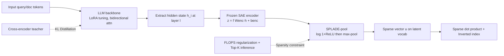

# Learning Retrieval Models with Sparse Autoencoders

**Conference**: ICLR 2026  
**OpenReview**: [https://openreview.net/forum?id=TuFjICawSc](https://openreview.net/forum?id=TuFjICawSc)  
**Code**: TBD  
**Area**: Information Retrieval / Learned Sparse Retrieval  
**Keywords**: Learned Sparse Retrieval, Sparse Autoencoder, SPLADE, Multilingual Retrieval, MMTEB, LLM Embedding  

## TL;DR
By replacing the vocabulary projection head of SPLADE with a pre-trained Sparse Autoencoder (SAE), queries and documents are encoded into sparse vectors within a "latent vocabulary" space. The resulting SPLARE model systematically outperforms vocabulary-based sparse retrieval in multilingual and cross-domain tasks, matching dense SOTA on MMTEB for the first time.

## Background & Motivation
**Background**: Learned Sparse Retrieval (LSR), represented by SPLADE, represents queries and documents as sparsely weighted bags-of-words in the backbone's vocabulary space. It leverages inverted indices for efficient retrieval and is inherently interpretable. It has long been SOTA on English benchmarks and shows stronger generalization than dense models. Recent work has shifted SPLADE from BERT to LLM backbones (e.g., Lion-SP-8B), further raising the performance ceiling.

**Limitations of Prior Work**: These LLM-based SPLADE models remain "trapped" within the fixed vocabulary. The vocabulary projection introduces three issues: tokenization redundancy (e.g., "Indian" and "indian" occupying two dimensions), dimensionality fixed by the backbone's vocabulary size (limiting scalability), and difficulty in handling multilingual/cross-lingual retrieval (vocabulary is biased toward Latin-script subwords, often degrading to approximation for low-resource languages like Tamil). Consequently, sparse retrieval falls significantly behind dense models on MMTEB, which emphasizes cross-lingual and cross-domain generalization; as of writing, there were no sparse models on the MMTEB multilingual leaderboard.

**Key Challenge**: While the efficiency and interpretability of LSR are attractive, its representation space (the fixed vocabulary) is exactly the bottleneck for generalization. The "semantically structured, cross-lingually consistent" discrete dimensions that sparse retrieval requires cannot be provided by standard vocabularies.

**Goal**: To find a superior sparse "vocabulary" that allows LSR to match or exceed dense SOTA in multilingual/cross-domain settings while maintaining efficiency and interpretability.

**Key Insight**: **Use SAE latent features as the vocabulary**. SAEs decompose dense activations of LLMs into sparse latent features. Extensive interpretability research has proven these features possess mono-semantic, language-agnostic, and even cross-modal properties—precisely the semantic space sparse retrieval desires. By replacing the SPLADE LM head with a frozen, pre-trained SAE encoder, sparse retrieval can be performed over this "latent vocabulary."

## Method

### Overall Architecture
The structure of SPLARE (SParse LAtent REtrieval) is nearly an isomorphic replacement of SPLADE: the sole difference lies in replacing "taking the last layer hidden state $\rightarrow$ projecting to vocabulary via LM head" with "taking a middle layer hidden state $\rightarrow$ projecting to latent feature space via a frozen SAE encoder." It then follows the SPLADE paradigm of term-saturation and max-pooling to aggregate token-level sparse vectors into sequence-level sparse representations. Relevance is calculated via sparse dot products using inverted indices. During training, only the LLM backbone is fine-tuned via LoRA, while the SAE remains frozen throughout.

### Key Designs

**1. Latent Vocabulary replaces Vocabulary Projection: Using frozen SAE encoder for middle-layer sparse features**. Given the hidden state $h_i$ at layer $l$, the SAE encoder $z = f(W_{enc} h_i + b_{enc})$ produces $|W|$-dimensional latent logits ($|W| \gg d$), parallel to the SPLADE projection to vocabulary $V$. The paper utilizes only the encoder parameters (no decoder needed as the goal is feature extraction, not reconstruction) from SAEs trained on the residual stream. Aggregation follows the SPLADE formula: $u_j = \max_{i} \log(1 + \mathrm{ReLU}(w_{ij}))$. This step yields three benefits: latent features are language-agnostic (training on English generalizes to 100+ languages), dimensionality is decoupled from the vocabulary (scalable with SAE width), and tokenization redundancy is eliminated. A counter-intuitive finding is that the **optimal layer is at approximately 2/3 depth** (around layer 20 for Llama-3.1-8B, level 16 for Gemma) rather than the final layer. This is both because middle-layer representations are richer for retrieval and because skipping the final layers significantly reduces inference latency.

**2. Training Objective with Distillation + FLOPS Regularization**. Unlike the contrastive learning prevalent in dense embeddings, SPLARE follows the SPLADE training paradigm: using a cross-encoder teacher for distillation by optimizing the KL divergence of the relevance distribution between teacher and student: $L_{KL} = \sum_i p_i(\log p_i - \log \hat p_i)$, where $\hat p_i = e^{s(q,d_i)/\tau}/\sum_j e^{s(q,d_j)/\tau}$. The authors argue that distillation naturally avoids the false negative problem of contrastive learning. Sparsity is constrained by FLOPS regularization, with a total loss $L = L_{KL} + \lambda_q \ell^q_{\text{FLOPS}} + \lambda_d \ell^d_{\text{FLOPS}}$. Additionally, the model is pre-trained with Masked Next Token Prediction and bidirectional attention enabled—crucial for LSR as pooling occurs at every position.

**3. Inference-time Top-K pooling to decouple sparsity tuning**. Sparsity in LSR fluctuates drastically with backbones, SAE suites, and datasets. Reaching a target sparsity often requires brittle tuning of $\lambda$. SPLARE adopts a conservative fixed $\lambda$ during training for moderate sparsity and then applies **Top-K pooling during inference** (defaulting to 40 for queries and 400 for documents). This shifts sparsity control to a tunable knob that does not require retraining. Top-K acts as a strict upper bound. Experiments show that using Top-K alone without regularization performs worse, so both are used in tandem. SPLARE is remarkably robust to document pruning: performance drops only ~2% when indexing only Top-100 dimensions, compared to over 6% for SPLADE, because the SPLARE latent space is more compact and structured with a more balanced activation distribution.

### SPLARE Model Specs
The primary model, SPLARE-7B (layer 26), is trained using Llama Scope SAEs ($|W|=131k$) based on Llama-3.1-8B, alongside a lightweight SPLARE-2B (layer 6). Retrieval performance correlates nearly log-linearly with SAE width, providing a scaling mechanism that the fixed-vocabulary SPLADE cannot offer.

## Key Experimental Results

### Main Results: Average MTEB Split Scores (Top-K=40/400)

| Model | English | Multilingual | Code | Medical | Law | ChemTEB |
|------|---------|--------------|------|---------|-----|---------|
| **English-only Training** | | | | | | |
| SPLADE-v3 | 50.7 | 38.1 | 44.5 | 44.2 | 40.4 | 75.6 |
| Lion-SP-8B | 48.5 | 50.0 | 53.3 | 54.4 | 48.5 | 71.1 |
| SPLADE-Llama (baseline) | 52.9 | 54.3 | 57.3 | 61.0 | 49.0 | 75.9 |
| **SPLARE** | 52.9 | **56.3** | 55.1 | **62.9** | **51.2** | 70.0 |
| **Multilingual Training** | | | | | | |
| SPLADE-Llama | 58.9 | 61.7 | 64.3 | 67.6 | 60.7 | 77.4 |
| **SPLARE** | **59.3** | **62.3** | 63.0 | **67.7** | **60.8** | **78.1** |

SPLARE consistently wins in Multilingual, Medical, and Law categories, falling slightly short only in the highly domain-specific Code category (where general SAE features are less specialized for code semantics).

### Comparison with Top MTEB Models (Multilingual Training)

| Model | English | Multilingual | XTREME-UP |
|------|---------|--------------|-----------|
| gte-Qwen2-7B-instruct | 58.1 | 60.1 | 17.4 |
| Qwen-3-Embedding-8B | 69.4 | 70.9 | - |
| gemini-embedding-001 | 64.4 | 67.7 | 64.3 |
| **SPLARE** | 59.3 | 62.3 | 58.6 |
| **SPLARE - no-pooling** | 61.4 | 63.8 | 61.4 |
| SPLARE - Top-K=(10,100) | 50.1 | 56.0 | 46.5 |
| SPLARE-2B | 55.9 | 59.1 | 41.6 |

SPLARE reaches the top 10 in MMTEB (Multilingual, v2) retrieval and is the #1 sparse model, without using private/synthetic data or pre-finetuning. Compared to NV-Embed-v2's 4096-dimensional dense vectors, SPLARE achieves high performance using only 40/400 active features.

### Cross-lingual Breakdown (Top-K=40/400)

| Model | indic | sca | deu | fra | kor | XTREME-UP | MIRACL |
|------|-------|-----|-----|-----|-----|-----------|--------|
| SPLADE-Llama | 91.9 | 70.4 | 57.3 | 65.6 | 74.8 | 56.2 | 69.9 |
| **SPLARE** | **92.3** | **70.8** | 57.1 | 64.8 | **76.0** | **58.6** | **71.7** |

The advantage is most pronounced in cross-lingual tasks (XTREME-UP +2.4, MIRACL +1.8).

### Key Findings
- **Optimal layer at ~2/3 depth**: Layer 20 for Llama and Layer 16 for Gemma yield the best results while saving inference latency.
- **Log-linear SAE width scaling**: For Gemma Scope, retrieval performance increases approximately log-linearly from 16k to 1M width, a feat impossible for fixed-vocabulary SPLADE.
- **Balanced activation distribution**: SPLARE utilizes nearly all 131k dimensions with a balanced distribution; SPLADE uses fewer than 100k dimensions and over-concentrates on a few.
- **Low latency**: Retrieval takes ~5ms/query (MS MARCO 8.8M documents using Seismic index, excluding model inference).
- **Superior interpretability**: In cross-lingual examples, SPLARE activates language-agnostic concepts like "history/culture" or "military casualties," while SPLADE redundantly activates "Indian/indian" and degrades into English subwords.

## Highlights & Insights
- **Turning interpretability tools into retrieval infrastructure**: SAEs previously served mechanistic interpretability; this paper demonstrates that their "language-agnostic, mono-semantic" features are the missing piece for sparse retrieval, merging two research lines.
- **Minimalist modification, plug-and-play**: Differing from SPLADE only at the "projection head," it can reuse the entire SPLADE training ecosystem and inverted index infrastructure with low migration costs across different backbones (Llama/Gemma).
- **Sparse retrieval matches dense on MMTEB for the first time**: Resolves the lack of sparse models on the MMTEB multilingual leaderboard. It achieves a win-win in efficiency and interpretability by using a few dozen active dimensions versus thousands in dense vectors.
- **Inference-time Top-K as a tunable knob**: Allows training once and freely sliding the performance-efficiency curve during deployment, which is highly practical for engineering.

## Limitations & Future Work
- **Code retrieval weakness**: General-purpose SAE features are not specialized enough for code. In multilingual training, the Code split is the only area lagging behind SPLADE. Specialized SAEs trained on code corpora are suggested for future work.
- **Reliance on high-quality open SAEs**: The performance ceiling is limited by available SAE suites (e.g., Llama Scope only provides 32k/131k widths). Extremely wide SAEs (e.g., 14M) are currently proprietary or scarce.
- **Frozen vs. fine-tuned SAE tradeoff**: Keeping the SAE frozen preserves interpretability and training stability but means latent features are not optimized specifically for retrieval. Whether joint fine-tuning could yield further gains is unexplored.
- **Initialization sensitivity**: LSR models are notoriously difficult to train. Training a projection head from scratch rarely converges; one must rely on LM heads or SAEs for a good initialization.

## Related Work & Insights
- **SPLADE Series** (Formal et al. 2021/2022a, Lassance et al. 2024): The direct parent work, providing the paradigm of term-saturation, max-pooling, and FLOPS regularization. SPLARE is essentially a "vocabulary-swapped" version.
- **LLM-based SPLADE** (Lion-SP-8B, Doshi et al. 2024, Zeng et al. 2025): Efforts to migrate SPLADE to LLM backbones, which are limited by vocabulary and weak multilingual generalization—the specific issues SPLARE targets.
- **Sparse Autoencoders / Mechanistic Interpretability** (Bricken et al. 2023, Huben et al. 2024, Llama Scope He et al. 2024, Gemma Scope Lieberum et al. 2024): Provided the key premise of mono-semantic, language-agnostic features and open-source SAE resources.
- **Insight**: Semantically structured discrete features from interpretability research can enhance representation design for downstream tasks. When a task is bottlenecked by a fixed discrete space (like a vocabulary), switching to a better discrete space (latent features) may be more effective than architectural changes.

## Rating
- **Novelty**: ⭐⭐⭐⭐⭐ Using SAE latent features as a retrieval "vocabulary" is a clean and innovative perspective, merging interpretability and sparse retrieval and matching dense performance on MMTEB for the first time.
- **Experimental Thoroughness**: ⭐⭐⭐⭐⭐ Covers English, multilingual, cross-domain, and cross-lingual benchmarks. Comprehensive ablations on layer depth, SAE width, sparsity-efficiency, and interpretability, with controlled SPLADE-Llama comparisons.
- **Writing Quality**: ⭐⭐⭐⭐ Clear motivation and well-articulated comparison with SPLADE. Formulas and charts are well-organized, though some background in LSR is helpful for the details.
- **Value**: ⭐⭐⭐⭐⭐ Provides a practical, efficient multilingual sparse retriever (7B/2B versions, 5ms/query) and charts a new research direction for using SAE features in retrieval, offering high utility for RAG and search systems.

<!-- RELATED:START -->

## Related Papers

- [\[ICLR 2026\] MILCO: Learned Sparse Retrieval Across Languages via a Multilingual Connector](milco_learned_sparse_retrieval_across_languages_via_a_multilingual_connector.md)
- [\[ACL 2026\] Learning to Extract Rational Evidence via Reinforcement Learning for Retrieval-Augmented Generation](../../ACL2026/information_retrieval/learning_to_extract_rational_evidence_via_reinforcement_learning_for_retrieval-a.md)
- [\[ICLR 2026\] Beyond RAG vs. Long-Context: Learning Distraction-Aware Retrieval for Efficient Knowledge Grounding](beyond_rag_vs_long-context_learning_distraction-aware_retrieval_for_efficient_kn.md)
- [\[ICLR 2026\] Hierarchical Concept-based Interpretable Models](hierarchical_concept-based_interpretable_models.md)
- [\[ICLR 2026\] Supervised Fine-Tuning or Contrastive Learning? Towards Better Multimodal LLM Reranking](supervised_fine-tuning_or_contrastive_learning_towards_better_multimodal_llm_rer.md)

<!-- RELATED:END -->
