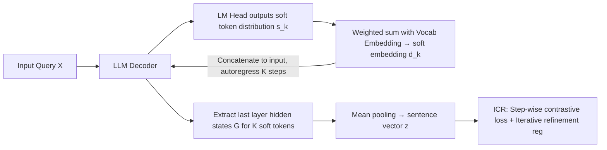

# Let LLMs Speak Embedding Languages: Generative Text Embeddings via Iterative Contrastive Refinement

**Conference**: ICLR 2026  
**OpenReview**: [https://openreview.net/forum?id=okjogxO1Fu](https://openreview.net/forum?id=okjogxO1Fu)  
**Code**: [https://github.com/Roytsai27/GIRCSE](https://github.com/Roytsai27/GIRCSE)  
**Area**: Information Retrieval / Text Representation Learning  
**Keywords**: Text embeddings, generative embeddings, contrastive learning, soft tokens, test-time scaling, MTEB  

## TL;DR
GIRCSE allows LLMs to autoregressively generate a sequence of "soft tokens" at inference time to iteratively refine sentence embeddings, supervised by step-wise contrastive losses. This marks the first effective utilization of LLM generative capabilities for embedding tasks, surprisingly unlocking "test-time scaling" where generating more tokens leads to higher vector quality.

## Background & Motivation
**Background**: Using LLMs for text embedding has become mainstream on the MTEB leaderboard. Methods like E5-Mistral, LLM2Vec, and NV-Embed typically treat LLMs as static feature extractors, obtaining a single vector via an EOS token or mean pooling after a single forward pass, followed by contrastive fine-tuning.

**Limitations of Prior Work**: This encoder-only paradigm neglects the core strength of LLMs—autoregressive generation and multi-step reasoning. While LLMs can "think before answering" in CoT tasks, they are restricted to "answering at first glance" in embedding tasks. Differences between existing methods are largely limited to pooling strategies and auxiliary training tricks; generative embedding remains largely unexplored.

**Key Challenge**: Directly allowing LLMs to generate text before encoding presents three issues: (1) Pre-trained LLMs generate fluent human-readable text rather than tokens optimized for semantic similarity, which can degrade embedding quality; (2) Embedding tasks lacks clear generation targets, making it unclear what content should be generated to benefit all tasks; (3) Discrete token sampling breaks gradients, preventing end-to-end training.

**Goal**: Design an end-to-end framework enabling LLMs to "distill" semantics into high-quality vectors through iterative generation, balancing general retrieval and instruction-following tasks to avoid the common trade-off where strength in one leads to weakness in the other.

**Core Idea**: **Let LLMs speak an "embedding language"** — instead of constraining tokens to be human-readable, the model is trained end-to-end with contrastive objectives to discover a sequence of soft tokens optimized for semantic representation, refining the representation with every step generated.

## Method

### Overall Architecture
GIRCSE (Generative Iterative Refinement for Contrastive Sentence Embeddings) performs two functions on a shared LLM: first, it autoregressively generates $K$ **soft tokens** (preserving the full vocabulary probability distribution, making them differentiable), pooling the last-layer hidden states of these soft tokens into a sentence vector; second, it applies an **Iterative Contrastive Refinement (ICR) objective** to provide contrastive supervision at every generation step, forcing early tokens to capture useful semantics and later tokens to provide continuous refinement. The entire process is trained end-to-end, and at inference, more generated tokens yield better vectors.

### Key Designs

**1. Soft Token Generation: Using weighted embeddings of the full distribution instead of discrete sampling to preserve gradients and semantics.** Autoregressive generation's primary challenge is that discrete sampling cuts off gradients, making end-to-end contrastive training impossible. Instead of taking the argmax at each step $k$, GIRCSE makes the LM head output a full vocabulary probability distribution $s_k=\mathrm{softmax}(W_\phi h'_{k-1}+b_\phi)\in\mathbb{R}^{|V|}$. This distribution is used as weights for a convex combination of the entire vocabulary embedding matrix to obtain a soft embedding $d_k=\sum_{i=1}^{|V|}s_{k,i}e_i$, which is then concatenated to the input sequence for the decoder to generate the next token. This approach offers two benefits: weighted sums allow smooth gradient backpropagation for end-to-end optimization, and avoiding the collapse into a single hardware token preserves semantic diversity—mixed distributions (e.g., "confused/frustrated/puzzled") carry richer semantics than a single hard-coded word. The final sentence vector $z$ is obtained by mean pooling the last-layer hidden states $G=(h^{(L)}_{N+1},\dots,h^{(L)}_{N+K})$ corresponding to the $K$ soft token positions: $z=\frac{1}{K}\sum_i g_i$.

**2. Step-wise Contrastive Loss: Supervising every step instead of just the final output to prevent intermediate degradation into noise.** If contrastive loss is only calculated for the final vector at step $K$, intermediate steps may evolve into meaningless transitions. GIRCSE applies contrastive supervision at every step: for step $k$, intermediate vectors $z_k=P(G_{1:k})$ are pooled from the first $k$ generated tokens, and the InfoNCE loss is accumulated across all steps: $L_{\text{contrast}}=\sum_{k=1}^{K}L_k$, where $L_k=-\log\frac{\exp(\sigma(z^q_k,z^{d^+}_k)/\tau)}{\sum_{d\in B}\exp(\sigma(z^q_k,z^d_k)/\tau)}$, $\sigma$ is cosine similarity, and $B$ is the set of positive and negative documents. This ensures that even if only one or two tokens are generated, the vectors are aligned in a contrastive sense, preventing early tokens from drifting and providing effective supervision throughout.

**3. Iterative Refinement Regularization: Using monotonicity constraints to force improvements at every step.** The authors found that simply generating more tokens does not guarantee quality improvement, as LLM often output redundant tokens. To address this, a regularization term is added: $L_{\text{reg}}=\frac{1}{K-1}\sum_{k=1}^{K-1}\max(\log L_{k+1}-\log L_k,0)$, which only penalizes cases where the loss at step $k+1$ is larger than at step $k$. This effectively enforces a soft monotonic decrease in contrastive loss along the generation steps. The total objective is $L_{\text{total}}=L_{\text{contrast}}+\lambda L_{\text{reg}}$. This monotonicity constraint allows GIRCSE to unlock **test-time scaling**: generating more tokens at inference time stably improves vector quality, analogous to test-time compute scaling in reasoning LLMs.

## Key Experimental Results

### Main Results
Compared against 18 SOTA embedding models on MTEB (English, v2, 41 datasets) and instruction-following benchmarks (IntentEmotion / NYTClustering), using a Mistral-7B backbone and only 0.2M training samples:

| Method | Backbone | Training Data | MTEB Avg. (Rank) | Instruct Avg. (Rank) | Overall Rank |
|---|---|---|---|---|---|
| gte-Qwen2 | QWEN2 | 800M | 70.72 (1) | 35.07 (18) | 9.5 |
| NV-Embed-v1 | Mistral | 1.1M | 68.32 (3) | 56.62 (7) | 5.0 |
| E5-Mistral | Mistral | 1.8M | 67.97 (4) | 56.95 (10) | 7.0 |
| GritLM (w/ gen.) | Mistral | 2M | 65.90 (11) | 60.83 (4) | 7.5 |
| Inbedder (E2E Gen) | LLaMA2 | 0.2M | 50.32 (20) | 77.17 (1) | 10.5 |
| **GIRCSE** | Mistral | 0.2M | 67.83* (5) | 62.97 (2) | **3.5** |
| **GIRCSE** | QWEN2 | 0.2M | 67.67* (6) | 62.48 (3) | **4.5** |

GIRCSE achieved the best overall ranking (3.5/4.5), placing top 5–6 on MTEB and top 2–3 in instruction following, despite using a fraction of the training data compared to SOTA models (0.2M vs millions).

### Ablation Study
Using Mistral-7B and 50K samples, incrementally adding Generative Embedding (Gen.), Step-wise Loss (SL), and Iterative Refinement (IR):

| Gen. | SL | IR | MTEB Avg. | Instruct Avg. |
|---|---|---|---|---|
| ✗ | ✗ | ✗ | 63.84 | 47.05 |
| ✓ | ✗ | ✗ | 65.21 | 56.47 |
| ✓ | ✓ | ✗ | 65.69 | 60.13 |
| ✓ | ✓ | ✓ | **66.27** | **62.97** |

Starting from a Causal-EOS baseline, simply introducing generative embedding boosts instruction following by 9 points (47→56). Step-wise loss and iterative refinement further enhance performance to achieve the strongest overall result.

### Key Findings
- **Breaking Trade-offs**: Non-generative models (e.g., gte-Qwen2) are strong in general tasks but weak in instructions (rank 1→18), while purely generative Inbedder shows the opposite (rank 20→1). GIRCSE is the only model strong in both, showing significant gains over fair baselines (p<0.05).
- **Test-time Scaling**: Relative performance on tasks like STS increases monotonically with the number of generated tokens (1→20), proving "more tokens = better vectors," a scaling dimension previously absent in embedding models.
- **Controllable Efficiency**: Strong performance is achieved with only 5–10 tokens. With KV caching, FLOPs are only ~1.0–1.1× that of standard embedding models.
- **Interpretability**: Soft tokens generate semantic signals like "frustrated" or "struggle" based on instructions, capturing implicit emotions beyond the scope of surface-level discriminative embeddings.

## Highlights & Insights
- **Paradigm Shift**: This work reconceptualizes "embedding" from a single-pass feature extraction to a multi-step autoregressive refinement, introducing a test-time compute scaling dimension similar to reasoning LLMs.
- **Soft Tokens as the Key**: Using weighted embeddings of the full probability distribution elegantly solves both differentiability and semantic richness, outperforming discrete generation or hard tokens (Inbedder).
- **Synergy of Supervision and Regularization**: Step-wise supervision combined with monotonic regularization ensures that generating more steps consistently adds value, which is the cornerstone for test-time scaling.

## Limitations & Future Work
- Iterative generation is inherently more expensive than single-step baselines. While KV caching reduces FLOPs to ~1.1×, latency still increases with the number of steps, requiring trade-offs in massive-scale retrieval scenarios.
- Due to compute constraints, only 20% (0.2M) of the data was used; the upper limit on full data remains unverified. MTEB performance still trails slightly behind gte-Qwen2 (67.8 vs 70.7) which used millions of samples.
- While qualitative examples exist for "embedding language" interpretability, a systematic theoretical characterization of the relationship between discrete and continuous semantic spaces is still needed.
- Test-time scaling eventually saturates; determining when to stop or how to adaptively decide the number of steps remains an open question.

## Related Work & Insights
- **Mainstream LLM Embeddings**: E5-Mistral, LLM2Vec (bidirectional attention + mean pooling), NV-Embed (Latent Attention + two-stage training), BGE-en-icl (LLM framework + ICL). These mostly differ in pooling and training tricks; GIRCSE highlights the overlooked potential of generation.
- **Generative Embeddings**: Inbedder uses instruction tuning with hard token generation, showing strong instruction following but poor generalization. GIRCSE compensates for this with soft tokens and end-to-end contrastive training.
- **Test-time Scaling Inspiration**: Porting test-time compute scaling from reasoning LLMs to embeddings suggests that other "single-pass" tasks (e.g., classification heads, retrieval reranking) might also benefit from iterative generation.

## Rating
- **Novelty**: ⭐⭐⭐⭐⭐ Integrating autoregressive generation and test-time scaling into text embeddings is a paradigm-level shift. The "soft token + step-wise contrastive + monotonic regularization" combination is highly clever.
- **Experimental Thoroughness**: ⭐⭐⭐⭐ Includes 18 SOTA comparisons across MTEB and instruction benchmarks, plus ablation and scaling curves. However, the data cap at 20% leaves the ultimate ceiling unexplored.
- **Writing Quality**: ⭐⭐⭐⭐ Clear chain of logic (motivation-challenge-method). Figure 1 provides an intuitive comparison of static vs. iterative refinement. Formulas and algorithms are complete.
- **Value**: ⭐⭐⭐⭐⭐ Opens a new axis of "test-time scaling" for embedding models. Achieving state-of-the-art results with small data provides significant momentum for the retrieval and semantic search community.

<!-- RELATED:START -->

## Related Papers

- [\[ICLR 2026\] Think Then Embed: Generative Context Improves Multimodal Embedding](think_then_embed_generative_context_improves_multimodal_embedding.md)
- [\[ICLR 2026\] HUME: Measuring the Human-Model Performance Gap in Text Embedding Tasks](hume_measuring_the_human-model_performance_gap_in_text_embedding_tasks.md)
- [\[ACL 2026\] Why Mean Pooling Works: Quantifying Second-Order Collapse in Text Embeddings](../../ACL2026/information_retrieval/why_mean_pooling_works_quantifying_second-order_collapse_in_text_embeddings.md)
- [\[ICLR 2026\] BTZSC: A Benchmark for Zero-Shot Text Classification Across Cross-Encoders, Embedding Models, Rerankers and LLMs](btzsc_a_benchmark_for_zero-shot_text_classification_across_cross-encoders_embedd.md)
- [\[ICLR 2026\] Supervised Fine-Tuning or Contrastive Learning? Towards Better Multimodal LLM Reranking](supervised_fine-tuning_or_contrastive_learning_towards_better_multimodal_llm_rer.md)

<!-- RELATED:END -->
