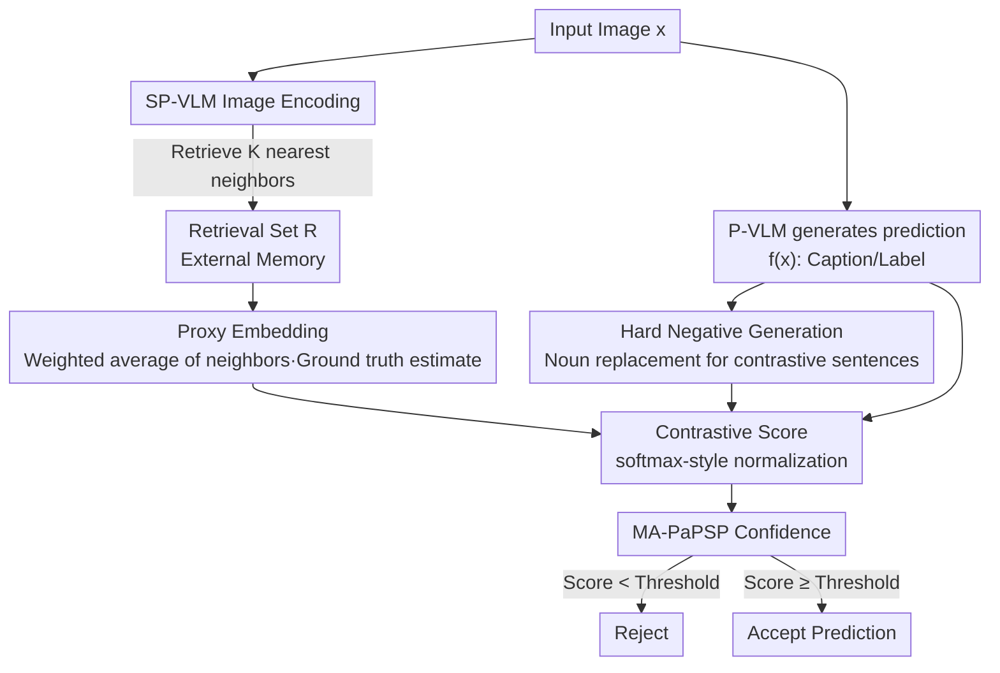

# Leveraging Data to Say No: Memory Augmented Plug-and-Play Selective Prediction

**Conference**: ICLR 2026  
**arXiv**: [2601.22570](https://arxiv.org/abs/2601.22570)  
**Code**: [https://github.com/kingston-aditya/MA-PaPSP](https://github.com/kingston-aditya/MA-PaPSP)  
**Area**: Information Retrieval  
**Keywords**: Selective Prediction, VLM Reliability, Retrieval Augmentation, Contrastive Scoring, CLIP

## TL;DR
The MA-PaPSP framework is proposed to construct proxy embeddings (using k-NN weighted averaging to reduce representation variance) and contrastive normalized scores (to improve calibration) via an external retrieval dataset. This provides reliable "refusal" capabilities for any VLM without training, outperforming PaPSP and LLM-as-judge baselines across selective prediction for image captioning, image-text matching, and classification.

## Background & Motivation

**Background**: VLMs (e.g., BLIP, InternVL, Qwen-VL) are widely used for image-text matching, image captioning, and classification. However, model predictions inevitably contain errors due to incorrect modal alignment, tail distribution samples, or image/language ambiguity. Selective Prediction (SP) mitigates this by granting models the ability to "refuse to answer."

**Limitations of Prior Work**:
   - **Closed-set Limitations**: Existing SP methods mainly target closed-set tasks like classification (limited label sets) and cannot handle open-set tasks like image captioning (unbounded label space).
   - **Training Dependency**: Most methods require fine-tuning the base model or training additional selectors, making them unsuitable for black-box or large-scale models.
   - **Unreliable CLIP Scores**: Using CLIP cosine similarity directly for confidence estimation suffers from two issues: (1) Representation instability—high variance in image/text vectors for the same semantic concept; (2) Poor calibration—inconsistent similarity distributions across different regions of the embedding space.

**Key Challenge**: An ideal SP solution should simultaneously be training-free, lightweight, support open-set tasks, and be plug-and-play for any VLM. Existing solutions fail to meet all these criteria.

**Goal**: Design a training-free, plug-and-play selective prediction module (PaPSP) capable of providing confidence assessments across task hierarchies (classification → image-text matching → image captioning) for various VLMs ranging from CLIP to large LVLMs.

**Key Insight**: Augment CLIP-style scoring models with an external retrieval dataset, using retrieved neighbors for embedding averaging (to reduce variance) and contrastive normalization (to improve calibration).

**Core Idea**: Utilize the weighted average of neighbor embeddings from external retrieval data as a stable "proxy embedding" and replace raw cosine similarity with contrastive normalization using hard negatives to achieve reliable selective prediction.

## Method

### Overall Architecture
MA-PaPSP addresses the following: how to assign reliable confidence scores to a VLM's predictions without **training any models**, allowing it to refuse answering when uncertain. The system involves three components: the base model P-VLM (e.g., BLIP, Qwen-VL) generates the prediction $f(x)$ (a caption or label); the external scoring model SP-VLM (e.g., SigLIP) encodes images and text into a shared embedding space; and an external retrieval dataset $R$ serves as "external memory." For each prediction, the process is: first, use the SP-VLM to encode the query image and retrieve neighbors from $R$, then weighted-average the neighbor embeddings to obtain a stable **proxy embedding** as a "ground truth estimate." Simultaneously, a set of **hard negatives** is generated for the prediction as a reference. Finally, the similarity between the "prediction vs. proxy embedding" is normalized via a softmax-style operation against the hard negatives to produce a calibrated **contrastive score**. If the score is below a threshold, the system refuses to answer. The entire pipeline uses only pre-trained weights and is plug-and-play for any model from CLIP to large LVLMs.

### Key Designs

**1. Proxy Embedding: Suppressing High Variance in CLIP Representations via Neighbor Averaging**

CLIP-style embedding spaces suffer from high variance for vectors corresponding to the same semantic concept; different images of the same category may have vastly different similarities. Directly calculating confidence from a single query vector is easily biased by this noise. The proxy embedding approach distrusts the query embedding itself and uses its neighbors in the retrieval set as representatives. Given a query $q$ (image or text), $K$ nearest neighbors $N_K(q)$ are retrieved from set $R$, and their embeddings are weighted by similarity to obtain a stable proxy embedding $\tilde{\varphi}(q) = \sum_i \frac{\gamma(q, z_i)}{\sum_j \gamma(q, z_j)} \varphi(y_i)$, acting as a "ground truth estimate." This essentially uses statistical averaging to cancel out individual noise from neighbors, bringing the result closer to the true semantic center. The method supports four retrieval variants (i2tr / i2ir / t2tr / t2ir), adapting to cross-modal and unimodal alignment needs.

**2. Hard Negative Generation: Providing Reference Sets for Open-Set Captioning Tasks**

The contrastive scoring step requires reference points to anchor confidence. While classification and image-text matching naturally provide candidate sets, open-set tasks like image captioning have an unbounded label space with no ready-made negatives. MA-PaPSP generates contrastive captions using either rule-based (RB) methods or small language models (SLM). The core operation involves replacing nouns in the original prediction $f(x)$ to produce sentences that are structurally similar but semantically altered. This ensures negatives are "hard" (similar syntax forces the model to focus on actual image-text alignment rather than surface similarities) and extends the contrastive scoring mechanism to open-set tasks.

**3. Contrastive Scoring: Improving Calibration via Softmax-style Normalization with Hard Negatives**

The second issue with raw cosine similarity is poor calibration: similarity distribution scales vary across different regions of the embedding space. A value of 0.3 might be high in one region but low in another, making it unsuitable as a universal confidence metric—similar to unnormalized logits before a softmax. Contrastive scoring adopts the softmax logic, normalizing the similarity between the image and the predicted caption (where the text side uses the proxy embedding) against the hard negative set $E(f(x))$: $s_{tc} = \frac{\exp(s(x, f(x))/\tau)}{\sum_k \exp(s(x, y_k)/\tau)}$, where the temperature $\tau$ controls distribution sharpness. This step scales the score to the $[0, 1]$ interval and ensures a more uniform distribution across the space, allowing it to serve as a calibrated confidence score for threshold-based rejection.

### Loss & Training
Entirely training-free. The SP-VLM uses pre-trained SigLIP without fine-tuning. The only hyperparameters tuned are the number of neighbors $K$, temperature $\tau$, and the choice of retrieval set $R$ (ablations show mixed out-of-domain sets perform best).

## Key Experimental Results

### Main Results - AURC (lower is better)

| Method | MS-COCO (CiderN) | Flickr-30K (CiderN) | Flowers | Pets | UCF101 | SugarCrepe |
|------|-------------------|---------------------|---------|------|--------|------------|
| VQAScore | 0.146 | 0.241 | 0.211 | 0.207 | 0.217 | 0.146 |
| SeeTRUE | 0.158 | 0.251 | 0.214 | 0.213 | 0.171 | 0.153 |
| PaPSP (SigLIP-S) | 0.142 | 0.237 | 0.093 | 0.211 | 0.154 | 0.162 |
| **MA-PaPSP (SigLIP-S)** | **0.121** | **0.235** | **0.077** | **0.171** | **0.116** | **0.079** |
| PaPSP (SigLIP-L) | 0.136 | 0.229 | 0.074 | 0.169 | 0.113 | 0.078 |
| **MA-PaPSP (SigLIP-L)** | **0.109** | **0.219** | **0.063** | **0.114** | **0.088** | **0.062** |
| Gain (L) | 19.85% | 4.36% | 14.86% | 32.52% | 22.12% | 20.51% |

### Cross-VLM Verification (Image Captioning AURC↓)

| P-VLM | PaPSP (COCO) | MA-PaPSP (COCO) | Gain |
|-------|-------------|-----------------|------|
| BLIP-1 (0.1B) | 0.138 | 0.114 | 17.4% |
| BLIP-2 (2.7B) | 0.136 | 0.109 | 19.9% |
| InternVL-3.5 (4B) | 0.106 | 0.068 | 35.8% |
| Qwen-2.5-VL (7B) | 0.102 | 0.066 | 35.3% |

### Ablation Study - Impact of Retrieval Set Type (AURC↓)

| Retrieval Set | MS-COCO (CiderN) | Flowers | SugarCrepe |
|--------|-------------------|---------|------------|
| Random | 0.126 | 0.062 | 0.064 |
| In-Domain | 0.126 | 0.062 | 0.066 |
| Out-of-Domain | 0.109 | 0.063 | 0.062 |
| Mixed | **0.107** | **0.062** | **0.068** |

### Key Findings
- MA-PaPSP using a small SP-VLM (SigLIP-B/16, 16M) surpasses PaPSP using a large SP-VLM (SigLIP-SO-400M, 1B), indicating that retrieval augmentation > simple model scaling.
- MA-PaPSP consistently outperforms LLM-based reasoning methods like VQAScore and SeeTRUE with significantly lower computational costs.
- The largest improvements are seen in classification tasks (Pets 32.5%, UCF101 22.1%), with significant gains in captioning (COCO 19.9%).
- General out-of-domain retrieval sets (CC12M+SBU) are comparable to or better than in-domain sets for captioning and matching.
- As P-VLM scale increases (from 0.1B to 7B), the gain from MA-PaPSP grows (17.4% → 35.3%), suggesting the method is more effective for stronger models.

## Highlights & Insights
- **Valuable Problem Definition**: First to systematically define the plug-and-play selective prediction problem across task hierarchies (classification → matching → captioning).
- **Elegant Method Design**: Proxy embeddings and contrastive scoring resolve representation instability and poor calibration respectively, with clear design motivations.
- **Strong Generality**: Training-free, compatible with any VLM (from CLIP to InternVL-3.5/Qwen-2.5-VL), and supports both open and closed-set tasks.
- **Interesting Insight**: General out-of-domain retrieval sets can replace in-domain data, lowering the barrier for practical deployment.

## Limitations & Future Work
- Requires storage and retrieval of external datasets (CC12M has 15M entries), posing requirements for storage and retrieval latency.
- Hard negative generation for image captioning relies on rule-based methods or SLMs, which may have inconsistent quality.
- The contrastive scoring temperature $\tau$ requires tuning and may vary across tasks.
- Experiments currently focus on English; representation space characteristics may differ in multilingual settings.
- Evaluation of open-set tasks (e.g., captioning) depends on the CIDEr-N threshold $\beta$, which influences the conclusions.

## Related Work & Insights
- Aligns with RAG (Retrieval-Augmented Generation) in philosophy but differs in goal: RAG enhances generation quality, while MA-PaPSP enhances confidence estimation.
- Provides a "safety valve" for VLM deployment: In high-stakes scenarios (e.g., medical imaging), MA-PaPSP allows the model to refuse to answer when uncertain.
- The proxy embedding concept can be extended elsewhere, such as prototype augmentation for few-shot classification or query augmentation in cross-modal retrieval.

## Rating
- Novelty: ⭐⭐⭐⭐ First to systematically address plug-and-play SP for open-set VLMs; the combination of proxy embeddings and contrastive scoring is novel.
- Experimental Thoroughness: ⭐⭐⭐⭐⭐ Comprehensive validation across task hierarchies, model scales, and retrieval set types.
- Writing Quality: ⭐⭐⭐⭐ High level of abstraction; the VLM task taxonomy is well-designed.
- Value: ⭐⭐⭐⭐ Significant tool for VLM reliability with direct value for practical deployment.

<!-- RELATED:START -->

## Related Papers

- [\[ICLR 2026\] MLP Memory: A Retriever-Pretrained Memory for Large Language Models](mlp_memory_a_retriever-pretrained_memory_for_large_language_models.md)
- [\[ICLR 2026\] Reusing Pre-training Data at Test Time is a Compute Multiplier](reusing_pre-training_data_at_test_time_is_a_compute_multiplier.md)
- [\[ACL 2025\] Health-LLM: Personalized Retrieval-Augmented Disease Prediction System](../../ACL2025/information_retrieval/health-llm_personalized_retrieval-augmented_disease_prediction_system.md)
- [\[ICLR 2026\] TokMem: One-Token Procedural Memory for Large Language Models](tokmem_one-token_procedural_memory_for_large_language_models.md)
- [\[ICLR 2026\] AMemGym: Interactive Memory Benchmarking for Assistants in Long-Horizon Conversations](amemgym_interactive_memory_benchmarking_for_assistants_in_long-horizon_conversat.md)

<!-- RELATED:END -->
