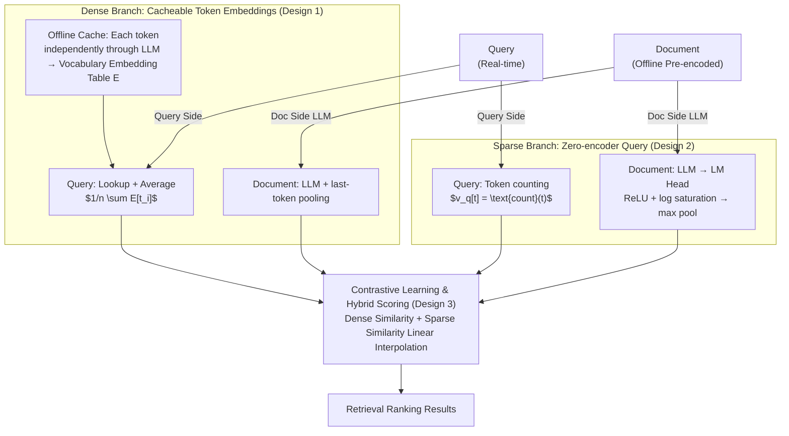

# LightRetriever: A LLM-based Text Retrieval Architecture with Extremely Faster Query Inference

**Conference**: ICLR 2026  
**arXiv**: [2505.12260](https://arxiv.org/abs/2505.12260)  
**Code**: [GitHub](https://github.com/caskcsg/lightretriever)  
**Area**: Information Retrieval  
**Keywords**: LLM Retrieval, Asymmetric Encoder, Fast Query Inference, Hybrid Retrieval, Embedding Cache

## TL;DR
LightRetriever is proposed as an extremely asymmetric LLM retrieval architecture: while the document side retains the full LLM encoder, the query side completely removes deep modeling—dense retrieval requires only embedding lookup plus averaging, and sparse retrieval requires only token counting. This achieves a $1000 \times$ speedup in query encoding and a $10 \times$ improvement in end-to-end throughput while maintaining $95\%$ of retrieval performance.

## Background & Motivation
LLM-based retrievers (e.g., E5-Mistral, LLM2Vec) typically utilize a symmetric dual-encoder architecture where documents and queries share the same LLM encoder. While documents can be precomputed offline, queries must be encoded online. Deploying full-sized LLMs as query encoders faces several challenges:

**Throughput Bottleneck**: Encoding $65\text{K}$ queries with a full-sized LLM takes upwards of $100$ seconds.

**Resource Consumption**: GPU accelerators are required for online serving.

**Latency Sensitivity**: Real-time search has strict requirements for low latency.

The **Key Insight** is that while documents benefit from the full modeling capability of an LLM to capture rich contextual semantics, it is questionable whether queries require the same depth. BM25, which relies on lexical matching with near-zero inference cost, remains competitive, suggesting that the computational overhead of query understanding can be significantly simplified.

**Core Idea**: Break the symmetry of the query-document encoder. The query side removes the deep model entirely. During training, individual tokens are passed independently through the LLM to cache embeddings for each token. At inference, the entire forward pass is replaced by a simple lookup table and averaging.

## Method

### Overall Architecture
LLM retrievers commonly use a "symmetric dual-encoder" where queries and documents share a single deep LLM. While documents can be pre-encoded and indexed offline, queries arrive in real-time and must undergo an online LLM pass, making the large model a throughput bottleneck for online services. LightRetriever fundamentally breaks this symmetry—**the document side retains the full LLM for deep modeling, while the query side is stripped of almost all forward propagation costs**, shifting the burden of semantic modeling from the query to the document side.

This is implemented via two complementary branches. The dense branch relies on "cacheable token embeddings": during training, each query token passes through the LLM independently, allowing the embeddings for the entire vocabulary to be precomputed as a lookup table. Online query encoding then reduces to table lookup and averaging. The sparse branch is more aggressive, using token counts directly as vectors on the query side with a zero-encoder approach, pushing the semantic burden entirely onto the document side. Both branches are trained with contrastive loss, and final hybrid retrieval scores are synthesized via linear interpolation of dense and sparse similarities.

### Key Designs

**1. Dense Branch: Cacheable Token Embeddings**

Symmetric dual-encoders suffer from mandatory online deep LLM passes for queries. LightRetriever replaces this with a lookup table. During training, instead of processing the whole query, task instructions are concatenated with single query tokens and fed independently. The last token pooling extracts the vector $v_{t_i}^{\text{den}} = Enc_q(Inst; t_i)$, and the query vector is the mean: $v_q^{\text{den}} = \frac{1}{n}\sum_i v_{t_i}^{\text{den}}$. Since tokens are encoded independently without interaction, the entire vocabulary embedding can be precomputed into a table $E \in \mathbb{R}^{V \times H}$. This offline caching takes less than $20$ seconds for Llama-8B on 8×H800. At runtime, query encoding becomes $v_q^{\text{den}} = \frac{1}{n}\sum_i E[t_i]$, requiring no GPU. This sacrifices contextual interaction between query tokens, but the speedup is deemed worth the slight performance loss for typically short queries.

**2. Sparse Branch: Zero-encoder on Query Side**

This branch pushes simplification to the limit. The query vector is directly defined by token counts $v_q^{\text{spr}}[t] = \text{count}(t)$ without any model interaction, essentially providing a BM25-style lexical signal. Semantic modeling is delegated to the document side: the LLM's last hidden state is projected back to the vocabulary space via the LM head, then processed with ReLU, log saturation, and max pooling to obtain a sparse vector $v_d^{\text{spr}} = \max\big(\ln(\max(h_{\text{last}} \cdot P, 0) + 1)\big)$. Log saturation prevents weight inflation for high-frequency words, while max pooling aggregates the document into a vocabulary-dimension sparse representation. FLOPs regularization is used during training to control sparsity. This is effective because sparse retrieval relies on term matching where deep query understanding often provides diminishing returns.

**3. Contrastive Learning and Hybrid Scoring**

Both branches are trained using standard listwise contrastive loss, $\ell^{CL} = -\log \frac{e^{v_q \cdot v_{d^+}/\tau}}{\sum_d e^{v_q \cdot v_d/\tau}}$, to pull positive documents closer and push hard negatives away. Dense and sparse representations are trained individually. During inference, normalized similarities are linearly interpolated. This allows smooth semantic matching (dense) and precise term matching (sparse) to complement each other, with the hybrid score significantly outperforming individual branches.

### Loss & Training
The training objective is contrastive loss combined with FLOPs regularization for the sparse branch (coefficient $0.001$, squared increase to maximum over the first $4\text{K}$ steps to minimize early side effects). The dataset comprises $20$ English and $3$ Chinese datasets totaling $8.38\text{M}$ samples. LoRA fine-tuning is used ($r=16$, $\alpha=32$, dropout $0.1$), with a batch size of $128$, $7$ hard negatives per query, temperature $\tau=0.02$, for $12\text{K}$ steps.

## Key Experimental Results

### Main Results

| Model | BeIR (nDCG@10) | CMTEB-R | Encoding Time (s) | Total Time (s) | QPS |
| :--- | :--- | :--- | :--- | :--- | :--- |
| Full-Llama8b | $56.8$ | $67.6$ | $109.49$ | $119.37$ | $549$ |
| Full-Llama3b | $55.6$ | $66.1$ | $52.59$ | $62.42$ | $1050$ |
| Llama8b First Layer | $52.5$ | $59.0$ | $2.34$ | - | - |
| **LightRetriever-Llama8b** | **$54.0$** | **$63.8$** | **$0.04$** | **$10.08$** | **$6500$** |
| Static Embedding | $44.9$ | $49.1$ | $0.04$ | - | - |
| BM25 | $42.0$ | $53.4$ | $0$ | - | - |

### Ablation Study

| Configuration | BeIR | CMTEB-R | Description |
| :--- | :--- | :--- | :--- |
| Dense Only | ~$50$ | ~$60$ | No sparse complement |
| Sparse Only | ~$42$ | ~$53$ | Similar to BM25 levels |
| Hybrid (Default) | $54.0$ | $63.8$ | Best cost-performance ratio |
| Full-LLM Encoder | $56.8$ | $67.6$ | Performance ceiling |
| Dimension Truncation | ~$53$ | ~$62$ | Further embedding compression possible |

### Key Findings
- Query encoding time dropped from $109.5\text{s}$ to $0.04\text{s}$, a **$2500 \times$ speedup**, with $12 \times$ end-to-end QPS improvement.
- Maintains $95\%$ of the performance of a full-sized LLM, significantly better than using only the first layer of a Llama encoder.
- Sparse + Dense hybrid mode significantly outperforms either single mode.
- Effectively generalizes across different LLM backbones (Llama-1B/3B/8B, Qwen-1.5B/3B/7B).

## Highlights & Insights
- The insight that "queries do not require deep modeling" is highly instructive, challenging the symmetric dual-encoder assumption.
- Caching the entire vocabulary embedding is simple and effective (one-time operation, $<20\text{s}$).
- The zero-encoder design on the sparse branch pushes lightweight computation to its limit.
- Shifting deep semantic understanding costs from the query side to the document side is a strategy with broad applicability.

## Limitations & Future Work
- Independent token encoding sacrifices contextual interactions within queries, potentially degrading performance for complex queries.
- Embedding tables must be re-cached for every combination of instruction and model.
- Performance degradation on long queries has not been fully analyzed.
- Dense vector dimensions remain large (matching the LLM hidden dimension), leading to significant storage costs.

## Related Work & Insights
- **vs E5-Mistral**: Maintains $95\%$ performance but query speed is $2500 \times$ faster.
- **vs BM25**: $12$ nDCG points higher while maintaining similar near-zero query inference costs.
- **vs Static Embedding**: $9$ points higher, validating improvements brought by LLM training.

## Rating
- Novelty: ⭐⭐⭐⭐⭐ First systematic exploration of extreme asymmetric encoders, simplifying the query side to the limit.
- Experimental Thoroughness: ⭐⭐⭐⭐⭐ Tested on $6$ LLM backbones, $23$ datasets, evaluating both speed and quality.
- Writing Quality: ⭐⭐⭐⭐ Clear and intuitive with rich diagrams.
- Value: ⭐⭐⭐⭐⭐ Significant value for practical retrieval system deployment; the $1000 \times$ speedup is highly attractive.

<!-- RELATED:START -->

## Related Papers

- [\[ICLR 2026\] Robust Test-Time Video-Text Retrieval: Benchmarking and Adapting for Query Shifts](robust_test-time_video-text_retrieval_benchmarking_and_adapting_for_query_shifts.md)
- [\[ICLR 2026\] RAEE: A Robust Retrieval-Augmented Early Exit Framework for Efficient Inference](raee_a_robust_retrieval-augmented_early_exit_framework_for_efficient_inference.md)
- [\[ICLR 2026\] Query-Aware Flow Diffusion for Graph-Based RAG with Retrieval Guarantees](query-aware_flow_diffusion_for_graph-based_rag_with_retrieval_guarantees.md)
- [\[ACL 2025\] Hypothetical Documents or Knowledge Leakage? Rethinking LLM-based Query Expansion](../../ACL2025/information_retrieval/hypothetical_documents_or_knowledge_leakage_rethinking_llm-based_query_expansion.md)
- [\[ICLR 2026\] AdaCache: Adaptive Caching and Context Augmentation for Efficient LLM Serving](adacache_adaptive_caching_and_context_augmentation_for_efficient_llm_serving.md)

<!-- RELATED:END -->
