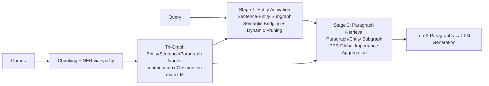

# LinearRAG: Linear Graph Retrieval Augmented Generation on Large-scale Corpora

**Conference**: ICLR 2026  
**OpenReview**: [https://openreview.net/forum?id=mCtfkypdm6](https://openreview.net/forum?id=mCtfkypdm6)  
**Code**: [https://github.com/DEEP-PolyU/LinearRAG](https://github.com/DEEP-PolyU/LinearRAG)  
**Area**: Information Retrieval / Graph-based RAG  
**Keywords**: GraphRAG, relation-agnostic graph construction, multi-hop retrieval, Personalized PageRank, linear scalability  

## TL;DR
LinearRAG identifies that performance bottlenecks in existing GraphRAG methods stem from unstable and expensive relationship extraction. It proposes a "Tri-Graph" that extracts only entities without relations, coupled with a two-stage retrieval process (semantic bridging for entity activation + global importance aggregation for passage retrieval). This approach reduces indexing time by 77% with zero LLM token consumption while outperforming all SOTA models across four benchmarks.

## Background & Motivation
**Background**: Traditional RAG systems chunk corpora and perform vector retrieval, which suffices for simple queries. However, when faced with large-scale unstructured corpora, relevant information is often scattered across heterogeneous documents, and chunking loses context, making multi-hop reasoning difficult. Consequently, GraphRAG has emerged—using knowledge graphs to model relations (e.g., RAPTOR for recursive summarization, Microsoft GraphRAG for community detection, and HippoRAG using Personalized PageRank to simulate hippocampal multi-hop retrieval) to theoretically provide complete reasoning chains.

**Limitations of Prior Work**: The authors' preliminary research offers a critical assessment of GraphRAG. On the GraphRAG-Bench, methods like LightRAG and HippoRAG increase evidence recall but result in context relevance of only 36.86%–54.61%, which is **lower** than the 62.87% achieved by Vanilla RAG. The root cause is the poor quality of automatically constructed knowledge graphs, specifically in relation extraction: (i) **Local inaccuracy**: "Einstein did not win the Nobel Prize for relativity" might be incorrectly extracted as (Einstein, won Nobel Prize for, relativity), completely reversing the facts. (ii) **Global inconsistency**: Extraction performed passage-by-passage lacks cross-corpus verification, leading to fragmented hierarchical structures (e.g., misaligning AI subfields). These noises directly contaminate retrieval and generation.

**Key Challenge**: While graph structures expand recall, they simultaneously introduce semantic noise. Existing attempts to "fix" graphs via bottom-up clustering or topic modeling are built upon erroneous triplets, causing errors to amplify at higher abstraction levels. The source of the problem is **relation extraction itself**, which is both expensive and challenging (natural language relations are often complex and context-dependent; e.g., "Rachel reluctantly agreed to run with Phoebe" cannot be cleanly compressed into an atomic triplet). More importantly, it is often **unnecessary**: the primary anchors connecting cross-passage information are aligned entities rather than relations. The original text already preserves complete relational semantics, which can be dynamically interpreted by the LLM during inference.

**Goal**: To build a reliable, linearly scalable GraphRAG with zero additional token cost that retains the multi-hop recall benefits of graphs without the noise of relation extraction.

**Core Idea**: **[Relation-agnostic + Entity-anchored]** This method simplifies complex relationship graphs into a linear, indexable view of "Entity-Sentence-Paragraph" using lightweight NER and semantic linking. During retrieval, it first performs semantic bridging on the sentence-entity subgraph to activate intermediate entities. Then, it uses PPR on the paragraph-entity subgraph for global importance aggregation, completing multi-hop retrieval in a single forward pass.

## Method

### Overall Architecture
LinearRAG is divided into offline and online phases. The offline phase partitions the corpus into paragraphs, then into sentences, and uses spaCy to extract entities to construct a **Tri-Graph** consisting of three types of nodes: "Paragraph / Sentence / Entity." Edges represent binary relationships of "contains" and "mentions" (no relational triplets). The online phase features two-stage retrieval. **Stage 1** fixes paragraph nodes and performs semantic bridging on the sentence-entity subgraph to activate intermediate entities. **Stage 2** fixes sentence nodes and uses activated entities as seeds to run Personalized PageRank on the paragraph-entity subgraph for global importance aggregation, feeding the Top-k paragraphs to the LLM. The pipeline consumes zero LLM tokens for indexing and retrieval, with complexity growing linearly with the corpus.

### Key Designs

**1. Zero-Token Tri-Graph Construction: Replacing relational triplets with "contain/mention" sparse matrices.** Given a set of paragraphs $P$, they are first segmented into sentences $S$. Lightweight models like spaCy perform NER to obtain the entity set $E$. These correspond to paragraph nodes $V_p$, sentence nodes $V_s$, and entity nodes $V_e$. Only two types of edges exist: an edge between a paragraph and an entity it contains, and an edge between a sentence and an entity it mentions, represented by the contain matrix $C_{ij}=\mathbb{1}\{p_i \text{ contains } e_j\}$ and the mention matrix $M_{ij}=\mathbb{1}\{s_i \text{ mentions } e_j\}$. This design is advantageous because: adding new paragraphs only requires local processing (NER and linking), maintaining linear complexity; NER is more accurate and faster than OpenIE and costs zero LLM tokens; adjacency matrices are naturally sparse, keeping memory usage linear; and original passages are preserved as knowledge carriers, ensuring no information loss. Experiments show a 77% reduction in indexing time compared to traditional schemes.

**2. Semantic Bridging for Entity Activation: Propagating "sentence-query similarity" along the bipartite graph to uncover multi-hop intermediate entities.** Directly matching entities in the query might miss hidden intermediate entities that bridge the multi-hop gap. LinearRAG first extracts query entities $E_q$ and initializes activation scores $a_q$ based on the most similar entities in the graph. It then calculates the similarity distribution between the query and each sentence $\sigma_{q,i}=\text{sim}(q, s_i)$ and iteratively propagates the activation vector:
$$a_q^t = \text{MAX}\big(M^T(\sigma_q \odot (M a_q^{t-1})),\ a_q^{t-1}\big)$$
where $\odot$ denotes element-wise multiplication. The intuition is that currently activated entities are mapped back to their sentences via $M$, weighted by query relevance $\sigma_q$, and then propagated back to neighboring entities via $M^T$. This process performs **implicit relationship matching** without explicit relational graphs. Vectorization allows $n$-hop activation in $n$ iterations (usually $n\le 4$), accelerated by Sparse Matrix-Matrix Multiplication (SpMM).

**3. Dynamic Pruning: Using a fixed threshold $\delta$ to restrict propagation to high-quality semantic paths.** While semantic bridging establishes initial associations, the search space can expand exponentially as unrelated entities become new seeds. LinearRAG introduces a threshold $\delta$ after each propagation step: only newly activated entities with relevance above $\delta$ are retained for the next round. Propagation terminates automatically when no new entities pass the threshold. This constrains diffusion to the most relevant paths and adapts the number of iterations to query complexity. Ablation results show that a fixed threshold outperforms no pruning or dynamic thresholds and reduces average retrieval time from 0.186s to 0.093s.

**4. Global Importance Aggregation: Running PPR on the paragraph-entity subgraph with hybrid initialization.** Relevant entities from the first stage initialize Personalized PageRank on the paragraph-entity bipartite graph:
$$I(v_i) = (1-d) + d \cdot \sum_{v_j \in B(v_i)} \frac{I(v_j)}{\deg(v_j)}$$
with a damping factor $d=0.85$. Entity nodes use activation scores $a_q^{(i)}$, while paragraph nodes use a hybrid initialization:
$$I(v|v\in V_p) = \Big(\lambda \cdot \text{sim}(q,v) + \ln\big(1 + \sum_{e_i \in E_a} a_q^{(i)} \cdot \ln(1+N_{e_i})/L_{e_i}\big)\Big)\cdot W_p$$
This fuses the "direct query-paragraph similarity" with the "weighted importance of activated entities within the paragraph" (considering occurrence count $N_{e_i}$ and hierarchy $L_{e_i}$). This step balances local semantic alignment with global structural importance. Top-k paragraphs are selected after PPR without any LLM calls.

## Key Experimental Results

### Main Results Table (Contain-Acc / GPT-Acc across four benchmarks, %)

| Method | HotpotQA C/G | 2Wiki C/G | MuSiQue C/G | Medical GPT |
|---|---|---|---|---|
| Vanilla RAG (Top-5) | 55.70 / 58.60 | 48.60 / 43.00 | 26.10 / 29.60 | 61.68 |
| LightRAG | 60.30 / 59.50 | 55.20 / 39.00 | 27.40 / 28.60 | 54.36 |
| HippoRAG | 57.00 / 59.30 | 66.10 / 59.90 | 29.30 / 24.10 | 55.04 |
| GFM-RAG | 62.70 / 65.60 | 66.80 / 59.50 | 29.90 / 34.60 | 56.07 |
| HippoRAG2 | 62.90 / 64.30 | 62.70 / 55.00 | 31.00 / 35.00 | 60.77 |
| **LinearRAG (Ours)** | **64.30 / 66.50** | **70.20 / 63.70** | **33.90 / 37.00** | **63.72** |

LinearRAG ranks first in both accuracy metrics across all datasets, with a GPT-Acc on 2Wiki approximately 3.8 percentage points higher than the runner-up.

### Efficiency Comparison (2Wiki: Time + Tokens + Mean Acc.)

| Method | Indexing (s) | Retrieval (s) | Prompt tokens | Completion | Acc. |
|---|---|---|---|---|---|
| LightRAG | 4933.22 | 10.963 | 35.52M | 51.16M | 47.10 |
| G-retriever | 2745.94 | 11.487 | 6.05M | 2.26M | 36.85 |
| HippoRAG | 936.00 | 1.461 | 3.05M | 0.98M | 63.00 |
| HippoRAG2 | 1147.01 | 1.694 | 4.98M | 1.22M | 58.85 |
| **LinearRAG** | **249.78** | 0.093 | **0** | **0** | **66.95** |

It offers the shortest indexing time and zero token consumption while achieving the highest accuracy.

### Ablation Study

| Configuration | HotpotQA | 2Wiki | MuSiQue | Medical |
|---|---|---|---|---|
| LinearRAG (full) | 65.40 | 66.95 | 35.45 | 63.72 |
| w/o Entity Activation | 63.15 | 64.40 | 31.65 | 61.69 |
| w/o Global Aggregation| 63.35 | 64.20 | 32.05 | 61.73 |

Pruning Strategy (2Wiki): Full version Acc 66.95 / 0.093s; w/o Pruning 64.50 / 0.186s; Geometric decay (×0.5) 65.15; Linear decay (−0.1) 65.35—fixed threshold is optimal in both accuracy and speed.

### Key Findings
- **Graph structures are useful but neutralized by noise**: GraphRAG increases recall but lowers context relevance, with relation extraction being the primary culprit.
- **Lower token usage does not imply performance loss**: The HippoRAG series uses fewer tokens than LightRAG/G-Retriever yet remains more accurate, suggesting "complex prompts" can be a burden rather than a benefit.
- **Two-stage necessity**: Removing either stage results in an average accuracy drop of 2-4 percentage points across all datasets.

## Highlights & Insights
- **Reverse-engineered problem identification**: By first proving the counter-intuitive phenomenon that "GraphRAG is inferior to Vanilla RAG" and pinpointing relation extraction as the cause, the paper presents a much stronger argument than merely introducing a new method.
- **The "explicit relations are unnecessary" perspective**: Preserving relational semantics in the original text for dynamic LLM interpretation bypasses the most fragile link in GraphRAG, representing a paradigm simplification rather than a patch.
- **Engineering value of zero LLM calls**: The absence of token consumption during indexing and retrieval is highly attractive for large-scale, cost-sensitive deployments.
- **Vectorized semantic propagation**: Implementing multi-hop retrieval as a series of sparse matrix multiplications plus MAX operations makes it natively compatible with GPU acceleration, providing both theoretical and empirical support for its scalability.

## Limitations & Future Work
- **Heavy reliance on NER and embedding quality**: If key entities are missed or the embedding model is poorly aligned, the starting point of semantic bridging will be skewed. Robustness to NER failure is not discussed in depth.
- **Boundary of the "entity-as-anchor" assumption**: For queries where the relation itself is the answer or entity co-occurrence is sparse (e.g., pure causal/temporal reasoning), the lack of a relational graph might lead to information loss.
- **Hyperparameter sensitivity of $\delta$**: The pruning threshold is sensitive to corpus and query complexity; the paper uses a fixed value but lacks a cross-domain adaptive solution.
- **Evaluation bias toward multi-hop QA**: While strong on multi-hop benchmarks, the generalizability to open-domain long-form generation or multimodal/tabular data requires further validation.

## Related Work & Insights
- **GraphRAG Taxonomy**: RAPTOR (recursive summarization trees), Microsoft GraphRAG (community detection), LightRAG (dual-level indexing), HippoRAG/HippoRAG2 (PPR-based multi-hop), GFM-RAG (query-relevant GNN), and G-Retriever (Prize-Collecting Steiner Tree). LinearRAG shares the PPR retrieval philosophy but eliminates the relation extraction step.
- **Inspiration**: This work suggests that "adding structure" does not equate to "adding value." When the construction process is noisy, simpler and more reliable intermediate representations can be more effective. Leaving "hard-to-extract explicit knowledge" for dynamic interpretation by LLMs is a design philosophy applicable to other knowledge-intensive tasks like tool retrieval or scientific QA.

## Rating
- **Novelty**: ⭐⭐⭐⭐ — The "Relation-agnostic Tri-Graph + Two-stage semantic bridging/PPR" is a significant simplification of the GraphRAG paradigm. The problem diagnosis is particularly well-executed.
- **Experimental Thoroughness**: ⭐⭐⭐⭐ — Covers four benchmarks, over ten baselines, and includes efficiency, ablation, and pruning strategy analyses.
- **Writing Quality**: ⭐⭐⭐⭐ — The logical loop of motivation-diagnosis-method-verification is robust, with clear diagrams and intuitive explanations.
- **Value**: ⭐⭐⭐⭐⭐ — Zero tokens, 77% faster indexing, and SOTA accuracy make it directly applicable to real-world large-scale RAG deployments.

<!-- RELATED:START -->

## Related Papers

- [\[ICLR 2026\] Youtu-GraphRAG: Vertically Unified Agents for Graph Retrieval-Augmented Complex Reasoning](youtu-graphrag_vertically_unified_agents_for_graph_retrieval-augmented_complex_r.md)
- [\[ACL 2026\] Navigating Large-Scale Document Collections: MuDABench for Multi-Document Analytical QA](../../ACL2026/information_retrieval/navigating_large-scale_document_collections_mudabench_for_multi-document_analyti.md)
- [\[ICLR 2026\] Query-Aware Flow Diffusion for Graph-Based RAG with Retrieval Guarantees](query-aware_flow_diffusion_for_graph-based_rag_with_retrieval_guarantees.md)
- [\[ACL 2025\] Graph of Records: Boosting Retrieval Augmented Generation for Long-context Summarization with Graphs](../../ACL2025/information_retrieval/gor_rag_long_context_summary.md)
- [\[ICLR 2026\] HiPRAG: Hierarchical Process Rewards for Efficient Agentic Retrieval Augmented Generation](hiprag_hierarchical_process_rewards_for_efficient_agentic_retrieval_augmented_ge.md)

<!-- RELATED:END -->
