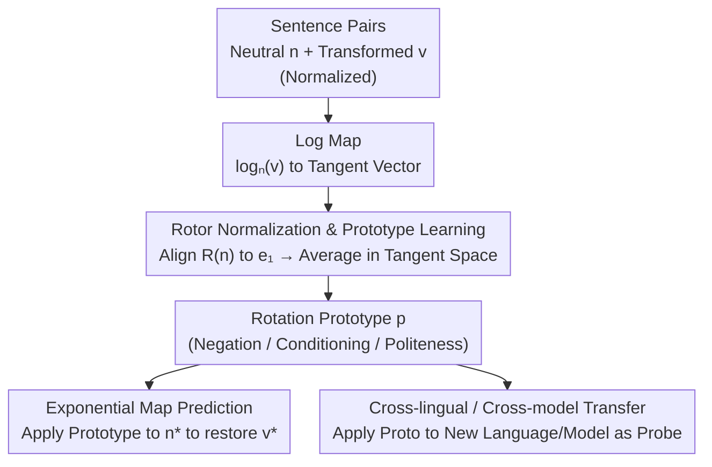

# Mapping Semantic & Syntactic Relationships with Geometric Rotation

**Conference**: ICLR 2026  
**arXiv**: [2510.09790](https://arxiv.org/abs/2510.09790)  
**Code**: [https://github.com/fuelix/RISE-steering](https://github.com/fuelix/RISE-steering)  
**Area**: Representation Learning / Embedding Interpretability  
**Keywords**: Embedding Geometry, Hyperspherical Rotation, Cross-lingual Generalization, Semantic Transformation, Linear Representation Hypothesis (LRH)

## TL;DR

This paper proposes RISE (Rotor-Invariant Shift Estimation), a method that utilizes Clifford algebra rotors to represent clausal semantic-syntactic transformations (negation, conditioning, politeness) as consistent rotation operations on a unit hypersphere. Systematic experiments across 7 languages, 3 embedding models, and 3 transformations demonstrate that these rotations are transferable across languages and models (77%-95% maintenance rate). This work marks the first extension of the Linear Representation Hypothesis (LRH) from word-level to cross-lingual clausal level, generalized to geodesic structures on curved manifolds.

## Background & Motivation

**Background**: During the word2vec era, semantic relationships could be intuitively expressed via vector arithmetic (e.g., "king - man + woman = queen"), indicating high linear interpretability in semantic spaces. The Linear Representation Hypothesis (LRH) formalizes this by asserting that semantic concepts are encoded as linear structures in embedding spaces. However, high-dimensional representations in modern Transformer models lose this intuitive geometric correspondence, leading to opaque internal mechanisms.

**Limitations of Prior Work**: (1) Existing interpretability methods (probes, steering vectors) are mostly task-specific and lack a systematic geometric framework to map semantic relationships. (2) Steering vectors exhibit inconsistent effects across different contexts, lacking generalization. (3) Validation of LRH has been largely confined to monolingual word-level tasks, leaving cross-lingual and clausal-level validation unexplored. (4) A critical geometric mismatch exists: modern embeddings reside on curved manifolds (hyperspheres), while traditional methods operate in Euclidean space, potentially causing the poor generalization of steering vectors.

**Key Challenge**: Embedding spaces are curved (spherical), yet manipulation and analysis tools assume they are flat (Euclidean). A method for representing semantic transformations that respects manifold geometry is needed.

**Goal**: Develop a geometric framework to identify clausal semantic-syntactic transformations and determine if these transformations can be consistently mapped as geometric operations across languages and model architectures.

**Key Insight**: Normalized sentence embeddings lie on a unit hypersphere → semantic transformations correspond to rotational shifts on the sphere → use Clifford algebra rotors to normalize and align transformations across different sentences → learn a universal "Rotation Prototype" for specific semantic transformations → apply this prototype to new sentences for prediction.

**Core Idea**: Semantic-syntactic transformations are consistent rotation operations on a hypersphere; once normalized by rotors, they become transferable across languages and models.

## Method

### Overall Architecture

RISE addresses a fundamental question: since modern embedding models map sentences to a curved unit hypersphere, what geometric operations do clausal transformations like "negation," "conditioning," or "politeness" correspond to? The method posits that **a category of semantic transformation equals a consistent rotation on the sphere**, which can be summarized by a compact "Rotation Prototype" $\vec{p}$.

The pipeline consists of three steps operating within a Riemannian geometric framework. The input is a set of "neutral-transformed" sentence pairs $(n_i, v_i)$ (normalized onto the sphere): first, use a logarithmic map to "flatten" the semantic displacement into a tangent vector at $n_i$; then, use a rotor to rotate each tangent space to a reference direction for averaging to obtain the prototype; finally, for a new sentence, use an exponential map to "project" the prototype back onto the sphere to predict the transformed embedding.

### Key Designs

**1. Rotor Normalization & Prototype Learning: Aligning transformations to a common coordinate system**

Normalized embeddings lie on the unit hypersphere, so the shift from neutral sentence $n_i$ to transformed sentence $v_i$ is a geodesic arc rather than an additive vector. RISE uses the Riemannian logarithmic map $\log_{n_i}(v_i)$ to flatten this shift into a tangent vector in the tangent space at $n_i$. However, since tangent spaces vary at each $n_i$, vectors cannot be compared directly. RISE computes an orthogonal transformation (rotor) $R(n_i)$ to rotate $n_i$ to a reference direction $e_1$, aligning all tangent spaces. This "removes" the base semantic content, leaving only the transformation. The aligned tangent vectors $\xi_i = R(n_i)\log_{n_i}(v_i)$ are averaged to create the prototype $\vec{p} = \frac{1}{M}\sum_i \xi_i$. 

For **prediction**, the process is reversed for a new sentence $n^\ast$: rotate $\vec{p}$ back to the tangent space of $n^\ast$ using $R(n^\ast)^\top$, then apply the exponential map $\exp_{n^\ast}(\cdot)$ to move along the geodesic. Unlike Mean Difference Vectors (MDV) which subtract in Euclidean space and ignore curvature, RISE respects the manifold's intrinsic geometry.

**2. Cross-lingual & Cross-model Transfer: Testing geometric universality**

The learned prototype acts as a probe to test the universality of semantic transformations. In cross-lingual transfer, a prototype learned in Language A is applied to embeddings in Language B. If the rotation remains effective, it suggests the geometric structure reflects semantic properties rather than language-specific syntax. Cross-model transfer utilizes statistical mapping (PCA + distribution alignment) to move prototypes across different model spaces (e.g., from `text-embedding-3-large` to `bge-m3`).

**3. Commutativity & Theoretical Support: Proving compositionality**

The authors prove that RISE transformations are compositional. Theorem A.1 shows that when applying multiple transformations sequentially, the difference between paths (e.g., "negate then condition" vs. "condition then negate") is $O(\|\vec{p}_A\| \cdot \|\vec{p}_B\|)$. Under small-angle approximations, these rotations commute, mimicking vector addition in Euclidean space. This provides an algebraic guarantee for extending LRH to curved manifolds.

## Key Experimental Results

### Main Results (Cross-lingual Transfer, rotor alignment score = Cosine Similarity)

| Transformation | Avg Score | Performance Range | Variation | Characteristics |
| :--- | :--- | :--- | :--- | :--- |
| Negation | **0.788** | 0.686-0.918 | Moderate | Strongest cross-lingual consistency |
| Conditioning | 0.780 | Stable | **Lowest (0.038)** | Highest uniformity |
| Politeness | 0.762 | Large variation | Highest (0.060) | Evident cultural dependence |

### Cross-model Transfer (text-embedding-3-large → bge-m3)

| Language | Transfer Performance | Notes |
| :--- | :--- | :--- |
| English | 0.80-0.82 | Best, likely reflects training data bias |
| Other Languages | 0.70-0.75 | Good, but ~20% performance gap |
| Zulu | 0.63-0.66 | Lowest, challenge of low-resource languages |

### Baseline Comparison

| Method | Monolingual Syntax (BLiMP) | Monolingual Semantics (SICK) | Cross-lingual Transfer |
| :--- | :--- | :--- | :--- |
| RISE | Strong (0.97) | Strong (0.84) | Moderate-Strong (0.74-0.89) |
| MDV | Strong (0.97) | Strong (0.83) | Moderate-Strong (0.72-0.91) |
| Procrustes | Strong (0.99) | Moderate (0.67) | **Failing-Weak (0.25-0.62)** |

### Key Findings

- **Negation consistency**: Rotations for negation are consistent across all languages, implying negation may be a "semantic primitive" independent of specific syntactic implementations (particles, suffixes, etc.).
- **Conditioning stability**: Has the lowest fluctuation, showing modal semantics are encoded very stably across languages.
- **Cultural impact**: Politeness shows the most variation, consistent with its dependence on social and cultural contexts.
- **Failure of global methods**: Procrustes alignment fails in cross-lingual scenarios as rigid global rotations are too coarse, justifying the need for manifold-aware methods.
- **Downstream gains**: In a negation classification task, RISE reached 93.0% accuracy vs. 87.2% for MDV, indicating RISE captures more useful semantic information.

## Highlights & Insights

- **"Rotation, not Translation"**: Shifting from additive vectors to rotations respects the inherent geometry of normalized embeddings, potentially explaining why traditional steering vectors lose efficacy in different contexts.
- **Negation as a Semantic Primitive**: The geometric consistency across diverse language families (analytic, agglutinative, inflectional) suggests these structures reflect properties of the semantic concept itself.
- **Extension of LRH**: RISE successfully generalizes the "linear direction = semantic concept" logic of LRH to "geodesic arc = semantic transformation" on Riemannian manifolds.
- **Algebraic Composition**: Approximate commutativity ensures that semantic transformations remain compositional in curved spaces, providing a theoretical foundation for interpretability.

## Limitations & Future Work

- **Scope of Transformations**: Limited to three types; needs extension to tense, causality, entailment, etc.
- **Data Bias**: Use of GPT-generated synthetic data may introduce anglocentric bias; requires validation with natural corpora.
- **Resource Disparity**: Significant performance gap between high-resource (English) and low-resource (Zulu) languages in cross-model transfer.
- **Semantic Nuance**: RISE performs moderately on deep semantic similarity tasks (SICK), suggesting it may capture syntactic structures more effectively than granular semantic nuances.

## Related Work & Insights

- **Park et al. (2024, 2025)**: Formalized three types of linear representations; RISE extends this to geodesic structures on manifolds.
- **Householder Pseudo-Rotation (HPR)**: Uses reflections for LLM activation steering; RISE applies rotors for embedding space analysis.
- **Steering Vector Research (Turner, Zou, Li, etc.)**: Primarily focuses on LLM internal activations; RISE extends steering principles to the geometry of embedding models.

## Rating

- **Novelty**: ⭐⭐⭐⭐⭐ First to model transformations as hyperspherical rotations with cross-lingual validation and LRH extension.
- **Experimental Thoroughness**: ⭐⭐⭐⭐⭐ Extensive evaluation across 7 languages, 3 models, and multiple baselines.
- **Writing Quality**: ⭐⭐⭐⭐⭐ Clear progression from theoretical motivation to design and empirical proof.
- **Value**: ⭐⭐⭐⭐ Foundational contribution to embedding interpretability and multilingual understanding.

<!-- RELATED:START -->

## Related Papers

- [\[ICLR 2026\] Lean Finder: Semantic Search for Mathlib That Understands User Intents](lean_finder_semantic_search_for_mathlib_that_understands_user_intents.md)
- [\[ICLR 2026\] Improving Semantic Proximity in Information Retrieval through Cross-Lingual Alignment](improving_semantic_proximity_in_information_retrieval_through_cross-lingual_alig.md)
- [\[ACL 2025\] Semantic Outlier Removal with Embedding Models and LLMs](../../ACL2025/information_retrieval/semantic_outlier_removal_with_embedding_models_and_llms.md)
- [\[AAAI 2026\] Magnitude Matters: A Superior Class of Similarity Metrics for Holistic Semantic Understanding](../../AAAI2026/information_retrieval/magnitude_matters_a_superior_class_of_similarity_metrics_for_holistic_semantic_u.md)
- [\[ACL 2025\] Uncovering Visual-Semantic Psycholinguistic Properties from the Distributional Structure of Text Embedding Space](../../ACL2025/information_retrieval/psycholinguistic_visual_semantic.md)

<!-- RELATED:END -->
