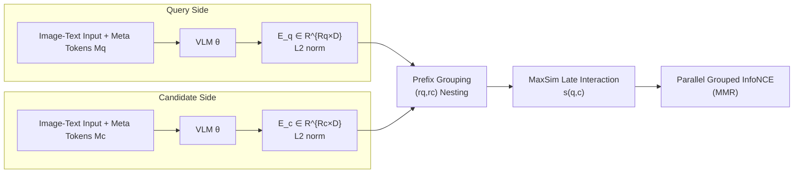

# MetaEmbed: Scaling Multimodal Retrieval at Test-Time with Flexible Late Interaction

**Conference**: ICLR 2026  
**OpenReview**: [https://openreview.net/forum?id=yKDqg9HwZX](https://openreview.net/forum?id=yKDqg9HwZX)  
**Code**: [https://github.com/facebookresearch/MetaEmbed](https://github.com/facebookresearch/MetaEmbed)  
**Area**: Multimodal Retrieval / Multi-Vector Late Interaction / Representation Learning  
**Keywords**: Multimodal Retrieval, Late Interaction, Multi-Vector, Matryoshka Representation, Test-Time Scaling, VLM Embedding  

## TL;DR
By appending a small set of learnable Meta Tokens to VLM input sequences and organizing information by granularity into these tokens using Matryoshka-nested multi-vector contrastive training, MetaEmbed allows users to freely choose between 1 to 64 vectors at test-time to trade off retrieval accuracy against indexing and latency overhead. This achieves SOTA performance on MMEB and ViDoRe with compact multi-vector representations and scales stably to 32B parameters.

## Background & Motivation
**Background**: General multimodal embedding models based on VLMs (VLM2Vec, GME, mmE5, MoCa, etc.) effectively capture semantic relevance between queries and candidates by performing contrastive learning on the last-layer hidden states. The mainstream approach compresses the entire query/candidate into a **single vector**, making indexing and scoring lightweight.

**Limitations of Prior Work**: Single vectors lose fine-grained information in cross-modal scenarios and have a theoretical upper bound on expressiveness. In text retrieval, **multi-vector late interaction** proposed by ColBERT retains token-level embeddings and uses MaxSim for lightweight scoring, preserving significantly more information than single vectors. This has spurred multimodal variants like ColPali and ColQwen. However, these methods encode each image into hundreds of patch vectors, causing index volume and retrieval latency to explode.

**Key Challenge**: Single vectors are too "thin" with insufficient expressiveness; ColBERT-style multi-vectors are too "fat" to store or compute efficiently—especially when **both query and candidate contain images**, where the interaction of thousands of tokens makes training and inference prohibitively expensive. Retrieval systems lack a knob to **freely slide between accuracy and cost**.

**Goal**: Design a multimodal retrieval framework that retains the expressiveness of multi-vectors, compresses the vector count to a range of single digits to dozens, and supports flexible expansion or contraction at test-time according to a budget.

**Key Insight**: **Use a small set of learnable Meta Tokens as "information compressors"**—their last-layer contextual representations serve as compact yet expressive multi-vector embeddings. Then, utilize **Matryoshka-style nested training** to order these vectors by granularity from coarse to fine, allowing the selection of only the first $r$ vectors at test-time to achieve different accuracy-efficiency trade-offs without retraining.

## Method

### Overall Architecture
MetaEmbed appends a set of learnable Meta Tokens to the end of both query and candidate input sequences. These pass through the same VLM alongside original image-text tokens. The last-layer hidden states at the Meta Token positions (L2 normalized) are extracted as **Meta Embeddings**—a fixed-size set of multi-vector representations. During training, **Matryoshka Multi-Vector Retrieval (MMR)** uses multiple nested prefix groups for parallel contrastive learning, ensuring the first few vectors form a "coarse summary" while subsequent vectors provide "fine-grained refinement." At test-time, retrieval granularity and budget are adjusted by choosing different prefix lengths $(r_q, r_c)$.

### Key Designs

**1. Meta Tokens as Compressed Contextual Multi-Vectors: Replacing "hundreds of patches" with "a few tokens."** Instead of directly retaining patch/token-level embeddings, MetaEmbed concatenates learnable query Meta Tokens $M_q\in\mathbb{R}^{R_q\times D}$ and candidate Meta Tokens $M_c\in\mathbb{R}^{R_c\times D}$ to the input. The transformer processes $z^{(0)}=[v;t;M_q;M_c]$ ($v$ for visual patches, $t$ for text) as a whole, and **only the positions of Meta Tokens** are extracted from the last hidden states $H=F_\theta(z^{(0)})$ to obtain $E^{(q)}_{\text{meta}}$ and $E^{(c)}_{\text{meta}}$. These vectors are fully contextualized "information sinks," allowing for a very small number of vectors (single digits to dozens) while retaining fine-grained semantics. Queries and candidates are encoded independently, enabling offline indexing like ColBERT, with scoring using MaxSim late interaction $s(q,c)=\sum_{i}\max_{j}\langle E^{(i)}_q, E^{(j)}_c\rangle$. This step compresses multi-vector retrieval from "thousands of vector interactions" to an affordable scale, resolving the previous bottleneck in multimodal-to-multimodal retrieval.

**2. Matryoshka Multi-Vector Retrieval (MMR): Ordering vectors by importance via nested prefixes.** Simply using all vectors is not "flexible"—indexing grows at $O(N\cdot R_c\cdot D)$ and scoring at $O(R_q\cdot R_c\cdot D)$. Inspired by Matryoshka Representation Learning, the authors impose a **prefix nesting structure** on Meta Embeddings: $G$ sets of increasing group sizes $1\le r^{(1)}_q<\dots<r^{(G)}_q=R_q$ are fixed (similarly for candidates). The $g$-th group utilizes only the prefix $E^{(q,g)}=E^{(q)}_{\text{meta}}[1{:}r^{(g)}_q]$ to compute the late interaction score $s^{(g)}(q,c)=\sum_{i=1}^{r^{(g)}_q}\max_{j\le r^{(g)}_c}\langle E^{(g,i)}_q,E^{(g,j)}_c\rangle$. This forces the leading vectors to be discriminative (serving as coarse summaries) while subsequent vectors provide refinements. The paper uses $G=5$ with group sizes $\{(1,1),(2,4),(4,8),(8,16),(16,64)\}$.

**3. Grouped Parallel Contrastive Objective: Optimizing all granularities simultaneously.** All groups $g$ are optimized **in parallel** during training, making each prefix independently discriminative and consistent with larger prefixes. For a minibatch containing a positive sample $c^{(b)}$ and an explicit hard negative $c^{(b,-)}$, the similarity is defined as $S^{(g)}_{u,v}=\frac{1}{\tau}s^{(g)}(q^{(u)},c^{(v)})$, and the InfoNCE for group $g$ is:

$$\mathcal{L}^{(g)}_{\text{NCE}}=-\frac{1}{B}\sum_{u=1}^{B}\log\frac{\exp(S^{(g)}_{u,u})}{\exp(S^{(g)}_{u,u})+\sum_{v\ne u}\exp(S^{(g)}_{u,v})+\exp(\tfrac{1}{\tau}s^{(g)}(q^{(u)},c^{(u,-)}))}$$

The final loss is a weighted sum: $\mathcal{L}_{\text{final}}=\sum_{g=1}^{G}w_g\,\mathcal{L}^{(g)}_{\text{NCE}}$ (with $w_g=1, \tau=0.03$ in experiments). Since granularities are optimized in parallel, **no retraining is required to switch group sizes at test-time**.

**4. Test-Time Scaling Knob: One-click balance of accuracy, index, and latency.** The nested design provides a simple knob: when indexing, each candidate stores only the first $r^{(g)}_c$ vectors; when querying, $(r^{(g)}_q,r^{(g)}_c)$ is selected based on latency constraints to calculate $s^{(g)}(q,c)$. Coarse prefixes (small $g$) are suitable for fast recall, while large prefixes (large $g$) offer higher accuracy. Increasing Meta Embeddings for indexing improves quality at the cost of higher indexing and latency—a "test-time scaling" capability previously missing in multimodal retrieval.

## Key Experimental Results

### Main Results
MMEB (36 tasks, Precision@1, %) and ViDoRe v2 (7 tasks, NDCG@5, %), reported at $(r_q,r_c)=(16,64)$:

| Model | Scale | MMEB Overall | ViDoRe v2 Avg |
|------|------|--------------|---------------|
| mmE5 | 11B | 69.8 | 50.5 |
| MoCa-7B | 7B | 71.5 | 58.8 |
| B3-7B | 7B | 72.0 | — |
| ColPali (Multi-Vector) | 3B | — | 54.5 |
| **MetaEmbed-3B** | 3B | **69.1** | **60.3** |
| **MetaEmbed-7B** | 7B | **76.6** | **61.3** |
| **MetaEmbed-32B** | 32B | **78.7** | — |

The 7B model outperforms MoCa-7B by 5.1 points and mmE5 by 6.8 points. The 32B model pushes the state-of-the-art to 78.7. On ViDoRe v2, even the 3B model outperforms larger single/multi-vector baselines. Despite **no multilingual training data**, it shows the largest gains in multilingual and biomedical subsets, indicating it inherits the backbone's cross-lingual capabilities.

### Ablation Study
**Test-Time Scaling (MMEB Precision@1 across budgets)**: Increasing the budget from (1,1) to (16,64) monotonically improves results across all scales, with larger gains in larger models:

| Model | (1,1) | (16,64) | Gain over Single Vector |
|------|-------|---------|----------------|
| MetaEmbed-3B | 65.4 | 69.1 | +3.3 |
| MetaEmbed-7B | 71.3 | 76.6 | +5.0 |
| MetaEmbed-32B | 72.4 | 78.7 | +6.6 |

**MMR Effectiveness (ViDoRe v1, MetaEmbed-3B)**: Without MMR, low-budget performance degrades significantly—dropping 9.0 points in the (1,1) setting. Even at full budget (16,64), MMR remains slightly superior, showing that nested training does not sacrifice full-scale multi-vector capability.

**Efficiency (MetaEmbed-7B, A100, 100k Candidates/Queries)**:

| Budget | Scoring FLOPs (G) | Latency (ms) | Index (GiB) | MMEB Acc |
|------|-------------------|-----------|------------|----------|
| (1,1) | 0.71 | 1.67 | 0.68 | 71.3 |
| (8,16) | 91.75 | 1.92 | 10.68 | 74.3 |
| (16,64) | 733.89 | 6.25 | 42.72 | 76.6 |

### Key Findings
- **Scoring stage adds negligible latency at medium budgets**: While FLOPs increase 100x, latency remains almost flat between (1,1) and (8,16) as GPU throughput absorbs the extra computation.
- **Query encoding is the bottleneck, not scoring**: Encoding a 1024-token image query takes 42.72 TFLOPs (788ms), magnitudes higher than scoring. Efficiency optimization should focus on encoding.
- **Backbone selection determines the ceiling**: MetaEmbed-11B based on Llama-3.2-Vision performed poorly (65.1) due to the weak VQA capabilities of the base model (42.1, 32 points lower than Qwen2.5-VL-7B). Generation shortcomings in the base model propagate to the embedding model.
- **Superior Scaling**: While single-vector baselines show diminishing returns from 7B to 32B, MetaEmbed continues to show significant gains.

## Highlights & Insights
- **Introduces "test-time scaling" to multimodal multi-vector retrieval**: Train once, then freely slide between accuracy, latency, and indexing budget at inference without retraining for different deployment scenarios.
- **Meta Tokens act as an elegant "learnable information bottleneck"**: Attention mechanisms allow the model to aggregate sequence-wide information into fixed tokens, avoiding the storage explosion of patch-level multi-vectors while retaining more detail than a single vector.
- **MMR = Expanding Matryoshka logic from "dimension nesting" to "vector nesting"**: While standard MRL nests dimensions in a single vector, MetaEmbed nests the number of vectors. This transition is natural and validated for the first time in multi-vector retrieval.
- **Enables Multimodal $\leftrightarrow$ Multimodal Retrieval**: Compressing both sides into a small set of vectors makes "image-to-image" retrieval trainable and inferable, which was previously blocked by token explosion.

## Limitations & Future Work
- **Index memory scales linearly with budget**: 100k candidates require 42.72 GiB at the (16,64) budget, which is challenging for large-scale deployment. Solutions currently rely on budget selection or CPU offloading rather than algorithmic compression.
- **Heavy dependence on backbone quality**: Defects in specific domains (e.g., VQA) of the base model are inherited; the method itself does not fix underlying generational weaknesses.
- **Heuristic Meta Token count and group sizes**: $G=5$ and sizes like $\{(1,1)\dots(16,64)\}$ are empirical choices; there is a lack of theory for optimal nesting structures.
- **Multilingual capability is "borrowed" from the backbone**: While effective, there is no specialized multilingual optimization.
- **Future Directions**: Integration with ANN and vector compression (e.g., PLAID, quantization); adaptive budget selection (selecting $r$ based on query difficulty); applying Meta Tokens to other scalable representation tasks.

## Related Work & Insights
- **Multimodal Embedding**: CLIP/BLIP/SigLIP independently encode modalities; newer models like VLM2Vec, GME, and mmE5 innovate on VLM backbones and data—but most remain restricted to single vectors, limiting scalability.
- **Multi-Vector Retrieval**: ColBERT pioneered late interaction, and ColPali/ColQwen brought it to image-text retrieval. However, patch-level vectors lead to storage and latency issues and fail for multimodal $\leftrightarrow$ multimodal. MetaEmbed uses Meta Tokens to solve these issues directly.
- **Matryoshka Representation Learning (MRL)**: Nests multi-granularity features in a single vector. This paper is the first to apply this to **multi-vector** retrieval for test-time scaling.
- **Insight**: The paradigm of "learnable query/pooling tokens + nested granularity training" can be generalized to any representation learning scenario requiring flexible trade-offs between quality and cost (e.g., compression, cache-friendly vector databases).

## Rating
- **Novelty**: ⭐⭐⭐⭐⭐ Combining Meta Token compression with Matryoshka multi-vector nesting achieves the first test-time scaling for multimodal multi-vector retrieval.
- **Experimental Thoroughness**: ⭐⭐⭐⭐ Covers MMEB/ViDoRe benchmarks, four scales from 3B~32B, two VLM architectures, and complete budget-efficiency ablations. Lacks only large-scale deployment testing with index compression.
- **Writing Quality**: ⭐⭐⭐⭐ Logic is smooth; Figures 1-3 provide an intuitive explanation of nested vectors and budget sliders.
- **Value**: ⭐⭐⭐⭐⭐ Provides an industrially deployable "train once, scale as needed" multimodal retrieval solution. Being open-source (Meta) adds high value for practical systems.

<!-- RELATED:START -->

## Related Papers

- [\[ICLR 2026\] Reusing Pre-training Data at Test Time is a Compute Multiplier](reusing_pre-training_data_at_test_time_is_a_compute_multiplier.md)
- [\[ICLR 2026\] Robust Test-Time Video-Text Retrieval: Benchmarking and Adapting for Query Shifts](robust_test-time_video-text_retrieval_benchmarking_and_adapting_for_query_shifts.md)
- [\[AAAI 2026\] Towards Inference-Time Scaling for Continuous Space Reasoning](../../AAAI2026/information_retrieval/towards_inference-time_scaling_for_continuous_space_reasoning.md)
- [\[ACL 2026\] Test-Time Training for Zero-Resource Dense Retrieval Reranking](../../ACL2026/information_retrieval/test-time_training_for_zero-resource_dense_retrieval_reranking.md)
- [\[ICLR 2026\] MRMR: A Realistic and Expert-Level Multidisciplinary Benchmark for Reasoning-Intensive Multimodal Retrieval](mrmr_a_realistic_and_expert-level_multidisciplinary_benchmark_for_reasoning-inte.md)

<!-- RELATED:END -->
