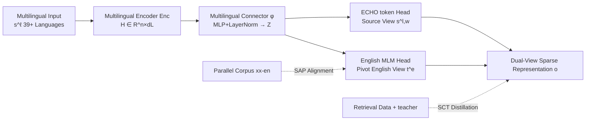

# MILCO: Learned Sparse Retrieval Across Languages via a Multilingual Connector

**Conference**: ICLR 2026  
**OpenReview**: [https://openreview.net/forum?id=Z6dVYEqurT](https://openreview.net/forum?id=Z6dVYEqurT)  
**Code**: [https://github.com/thongnt99/milco](https://github.com/thongnt99/milco)  
**Area**: Information Retrieval / Learned Sparse Retrieval / Multilingual and Cross-Lingual Retrieval  
**Keywords**: Learned Sparse Retrieval, Multilingual Connector, English Vocabulary Pivot, Sparse Alignment Pre-training, LexEcho Dual-View

## TL;DR
MILCO employs a "multilingual connector + English MLM head" to project text from 39+ languages into a shared English vocabulary sparse space. Combined with "Sparse Alignment Pre-training" to prevent semantic collapse and a "LexEcho dual-view" to recover rare entities lost during translation, a single 560M sparse model outperforms dense, sparse, and multi-vector baselines such as BGE-M3 and Qwen3-Embed in both multilingual and cross-lingual retrieval tasks.

## Background & Motivation
- **Background**: Learned Sparse Retrieval (LSR, e.g., SPLADE) combines the retrieval efficiency of dual-encoders with the lexical interpretability of term matching—representations are directly aligned with natural language vocabularies, facilitating error tracing, bias checking, and post-hoc pruning for Matryoshka-style latency control. However, LSR progress has been almost exclusively focused on English.
- **Limitations of Prior Work**: Multilingual expansion remains fragmented. BGE-M3 integrates dense, sparse, and multi-vector heads into one backbone, but its sparse component performs poorly and lacks cross-lingual capabilities; SPLADE-X and BLADE only handle cross-lingual retrieval and require training separate models for each language pair, making them difficult to scale.
- **Key Challenge**: The most direct multilingual LSR approach is connecting a multilingual encoder to a multilingual MLM head to project into a full multilingual vocabulary. However, direct contrastive training triggers severe **semantic collapse**, where representations degenerate into random latent tokens unrelated to the input, causing both interpretability and performance to crash.
- **Goal**: Develop a single sparse model to support both multilingual retrieval (same language for query and document) and cross-lingual retrieval (different languages) while maintaining lexical transparency and achieving SOTA performance.
- **Core Idea**: **[Pivot Vocab Unification]** Instead of aligning to a massive multilingual vocabulary, collapse all languages into an English pivot vocabulary using a lightweight connector to map multilingual hidden states to the English MLM head's input space; **[Alignment before Contrastive]** Use massive parallel corpora for Sparse Alignment Pre-training to "anchor" representations to the English vocabulary before contrastive training to avoid collapse; **[Source Language Echo]** Maintain an additional source token view specifically to recover rare entities that might be lost in the English view translation.

## Method

### Overall Architecture
MILCO consists of three sequential components: a Multilingual Encoder → a Multilingual Connector → a LexEcho Head. It outputs a sparse vector aligned with the English vocabulary for every text (plus an additional source language view). Training occurs in two stages: first, Sparse Alignment Pre-training (SAP) using parallel corpora to anchor the English view to the English vocabulary, followed by Sparse Contrastive Training (SCT) using retrieval data to enhance performance. $\ell_1$ regularization is used throughout to maintain sparsity.

### Key Designs

**1. Multilingual Connector: Folding all languages into the English vocabulary.** After the encoder outputs multilingual hidden states $H \in \mathbb{R}^{n \times d_L}$, the connector $\phi$ (an MLP) combined with $\mathrm{LayerNorm}(\mathrm{Linear}(\phi(H)))$ projects them into the embedding space of the pivot language (English) $Z \in \mathbb{R}^{n \times d_e}$. This step is the fundamental difference from the "multilingual MLM head" approach: rather than forcing the model to distribute weights across a massive multilingual vocabulary, it converges onto an English pivot that is information-rich and has existing LSR teachers available for alignment. This yields cross-lingually universal representations while reducing training memory and compute requirements—allowing a single model to serve both multilingual and cross-lingual scenarios.

**2. LexEcho Dual-View Head: English view for semantics, source view for entity recovery.** The projected $Z$ is decoded by the English MLM head into an English vocabulary $V_e$. Using a log-saturation activation $\mathrm{LogSat}(x)=\log(1+\mathrm{ReLU}(x))$, non-negative logits $T^{(e)}=\mathrm{LogSat}(\mathrm{Dec}(Z)) \in \mathbb{R}^{n \times |V_e|}$ are obtained. Max-pooling along the source token dimension yields the English sparse vector $t^{(e)}_j=\max_i T^{(e)}_{ij}$. This path provides both literal translations (live, music, phone) and semantically expanded terms (song, stream, step) to support semantic retrieval. However, the connector may fail on rare/unseen entities (especially non-Latin characters like "陌陌 Momo"). Thus, MILCO uses a dedicated $\mathrm{[ECHO]}$ token head to calculate source token weights $w=\mathrm{LogSat}(\mathrm{Dec}_{[\text{ECHO}]}(Z)) \in \mathbb{R}^n_{\ge 0}$, selectively "echoing" critical source tokens. The final representation $o=\{t^{(e)}, s^{(l)}, w\}$ combines the English semantic view and weighted source view, enabling the model to represent entities it has never seen or cannot translate.

**3. Sparse Alignment Pre-training (SAP): Anchoring before optimization.** Since direct contrastive training causes semantic collapse, the first stage uses an existing English LSR teacher (e.g., SPLADE-v3) to produce target sparse vectors $t^*$ for English sentences in parallel pairs $(s^{(\ell)}, s^{(e)})$, and aligns the English view $t^{(e)}$ of the non-English sentence to it. A key component is the **Sparse-aware MSE (SMSE)** loss: as sparse vectors have mostly zero coordinates and LogSat has zero gradients for negative pre-activations, the loss is defined directly on the decoding logits $\mathrm{Dec}(Z)$ and calculated only on coordinates where "at least one side is positive":
$$L_{\text{SMSE}}(t^{(e)},t^*)=\frac{\sum_j \mathbb{1}(\tilde t^{(e)}_j>0 \lor \tilde t^*_j>0)\,(\tilde t^{(e)}_j-\tilde t^*_j)^2}{\sum_j \mathbb{1}(\tilde t^{(e)}_j>0 \lor \tilde t^*_j>0)}$$
This concentrates learning signals on the few informative lexical coordinates, mitigating gradient dilution and stabilizing alignment. SAP utilizes a massive amount of easily accessible bilingual parallel corpora (594M pairs), bypassing the scarcity of multilingual relevance labels.

**4. Sparse Contrastive Training (SCT): Distilling performance, $\ell_1$ for sparsity.** Alignment anchors the vocabulary but does not optimize for retrieval. The second stage uses KL distillation on retrieval data to transfer knowledge from a cross-encoder teacher, adding $\ell_1$ regularization on query/document to promote sparsity: $L_{\text{contrastive}}=L_{\text{KLD}}+\alpha_q\|q\|_1+\alpha_d\|p\|_1$. The paper emphasizes that SAP is a **precondition** for SCT—without alignment, direct contrastive training leads to collapse and significantly worse performance.

## Key Experimental Results

### Main Results (MIRACL dev, nDCG@10, Mean over 18 languages)

| Model | Scale | Avg | Notes |
|---|---|---|---|
| BM25 | - | 31.9 | Unsupervised Sparse |
| M3-Sparse | 560M | 53.9 | BGE-M3 Sparse Component |
| T-Splade | 3.4B | 54.5 | Translate to English then SPLADE |
| Qwen3-Embed-0.6B | 596M | 60.5 | Dense |
| M3-Dense | 560M | 69.2 | Dense |
| Qwen3-Embed-8B | 7.57B | 69.8 | Large Language Model Dense |
| M3-Dense+Sparse+Multivec | 560M | 71.5 | Hybrid Triple-head |
| **MILCO ① (SAP+SCT_KD+LexEcho)** | **560M** | **72.3** | **Strongest variant** |

MILCO outperforms M3-Sparse by +34.1%, T-Splade by +32.7%, Qwen3-0.6B by +19.5%, and M3-Dense by +4.5%. Despite being roughly 14× smaller, it exceeds E5-Mistral 7B and Qwen3-8B. On MLDR long documents (13 languages), it achieves 74.4, which is 14% higher than the M3-All hybrid ensemble. On MTEBv2 (39 languages), it leads the small model group with 66.83.

### Ablation Study (MIRACL Avg nDCG@10)

| Configuration | Avg | Conclusion |
|---|---|---|
| ① SAP + SCT_KD + LexEcho | 72.3 | Full Model |
| ② SAP + SCT_KD + English-only view | 69.4 | Removing source view: −4.17% |
| ③ SAP + SCT(InfoNCE) + LexEcho | 70.1 | Without distillation |
| ④ SAP + English MLM only (alignment only) | 54.5 | Lacks contrastive training |
| ⑤ SCT_KD + English MLM (contrastive only) | 59.2 | Lacks alignment |
| ⑥ noMILCO (No connector, multilingual MLM head) | 50.7 | Removing connector is the worst |

### Key Findings
- **Alignment is the foundation**: Performance collapses without SAP (⑤) or without the connector (⑥). Alignment alone (④) only reaches 54.5 and requires subsequent contrastive training (→ ③ 70.1, specifically with distillation → ① 72.3).
- **LexEcho provides the greatest gain for non-Latin languages**: Compared to the English-only view (②), performance increases by +8.09% for Chinese, +6.8% for Telugu, +6.5% for Persian, +6.5% for Korean, and +6.04% for Japanese, precisely because these language entities are harder to map to English.
- **Interpretability + Dynamic Efficiency**: Sparse lexical representations allow error tracing (e.g., discovering "Momo" was missed by the English view but recovered with a high weight for "陌" by LexEcho). Using mass-based pruning to compress document representations to an average of only 30 active dimensions, MILCO-560M still outperforms the 1024-dimensional Qwen3-0.6B, with 3× lower retrieval latency and 10× smaller index.
- **Zero-shot Cross-lingual**: The connector projects languages into a unified English view, enabling MILCO to perform zero-shot cross-lingual retrieval (MKQA R@100), a task impossible for "source-view only" sparse models like M3-Sparse.

## Highlights & Insights
- **"Pivot Vocabulary + Alignment before Contrastive" is the key to preventing semantic collapse**: Folding multiple languages into the English vocabulary unifies representations while saving compute. The SMSE loss, calculated only on sparse activation coordinates and applied directly to logits before LogSat, is an engineering breakthrough for stable sparse alignment.
- **LexEcho elegantly addresses structural flaws of the pivot paradigm**: The loss of entities when pivoting through English is a structural issue (unsolvable even by scaling up, as new entities emerge constantly). Dual-view explicitly decouples semantics (via English) and entities (via source language), with weights adaptively determining the importance of each path.
- **Sparse LSR outperforms dense/hybrid models in multilingual settings**: Achieving SOTA results while being 1/14th the size of Qwen3-8B demonstrates the high upper bound of lexical sparse retrieval, while retaining transparency and controllable latency through pruning.

## Limitations & Future Work
- **Reliance on English as a pivot and English LSR teachers**: While the method isn't restricted to English as a pivot, it was chosen due to available resources/teachers. The feasibility for low-resource pivots or settings without teachers remains unverified.
- **512 token training context**: Long documents are handled via passage-level scoring (selecting the best passage), which is not native long-context support and may lose cross-paragraph semantics.
- **Heavy reliance on large-scale parallel corpora during SAP** (594M bilingual pairs); coverage for language pairs with scarce parallel resources is unclear.
- **Source-view language-specific vocabularies** still introduce some heterogeneity; complete cross-lingual unification is only achieved at the English-view level.

## Related Work & Insights
- **LSR Lineage**: Moving from SNRM (latent sparsity) to SPLADE (MLM head, differentiable query weighting and expansion), MILCO belongs to the MLM Encoder family and is the first to systematically solve its multilingualization.
- **Cross-Lingual Retrieval**: Compared to the "one model per language pair" approach of SPLADE-X/BLADE and the weak cross-lingual capabilities of the BGE-M3 sparse component, MILCO unifies multilingual and cross-lingual tasks in a single model.
- **Alignment Pre-training**: Proposes the first exploration of "multilingual sparse alignment" by migrating dense alignment ideas (e.g., Reimers & Gurevych) into a sparse vocabulary space.
- **Insights**: The concept of pivot language folding plus dual-view echoing can be generalized to other multimodal/multilingual sparse modeling tasks that require unified representations while preserving rare tokens.

## Rating
- **Novelty**: ⭐⭐⭐⭐⭐ The combination of folding vocabularies via a multilingual connector, SMSE sparse alignment, and LexEcho dual-view is an original and self-consistent solution for multilingual sparse retrieval.
- **Experimental Thoroughness**: ⭐⭐⭐⭐⭐ Covers 39 languages and 4 main benchmarks + Appendix BEIR/NeuCLIR/LIMIT. The ablation study clearly breaks down 6 configurations and quantifies pruning, latency, and index size.
- **Writing Quality**: ⭐⭐⭐⭐ Logic flow from motivation to method to ablation is smooth; RQ organization is clear. Some formulas and notation are dense and require diagrams to fully grasp.
- **Value**: ⭐⭐⭐⭐⭐ A single 560M sparse model achieving SOTA in both multilingual and cross-lingual retrieval while balancing transparency and efficiency has direct utility for production-grade multilingual retrieval.

<!-- RELATED:START -->

## Related Papers

- [\[ICLR 2026\] Learning Retrieval Models with Sparse Autoencoders](learning_retrieval_models_with_sparse_autoencoders.md)
- [\[ACL 2026\] All Languages Matter: Understanding and Mitigating Language Bias in Multilingual RAG](../../ACL2026/information_retrieval/all_languages_matter_understanding_and_mitigating_language_bias_in_multilingual_.md)
- [\[ICML 2026\] LEMUR: Learned Multi-Vector Retrieval](../../ICML2026/information_retrieval/lemur_learned_multi-vector_retrieval.md)
- [\[ICLR 2026\] ELViS: Efficient Visual Similarity from Local Descriptors that Generalizes Across Domains](elvis_efficient_visual_similarity_from_local_descriptors_that_generalizes_across.md)
- [\[ICLR 2026\] Let LLMs Speak Embedding Languages: Generative Text Embeddings via Iterative Contrastive Refinement](let_llms_speak_embedding_languages_generative_text_embeddings_via_iterative_cont.md)

<!-- RELATED:END -->
