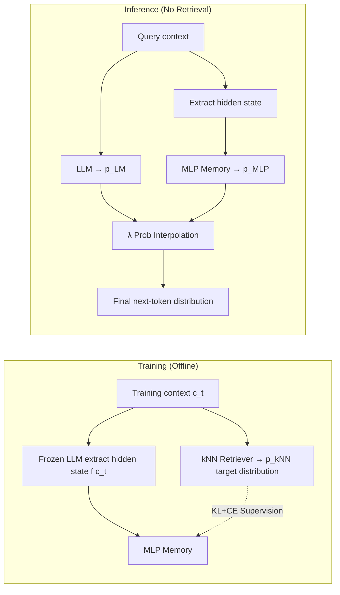

# MLP Memory: A Retriever-Pretrained Memory for Large Language Models

**Conference**: ICLR 2026  
**OpenReview**: [https://openreview.net/forum?id=1SMdxRtLBp](https://openreview.net/forum?id=1SMdxRtLBp)  
**Code**: [https://github.com/LUMIA-Group/MLPMemory](https://github.com/LUMIA-Group/MLPMemory)  
**Area**: Information Retrieval / Parameterized Memory / Retrieval Augmentation  
**Keywords**: kNN-LM, Parameterized Memory, Retrieval Distillation, MLP, Hallucination Suppression  

## TL;DR
The next-token distribution obtained from kNN retrieval over the entire pre-training corpus is distilled into a lightweight, all-MLP module. This allows LLMs to access "retrieval-style knowledge" via a single forward pass during inference, achieving higher QA accuracy and reduced hallucination at 2.5× the speed of RAG.

## Background & Motivation
- **Background**: There are two mainstream routes for supplementing LLM knowledge. Non-parametric Retrieval-Augmented Generation (RAG) retrieves external documents during inference to concatenate into the context, offering flexible knowledge updates. Parameterized Continual Pre-training (CPT) or LoRA directly modifies weights to encode knowledge into the model.
- **Limitations of Prior Work**: RAG suffers from high latency (nearest neighbor search + long context) and "shallow fusion," where the retriever exists outside the LLM computation graph. Conversely, CPT/LoRA can cause catastrophic forgetting and degrade general capabilities; in this study's experiments, CPT dropped an average of 9.6 points across five QA tasks. Furthermore, explicit memories like kNN-LM require massive data storage (e.g., GPT2-small on Wikitext-103 requires nearly 500GB).
- **Key Challenge**: It is difficult to simultaneously achieve "efficient inference" and "effective knowledge access"—retrieval is flexible but slow, while weight modification is fast but harmful to general performance.
- **Goal**: Construct a **fully parameterized, differentiable, compressed, low-latency long-term memory covering the entire pre-training corpus**, capturing the benefits of retrieval with the speed of parameterization.
- **Core Idea**: **Distill retrieval behavior itself into parameters**—use an MLP to fit the next-token distribution output by a kNN retriever over the full corpus. During inference, only probability interpolation is performed, completely eliminating document retrieval and nearest neighbor search (**Retriever-Pretrained Memory**).

## Method

### Overall Architecture
The system consists of two separately pre-trained components: a frozen Transformer decoder (base LM) and an external all-MLP memory. During the training phase (offline), a kNN-LM style datastore is constructed over the corpus. For each context, a non-parametric retrieval distribution $p_{kNN}$ is calculated, and the MLP is trained to map the LM hidden states to this distribution. During the inference phase, the MLP output is interpolated with the LM output to obtain the final distribution, without accessing any document store.

### Key Designs

**1. All-MLP Memory Architecture: Stacked MLPs without token-mixing act as a differentiable retriever.** The authors observe that "imitating a retriever" involves processing a single query vector and does not require sequence-level token-mixing (attention). Given that FFN layers inherently function as key-value memories, the memory module is designed as a stack of pure MLPs. This converts discrete retrieval $M:\mathbb{R}^d \to \mathbb{R}^{|V|}$ into a differentiable mapping. It takes the base LM hidden state $f(c)$ as input and directly outputs a vocabulary distribution approximating $p_{kNN}(y\mid c)$, bypassing nearest neighbor search. The default 8-layer, 1B-parameter model compresses a 40TB datastore (corresponding to 5B tokens in kNN-LM) into approximately 4GB of parameters.

**2. Retrieval Distribution Distillation + Mixed KL/CE Objective: Learning distribution shapes while ensuring token accuracy.** Supervision signals are derived from the pre-computed $\{(f(c_t), p_{kNN}(\cdot\mid c_t))\}$. During construction, the query itself is excluded from the neighbor set to prevent trivial self-retrieval. Since the kNN distribution is naturally a soft distribution of "multiple reasonable continuations weighted by similarity," the primary loss uses KL divergence to match the entire distribution: $L_{KL}(c_t)=\mathrm{KL}(p_{kNN}(\cdot\mid c_t)\,\Vert\,p_{MLP}(\cdot\mid c_t))$. A cross-entropy term $L_{CE}(c_t)=-\log p_{MLP}(w_t\mid c_t)$ is added to anchor the distribution to ground-truth tokens, preventing shifts caused by learning only LM targets. These are balanced using $L=\alpha L_{KL}+(1-\alpha)L_{CE}$. Ablations show $\alpha=0.4$ is optimal—pure CE overfits to language modeling, while pure KL fails to learn token-level accuracy.

**3. Probability Interpolation Inference: Single forward pass, latency decoupled from corpus scale.** Following the kNN-LM interpolation formula but removing retrieval, the final distribution is $p_{final}(w_t\mid c_t)=\lambda\, p_{MLP}(w_t\mid c_t)+(1-\lambda)\, p_{LM}(w_t\mid c_t)$, where $\lambda$ is tuned on validation sets. Since the MLP is a lightweight forward pass, inference speed is **independent** of the datastore size. Experiments show TTFT is 2.5× faster than RAG (top-5) and 5.6× faster than kNN-LM, with only 1.2× throughput overhead relative to the base LM.

**4. Layer Selection: Using representations from approximately 70% of network depth as memory input.** Unlike the common practice in kNN-LM of using the final layer, this study finds that attaching the MLP Memory to hidden states at approximately 70% depth is consistently optimal across GPT2 small, medium, and large scales. This aligns with findings from Memorizing Transformers (approx. 75% depth), indicating that middle-to-late layer representations are better suited as keys for long-term knowledge retrieval.

## Key Experimental Results

### Main Results (Five QA Benchmarks, Exact-Match metrics, relative gain in parentheses)

| Method | NQ | WebQA | TriviaQA | TruthfulQA | HotpotQA | Average |
|---|---|---|---|---|---|---|
| Mistral-7B-v0.3 | 20.63 | 29.28 | 57.65 | 32.09 | 20.96 | 32.12 |
| +RAG | 22.56 | 24.90 | 54.21 | 35.47 | 29.77 | 33.38 (+3.9%) |
| +kNN-LM | 21.05 | 30.51 | 57.77 | 32.33 | 21.20 | 32.57 (+1.4%) |
| +CPT | 12.16 | 34.06 | 61.21 | 29.18 | 16.04 | 30.53 (−5.0%) |
| +LoRA | 18.17 | 34.50 | 61.60 | 30.91 | 16.23 | 32.28 (+0.5%) |
| **+MLP Mem** | **25.20** | **37.45** | 60.99 | 32.54 | 24.14 | **36.06 (+12.3%)** |

On Llama2-7B, MLP Memory improved the average from 32.81 to 35.38 (+7.8%), while CPT dropped to 29.66 (−9.6%).

### Ablation Study (Loss weight α, WikiText-103 PPL trends)

| α | 0.0 (Pure CE) | 0.4 (Optimal) | 1.0 (Pure KL) |
|---|---|---|---|
| Effect | Overfits LM targets | **Best** | Fails to learn token accuracy |

Layer selection ablation: Across GPT2 small/medium/large, extracting representations at ~70% depth was consistently optimal (deviating from the kNN-LM convention of the final layer).

### Key Findings
- **General NLP Tasks Improve Rather than Degrade**: Average scores across nine tasks (sentiment/entailment/topic classification) rose from 67.86 to 73.07. Reasoning tasks like RTE (59.57→64.62) and CB (69.64→76.79) showed notable gains, whereas CPT/LoRA results were inconsistent.
- **Strong Hallucination Suppression**: On HaluEval, scores for Dialogue/QA/Summarization increased by +9.68 / +10.08 / +2.14 points respectively, while CPT/LoRA generally saw performance drops.
- **Outperforming Explicit Retrieval on the Same Corpus**: MLP Memory achieved better results than RAG/kNN-LM using the same Wikipedia-2021 corpus. Qualitative analysis shows cases where RAG retrieved the correct document but was distracted by context, whereas MLP Memory answered correctly without explicit retrieval.

## Highlights & Insights
- **"Distilling retrieval into parameters" is a clever strategy**: Rather than approximating a specific piece of knowledge, it approximates the "behavior/distribution of retrieval," thereby inheriting the rich signals of multiple reasonable continuations found in kNN soft distributions—more informative than single-label LM supervision.
- **Decoupling latency from corpus scale** provides significant engineering value: While RAG and kNN-LM slow down as the corpus grows, MLP Memory maintains constant overhead, making it deployment-friendly.
- **Decoupling Memory from Reasoning**: Since base LM weights remain untouched, the method avoids the catastrophic forgetting seen in CPT/LoRA. The memory module acts as a "complement rather than an interference."
- The architecture is self-consistent with the established theory that FFNs act as key-value memories, motivating the use of pure MLPs for "memory."

## Limitations & Future Work
- **Degraded Knowledge Updateability**: Once distilled into parameters, the flexibility of "changing documents to change knowledge" (as in RAG) is lost. Updating the corpus requires rebuilding the datastore and retraining the MLP; incremental update schemes were not discussed.
- **Dependency on Expensive One-time Offline Datastore Construction**: Performing kNN retrieval over the entire corpus to cache target distributions is computationally intensive, albeit an offline cost.
- **Limited Scale and Backbone**: Primary experiments were limited to 7B backbones and 1B memory; scalability to larger models or corpora remains unverified.
- **Hyperparameter Tuning**: $\lambda$ and $\alpha$ require task-specific tuning; there is room for improving robustness and automation of interpolation parameters.
- **Mechanistic Analysis**: While the paper shows empirically that compressed retrieval patterns are more resistant to interference than explicit retrieval, it lacks a detailed mechanistic analysis of why parameterization leads to higher accuracy.

## Related Work & Insights
- **kNN-LM / Retrieval Augmentation**: The direct precursor; this work effectively compresses the non-parametric datastore of kNN-LM into parameters, removing storage and search bottlenecks.
- **Memory-Augmented LMs** (Memory Networks / Memory Transformers / LongMem / MemoRAG): Most treat memory as "working memory" for context extension; this work emphasizes "long-term memory" covering the entire pre-training corpus.
- **All-MLP Architectures** (gMLP / sparse-MLP) and the discovery that "FFN is key-value memory" provide the theoretical basis for using pure MLPs as retrievers.
- Insight: External behaviors like retrieval or tool calling could potentially be replaced by low-latency parameter modules through "behavior distillation," a concept worth migrating to agentic and tool-use scenarios.

## Rating
- **Novelty**: ⭐⭐⭐⭐ The approach of "distilling retriever behavior into a differentiable MLP memory" is a novel third path between RAG and standard parameterization.
- **Experimental Thoroughness**: ⭐⭐⭐⭐ Comprehensive coverage across two backbones, five QA tasks, nine NLP tasks, HaluEval, and ablations on $\alpha$ and layer selection. However, it lacks validation on models larger than 7B or online update scenarios.
- **Writing Quality**: ⭐⭐⭐⭐ Clear logical flow from motivation to architecture, loss, and inference. Effective diagrams (Fig 2/4) and well-defined property targets.
- **Value**: ⭐⭐⭐⭐ High engineering value due to the decoupling of latency and corpus size, hallucination suppression, and lack of forgetting. It serves as a competitive and practical alternative to RAG or fine-tuning.

<!-- RELATED:START -->

## Related Papers

- [\[ICLR 2026\] TokMem: One-Token Procedural Memory for Large Language Models](tokmem_one-token_procedural_memory_for_large_language_models.md)
- [\[ICLR 2026\] Expert Heads: Robust Evidence Identification for Large Language Models](expert_heads_robust_evidence_identification_for_large_language_models.md)
- [\[ICML 2026\] Understand and Accelerate Memory Processing Pipeline for Large Language Model Inference](../../ICML2026/information_retrieval/understand_and_accelerate_memory_processing_pipeline_for_disaggregated_llm_infer.md)
- [\[ICLR 2026\] AMemGym: Interactive Memory Benchmarking for Assistants in Long-Horizon Conversations](amemgym_interactive_memory_benchmarking_for_assistants_in_long-horizon_conversat.md)
- [\[ICLR 2026\] Query-Level Uncertainty in Large Language Models](query-level_uncertainty_in_large_language_models.md)

<!-- RELATED:END -->
