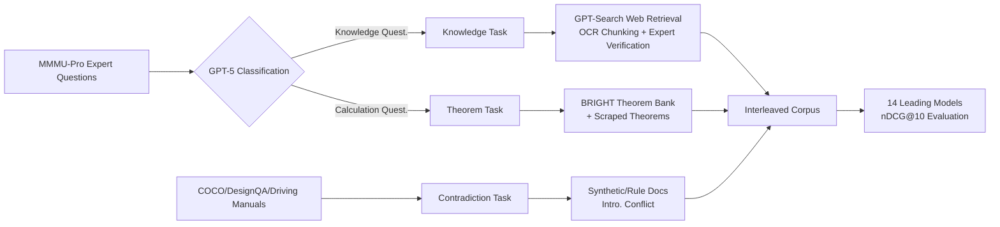

# MRMR: A Realistic and Expert-Level Multidisciplinary Benchmark for Reasoning-Intensive Multimodal Retrieval

**Conference**: ICLR 2026  
**OpenReview**: [https://openreview.net/forum?id=XZNXSM4rHG](https://openreview.net/forum?id=XZNXSM4rHG)  
**Code**: [https://github.com/rebeccaz4/MRMR](https://github.com/rebeccaz4/MRMR) · [Dataset](https://huggingface.co/datasets/MRMRbenchmark)  
**Area**: Information Retrieval / Multimodal Retrieval / Benchmark  
**Keywords**: Multimodal Retrieval, Reasoning-Intensive Retrieval, Expert Domain, Contradiction Retrieval, Interleaved Image-Text, MMMU-Pro  

## TL;DR
MRMR constructs the first multimodal retrieval benchmark targeting **expert-level, multidisciplinary, and reasoning-intensive** scenarios. It includes 1,435 queries spanning 23 domains, represents both queries and documents as interleaved image-text sequences, and introduces a novel "Contradiction Retrieval" task. Evaluations reveal that current multimodal retrieval models significantly lag behind a naive "text retriever + image captioning" approach in tasks requiring reasoning.

## Background & Motivation
**Background**: LLM agents, such as DeepResearch, increasingly rely on external retrieval to supplement knowledge. Information in high-value scenarios like science, medicine, engineering, and finance is naturally multimodal (images + text), making a robust multimodal retrieval component essential. While existing benchmarks (InfoSeek, OVEN, ViDoRe, MMDocIR, etc.) have made progress, they fail to capture the complexity of realistic agentic scenarios.

**Limitations of Prior Work**: The authors identify three systematic gaps: (1) **Narrow Domain Scope**: Most benchmarks are built on Wikipedia text/images, focusing on general knowledge that SOTA LLMs already handle easily; (2) **Lack of Reasoning**: Existing tasks primarily involve semantic matching and information lookup, rarely requiring deep understanding or logical reasoning of expert-domain images (e.g., microscopic slide diagnosis); (3) **Simple Modalities**: Most only support "single image + supplementary text" queries, whereas real-world queries and documents are often interleaved mixtures of multiple images and text.

**Key Challenge**: While retrieval models are strong at "semantic matching/finding similarity," they are almost entirely deficient in "understanding expert images + performing logical reasoning to determine relevance." The latter is precisely the capability most needed for agentic retrieval, yet existing benchmarks fail to expose this weakness.

**Goal**: To create a multimodal retrieval benchmark that distinguishes between "matching capability" and "reasoning capability," covering multidisciplinary expert domains and supporting realistic interleaved input formats.

**Core Idea**: **[Data Source Upgrade]** Directly reuse expert-level VQA problems from MMMU-Pro as query sources (ensuring difficulty and domain breadth), with positive documents collected and verified by human experts from the internet. **[Task Innovation]** Introduce **Contradiction Retrieval** alongside traditional "supporting evidence retrieval"—requiring models to find rules/statements that conflict with the query, thereby forcing logical reasoning. **[Format Unification]** Represent both queries and documents as interleaved image-text sequences to approximate real-world usage.

## Method

### Overall Architecture
MRMR formalizes multimodal retrieval as: given a query set $Q$ and a document corpus $D$, each query/document is a sequence of interleaved text fragments and images $(x_1, \dots, x_k)$. For a query $q$, a document is a positive sample $d^+$ if it provides foundational principles/theorems for a reasoning chain; otherwise, it is a negative sample $d^-$. Centered on "reasoning," the benchmark designs three task categories—Knowledge (expert knowledge retrieval), Theorem (theorem retrieval), and Contradiction (contradiction retrieval)—totaling 1,435 queries across 23 domains and 6 major disciplines. The data construction follows a semi-automated pipeline: "MMMU-Pro question selection → GPT-Search for candidates → OCR chunking for interleaved content → GPT filtering + expert review → Negative sample supplementation."

### Key Designs

**1. Knowledge Task: Reversing expert questions to find "helpful web pages."** The difficulty lies in "positive sample collection"—unlike semantic retrieval, there are no ready-made image-text pairs; one must find multimodal materials that support the answer. The authors use GPT-5 to categorize MMMU-Pro questions into knowledge-based or calculation-based, filtering out those solvable via shallow reasoning without external expertise. Detailed captions are generated for each image as context. GPT-Search then reasons through the questions and provides explanations with reference links (Wikipedia, books, papers, blogs). These pages are captured as PDFs, and interleaved content is extracted using MonkeyOCR and chunked (preserving image references). After GPT-5 filtering and expert review, samples judged relevant by both are kept as $d^+$, and those judged irrelevant by both become hard negatives. Questions without found materials (38.2%) have supporting documents manually created by experts. Finally, negative samples are sampled from PIN-14M (PMC medical literature, OBELICS) to form a 26,223-document corpus.

**2. Theorem Task: Extending "finding solution theorems" to multimodal math/science.** Following the BRIGHT approach, for a new calculation problem, the model should retrieve the theorem statement required for the solution. Using MMMU-Pro calculation questions as queries, GPT-5 excludes questions that explicitly state the required theorem. Remaining questions are categorized into Math/Physics/Engineering/Business. GPT-5 reasons through each, providing an answer and summarizing key theorems. Only questions GPT-5 answers correctly are kept (512 total). The corpus mainly uses ~13.8k theorem statements from BRIGHT. Summarized theorems serve as queries to retrieve top-10 candidates via Qwen3-Embedding, from which GPT-5 selects the most relevant as $d^+$. For theorems missing from BRIGHT, content is scraped from Wikipedia (including diagrams) and rewritten into BRIGHT format by GPT-5.

**3. Contradiction Task: Introducing "finding contradictions" to force logical reasoning.** This is the core differentiator of MRMR. The query describes a case, and the corpus contains mandatory rules; the positive sample is the specific rule "violated by the case." The model must judge conceptual conflict beyond simple semantic matching. It consists of three sub-tasks: **Negation** (a synthetic task inspired by NegBench: given a COCO image with four descriptions, one asserts the existence/non-existence of an object incorrectly; Hit@1 is used); **Vehicle Design** (based on Formula SAE rules and DesignQA: given a vehicle design case, retrieve the specific rule it violates, e.g., a wheelbase shorter than the minimum requirement); **Traffic Case** (using official driving manuals as the corpus: specific traffic rules are paired with annotated violation cases, augmented by Qwen-Image to replace text elements with AI-generated images, e.g., a car following at 3m, violating safe distance rules).

**4. Four Retrieval Paradigms + Unified Evaluation Protocol.** To fairly compare technical routes, 14 models are categorized: **T2T** (text retrievers BGE-M3 / NV-Embed-v2 / Qwen3-Embedding with MLLM-generated captions); **IT2IT Dual-stream Fusion** (EVA-CLIP / SigLIP / OpenCLIP / JinaCLIP: text and images are encoded separately, and a fusion embedding $e = t + i$ is used for scoring); **IT2IT Merged Image** (VISTA / E5-V / MM-Embed / VLM2Vec / Ops-MM-Embedding / GME-Qwen2-VL: multiple images are concatenated into one for single-image models); **T2I Document-as-Image** (ColPali: encodes multimodal documents as screenshots; query images are replaced by LLM descriptions). Evaluation uses nDCG@10 (except Hit@1 for Negation).

## Key Experimental Results

### Main Results (nDCG@10, Avg is the mean of 11 sub-tasks)

| Model | Category | Knowledge(Art) | Theorem(Eng.) | Contradiction(Traffic) | **Avg.** |
|------|------|------|------|------|------|
| **Qwen3-Embedding** | T2T | 71.9 | 42.9 | 54.2 | **54.1** |
| Ops-MM-Embedding | IT2IT Merged | 79.3 | 30.1 | 45.8 | 48.1 |
| Ops-MM-Embedding | T2I Doc-as-Img | 67.7 | 29.2 | 46.3 | 45.6 |
| NV-Embed-v2 | T2T | 70.7 | 32.9 | 42.2 | 44.8 |
| MM-Embed | IT2IT Merged | 65.6 | 27.4 | 34.9 | 39.8 |
| GME-Qwen2-VL | IT2IT Merged | 54.3 | 30.2 | 29.6 | 36.2 |
| ColPali | T2I | 36.1 | 13.5 | 18.2 | 25.2 |
| OpenCLIP | Dual-stream | 56.0 | 7.3 | 12.4 | 18.0 |
| E5-V | IT2IT Merged | 25.1 | 2.5 | 2.1 | 8.6 |

**The strongest model is the T2T Qwen3-Embedding (54.1)**, which outperforms the best multimodal model Ops-MM-Embedding (48.1) by 6.0 points. CLIP-style dual-stream models perform worst overall (11.6–18.0).

### Key Findings
- **Multimodal models collapse on reasoning tasks**: Ops-MM-Embedding averages 67.4 on Knowledge but drops to 37.4 on Theorem and 36.6 on Contradiction—a gap of nearly 30 points. The issue lies in reasoning capacity rather than domain knowledge.
- **Negation is near random**: In the 1-out-of-4 task, most models achieve a Hit@1 below 25% (≈ random). Contradictions easily spotted by humans are missed even by strong text embeddings.
- **Significant domain variance**: Among multimodal models, E5-V scores only 8.6 while Ops-MM-Embedding reaches 48.1. Success in "Art" tasks often relies on matching visually similar paintings, whereas medical imaging requires identifying underlying pathological/radiological features, which is significantly harder.
- **Two failure modes** (based on 30 case analyses): ① Visual bias overrides contextual relevance (e.g., a nematode SEM image being ranked high because it looks like an earthworm in the query); ② High-level reasoning failure (e.g., in traffic cases, models give high scores to negative samples containing cars/tunnels/lanes but fail to deduce that "crossing the line" violates "lane keeping").
- **Test-time scaling works**: Replacing the original query with an MLLM-generated reasoning trajectory (question summary + CoT) improves Qwen2-VL-2B by +5.1 and Qwen2.5-VL-72B by +14.8. Knowledge tasks benefit most, though larger models incur 20–66% higher token costs.

## Highlights & Insights
- **Novel Contradiction Retrieval**: Flipping "finding supporting evidence" to "finding conflicting evidence" is a design that truly requires logical reasoning beyond semantics. This has direct value for legal compliance, engineering audits, and autonomous driving.
- **An counter-intuitive conclusion**: In expert-level reasoning scenarios, end-to-end multimodal embedding models are still outperformed by a naive pipeline of "image captioning + strong text retriever." This suggests that current multimodal embeddings significantly overestimate their visual reasoning capabilities.
- **Pragmatic Data Construction**: The semi-automated pipeline using GPT-Search + OCR chunking + GPT/human double verification balances scale and quality, with 30–60% of ambiguous samples discarded to ensure label reliability.
- **Fine-grained multidisciplinary evaluation**: Breaking down 23 domains / 6 disciplines allows for identifying "domain-specific" strengths (e.g., strong in Art, weak in Medicine), providing a clear guide for model selection.

## Limitations & Future Work
- **Corpus scale**: The authors acknowledge the corpus can be expanded by sampling more expert documents to increase retrieval difficulty (which may also increase false negative rates).
- **False Negative Risk**: Large-scale negative sampling from PIN-14M assumes a "low false negative probability," which, despite manual error analysis, remains a potential source of noise.
- **Reliance on GPT series**: Question selection, initial relevance filtering, and theorem rewriting heavily depend on GPT-5/GPT-Search, which may propagate biases into the benchmark.
- **Test-time scaling limited to text**: The study focuses on text-side query expansion, leaving image-side expansion/processing for future work.
- **Missing Ideal Models**: Prototypical interleaved models like TIIR are not publicly available, preventing evaluation of the methods most suited for the MRMR format.

## Related Work & Insights
- **Reasoning-Intensive Retrieval**: BRIGHT first proposed retrieval benchmarks requiring reasoning for relevance in the text domain; MRMR extends this to the multimodal domain and reuses BRIGHT's theorem bank.
- **Multimodal Retrieval Benchmarks**: Spanning semantic matching (NIGHTS/SciMMIR), composed image retrieval (FashionIQ/CIRR/CIRCO), and information retrieval (InfoSeek/OVEN/ViDoRe/MMDocIR) to interleaved TIIR—MRMR maximizes "expert domain + reasoning + interleaved" dimensions, making it the first to combine all three.
- **Multimodal Embedding Models**: Evaluation covers everything from CLIP/BLIP dual-stream models to MLLM-finetuned unified embeddings, effectively serving as an expert-level reasoning stress test for this technical lineage.
- **Insight**: Results strongly suggest that next-generation multimodal retrievers need to explicitly incorporate "visual reasoning" into training objectives (rather than just surface-level alignment); meanwhile, the "caption + text retrieval" baseline serves as a high bar that must be cleared before claiming multimodal superiority.

## Rating
- **Novelty**: ⭐⭐⭐⭐⭐ The first multimodal retrieval benchmark to combine "expert-level + multidisciplinary + reasoning-intensive + interleaved" features; introduces the novel contradiction retrieval task.
- **Experimental Thoroughness**: ⭐⭐⭐⭐ Covers 4 paradigms / 14 models / 23 domains, plus 30 failure analyses and test-time expansion experiments; slightly limited in corpus scale exploration.
- **Writing Quality**: ⭐⭐⭐⭐ Clear reasoning-construction-evaluation logic; rich with tables and case diagrams; data details are well-organized.
- **Value**: ⭐⭐⭐⭐⭐ Exposes the counter-intuitive gap where multimodal embeddings underperform caption+text pipelines, providing clear direction for multimodal RAG and agentic retrieval components.

<!-- RELATED:START -->

## Related Papers

- [\[ICLR 2026\] Retro*: Optimizing LLMs for Reasoning-Intensive Document Retrieval](retro_optimizing_llms_for_reasoning-intensive_document_retrieval.md)
- [\[ICLR 2026\] Frustratingly Simple Retrieval Improves Challenging, Reasoning-Intensive Benchmarks](frustratingly_simple_retrieval_improves_challenging_reasoning-intensive_benchmar.md)
- [\[ACL 2026\] A Survey of Reasoning-Intensive Retrieval: Progress and Challenges](../../ACL2026/information_retrieval/a_survey_of_reasoning-intensive_retrieval_progress_and_challenges.md)
- [\[ICLR 2026\] Beyond Sequential Reranking: Reranker-Guided Search Improves Reasoning Intensive Retrieval](beyond_sequential_reranking_reranker-guided_search_improves_reasoning_intensive_.md)
- [\[ICLR 2026\] RefTool: Reference-Guided Tool Creation for Knowledge-Intensive Reasoning](reftool_reference-guided_tool_creation_for_knowledge-intensive_reasoning.md)

<!-- RELATED:END -->
