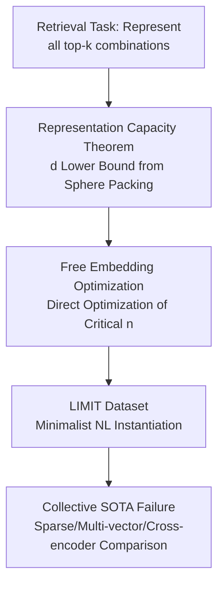

# On the Theoretical Limitations of Embedding-Based Retrieval

**Conference**: ICLR 2026  
**OpenReview**: [https://openreview.net/forum?id=k9CzIvzfaA](https://openreview.net/forum?id=k9CzIvzfaA)  
**Code**: https://github.com/google-deepmind/limit  
**Area**: Information Retrieval / Dense Retrieval / Representation Learning Theory  
**Keywords**: Single-vector embedding, representation capacity lower bound, sphere packing, top-k retrieval, LIMIT dataset

## TL;DR
This paper derives a lower bound theorem for the "dimension required for single-vector embeddings to represent all top-k document combinations" using sphere packing arguments from high-dimensional geometry. It empirically demonstrates through free embedding optimization and a minimalist real-world dataset, LIMIT, that as long as the number of relevant combinations to be represented is sufficient—even for queries as simple as "who likes apples"—dense retrieval models with fixed dimensions are **destined** to fail. This is a fundamental bottleneck of the single-vector paradigm rather than an issue of data or scale.

## Background & Motivation
**Background**: Information retrieval has shifted from sparse methods like BM25 to neural retrieval with language model backbones, primarily in the form of "single-vector dense retrieval"—compressing an entire text segment into a single vector and ranking via dot product. Recent instruction-based benchmarks (QUEST, BRIGHT, BrowseComp, etc.) further require embedding models to represent "arbitrary queries + arbitrary relevance definitions," effectively pushing retrieval goals toward "theoretically any task that can be defined."

**Limitations of Prior Work**: There is a common implicit assumption in the community that the challenges embedding models currently cannot solve are due to unrealistic queries or that better data and larger models will eventually resolve them. In other words, failures are attributed to "insufficient engineering" rather than principled ceilings.

**Key Challenge**: Single-vector embeddings utilize vector representations in geometric space, and the number of distinct top-k subsets that can be "partitioned" in this space is strictly constrained by the dimension $d$. When a task requires the number of relevant document combinations to grow exponentially (instructions and logical operators can bind any two unrelated documents into a top-k set), fixed-dimensional capacity will eventually become insufficient. This contradiction has not been quantitatively characterized in "realistic and simple" scenarios before.

**Goal**: (1) Provide the **lower bound** of embedding dimensions required to represent all top-k combinations; (2) Prove that this limitation holds for any model and any training data; (3) Construct a simple yet unsolvable real-world dataset to map abstract theorems onto SOTA models.

**Key Insight**: Instead of probing model limits with "harder benchmarks," this work connects neural retrieval with established conclusions in linear algebra and high-dimensional geometry (Voronoi, sphere packing, sign rank, JL Lemma) to ask at the root of **representation capacity**: "how many retrieval results can embedding dimensions actually encode."

**Core Idea**: Using a classical sphere packing volume argument, the requirement to "realize all $\binom{n}{k}$ top-k subsets with margin $\omega$" is translated into a hard lower bound on dimension $d$. This lower bound is then pushed from theory to empirical testing using free embeddings and the LIMIT dataset.

## Method

### Overall Architecture
This paper does not propose a new model but builds a "three-stage progressive" argumentative chain, moving from abstract theory toward real-world models to confirm that the representation capacity of single-vector embeddings is throttled by dimension. The three stages comprise: deriving a model-agnostic dimension lower bound (Theorem 1), measuring the "best-case" dimension needed in ideal scenarios via free embeddings, and finally exposing real SOTA models using the LIMIT dataset.

### Key Designs

**1. Representation Capacity Lower Bound Theorem: Translating "Realizing all top-k combinations" into Hard Dimension Constraints**

Addressing the pain point that "scaling data and parameters will solve everything," this paper provides a model-agnostic lower bound. Let $n$ unit document vectors be $v_1, \dots, v_n \in \mathbb{R}^d$ and the query be a unit vector. A $k$-subset $S$ is said to be realized with margin $\omega$ if there exists a unit query $u_S$ such that the lowest score in the set is higher than the highest score outside the set by at least $2\omega$:

$$\min_{i\in S}\langle u_S, v_i\rangle \;\ge\; \max_{j\notin S}\langle u_S, v_j\rangle + 2\omega.$$

Theorem 1 asserts that if all $\binom{n}{k}$ possible $k$-subsets can be realized with margin $\omega$, then:

$$\binom{n}{k} \le \Big(1 + \frac{1}{\omega}\Big)^d, \quad \text{implying} \quad d \ge \frac{\log\binom{n}{k}}{\log(1 + 1/\omega)}.$$

The proof utilizes a sphere packing volume argument: for any two different subsets $S \neq T$, substituting the realization constraints leads to the corresponding queries satisfying $\lVert u_S - u_T \rVert \ge 2\omega$. Thus, these $\binom{n}{k}$ queries are at least $2\omega$ apart, and their respective open balls of radius $\omega$ are disjoint and contained within a larger ball of radius $1+\omega$. Comparing volumes $M \cdot \omega^d \le (1+\omega)^d$ yields the result. Asymptotically, for $n \gg k$, $d = \Omega\big(k \log(en/k) / \log(1 + 1/\omega)\big)$. This is a mirror of the JL Lemma: while JL provides the **sufficient** dimension for distance preservation, this theorem provides the **necessary** dimension to realize all retrieval sets.

**2. Free Embedding Optimization: Testing How Conservative the Theoretical Lower Bound Is**

Theorem 1 is a loose lower bound as it ignores practical constraints like gradient learning, tokenization, or generalization. To measure the "best-case" requirements, the paper designed **free embedding** experiments: discarding language models and directly treating each query/doc as a learnable vector, optimized via Adam + InfoNCE **directly on the test set qrel matrix** (full batch, other docs as negatives, projected gradient for unit norm). This represents the upper bound of capacity—if free embeddings cannot solve it, no real model can.

The experiment fixes $k=2$ and increases $n$ until a dimension $d$ can no longer reach 100% accuracy, marking this as the **critical $n$**. Fitting different $d$ critical points to a cubic polynomial:

$$y = -10.5322 + 4.0309\,d + 0.0520\,d^2 + 0.0037\,d^3, \quad (r^2=0.999).$$

Extrapolating shows critical $n$ for 512-dim is ~500k, 768-dim is ~1.7M, and 1024-dim is ~4M. Crucially, the theoretical lower bound **severely underestimates** practical needs—at $n=100$, Theorem 1 requires 4 dims, while free embedding requires $d > 18$.

**3. LIMIT Dataset: Instantiating Abstract Theorems into "Absurdly Simple yet Unsolvable" Real Tasks**

To clarify what free embeddings mean for real models, the authors constructed the natural language dataset LIMIT. The mapping uses a "preference" attribute: documents are "Person likes X, Y...", and queries are "Who likes X," with exactly $k=2$ relevant documents per query. The attribute list was generated and cleaned by Gemini 2.5 Pro into 1850 non-overlapping items. Vocabulary consists of 50k docs and 1000 queries. For the qrel matrix, the authors used **46 documents** to carry all 1000 queries (since $\binom{46}{2} = 1035$ is the smallest $n$ to cover 1000 top-2 combinations). Variants include a **small** version (only these 46 docs) and a **synonym** version (attributes replaced by synonyms to reduce lexical overlap).

### Loss & Training
Free embeddings use the InfoNCE contrastive loss. Domain-shift ablations for LIMIT involve fine-tuning `lightonai/modernbert-embed-large` on the train or test sets using SentenceTransformers, sweeping different $d$ by projecting hidden layers to specified dimensions.

## Key Experimental Results

### Main Results
Models tested include GritLM, Qwen3 Embedding, Promptriever, Gemini Embedding, Arctic Embed Large v2.0, and E5-Mistral (single-vector, dim 1024–4096), with three non-single-vector baselines: BM25, GTE-ModernColBERT (multi-vector), and token-level TF-IDF.

| Setting | Task Scale | Single-vector SOTA Performance | Baseline |
| :--- | :--- | :--- | :--- |
| LIMIT Full | 50k docs / 1000 q / k=2 | recall@100 struggles to exceed 20% | BM25 near perfect (high dim) |
| LIMIT small | 46 docs | fails even at recall@20 | GTE-ModernColBERT outperforms but fails |
| Cross-encoder | small, 46 docs fed in | — | Gemini-2.5-Pro 100% success |

### Ablation Study

| Configuration | Key Phenomenon | Explanation |
| :--- | :--- | :--- |
| Fine-tune on LIMIT-train | recall@10 rises from ~0 to only ~2.8 | In-domain training is ineffective → Not domain shift |
| Fine-tune on LIMIT-test | Task is learnable (token overfitting) | Consistent with free embeddings: overfittable but not generalizable |
| LIMIT-small → synonym | BM25 drops >89%, Qwen3 drops 38.9% | Sparse models rely on lexical overlap; collapse after de-overlapping |
| Dimension scaling (MRL) | Recall rises monotonically with dimension | Dimension is the decisive variable, echoing the theorem |

### Key Findings
- **Dimension is the decisive factor**: Performance of all single-vector models rises monotonically with embedding dimension, directly validating the theoretical constraint of $d$ on capacity.
- **Not domain shift**: In-domain training yields marginal gains, whereas test-set overfitting succeeds, proving failure stems from representation capacity rather than distribution shift.
- **Architecture comparison clarifies the path**: Cross-encoders (Gemini-2.5-Pro) are not limited by embedding dimension and succeed 100%; multi-vector (MaxSim) significantly outperforms single-vector; sparse/BM25 approaches perfection due to extremely high dimensionality, though BM25's collapse on synonyms proves it is merely a different kind of limitation (lexical matching).

## Highlights & Insights
- **Connecting Neural Retrieval to Classical Geometry**: By using the volume ratio of sphere packing—a concept accessible even at high school levels—the paper provides a dimension lower bound independent of training details that cannot be refuted by "larger models."
- **The Philosophy of Best-case Experiments**: Directly optimizing free vectors on the test set creates a "cheating upper bound," blocking the argument that "theory is too loose"—even "cheating" requires dimensions far exceeding the lower bound.
- **The "Simple Paradox" of LIMIT**: Questions like "who likes apples" can be represented in 12 dimensions theoretically, yet SOTA large models fail. this contrast is more persuasive than any complex benchmark.
- **Transferable Methodology**: Using "free parameter instantiation + critical point fitting" to quantify the capacity ceiling of a representation paradigm can be applied to knowledge graph embeddings, multi-modal alignment, etc.

## Limitations & Future Work
- The authors acknowledge the theory only targets single-vector models; multi-vector architectures lack a theoretical theorem (only empirical evidence is provided).
- The lower bound for more relaxed scenarios (e.g., allowing a few errors or covering most combinations) is not characterized.
- While it proves "certain combinations cannot be represented," it cannot predict which specific queries/instructions will fail—some reasoning tasks may still happen to be solvable.
- Observation: The LIMIT dataset's "preference" attribute is one specific mapping; the precise relationship between qrel density and difficulty remains an open question. Future directions include cross-encoders, multi-vector, and hyperencoders as candidates to bypass the dimension bottleneck.

## Related Work & Insights
- **vs JL Lemma**: While JL provides a **sufficient** dimension for distance preservation, this work provides the **necessary** dimension to realize retrieval sets, shifting focus from "distance preservation" to "separability + margin."
- **vs Higher-order Voronoi / Order-k Region Counting**: Classic work asks "how many k-subsets can be realized given a configuration," which is hard to bound tightly. This work asks the inverse: "what dimension is required to realize **all** subsets," yielding a clean lower bound.
- **vs Existing Empirical Studies**: Previous works empirically observed that small dimensions increase false positives. This work provides the first **theoretical** link between dimension and the achievable top-k set space.
- **vs Instruction Retrieval Benchmarks**: Benchmarks like QUEST only sample a tiny fraction of the combinatorial space ($\binom{325k}{20} \approx 7\times 10^{91}$ is far more than 3k queries), which masks fundamental capacity limits.

## Rating
- Novelty: ⭐⭐⭐⭐⭐ Introducing sphere packing bounds to dense retrieval provides a paradigm-level capacity ceiling.
- Experimental Thoroughness: ⭐⭐⭐⭐ Closed loop of Theory + Free Embeddings + Real Dataset, covering various baselines.
- Writing Quality: ⭐⭐⭐⭐⭐ Clear argumentative chain; the narrative of LIMIT is highly compelling.
- Value: ⭐⭐⭐⭐⭐ Directly challenges the implicit assumption of "large model omnipotence," providing guidance for next-gen retrieval architectures.

<!-- RELATED:START -->

## Related Papers

- [\[ICLR 2026\] Embedding-Based Context-Aware Reranker](embedding-based_context-aware_reranker.md)
- [\[ICLR 2026\] Uncertainty-driven Embedding Convolution](uncertainty-driven_embedding_convolution.md)
- [\[ICLR 2026\] KaLM-Embedding-V2: Superior Training Techniques and Data Inspire A Versatile Embedding Model](kalm-embedding-v2_superior_training_techniques_and_data_inspire_a_versatile_embe.md)
- [\[ICLR 2026\] Think Then Embed: Generative Context Improves Multimodal Embedding](think_then_embed_generative_context_improves_multimodal_embedding.md)
- [\[ICLR 2026\] HUME: Measuring the Human-Model Performance Gap in Text Embedding Tasks](hume_measuring_the_human-model_performance_gap_in_text_embedding_tasks.md)

<!-- RELATED:END -->
