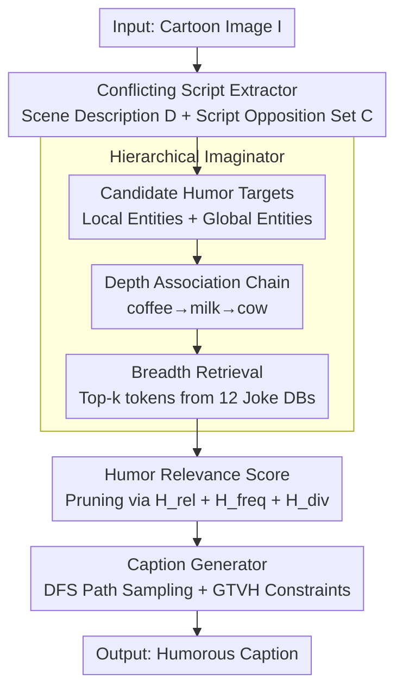

# On the Wings of Imagination: Conflicting Script-based Multi-role Framework for Humor Caption Generation

**Conference**: ICLR 2026  
**arXiv**: [2602.06423](https://arxiv.org/abs/2602.06423)  
**Code**: None  
**Area**: Information Retrieval  
**Keywords**: Humor generation, GTVH theory, Script opposition, Imagination tree, LLM collaboration, Multi-role framework

## TL;DR

Ours proposes the HOMER framework, which constructs a three-role LLM collaboration mechanism (Conflicting Script Extractor + Hierarchical Imaginator + Caption Generator) based on the GTVH humor theory. By explicitly modeling script opposition, multi-perspective association chains, and joke database retrieval to construct an imagination tree, the creative space is expanded. HOMER achieves an average improvement of ~7% using GPT-4o as the backbone on the New Yorker cartoon benchmark, and significant human evaluation results outperform all baselines.

## Background & Motivation

**Background**: Multimodal humor generation is a critical task for exploring whether LLMs possess human-level linguistic cognitive complexity. The typical "funny caption generation" task requires simultaneous visual understanding, humor reasoning, creative imagination, and linguistic style expression, which is challenging even for humans.

**Limitations of Prior Work**: Existing methods mainy rely on (a) general prompts (HumorousAI, Phunny), (b) multi-hop reasoning self-improvement (CLoT), or (c) task fine-tuning (LoL). However, these methods depend solely on the inherent humor mechanisms of LLMs, capturing only surface-level humorous language patterns without deep humor logic reasoning and creative imagination.

**Key Challenge**: (a) Inherent humor generation capabilities of LLMs are weak, as verified by multiple studies; (b) Existing methods lack creativity — "humorous" captions are often merely descriptive statements; (c) Lack of interpretability — the location and reason for the humor are unclear.

**Key Insight**: Leveraging the General Theory of Verbal Humor (GTVH), humor creation is modeled as the interaction of multiple knowledge resources. The core is **script opposition**, where the conflict between two semantic frameworks generates humor (expectation establishment → expectation violation → surprise/absurdity).

**Design Motivation**: GTVH decomposes humor into five knowledge resources — Script Opposition, Situation, Target, Narrative Strategy, and Language — providing a naturally structured guiding framework for humor caption generation.

**Mechanism**: Consider a cartoon of an office meeting with a massive coffee cup. GPT-4o and CLoT only describe "meeting + caffeine," whereas HOMER identifies the "giant cup vs. normal cup" script opposition. Following an imagination chain of "coffee → milk → cow," it generates a humorous caption with deep absurdity: "HR says we can expense a cow now."

## Method

### Overall Architecture

HOMER (Humor-theory-driven multi-role LLM collaboration framework augmented with humor Retrieval) addresses the core problem where LLMs produce descriptive but unfunny captions because they do not know where the humor lies or how to explain it. The mechanism splits humor generation into a "recipe-based" three-role pipeline following GTVH: extracting the logical premise of the joke, expanding the creative space around it, scoring and pruning, and finally generating the caption.

Specifically, the Conflicting Script Extractor $\mathrm{Extract}(\cdot)$ extracts scene description $D$ and script opposition set $\mathcal{C}$ from the image. The Hierarchical Imaginator $\mathrm{Imagine}(\cdot)$ uses $\mathcal{C}$ and $D$ as anchors to expand candidate humor targets into an imagination tree $\mathcal{T}_{\mathrm{im}}$ through "depth association chains + breadth joke retrieval," pruning leaf nodes using humor relevance scores. Finally, the Caption Generator $\mathrm{Gen}(\cdot)$ samples a creative path from the tree to write the caption. The entire pipeline is denoted as $\mathrm{Cap}(I) = \mathrm{Gen}(\Phi(\mathcal{C}, D, \mathcal{T}_{\mathrm{im}}, \Omega))$, where $\Omega \in NS \times LA$ corresponds to narrative strategy and language style knowledge resources in GTVH.

### Key Designs

**1. Conflicting Script Extractor: Explicitly Extracting the Logical Premise**

A common flaw in existing methods is asking the LLM to be funny immediately. HOMER positions structured extraction upfront: the LLM analyzes the image to generate a scene description $D$ (location, characters, expressions, actions), then follows GTVH definitions to identify relevant script oppositions $\mathcal{C} = \mathrm{Extract}(\Phi_{\mathrm{script}}(I, D))$. Script opposition is the logical foundation of humor; ablation studies show its removal leads to the largest performance drop.

**2. Hierarchical Imaginator: Expanding Creative Space via Depth and Breadth**

Pure LLM association is often redundant, while simple retrieval introduces noise. This module uses a "expand then prune" strategy. It selects candidate humor targets $\{t_i\}$ from local and global perspectives. For each target, a recursive association function generates a backbone chain $e_{\tau+1}^{(i)} = f_{\mathrm{chain}}(e_{\tau}^{(i)})$ (average length $\approx 4$). For each entity $e_{\tau}^{(i)}$, retrieval query embeddings $\mathbf{z}_q = f_{\mathrm{emb}}(D, \mathcal{C}, e_{\tau}^{(i)})$ are used to fetch top-$k$ tokens from 12 joke datasets for breadth expansion.

**3. Humor Relevance Scoring: Quantizing Humor via WordNet**

To prune the imagination tree, HOMER uses a humor relevance score $\mathbf{H}(e_{\tau}^{(i)}, \varepsilon) = \mathbf{H}_{\mathrm{rel}} + \mathbf{H}_{\mathrm{freq}} + \mathbf{H}_{\mathrm{div}}$. The related-conflict term $\mathbf{H}_{\mathrm{rel}}$ uses WordNet semantic relations: Target Semantic Similarity (TSS) via Wu-Palmer similarity and Concept Oppositeness (CO) via Jaccard dissimilarity. These are combined using a shaping function $f(x)=x\exp(-x)$:

$$\mathbf{H}_{\mathrm{rel}} = \mathrm{TSS} + f(\mathrm{TSS})\cdot\mathrm{CO}$$

This design aligns with the essence of humor: semantically related (High TSS) yet conceptually opposed (High CO).

**4. Caption Generator: Structured Generation from Sampled Paths**

The generator randomly selects a script $C\in\mathcal{C}$ and a target $t_i$, performs DFS on the tree $T_i$ to find paths $\mathcal{P}_i$, and samples path $P_i$. The final caption is $\mathrm{Cap}(I) = \mathrm{Gen}(\Phi(\mathcal{C}, D, P_i, \Omega))$. This produces diverse captions while maintaining humor quality through GTVH structural constraints.

## Key Experimental Results

### Main Results: Humor Caption Generation with GPT-4o Backbone (pass@k, %)

| Method | #Top10 @1 | #Top10 @3 | #200-209 @1 | #200-209 @3 | #1000-1009 @1 | #1000-1009 @3 |
|------|-----------|-----------|-------------|-------------|---------------|---------------|
| CoT | 45.79 | 70.59 | 57.28 | 82.85 | 61.58 | 86.90 |
| Few-shot | 58.07 | 78.91 | 65.12 | 81.14 | 65.59 | 88.39 |
| Self-consistency | 62.03 | 77.96 | 68.09 | 84.45 | 69.42 | 85.51 |
| HumorousAI | 62.11 | 81.24 | 69.38 | 85.32 | 73.46 | 85.42 |
| CLoT | 61.17 | 75.29 | 59.52 | 72.47 | 68.70 | 78.00 |
| **HOMER** | **66.41** | **83.70** | **73.40** | **88.38** | **76.32** | **90.50** |
| Gain | +6.92% | +3.03% | +5.79% | +3.59% | +3.89% | +2.39% |

### Ablation Study: Component Contribution (GPT-4o, Humor in AI #Top10)

| Configuration | pass@1 | pass@3 | pass@5 |
|------|--------|--------|--------|
| Image-Only | 20.20 | 38.30 | 51.00 |
| I+D | 50.60 | 69.49 | 78.00 |
| I+$\mathcal{C}$ | 41.80 | 59.70 | 67.00 |
| I+$\mathcal{T}_{\mathrm{im}}$ | 20.00 | 35.90 | 43.00 |
| I+D+$\mathcal{C}$ | 57.40 | 75.50 | 80.00 |
| I+D+$\mathcal{C}$+$\mathcal{T}_{\mathrm{im}}$ (Full) | **66.41** | **83.70** | **89.18** |

### Key Findings

- **Script opposition is the most critical foundation**: Removing $\mathcal{C}$ results in the largest performance drop, proving it is the logical cornerstone of humor.
- **Imagination tree requires guidance**: Adding $\mathcal{T}_{\mathrm{im}}$ alone is worse than Image-Only. It only functions effectively when guided by $D$ and $\mathcal{C}$.
- **Strong cross-model universality**: HOMER consistently improves performance across GPT-4o, Claude-4, Qwen-VL (7B), and LLaVA-1.5 (7B), with larger gains on weaker models.
- **Human evaluation consistency**: HOMER was the only method with a mean score > 3.0 (3.54 for Humor in AI).

## Highlights & Insights

- **Theory-driven vs. Data-driven**: HOMER systematically decomposes the process using GTVH rather than just "trying to be funny."
- **Creative Expansion**: The combination of LLM association chains (depth) and joke retrieval (breadth) enables creative jumps, such as from "coffee" to "cow."
- **Safety**: Detoxify scores are < 0.03, indicating that theory-driven generation is safer than brute-force humorous prompting.

## Limitations & Future Work

1. **GTVH Scope**: It primarily addresses verbal humor and may lack coverage for non-verbal humor like visual puns.
2. **Inference Cost**: Multi-role serial calls + retrieval result in higher latency compared to single prompts.
3. **Culture Bias**: The 12 English joke datasets may contain cultural biases.

## Related Work & Insights

### vs. CLoT (Multi-hop Reasoning)
CLoT relies on CoT self-improvement but lacks structured humor understanding. HOMER provides a "recipe" via GTVH. HOMER outperforms CLoT by 5.24% pass@1 on GPT-4o.

### vs. HumorousAI (General Humor Prompt)
HumorousAI relies on LLM inherent capability. HOMER's advantage lies in the imagination tree extending the creative space beyond training data through retrieval.

## Rating

| Dimension | Rating | Reason |
|------|------|------|
| Novelty | ⭐⭐⭐⭐ | Systemic integration of GTVH theory; clever imagination tree + retrieval pruning mechanism. |
| Effectiveness | ⭐⭐⭐⭐ | Significant improvements across 4 backbones and 2 datasets; thorough ablation and human evaluation. |
| Utility | ⭐⭐⭐ | High inference cost due to multi-step calls; requires external joke DB maintenance. |
| Writing Quality | ⭐⭐⭐⭐ | Clear structure; well-motivated theory; vivid case studies. |

<!-- RELATED:START -->

## Related Papers

- [\[ACL 2026\] Domain-Specific Data Generation Framework for RAG Adaptation](../../ACL2026/information_retrieval/domain-specific_data_generation_framework_for_rag_adaptation.md)
- [\[ICLR 2026\] GRO-RAG: Gradient-aware Re-rank Optimization for Multi-source Retrieval-Augmented Generation](gro-rag_gradient-aware_re-rank_optimization_for_multi-source_retrieval-augmented.md)
- [\[ICML 2025\] FedRAG: A Framework for Fine-Tuning Retrieval-Augmented Generation Systems](../../ICML2025/information_retrieval/fedrag_a_framework_for_fine-tuning_retrieval-augmented_generation_systems.md)
- [\[ICLR 2026\] ZeroGR: A Generalizable and Scalable Framework for Zero-Shot Generative Retrieval](zerogr_a_generalizable_and_scalable_framework_for_zero-shot_generative_retrieval.md)
- [\[ACL 2025\] FlexRAG: A Flexible and Comprehensive Framework for Retrieval-Augmented Generation](../../ACL2025/information_retrieval/flexrag_a_flexible_and_comprehensive_framework_for_retrieval-augmented_generatio.md)

<!-- RELATED:END -->
