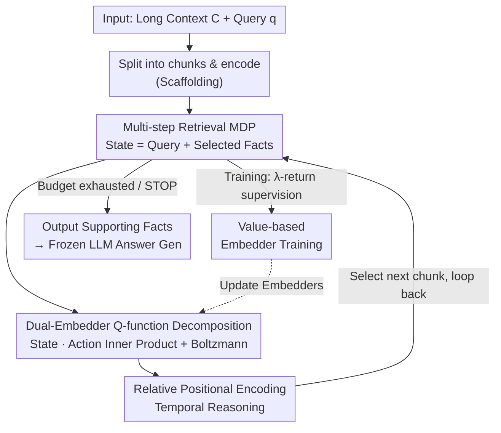

# Q-RAG: Long Context Multi‑Step Retrieval via Value‑Based Embedder Training

**Conference**: ICLR2026  
**OpenReview**: [https://openreview.net/forum?id=MS9nWFY7LG](https://openreview.net/forum?id=MS9nWFY7LG)  
**Code**: https://github.com/griver/Q-RAG  
**Area**: Information Retrieval / RAG  
**Keywords**: Multi-step Retrieval, RAG, Reinforcement Learning, Embedder Fine-tuning, Long Context

## TL;DR
Q-RAG models multi-step retrieval as an MDP, using value-based reinforcement learning to fine-tune only the embedder (leaving the LLM frozen). This allows the retrieval agent to step-by-step pick supporting facts directly within the latent space of chunk embeddings. It achieves SOTA on long-context benchmarks like BabiLong and RULER (up to 10 million tokens) and can be trained using a single A100.

## Background & Motivation
**Background**: RAG is a mainstream method to mitigate LLM issues such as long-context inefficiency, hallucinations, and static knowledge by feeding only the most relevant snippets to the LLM to shorten input and improve efficiency. However, most RAG systems are **single-step retrieval**, fetching top-k snippets in one go. This suffices for simple tasks like Needle-in-a-Haystack but fails on complex ones.

**Limitations of Prior Work**: Complex questions require **multi-step retrieval**—effectively "search-based reasoning"—where finding Fact A is necessary to know how to search for Fact B. Current multi-step approaches have significant drawbacks: 1) Knowledge Graph construction (GraphReader, HippoRAG) is extremely slow during inference as the LLM must read the entire context first; 2) LLM agent routes (alternating RAG queries and LLM-generated instructions) are sensitive to noise/errors, where one bad snippet poisons subsequent queries; 3) The recent trend of **fine-tuning LLMs** to call retrieval tools (Search-R1, R1-Searcher, ReSearcher) is effective but extremely expensive, often requiring 8×A100 and locking the method to specific open-source models.

**Key Challenge**: Effective multi-step retrieval requires **joint optimization of retrieval and generation**. Currently, this necessitates fine-tuning the LLM itself, which is costly and restricts the method to smaller, tunable models. Retrieval capability is tethered to LLM parameters, preventing decoupling from "arbitrarily sized or closed-source" generation models.

**Goal**: To build a resource-efficient multi-step retrieval agent without fine-tuning the LLM that can perform common-sense/temporal reasoning over ultra-long contexts (10M tokens) while remaining competitive on multi-hop QA like HotPotQA and MuSiQue.

**Key Insight**: The authors observe that **multi-step retrieval can be performed entirely within the latent space of chunk embeddings without LLM intervention in decision-making**. By treating "currently retrieved facts" as the state and "choosing the next chunk" as the action, the process becomes a finite-horizon MDP solvable with compact, inexpensive value-based RL.

**Core Idea**: Use reinforcement learning to fine-tune only the **embedders** (state and action embedders) so that the Q-value equals the inner product of state and action embeddings. This drives multi-step retrieval via a value function in latent space, completely decoupling retrieval power from any specific LLM.

## Method

### Overall Architecture
Q-RAG reformulates "multi-step evidence seeking in long documents" as a **finite-horizon MDP**: Given a triple $(C, q, y)$—long context $C$ (pre-split into $m$ non-overlapping chunks $\{c^{(i)}\}_{i=1}^m$), initial query $q$, and gold answer $y$—the agent must find information in $C$ that is "missing from $q$ but necessary for the correct answer." At the start of an episode, all chunks are encoded. The state $s_t = \mathrm{ord}([q, a_0, \dots, a_{t-1}])$ is a list of the query and selected chunks sorted in their original document order (using $\mathrm{ord}(\cdot)$ to eliminate permutation ambiguity). The action set $A_t = C \setminus \{a_0,\dots,a_{t-1}\}$ consists of unselected chunks. Each step picks a chunk until the budget $T$ is exhausted or a STOP action is triggered. Rewards are sparse: 1 if the final state contains all supporting facts $F^\star$, and 0 otherwise.

Decision-making is performed by a **value-based agent**: Two embedders encode the state and candidate actions respectively, with the Q-value defined as their inner product. A Boltzmann policy selects the next chunk based on Q-values. The embedders are trained via TD reinforcement learning. After retrieval, the selected facts are fed to a **frozen** LLM to generate the final answer.

### Key Designs

**1. Modeling Multi-step Retrieval as Latent Space MDP: Moving "Decision-making" from LLM to Embedding Space**

To address the key challenge that multi-step retrieval requires fine-tuning expensive LLMs, Q-RAG **changes the decision-maker**: instead of having the LLM generate search queries, a lightweight agent makes choices directly in the latent space. Formally, action $a_t \in A_t$ selects a chunk, and the transition is deterministic: $p(s_t, a_t) = \mathrm{ord}([q, a_0,\dots,a_{t-1}, a_t])$. This allows the decision process to happen entirely in vector space. A single decision involves only an inner product and a softmax, requiring no LLM forward passes, making it fast, cheap, and plug-and-play with any generation model.

**2. Dual-Embedder Q-function Decomposition + Boltzmann Policy: Q-values as Vector Inner Products**

For scalability to millions of candidate chunks, Q-RAG decomposes the Q-function into the **inner product of two embedders**: a state embedder $E_s(s_t; \theta_1) \in \mathbb{R}^d$ and an action embedder $E_a(a^i, i; \theta_2) \in \mathbb{R}^d$ that encodes chunk content and its document position $i$ (using rotary position embedding):
$$Q_\theta(s, a^i) = \langle E_s(s; \theta_1),\ E_a(a^i, i; \theta_2)\rangle.$$
This decomposition is theoretically grounded (convergence guarantees in Appendix A). Its value lies in precomputing and caching all action embeddings; each step only requires recomputing one state embedding and performing an inner product. This reduces "evaluating Q-values for all candidates" to efficient vector similarity search. The next chunk is sampled via a Boltzmann policy:
$$\pi(a_t|s_t) = \frac{\exp\frac{1}{\alpha}(Q_\theta(s_t,a_t) - q)}{\sum_{a\in A_t}\exp\frac{1}{\alpha}(Q_\theta(s_t,a) - q)},$$, where $q = \max_{a\in A_t} Q_\theta(s_t, a)$ ensures numerical stability, and temperature $\alpha$ decays toward 0.

**3. Value-based Embedder Training: Injecting Retrieval Quality via Soft-Q + PQN + λ-return**

Q-RAG employs Maximum Entropy (Soft) RL, defining soft $Q^\pi$ and $V^\pi$:
$$Q^\pi(s,a) = r(s,a) + \gamma V^\pi(p(s,a)),\quad V^\pi(s) = \mathbb{E}_{a\sim\pi}[Q^\pi(s,a) - \alpha\log\pi(a|s)].$$
The temperature $\alpha > 0$ controls exploration, which is vital given the "large candidate pool and sparse rewards." The underlying TD algorithm is PQN (instead of DQN) because PQN **requires no replay buffer**. In retrieval scenarios with massive action spaces, a replay buffer would necessitate re-encoding all chunks for each sample to estimate successor V/Q values, which is memory-prohibitive. Q-RAG uses **soft value functions** and **target networks**—ablations show both are crucial for stability. The training objective uses **λ-return** $G^\lambda_t$ to minimize MSE $L_Q = \mathbb{E}[(Q_\theta(s_t,a_t) - G^\lambda_t)^2]$, updating only the two embedders.

**4. Relative Positional Encoding for Temporal Reasoning: Locating Candidates Relative to Known Facts**

In narrative text, content alone often fails to determine if a chunk is helpful. For example, to answer "What happened before event X?", a retriever might find multiple mentions of the character's location. Without **temporal information**, it cannot pick the correct one. Q-RAG designs **relative positional encoding** $\rho_t$: at step $t$, selected chunk indices $S_t = \{i_1 < \dots < i_k\}$ split the document into $k+1$ intervals. $\rho_t$ maps candidate indices to a real number indicating the interval and relative order. Specifically, with boundaries $b_0=1, b_j=i_j, b_{k+1}=m+1$, for chunk $c^i$ in interval $j$:
$$\rho_t(i) = j\delta + \ell\,\frac{i - b_j}{b_{j+1} - b_j},$$
where $\delta$ is step size and $\ell$ is resolution. Absolute positions are replaced by these relative positions in the action embedder: $E_a(a^i, i; \theta_2) \Rightarrow E_a(a^i, \rho_t(i); \theta_2)$. This allows the Q-function to utilize spatial relationships between candidates and retrieved evidence, remaining invariant to global translation.

### Loss & Training
The objective is the Mean Squared Error of the λ-return: $L_Q = \mathbb{E}[(Q_\theta(s_t,a_t) - G^\lambda_t)^2]$. Multiple environments run in parallel to sample trajectories, λ-returns are calculated back-to-front, and target parameters are updated via EMA $\theta' \leftarrow \tau\theta + (1-\tau)\theta'$. Key settings include soft-Q, target networks, temperature annealing, and fine-tuning public embedders like multilingual-e5-large or contriever using a single A100-80GB.

## Key Experimental Results

### Main Results
On RULER long-context retrieval, Q-RAG generalizes to 1M tokens despite being trained only on 4K-document samples:

| Length | Method | NIAH Avg. | SH QA | MH QA |
|------|------|-----------|-------|-------|
| 4K | LongRoPE2-8B | 99.7 | 99 | 60 |
| 4K | Beam Retriever | 98.5 | 29.0 | 39.0 |
| 4K | **Q-RAG** | **100** | **62** | **67** |
| 128K | LongRoPE2-8B | 97 | 56 | 50 |
| 128K | **Q-RAG** | **100** | 55 | **65** |
| 1M | **Q-RAG** | 99.7 | 52 | 61 |

On Open-domain multi-hop QA (HotPotQA for training, MuSiQue for OOD), using QwQ-32B for generation:

| Method | HotPotQA Fact F1 | HotPotQA Ans F1 | MuSiQue(OOD) Fact F1 | MuSiQue Ans F1 | Avg Ans F1 |
|------|------------------|------------------|----------------------|----------------|------------|
| Beam Retriever | **0.97** | 0.77 | 0.61 | 0.40 | 0.59 |
| Search-R1 (Full LLM FT) | 0.81 | 0.65 | 0.71 | 0.51 | 0.58 |
| **Q-RAG** | 0.93 | 0.76 | **0.71** | **0.52** | **0.64** |
| **Plan Q-RAG** | 0.95 | 0.76 | 0.69 | 0.51 | **0.64** |

### Ablation Study
On BabiLong-QA3 (requires ≥3 facts + temporal reasoning), reporting Fact Retrieval F1:

| Configuration | 1K | 32K | 1M | Notes |
|------|------|------|------|------|
| Q-RAG (Full) | 97.8 | 97.1 | 96.5 | Minimal degradation with length |
| w/o Soft-Q | 95.9 | 94.5 | 93.3 | Max-entropy loss (~2-3 pt drop) |
| w/o Target | 79.2±26 | 77.6±27 | 75.9±28 | Variance explosion |
| Multi-Step RAG w. SFT | 20.3 | 20.1 | — | SFT fails to capture signal |
| Multi-Step RAG w.o. FT | 15.5 | 15.5 | — | Basic retrieval unusable |

### Key Findings
- **RL Fine-tuning of Embedders is Critical**: Without fine-tuning (w.o. FT), performance is ~15 F1; using SFT only reaches ~20 F1. RL fine-tuning reaches ~97 F1, proving retrieval quality must be "learned" via RL.
- **Target Network exceeds Soft-Q in Importance**: Removing soft-Q results in a mild drop, but removing the target network leads to massive variance ($\pm 27$), proving it is essential for stability.
- **Maximum Advantage on Complex Tasks**: On BabiLong QA3, which requires long reasoning chains, other long-context methods degrade rapidly while Q-RAG shows near-zero degradation.
- **Retrieval Budget (2 vs 3 steps)**: Increasing steps from 2 to 3 on HotPotQA improves both fact count and answer quality. Accuracy depends primarily on "whether correct chunks are retrieved" rather than sensitivity to noise.

## Highlights & Insights
- **Decoupling Retrieval from LLM Parameters**: Decisions on "which chunk to pick" happen in latent space via a value function, allowing the retrieval capability to work with any (including closed-source) LLMs.
- **Dual Efficiency of Q = Inner Product**: This decomposition makes evaluating millions of candidates a cached vector search, explaining why Q-RAG scales to 10M tokens while trajectory-scoring methods (like BeamRetriever) fail.
- **Pragmatic Choice of PQN**: By choosing PQN over DQN, the authors avoid the memory/speed overhead of replay buffers in high-action environments.
- **Transferable Relative Positional Encoding**: The idea of partitioning documents based on already-retrieved evidence to inject structure can transfer to any iterative retrieval task.

## Limitations & Future Work
- **Reliance on Oracle Facts**: Experiments used $F^\star$ (supporting facts) for rewards. Many real-world datasets lack per-chunk annotations. LLM-based rewards (using answer EM/F1) are left for future work.
- **Retrieval vs. Answer Quality**: While fact retrieval is near-perfect, the gap in Answer F1 (61-67) suggests that generation and retrieval are not yet jointly optimized.
- **Chunking Assumptions**: The method assumes pre-split, non-overlapping chunks; the impact of chunk granularity or overlaps remains uninvestigated.
- **Baseline Consistency**: Baseline results were a mix of reported and reproduced values, requiring caution in head-to-head comparisons.

## Related Work & Insights
- **vs Search-R1 / R1-Searcher**: These use GRPO on full LLMs. Q-RAG is single-card trainable and works with any model by focusing only on the embedders.
- **vs RePlug**: RePlug uses LLM feedback to tune retrievers but does not handle multi-step reasoning or RL in this specific formulation.
- **vs BeamRetriever**: BeamRetriever is SOTA for short-context QA but cannot scale to long contexts due to transformer-based trajectory scoring; Q-RAG's inner-product approach is significantly faster and more scalable.
- **vs Long-context Models (RMT / Mamba2)**: Q-RAG outperforms "extended sequence window" architectures on 1M+ tokens, suggesting "retrieval + frozen LLM" can be more cost-effective than native window expansion.

## Rating
- Novelty: ⭐⭐⭐⭐⭐ Reframing multi-step retrieval as a latent MDP for embedder-only RL is a refreshing and orthogonal approach.
- Experimental Thoroughness: ⭐⭐⭐⭐ Covers 4K-10M tokens and multi-hop QA, though baseline consistency is noted as a minor issue.
- Writing Quality: ⭐⭐⭐⭐ Clear MDP formulation and algorithms.
- Value: ⭐⭐⭐⭐⭐ Extremely practical due to single-GPU training and compatibility with any LLM.

<!-- RELATED:START -->

<!-- RELATED:END -->

## Related Papers

- [\[ICLR 2026\] Beyond RAG vs. Long-Context: Learning Distraction-Aware Retrieval for Efficient Knowledge Grounding](beyond_rag_vs_long-context_learning_distraction-aware_retrieval_for_efficient_kn.md)
- [\[ICLR 2026\] DeepRAG: Thinking to Retrieve Step by Step for Large Language Models](deeprag_thinking_to_retrieve_step_by_step_for_large_language_models.md)
- [\[ICML 2026\] HGMem: Hypergraph-based Working Memory to Improve Multi-step RAG for Long-Context Complex Relational Modeling](../../ICML2026/information_retrieval/hgmem_hypergraph-based_working_memory_to_improve_multi-step_rag_for_long-context.md)
- [\[ACL 2026\] BRIEF-Pro: Universal Context Compression with Short-to-Long Synthesis for Fast and Accurate Multi-Hop Reasoning](../../ACL2026/information_retrieval/brief-pro_universal_context_compression_with_short-to-long_synthesis_for_fast_an.md)
- [\[ACL 2025\] Hierarchical Document Refinement for Long-context Retrieval-augmented Generation](../../ACL2025/information_retrieval/hierarchical_document_refinement_for_long-context_retrieval-augmented_generation.md)

<!-- RELATED:END -->
