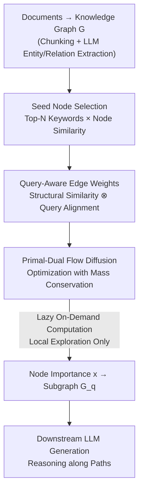

# Query-Aware Flow Diffusion for Graph-Based RAG with Retrieval Guarantees

**Conference**: ICLR 2026  
**OpenReview**: [https://openreview.net/forum?id=n28wnc2QTc](https://openreview.net/forum?id=n28wnc2QTc)  
**Code**: TBD (Project Page only)  
**Area**: Information Retrieval / Graph Learning / Graph RAG  
**Keywords**: Graph-based RAG, Flow Diffusion, Query-Aware Traversal, Subgraph Retrieval Guarantees, Text-to-SQL

## TL;DR
QAFD-RAG introduces "flow diffusion" into graph-based RAG by dynamically re-weighting edges based on query semantics. This ensures information flows only along paths aligned with the query, enabling the training-free extraction of compact, interpretable reasoning subgraphs. It provides the first statistical guarantee for "recalling relevant subgraphs with high probability" and consistently outperforms baselines like GraphRAG and LightRAG in QA and Text-to-SQL tasks.

## Background & Motivation

**Background**: Real-world knowledge is often graph-structured (DB schemas, social networks, biomedical libraries). Graph-based RAG captures multi-hop dependencies and hierarchical relations by retrieving from knowledge graphs (KG), representing a mainstream direction for enhancing LLM multi-hop reasoning. Representative methods include GraphRAG, which uses community detection (Leiden clustering) to group documents into hierarchical communities, and LightRAG, which extracts 1-hop ego-networks around seed nodes.

**Limitations of Prior Work**: The authors identify two critical flaws in existing graph-based RAG: (i) **Heuristic design and lack of theoretical guarantees**—there is no quantifiable assurance of subgraph quality or relevance to the query; (ii) **Static traversal strategies that ignore overall query semantics**—communities or neighborhoods remain the same regardless of the query. Figure 1 of the paper provides an intuitive example: for the query "Introduce Steve Jobs' products at Apple," GraphRAG pulls in an entire community (including Mac/macOS but mixing in Amazon River and Apple fruit), while LightRAG includes structurally adjacent but semantically irrelevant nodes (e.g., Fuji apple varieties).

**Key Challenge**: There is a discrepancy between "structural connectivity" and "semantic relevance." Two nodes being neighbors in a graph does not imply relevance to the current query. Static traversal focuses only on structure, leading to the retrieval of regions that are "structurally close but semantically irrelevant," which dilutes context and breaks the coherence of the reasoning chain. Furthermore, there is no theoretical characterization of recall accuracy.

**Goal**: Establish **retrieval guarantees** for "subgraph retrieval adaptive to query semantics." This requires making the retrieval dynamic based on the query while proving that "relevant subgraphs are recalled with high probability and irrelevant leakage is controlled."

**Key Insight**: The authors turn to **flow diffusion** theory. Starting from seed nodes, "mass" is diffused to neighbors along edges according to weights. Spectral diffusion methods offer strong guarantees and efficiency in clustering and community detection, but they have not been studied in "query-aware" scenarios. The authors' insight is that by transforming edge weights into query-aware "semantic gates," diffusion can be converted into a semantic filter, allowing the adaptation of spectral diffusion's theoretical guarantees.

**Core Idea**: Use "query-aware edge weights" instead of "static weights" for flow diffusion. The weight of edge $(u,v)$ integrates "structural similarity" with the "query alignment" of both endpoints. This directs the flow only towards query-aligned paths, resulting in compact subgraphs with provable recall guarantees.

## Method

### Overall Architecture
QAFD-RAG is a **training-free**, two-stage framework. The **Indexing Stage** chunks raw documents and uses an LLM to extract entities and relations to construct a knowledge graph $G=(V,E,R)$, following standard practices. The core innovation lies in the **Query Stage**: given a query $q$, an LLM first extracts keywords. **Seed nodes** $S_V$ are selected based on the semantic similarity between nodes and keywords to serve as mass injection points. During traversal, **every edge is dynamically re-weighted** (integrating structural similarity and query alignment). Flow diffusion is modeled as an optimization problem with mass conservation constraints, solved via a push-relabel coordinate descent algorithm. The resulting node importance $x$ represents the relevance of each entity to the query, used to extract a reasoning subgraph $G_q$ for generating the final answer. The process adopts **lazy on-demand computation** (calculating weights/embeddings only when mass reaches a node), ensuring complexity grows with the size of the explored subgraph rather than the entire graph.

### Key Designs

**1. Seed Node Selection: Anchoring the Query to the Graph**

Flow diffusion requires starting points. While traditional methods assume seeds are known, RAG must identify them from the query. The authors use an LLM to extract a keyword set $K_q=\{w_1,\dots,w_{|K_q|}\}$ from query $q$ (including both high-level concepts and low-level surface words). Keywords and nodes are mapped to a $d$-dimensional embedding space. The relevance score of node $v$ is defined as its **maximum similarity** to any keyword: $\text{score}(v,q)=\max_{i}H_{\text{sim}}(e_{q,i},e_v)$. The Top-$N$ nodes are selected as seeds $S_V$. This step identifies effective reasoning starting points with $O(|V|\,|K_q|\,d+|V|\log N)$ complexity.

**2. Dynamic Query-Aware Edge Weights: Edges as "Semantic Gates"**

This is the core innovation. Traditional diffusion uses static weights (often an identity matrix), leading to "uniform exploration." The authors make edge weights encode both structural and semantic signals. For edge $(u,v)$:

$$\bar{w}(q,u,v) = c\cdot H_{\text{sim}}(h(u),h(v))\circ\big(a+b\cdot(H_{\text{sim}}(h(u),h(q))\circ H_{\text{sim}}(h(v),h(q)))\big)$$

where $H_{\text{sim}}(h(u),h(v))$ is node-to-node **structural similarity**, and the latter part represents **semantic relevance** of both endpoints to the query. $\circ$ can be addition or multiplication. The **multiplicative interaction** ensures that weights are amplified only when both endpoints are relevant, while being **exponentially suppressed** if even one is irrelevant. This effectively blocks expansion into structurally close but semantically unrelated areas (e.g., Apple → Amazon River). Weights are computed **online and on-demand**.

**3. Primal-Dual Flow Diffusion Optimization: Provable Convex Optimization**

With edge weights defined, flow diffusion is formulated as a constrained optimization problem **minimizing total flow cost while satisfying mass conservation at each node**:

$$\min_{f\in\mathbb{R}^{|E|}}\ \tfrac{1}{2}f^\top\bar{W}(q)f\quad\text{s.t.}\quad \Delta+B\bar{W}(q)f\le T$$

where $f$ is the edge flow, $\bar{W}(q)$ is the diagonal matrix of query-aware weights, $B$ is the incidence matrix, $\Delta$ encodes mass injection (for seeds), and $T$ is the sink capacity. Using Lagrange multipliers $x\in\mathbb{R}^{|V|}_+$, the **dual problem** is $\min_x \tfrac12 x^\top L(q)x + x^\top(T-\Delta)$, where $L(q)$ is the weighted Laplacian. This is solved via coordinate descent: "overloaded" nodes ($m_v > T_v$) push excess mass to neighbors. The solution $x$ provides node importance scores. This dual perspective ensures convergence and direct query-relevance mapping.

**4. Lazy Local Computation + Multi-subquery Decomposition**

The algorithm maintains **locality**: each iteration only touches one node and its neighbors. The number of explored nodes is bounded by the total injected mass $\|\Delta\|_1$. Combined with **lazy evaluation** (computing edge weights only when mass flows to them), complexity depends on the explored subgraph size rather than the full graph. For complex multi-hop queries, the authors add a **multi-subquery decomposition** layer: the query is decomposed into $K$ sub-queries $\{q_1,\dots,q_K\}$. Flow diffusion is performed for each, and the resulting subgraphs are merged: $G_q=\bigcup_k G_{q_k}$.

### Loss & Training
QAFD-RAG is **completely training-free**. It relies on pre-trained embeddings and online convex optimization. Key hyperparameters include $N=40$ seeds, $\alpha=50$ mass, and Hybrid weights ($a=1, b=1/4$). It uses `text-embedding-3-small` (1536-dim) and `GPT-4o-mini` for extraction and keyword generation. The algorithm reaches $\epsilon$-precision in $O(\bar{d}\|\Delta\|_1\tfrac{\alpha}{\beta}\log\tfrac1\epsilon)$ time, which is sub-linear relative to the graph size $n$.

## Key Experimental Results

### Main Results

General QA results on UltraDomain subsets (GPT-4o scoring 0–100 across 5 dimensions):

| Dataset | Method | Comprehensiveness | Logic | Relevance | Coherence |
|--------|------|--------|--------|--------|--------|
| Agriculture | GraphRAG | 87.30 | 90.80 | 94.01 | 90.08 |
| Agriculture | LightRAG | 83.65 | 88.85 | 93.55 | 88.67 |
| Agriculture | **Ours** | **89.93** | **92.10** | **95.67** | **92.00** |
| Biology | GraphRAG | 85.76 | 88.94 | 93.00 | 88.57 |
| Biology | **Ours** | **89.44** | **91.19** | **95.05** | **91.33** |

Multi-hop QA (F1 / EM):

| Method | HotpotQA F1 | HotpotQA EM | 2Wiki F1 | MuSiQue F1 | MuSiQue EM |
|------|-------------|-------------|----------|------------|------------|
| GraphRAG | 33.40 | 14.00 | 15.20 | 39.40 | 17.60 |
| HippoRAG | 58.67 | 45.27 | **70.33** | 38.33 | 27.55 |
| **Ours** | **73.42** | **58.10** | 69.41 | **47.99** | **33.50** |

Text-to-SQL (Spider 2.0 Local, Execution Accuracy):

| Method | SQLite (%) | Snowflake (%) |
|------|-----------|---------------|
| Spider-Agent | 21.50 | 16.30 |
| **Ours + SQL-Agent** | **26.70** | **23.70** |

### Ablation Study

| Configuration | Observation | Explanation |
|------|------|------|
| Hybrid Weight (Default) | Best performance | Struct. Sim × $(a + b(\text{Query Alignment}))$ |
| Product Weight | Competitive | Multiplicative interaction suppresses irrelevant edges; used in proofs |
| Mean Weight | Weakest | Semantic signals are not amplified/suppressed effectively |

### Key Findings
- **Query-aware weighting is the core gain**: By placing "semantic gates" on edges, irrelevant neighborhoods are suppressed. In multi-hop QA, HotpotQA F1 improved from 58.67 (HippoRAG) to 73.42.
- **Stability in multi-hop tasks**: While HippoRAG is competitive on 2Wiki, QAFD-RAG is more robust across HotpotQA and MuSiQue with better precision-recall balance.
- **Multiplicative interaction outperforms additive**: The "gate" effect of Product/Hybrid variants effectively filters structural noise.
- **Modularity**: The method is plug-and-play and can replace static clustering in GraphRAG or enhance HippoRAG's PPR.

## Highlights & Insights
- **Dynamic edge weights as query functions**: Transforming the diffusion process into a semantic filter by incorporating "endpoint-query alignment" into weights is a clever mechanical shift that blocks expansion into irrelevant nodes.
- **First theoretical guarantee for Graph RAG**: By using a structured stochastic graph model with sub-Gaussian embeddings, the authors prove **edge weight separation** and **subgraph recall** (Theorem 7: full recall of relevant $R_k$ with high probability and controlled leakage).
- **Scalability**: Lazy computation and locality ensure the method scales to million-node KGs, as complexity depends on the subgraph size.

## Limitations & Future Work
- **Dependency on embeddings**: Domain-specific scenarios might see embedding failure, leading to poor weight separation.
- **Logic negation**: Embeddings struggle with "does not contain X." Currently addressed by keyword extraction but still limited.
- **Theoretical-Practical Gap**: Guarantees are proven for the Product variant under specific graph models, whereas the Hybrid variant is used in practice.
- **Future Directions**: Learning weights from query-answer pairs and extending to temporal or multimodal graphs.

## Related Work & Insights
- **vs GraphRAG**: GraphRAG uses query-agnostic Leiden clustering, pulling in entire communities. Ours use dynamic weighting for compact, query-aligned subgraphs.
- **vs HippoRAG**: HippoRAG uses query-independent transition probabilities in PPR. QAFD-RAG makes transitions query-aware and provides theoretical guarantees.
- **vs Traditional Flow Diffusion**: Previous work focused on community detection with static weights; this is the first systematic application of query-aware flow diffusion in RAG.

## Rating
- Novelty: ⭐⭐⭐⭐⭐ First introduction of query-aware flow diffusion to RAG with statistical guarantees.
- Experimental Thoroughness: ⭐⭐⭐⭐ Extensive coverage across QA, Summarization, and SQL, though HippoRAG remains strong on specific datasets.
- Writing Quality: ⭐⭐⭐⭐ Clear motivation and methodology; heavy but well-integrated theory.
- Value: ⭐⭐⭐⭐⭐ Training-free, plug-and-play, and theoretically grounded.

<!-- RELATED:START -->

## Related Papers

- [\[ICLR 2026\] SmartChunk Retrieval: Query-Aware Chunk Compression with Planning for Efficient Document RAG](smartchunk_retrieval_query-aware_chunk_compression_with_planning_for_efficient_d.md)
- [\[ICLR 2026\] When to use Graphs in RAG: A Comprehensive Analysis for Graph Retrieval-Augmented Generation](when_to_use_graphs_in_rag_a_comprehensive_analysis_for_graph_retrieval-augmented.md)
- [\[ICLR 2026\] Flow of Spans: Generalizing Language Models to Dynamic Span-Vocabulary via GFlowNets](flow_of_spans_generalizing_language_models_to_dynamic_span-vocabulary_via_gflown.md)
- [\[ICLR 2026\] Beyond RAG vs. Long-Context: Learning Distraction-Aware Retrieval for Efficient Knowledge Grounding](beyond_rag_vs_long-context_learning_distraction-aware_retrieval_for_efficient_kn.md)
- [\[ICLR 2026\] GRO-RAG: Gradient-aware Re-rank Optimization for Multi-source Retrieval-Augmented Generation](gro-rag_gradient-aware_re-rank_optimization_for_multi-source_retrieval-augmented.md)

<!-- RELATED:END -->
## Related Papers

- [\[ICLR 2026\] Flow of Spans: Generalizing Language Models to Dynamic Span-Vocabulary via GFlowNets](flow_of_spans_generalizing_language_models_to_dynamic_span-vocabulary_via_gflown.md)
- [\[ICML 2026\] Self-Augmenting Retrieval for Diffusion Language Models](../../ICML2026/information_retrieval/self-augmenting_retrieval_for_diffusion_language_models.md)
- [\[ICLR 2026\] Beyond RAG vs. Long-Context: Learning Distraction-Aware Retrieval for Efficient Knowledge Grounding](beyond_rag_vs_long-context_learning_distraction-aware_retrieval_for_efficient_kn.md)
- [\[ICLR 2026\] GRO-RAG: Gradient-aware Re-rank Optimization for Multi-source Retrieval-Augmented Generation](gro-rag_gradient-aware_re-rank_optimization_for_multi-source_retrieval-augmented.md)
- [\[AAAI 2026\] ReFeed: Retrieval Feedback-Guided Dataset Construction for Style-Aware Query Rewriting](../../AAAI2026/information_retrieval/refeed_retrieval_feedback-guided_dataset_construction_for_style-aware_query_rewr.md)

<!-- RELATED:END -->
