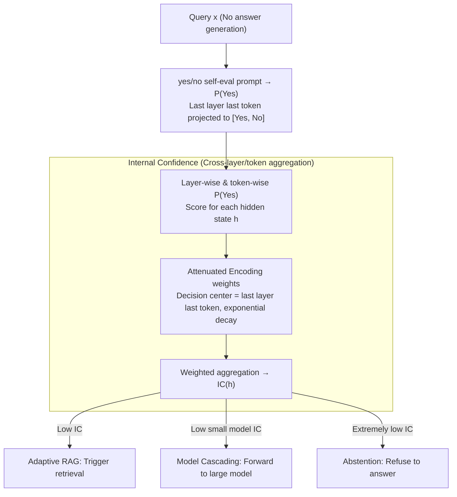

# Query-Level Uncertainty in Large Language Models

**Conference**: ICLR2026  
**arXiv**: [2506.09669](https://arxiv.org/abs/2506.09669)  
**Code**: [GitHub](https://github.com/tigerchen52/query_level_uncertainty)  
**Area**: Information Retrieval  
**Keywords**: uncertainty estimation, knowledge boundary, adaptive inference, training-free, internal confidence

## TL;DR
The authors propose the concept of Query-Level Uncertainty and introduce the Internal Confidence (IC) method to estimate whether an LLM can answer a given query before generation (via a single forward pass). This enables efficient, training-free adaptive inference (RAG triggering, model cascading, and abstention).

## Background & Motivation
1. LLMs possess knowledge boundaries and cannot accurately answer all questions; awareness of these boundaries is crucial for building trustworthy and efficient AI systems.
2. Existing uncertainty estimation methods are mostly answer-level (evaluated post-generation), which incurs high computational overhead as answers must be fully generated.
3. Adaptive inference (e.g., RAG, slow thinking, model cascading) requires pre-generation signals to decide whether to trigger additional resources.
4. Existing query-level methods require training probes or fine-tuning models (e.g., IDK tokens, R-Tuning), which limits their generalizability.
5. Internal hidden states of LLMs contain rich information about knowledge accessibility, and cross-layer consistency can improve output quality.

## Method

### Overall Architecture
The method transforms the question "Can the LLM correctly answer this query?" into a confidence score readable **before generation**. The model is provided with a fixed yes/no self-evaluation prompt, but **it is not permitted to actually generate an answer**. Instead, the probability $P(\text{Yes})$ is extracted from the hidden states. While the standard approach only examines the last token of the last layer, this work extends it to calculate $P(\text{Yes})$ across **all layers and all token positions**, then aggregates these into Internal Confidence (IC) using weights that decay with distance from the "decision center." The entire process requires only **one forward pass and is completely training-free**, allowing the resulting IC to directly drive adaptive RAG, model cascading, and abstention decisions.

### Key Designs

**1. Yes/no self-evaluation prompt + P(Yes) extraction: Turning pre-generation awareness into readable signals**

Most existing uncertainty estimations are answer-level, requiring full answer generation before evaluation, which is expensive and unusable for pre-generation decisions like "whether to trigger retrieval." This paper uses a fixed prompt for self-evaluation—"Respond only with 'Yes' or 'No' to indicate whether you are capable of answering the {Query} accurately."—but **does not decode** the response. Instead, it takes the hidden state $\mathbf{h}_N^{(L)}$ of the last token in the last layer, projects it onto the [Yes, No] tokens via the unembedding matrix, and applies softmax. The probability assigned to "Yes" is treated as the confidence score:

$$P(\text{Yes}) = \text{softmax}\!\left(\mathbf{W}^{\text{unemb}}_{[\text{Yes},\text{No}]}\,\mathbf{h}_N^{(L)}\right)_{\text{Yes}}$$

This acts as a training-free linear probe; the model's judgment of its own knowledge boundary is linearly encoded in the hidden states (answerable and non-answerable queries are approximately linearly separable in the latent space). Reading this directly saves the cost of generation and requires only one forward pass.

**2. Internal Confidence: Cross-layer and cross-token weighted aggregation using attenuated weights**

Relying solely on the final position ignores knowledge signals encoded in intermediate layers. $P(\text{Yes})$ typically increases across layers (low to high) and tokens (left to right), and the final point is not always the most discriminative. The paper calculates $P(\text{Yes})$ for all layers $l$ and token positions $n$, aggregating them into Internal Confidence:

$$\text{IC}(\mathbf{h}) = \sum_{n=1}^{N}\sum_{l=1}^{L} w_n^{(l)}\, P\!\left(\text{Yes}\mid \mathbf{h}_n^{(l)}\right)$$

To avoid using a validation set for weight optimization (which would violate the training-free principle), the authors use **Attenuated Encoding**. Weights decay exponentially based on the distance from a "decision center": $\delta_j^{(i)} = \exp(-\alpha\,|i-j|^2)\,/\,\sum_j \exp(-\alpha\,|i-j|^2)$, where $i$ is the center and $\alpha$ controls locality. The decision center is **fixed at the last token of the last layer**. Although AUROC heatmaps show the most discriminative points are actually in the middle (e.g., $\mathbf{h}_5^{(27)}$ on Llama-8B), pinning the center at the end and absorbing neighborhood information provides a sufficient approximation. This aggregation increases AUROC from 59.6 (base $P(\text{Yes})$) to 64.2.

**3. Three adaptive inference applications: Driving resource allocation with pre-generation signals**

As IC is a pre-generation signal, it is naturally suited for deciding resource allocation before answering. **Adaptive RAG**: Trigger retrieval if IC is low; answer directly if IC is high, reducing RAG calls by $50\%+$ with minimal performance loss. **Model Cascading**: Forward the query to a larger model if the small model's IC is low, optimizing the cost-quality tradeoff. **Abstention**: Refuse to answer queries with extremely low IC to improve system trustworthiness. All three utilize the same IC threshold.

## Key Experimental Results

### Main Results (Across Models and Tasks)

| Method | Phi-3.8B AUROC | Llama-8B AUROC | Qwen-14B AUROC | Avg AUROC |
|------|:--:|:--:|:--:|:--:|
| Max(-log p) | 54.0 | 56.3 | 57.8 | 56.0 |
| Predictive Entropy | 57.9 | 60.1 | 62.4 | 60.1 |
| Semantic Entropy | 55.6 | 59.7 | 60.0 | 58.4 |
| P(Yes) top-right | 57.3 | 60.5 | 60.9 | 59.6 |
| **Internal Confidence** | **60.8** | **64.7** | **67.1** | **64.2** |

### Comparison with Answer-level Methods (Speed)

| Method | GSM8K AUROC | ms/sample |
|------|:--:|:--:|
| IC (Ours) | 66.8 | **0.3** |
| Predictive Entropy | 61.0 | 9.8 |
| Min-K Entropy | 60.4 | 3.8 |
| Semantic Entropy | 60.0 | 151.8 |

**Key Findings**:
1. IC consistently outperforms all baselines across 3 datasets and 3 models.
2. Compared to answer-level methods, IC is $32\times$ to $602\times$ faster and achieves higher accuracy.
3. In RAG scenarios, it reduces RAG calls by over $50\%$ with negligible performance degradation.
4. The effectiveness of IC increases with model size, as larger models have better awareness of their own knowledge boundaries.
5. Information from layers and tokens near the decision center is most discriminative, consistent with AUROC heatmaps.

## Highlights & Insights
- Formally defines query-level uncertainty, shifting uncertainty estimation from "posterior" to "prior."
- Completely training-free, requiring only a single forward pass, making it highly practical.
- The cross-layer and cross-token weighted aggregation strategy (Attenuated Encoding) is simple yet effective.
- Demonstrates significant efficiency-quality trade-off advantages in RAG and model cascading.

## Limitations & Future Work
- The decision center is fixed at the last token of the last layer, which is sub-optimal (a trade-off to maintain the training-free property).
- Validated only on tasks with clear ground truths (factual QA/mathematical reasoning); open-ended generation is not covered.
- Greedy decoding as a proxy for the knowledge boundary is conservative and may underestimate model capability.
- Capability to distinguish performance on reasoning-heavy tasks (e.g., multi-step math) is relatively weaker than on factual QA.

## Related Work & Insights
- Answer-level uncertainty: Semantic Entropy (Kuhn et al. 2023), P(True) (Kadavath et al. 2022).
- Knowledge boundary detection: IDK token (Cohen et al. 2024), R-Tuning (Zhang et al. 2024a) — both require training.
- Internal state probes: Gottesman & Geva (2024) trained lightweight probes; Semantic Entropy Probes (Kossen et al. 2024).

## Rating
- Novelty: ⭐⭐⭐⭐ (Novel query-level concept, concise method)
- Experimental Thoroughness: ⭐⭐⭐⭐ (3 models, 3 datasets, multiple applications)
- Writing Quality: ⭐⭐⭐⭐⭐ (Clear problem definition, intuitive diagrams)
- Value: ⭐⭐⭐⭐ (High practical value for adaptive inference)

<!-- RELATED:START -->

## Related Papers

- [\[ICLR 2026\] DeepRAG: Thinking to Retrieve Step by Step for Large Language Models](deeprag_thinking_to_retrieve_step_by_step_for_large_language_models.md)
- [\[AAAI 2026\] "As Eastern Powers, I Will Veto." : An Investigation of Nation-Level Bias of Large Language Models in International Relations](../../AAAI2026/information_retrieval/as_eastern_powers_i_will_veto_an_investigation_of_nation-level_bias_of_large_lan.md)
- [\[ICLR 2026\] TokMem: One-Token Procedural Memory for Large Language Models](tokmem_one-token_procedural_memory_for_large_language_models.md)
- [\[ICLR 2026\] MLP Memory: A Retriever-Pretrained Memory for Large Language Models](mlp_memory_a_retriever-pretrained_memory_for_large_language_models.md)
- [\[ICLR 2026\] Expert Heads: Robust Evidence Identification for Large Language Models](expert_heads_robust_evidence_identification_for_large_language_models.md)

<!-- RELATED:END -->
