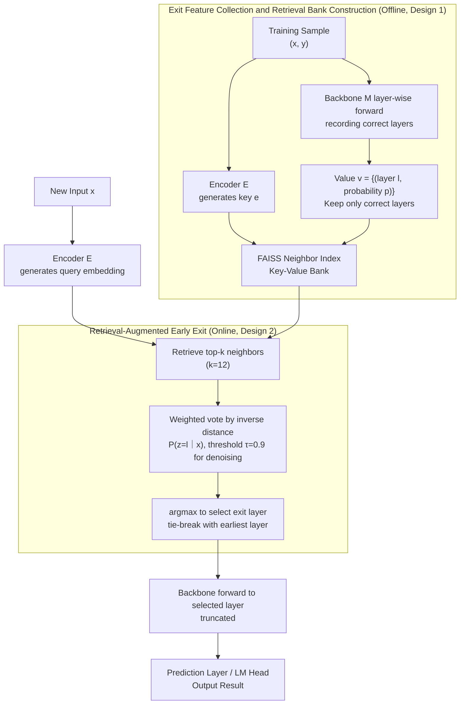

# RAEE: A Robust Retrieval-Augmented Early Exit Framework for Efficient Inference

**Conference**: ICLR 2026  
**arXiv**: [2405.15198](https://arxiv.org/abs/2405.15198)  
**Code**: [GitHub](https://github.com/HugeRaabbit/RAEE)  
**Area**: Information Retrieval  
**Keywords**: Early Exit, Retrieval-Augmented, Distribution Prediction, Inference Acceleration, Error Correction  

## TL;DR

Ours proposes RAEE, a training-free retrieval-augmented early exit framework. By retrieving exit information from semantically similar samples to dynamically determine the optimal exit layer, it not only accelerates inference but also corrects model mispredictions, achieving a win-win for both speed and performance.

## Background & Motivation

The inference efficiency of Large Language Models (LLMs) is a core challenge in deployment. Early Exit is an advanced model pruning method that reduces latency and memory overhead by terminating inference at intermediate layers.

Prior early exit frameworks are categorized into three types:
- **Training-based methods** (e.g., DeeBERT): Jointly optimize internal classifiers and the backbone model, incurring high training costs.
- **Semi-training methods** (e.g., AdaInfer): Freeze the backbone and only train lightweight classifiers, relying on manual feature engineering.
- **Training-free methods** (e.g., HashEE): Use heuristic exit criteria, which lack adaptability and lead to significant performance degradation.

**Key Insight**: Existing methods generally trade accuracy for speed, neglecting the error-correction potential of early exiting. The authors observe:

**Early exit as an error-correction mechanism**: Intermediate layers sometimes produce better predictions than the final layer. When the full model predicts incorrectly, an average of 90.66% of these errors can be corrected via intermediate layer outputs.

**Consistent exit behavior in semantically similar data**: The correct prediction probability patterns of Top-8 nearest neighbors are highly consistent.

## Method

### Overall Architecture

RAEE transforms the problem of "deciding which layer to exit" from a task requiring a trained classifier into a task of retrieving answers from historical experience. It consists of two stages: In the construction stage, embeddings of training samples and their exit behaviors across layers are stored offline in a retrieval bank. In the inference stage, a query is performed for new inputs, and the optimal exit layer is determined via a weighted vote of the neighbors' exit information, allowing for early termination without training any parameters.

### Key Designs

**1. Exit Feature Collection and Bank Construction: Offline accumulation of "correct exit layers" per sample**

The difficulty of early exit lies in the inability to know beforehand which layer will provide the correct answer. Training-based methods use classifiers to learn this judgment, which is costly and prone to overfitting. RAEE switches to direct observation and storage. Given training data $\mathcal{D} = \{(x_i^{train}, y_i^{train})\}$ and a backbone model $\mathcal{M}$ with $m$ layers, an encoder $\mathcal{E}$ encodes each input into a key $\mathcal{K} = \{e_i\}_{i=1}^{|\mathcal{D}|} = \{\mathcal{E}(x_i^{train})\}_{i=1}^{|\mathcal{D}|}$. The values stored are the set of layers that predicted correctly along with their probabilities: $\mathcal{V} = \{v_i\}_{i=1}^{|D|} = \{\{(l_i^j, p_i^j)\}_{j=1}^{m_i}\}_{i=1}^{|D|}$. Retaining only correct layers is crucial for performance improvement, ensuring the retrieval bank possesses an inherent error-correction bias. The bank utilizes FAISS for approximate nearest neighbor indexing with minimal overhead.

**2. Retrieval-Augmented Early Exit: Voting for the exit layer using neighbors' experience**

For a new input $x$, RAEE treats the exit layer as a random variable $z \in \{1, \ldots, m\}$ and approximates its distribution using the exit information of top-$k$ neighbors. Each neighbor $v_i$ contributes to the layer probability weighted by its inverse distance: $P(v_i|x) = \frac{\min(\{distance(v_j, x)\}_{j=1}^k)}{distance(v_i, x)}$. The contribution of all neighbors for layer $l$ is aggregated to obtain $P(z=l|x) = \sum_{i=1}^{k} P(v_i|x) \cdot S_i$. The final exit is determined by $f(x) = \arg\max_l P(z=l|x)$. This works because semantically similar data exhibit highly consistent exit patterns. The neighbor count is set to $k = 12$, and a threshold $\tau = 0.9$ filters out low-probability exit layers to reduce noise. When multiple layers share the maximum probability, the earliest one is chosen to maximize acceleration.

## Key Experimental Results

### Main Results: Performance Comparison Across 8 Downstream Tasks

| Method | Backbone | SST-2 | SST-5 | MR | CR | MPQA | SUBJ | TREC | CoLA | Avg |
|------|------|-------|-------|-----|-----|------|------|------|------|-----|
| RoBERTa-Large | Full Model | 83.60 | 34.98 | 80.80 | 79.55 | 67.60 | 51.45 | 32.40 | 2.03 | 54.05 |
| DeeBERT | RB-L | 52.29 | 18.05 | 50.60 | 50.00 | 75.95 | 80.85 | 16.20 | 0.00 | 42.99 |
| AdaInfer | RB-L | 50.92 | 24.48 | 50.00 | 50.00 | 60.90 | 50.85 | 22.60 | -1.62 | 38.52 |
| **RAEE** | **RB-L** | **84.63** | **33.57** | **81.55** | **68.05** | **78.55** | **84.05** | **62.40** | **14.48** | **63.41** |
| SLEB | Llama-3 | 54.01 | 21.09 | 51.10 | 49.45 | 55.65 | 49.95 | 14.00 | 0.92 | 37.02 |
| **RAEE** | **Llama-3** | **73.05** | **35.25** | **66.45** | **57.95** | **75.05** | **90.05** | **51.80** | **9.55** | **57.39** |

**Key Findings**: RAEE not only accelerates inference across all backbone models but also exceeds the average performance of the full models (63.41 vs 54.05), breaking the traditional "accuracy-for-speed" trade-off paradigm of early exiting.

### Ablation Study: Impact of Correct-Prediction Retrieval Bank

| Model | SST-2 | SST-5 | TREC | CoLA | Avg |
|------|-------|-------|------|------|-----|
| Llama-3-8B Full Model | 62.84 | 26.06 | 8.40 | 0.00 | 41.80 |
| RAEE w/o Correct Filtering | 60.55 | 24.52 | — | — | — |
| **RAEE w/ Correct Filtering** | **73.05** | **35.25** | **51.80** | **9.55** | **57.39** |

Using only correct predictions to construct the retrieval bank is vital for RAEE's performance gains.

## Highlights & Insights

1.  **Paradigm Shift**: Demonstrates for the first time that early exit is not just an acceleration technique but also a dynamic error-correction mechanism, breaking the efficiency-accuracy trade-off.
2.  **Training-free Design**: Requires no training of classifiers or model parameters; the retrieval bank is built solely from model inference.
3.  **Cross-model Generality**: Effective across diverse architectures including RoBERTa, T5, Llama-3, and Gemma.
4.  **Theoretical Insight**: Models early exit as a distribution prediction problem, approximating the exit distribution through exit information of similar data.

## Limitations & Future Work

- Requires construction and maintenance of an external retrieval bank, increasing storage overhead.
- Retrieval process introduces additional latency (though performed only once at the start of inference).
- Performance depends on the embedding quality of the pre-trained encoder.
- Generalization capabilities for out-of-distribution (OOD) data require further validation.

## Related Work & Insights

- **Training-based Early Exit**: DeeBERT, ElasticBERT, PABEE — Require internal classifier training.
- **Training-free Early Exit**: HashEE, CALM — Utilize heuristic criteria.
- **Semi-training Early Exit**: AdaInfer — SVM-based approaches.
- **Retrieval-Augmented Inference**: REALM, RAG — Relevant work in retrieval-augmented generation.

## Rating

| Dimension | Score | Description |
|------|------|------|
| Novelty | ⭐⭐⭐⭐ | Combines retrieval augmentation with early exit; proposes error-correction perspective. |
| Value | ⭐⭐⭐⭐ | Training-free, cross-model compatible, and ready for deployment. |
| Experimental Thoroughness | ⭐⭐⭐⭐ | Comprehensive comparison across 8 tasks and 4 backbone models. |
| Writing Quality | ⭐⭐⭐⭐ | Clear logic from observation to method to experiments. |

<!-- RELATED:START -->

## Related Papers

- [\[ACL 2025\] FlashBack: Efficient Retrieval-Augmented Language Modeling for Fast Inference](../../ACL2025/information_retrieval/flashbackefficient_retrieval-augmented_language_modeling_for_long_context_infere.md)
- [\[ICLR 2026\] HiPRAG: Hierarchical Process Rewards for Efficient Agentic Retrieval Augmented Generation](hiprag_hierarchical_process_rewards_for_efficient_agentic_retrieval_augmented_ge.md)
- [\[ICLR 2026\] Robust Test-Time Video-Text Retrieval: Benchmarking and Adapting for Query Shifts](robust_test-time_video-text_retrieval_benchmarking_and_adapting_for_query_shifts.md)
- [\[ICLR 2026\] LightRetriever: A LLM-based Text Retrieval Architecture with Extremely Faster Query Inference](lightretriever_a_llm-based_text_retrieval_architecture_with_extremely_faster_que.md)
- [\[ICLR 2026\] Expert Heads: Robust Evidence Identification for Large Language Models](expert_heads_robust_evidence_identification_for_large_language_models.md)

<!-- RELATED:END -->
