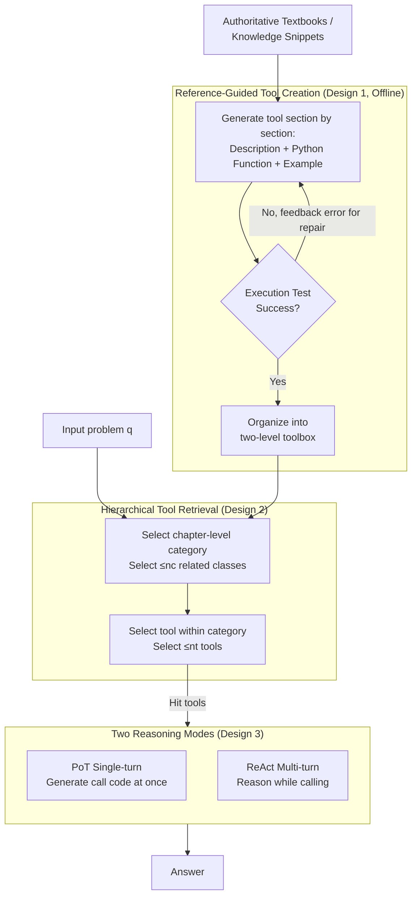

# RefTool: Reference-Guided Tool Creation for Knowledge-Intensive Reasoning

**Conference**: ICLR 2026  

**arXiv**: [2505.21413](https://arxiv.org/abs/2505.21413)  
**Code**: TBD  
**Area**: Information Retrieval  
**Keywords**: tool creation, reference-guided, knowledge-intensive reasoning, executable tools, hierarchical toolbox  

## TL;DR
The RefTool framework is proposed to automatically create executable Python tools based on external reference materials (textbooks, knowledge snippets), addressing the failure of existing tool creation methods that rely on LLM internal knowledge in specialized domains. It outperforms existing methods by an average of 12.3% on causal reasoning, physics, and chemistry tasks.

## Background & Motivation
**Background**: LLM tool creation enables models to dynamically generate and call tools during reasoning, offering greater flexibility than predefined toolsets. Existing methods (e.g., CRAFT, TroVE) rely on the internal knowledge of LLMs to generate tools.

**Limitations of Prior Work**: LLM internal knowledge is unreliable in specialized domains (causal reasoning, quantum physics, organic chemistry), leading to the generation of tools containing incorrect formulas or logic.

**Key Challenge**: Tool creation requires precise domain knowledge, whereas LLM knowledge in specialized fields may be inaccurate or incomplete.

**Goal**: How to utilize external authoritative reference materials (textbooks) as knowledge sources to guide tool creation?

**Key Insight**: Utilize the natural chapter-section structure of textbooks to organize a hierarchical toolbox and extract executable Python functions from each section.

**Core Idea**: References → Tool Creation + Hierarchical Toolbox → Hierarchical Retrieval → Reasoning.

## Method

### Overall Architecture
RefTool addresses the pain point where LLMs generate incorrect formulas when creating tools based on internal knowledge in specialized domains. The solution involves using authoritative textbooks as knowledge sources and compiling them offline into a set of executable tools for direct invocation during reasoning. The pipeline is divided into two stages: **tool creation**, where textbooks are read section by section to generate Python functions with descriptions and examples, followed by execution tests for verification, and organized into a two-level toolbox based on the chapter-section structure; and **tool utilization**, which performs hierarchical retrieval (first by chapter-level category, then by specific tool) to feed identified tools into PoT single-turn or ReAct multi-turn reasoning to solve problems.

### Key Designs

**1. Reference-Guided Tool Creation: Using Textbooks as Knowledge Sources Instead of LLM Imagination**

This design targets the core challenge: tool creation requires precise domain knowledge, but LLM knowledge in professional fields like causal reasoning, quantum physics, and organic chemistry is inherently unreliable. RefTool draws material from each section of a textbook to generate one tool per section. Each tool contains a "trinity": a natural language description, an executable Python function, and a usage example. Generated tools are not trusted immediately; they undergo **execution testing** for verification: 73% of tools pass the test in one generation, and another 14% pass after one round of repair, ensuring that only correct code enters the library. The organization directly leverages the natural hierarchical structure of textbooks (Chapter → Section → Tool), eliminating the need for additional knowledge engineering, as textbooks are human-verified knowledge sources more reliable than LLM internal knowledge.

**2. Hierarchical Tool Retrieval: Two-Step Selection to Narrow the Search Space**

Once the tools are stored, the library can be quite large. Flat retrieval during reasoning can suffer from reduced precision due to irrelevant tools. RefTool performs a two-step retrieval following the hierarchy of the toolbox: first selecting relevant categories at the chapter level, then choosing specific tools within those categories. This significantly reduces the candidates at each step, compressing the search space and improving hit precision. For unstructured reference materials without clear sectioning, the LLM first summarizes a category hierarchy before following the same two-step retrieval.

**3. Two Reasoning Modes: Complementarity of PoT and ReAct**

The choice of how to use tools depends on the task type. **PoT (Program of Thought)** generates a single block of code containing tool calls to solve the problem in one go, which is more efficient for tasks with deterministic solution paths. **ReAct** employs multi-turn interaction, performing reasoning while retrieving and calling tools as needed, providing greater flexibility for tasks requiring step-by-step exploration. These two modes cover reasoning needs ranging from "one-shot solutions" to "exploratory approaches."

## Key Experimental Results

### Main Results

| Task | RefTool+PoT (GPT-4o) | TroVE | Domain-specific methods |
|------|---------------------|-------|------------|
| Causal Reasoning (QRData) | **46.8%** | 36.4% | — |
| Physics (TheoremQA) | **57.9%** | — | Physics Reasoner |
| Chemistry (SciBench) | **66.4%** | — | ChemAgent |

### Ablation Study

| Configuration | Effect |
|------|------|
| No reference materials (Pure LLM knowledge) | Significant decline |
| No hierarchical structure (Flat retrieval) | Reduced retrieval precision |
| No execution test verification | Increased proportion of incorrect tools |

### Key Findings
- Ours outperforms tool creation methods by an average of **13.0%** and domain-specific methods by **10.2%**.
- 73% of tools pass verification in a single generation—the quality of reference materials ensures the quality of tools.
- Hierarchical retrieval is more effective than flat retrieval—leveraging textbook structures reduces the search space.
- RefTool shows the largest gain in causal reasoning (+10.4%), indicating that LLM internal knowledge is weakest in the causal domain.

## Highlights & Insights
- The approach of **directly transforming textbooks into tools** is intuitive—human learning also moves from studying textbooks to application.
- The **73% first-pass verification rate** suggests that the transformation from textbook knowledge to code is more reliable than expected.
- The **hierarchical toolbox** utilizes the natural structure of textbooks, avoiding additional knowledge engineering.
- The method is generalizable to any professional domain with structured reference materials.

## Limitations & Future Work
- Dependent on the availability of high-quality reference materials—cannot be used without a good textbook.
- Each section generates at most 2 tools; information-dense chapters might miss important functionalities.
- The tool hierarchy is fixed at two levels; complex knowledge systems might require more flexible organization.
- Inter-tool coordination and reuse (e.g., one tool calling another) have not been explored.

## Related Work & Insights
- **vs CRAFT/TroVE**: These rely on LLM internal knowledge, which is unreliable in specialized domains; RefTool compensates with external references.
- **vs RAG**: RAG retrieves raw text for LLM reasoning, whereas RefTool pre-compiles knowledge into executable code—execution is more precise than reasoning.
- **vs chainSTORM/domain-specific agents**: Domain-specific methods require manual design; RefTool automatically generates them from textbooks.
- Inspired the "knowledge compilation" paradigm: Pre-compiling textual knowledge into executable programs to reduce cognitive burden during reasoning.

## Rating
- Novelty: ⭐⭐⭐⭐ The reference-to-tool approach is intuitive and effective.
- Experimental Thoroughness: ⭐⭐⭐⭐ Validated across three specialized domains with sufficient comparisons.
- Writing Quality: ⭐⭐⭐⭐ Framework design is clearly presented.
- Value: ⭐⭐⭐⭐ Provides a practical paradigm for tool creation in specialized fields.

<!-- RELATED:START -->

## Related Papers

- [\[ICLR 2026\] Beyond Sequential Reranking: Reranker-Guided Search Improves Reasoning Intensive Retrieval](beyond_sequential_reranking_reranker-guided_search_improves_reasoning_intensive_.md)
- [\[ICLR 2026\] Retro*: Optimizing LLMs for Reasoning-Intensive Document Retrieval](retro_optimizing_llms_for_reasoning-intensive_document_retrieval.md)
- [\[ICLR 2026\] Frustratingly Simple Retrieval Improves Challenging, Reasoning-Intensive Benchmarks](frustratingly_simple_retrieval_improves_challenging_reasoning-intensive_benchmar.md)
- [\[ICML 2026\] REAL: Resolving Knowledge Conflicts in Knowledge-Intensive Visual Question Answering via Reasoning-Pivot Alignment](../../ICML2026/information_retrieval/real_resolving_knowledge_conflicts_in_knowledge-intensive_visual_question_answer.md)
- [\[ICLR 2026\] MRMR: A Realistic and Expert-Level Multidisciplinary Benchmark for Reasoning-Intensive Multimodal Retrieval](mrmr_a_realistic_and_expert-level_multidisciplinary_benchmark_for_reasoning-inte.md)

<!-- RELATED:END -->
